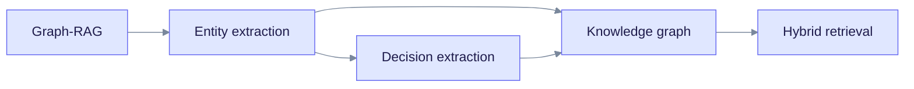

> **Released: v0.32.2** · Contract: [OpenAPI snapshot](../../edgequake_webui/openapi/openapi.snapshot.json) · Ops: [Ingestion cancel and fairness](../ingestion-cancel-and-fairness.md)

# Core Concepts

These pages explain the ideas that EdgeQuake is built on. They are for anyone who wants to understand why the system behaves the way it does before they tune it.

Read the chart left to right. Entity extraction builds the knowledge graph. Hybrid retrieval reads it. Decision extraction is an optional second way to build the graph.

## Read in this order

1. [Graph-RAG](graph-rag.md): why a graph helps retrieval-augmented generation.
2. [Entity extraction](entity-extraction.md): how text becomes entities and relationships.
3. [Knowledge graph](knowledge-graph.md): how the graph is stored and isolated per tenant.
4. [Hybrid retrieval](hybrid-retrieval.md): how a question is answered with vectors and graph together.
5. [Decision extraction](decision-extraction.md): preview mode that answers closed questions with a small local model (SPEC-160).
6. [Feature tour](feature-tour.md): one page that lists what the product can do.

## Operational concepts

- [Pipeline progress](../deep-dives/pipeline-progress.md): task IDs, WebSocket and SSE progress, `display_status` and `ui_phase`.
- [PDF processing](../deep-dives/pdf-processing.md): vision convert, multimodal assets, the convert-then-ingest split, and the `cancelled` status.
- [Ingestion cancel and fairness](../ingestion-cancel-and-fairness.md): cancel behaviour, tenant fairness, cooperative abort.
