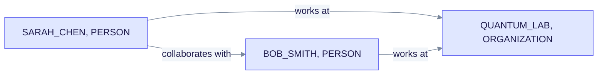
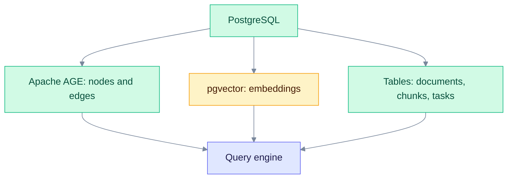
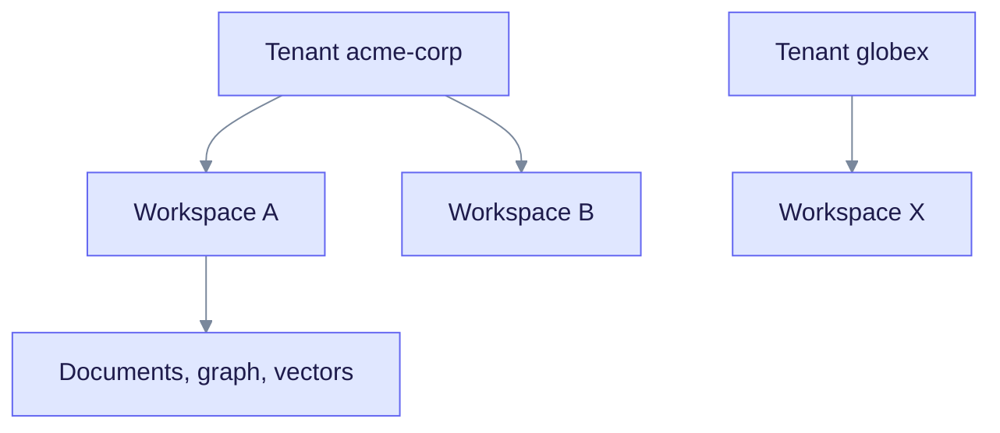

> **Released: v0.32.2** · Contract: [OpenAPI snapshot](../../edgequake_webui/openapi/openapi.snapshot.json) · Ops: [Ingestion cancel and fairness](../ingestion-cancel-and-fairness.md)

# Knowledge Graph

The knowledge graph is where EdgeQuake keeps what it learned from your documents: entities as nodes and relationships as edges. This page explains what is stored, where, and how tenants stay separate. It is for developers and operators.

## What is in the graph

| Item | Meaning | Examples of fields |
|------|---------|--------------------|
| Node (entity) | A person, place, concept or other thing | `entity_name`, `entity_type`, `description`, `source_id`, `degree` |
| Edge (relationship) | A link between two entities | `src_id`, `tgt_id`, `relation_type`, `keywords`, `weight`, `description` |
| Properties | Extra data on nodes and edges | Descriptions, weights, source chunk IDs |

Entity names are normalized to upper case with underscores, for example `SARAH_CHEN`. Each node tracks the chunks it came from, so answers can cite their sources. You can read the graph through `GET /api/v1/graph/entities` and `GET /api/v1/graph/relationships`; both return `items`.

Read the chart as sentences. Each arrow is an edge with a relation label. The same pair of nodes can be reached by more than one path.

## Where the data lives

Everything is in one PostgreSQL database. There is no separate graph server and no in-memory mode.

Read the chart from the top. The query engine combines the three stores.

| Store | Holds | Used for |
|-------|-------|----------|
| Apache AGE | Entity nodes and relationship edges | Graph traversal with Cypher |
| pgvector | Embeddings for chunks, entities and relationships (`vector` or `halfvec`) | Similarity search with HNSW indexes |
| Standard tables | Documents, chunk text, conversations, tasks | Filtering and metadata |

The vector size comes from the embedding model you choose, so there is no fixed width. See [Vector storage](../deep-dives/vector-storage.md) and [Graph storage](../deep-dives/graph-storage.md).

## Vector plus graph

A question usually uses all three stores:

1. **Vector search** finds entities and chunks that look like the question.
2. **Graph traversal** walks edges from those entities to find neighbors. The default walk is breadth-first (`bfs`). Personalized PageRank (`ppr`) is opt-in with `EDGEQUAKE_GRAPH_WALK=ppr`.
3. **Fusion** merges both results into the prompt for the model.

The [hybrid retrieval](hybrid-retrieval.md) page covers the modes in detail.

## Tenants and workspaces

EdgeQuake isolates data in two levels. A **tenant** is an organization. A **workspace** is a project inside a tenant. Documents, entities, relationships and vectors all belong to one workspace.

Read the chart from the tenant down. A workspace never sees data from another workspace or tenant.

Send `X-Tenant-ID` and `X-Workspace-ID` headers to choose the scope. If you omit them, the default tenant and the default workspace apply. Since v0.32.0, PostgreSQL row-level security enforces the scope inside the database, in addition to the application checks.

## Communities

EdgeQuake can group closely linked entities into communities with the Louvain algorithm. Detection is workspace-scoped, and it is skipped for graphs above 50,000 nodes. See [Community detection](../deep-dives/community-detection.md).

## Limits to know

| Limit | Value |
|-------|-------|
| Nodes returned by one `GET /api/v1/graph` call | 500 |
| Traversal depth for that call | 5 |
| Page size on list endpoints | 100 |

## Learn more

- [Entity extraction](entity-extraction.md): how entities are found.
- [Hybrid retrieval](hybrid-retrieval.md): how queries use the graph.
- [LightRAG algorithm](../deep-dives/lightrag-algorithm.md)

## Source code

- [Graph storage trait](https://github.com/raphaelmansuy/edgequake/blob/edgequake-main/edgequake/crates/edgequake-storage/src/traits/graph.rs)
- [Vector storage trait](https://github.com/raphaelmansuy/edgequake/blob/edgequake-main/edgequake/crates/edgequake-storage/src/traits/vector.rs)
- [PostgreSQL adapters](https://github.com/raphaelmansuy/edgequake/tree/edgequake-main/edgequake/crates/edgequake-storage/src/adapters/postgres)
