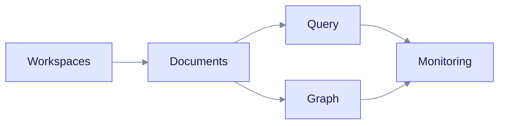

> **Released: v0.32.2** · Contract: [`openapi.snapshot.json`](../edgequake_webui/openapi/openapi.snapshot.json) · Ops: [Ingestion cancel and fairness](ingestion-cancel-and-fairness.md)

# Cookbook

This page holds short recipes for common EdgeQuake tasks. Endpoints and response fields were checked against the source code. Run the commands on your own stack before you rely on them. It is for developers who already have a stack running. If you do not, start with the [Quick Start](getting-started/quick-start.md).

## Set up your shell

Every recipe uses these variables.

```bash
export API=http://localhost:8080          # make dev: http://localhost:8090
export WS=00000000-0000-0000-0000-000000000003   # default workspace
H_WS="X-Workspace-ID: $WS"
H_AUTH="Accept: application/json"          # dev mode; see below for auth
```

- **Dev mode** (`make dev`, Docker quickstart): the API is open. The `H_AUTH` line above is a harmless placeholder.
- **Auth on:** set `H_AUTH="Authorization: Bearer $TOKEN"` or `H_AUTH="X-API-Key: $KEY"`. See [Runtime auth hardening](operations/runtime-auth-hardening.md).
- **Scope:** `X-Workspace-ID` accepts a workspace UUID or `default`. `X-Tenant-ID` selects the tenant; the default tenant is `00000000-0000-0000-0000-000000000002`.
- **Status fields:** read `display_status` and `ui_phase` on a document. Read `status` on a task. Task status values are `pending`, `processing`, `indexed`, `failed` and `cancelled`.



Read the chart as the order most people use the recipes: set up a workspace, load documents, then query, explore and monitor.

## Document recipes

### Upload text content

```bash
curl -s -X POST "$API/api/v1/documents" \
  -H "Content-Type: application/json" -H "$H_WS" -H "$H_AUTH" \
  -d '{
    "title": "about-edgequake",
    "content": "EdgeQuake is a Graph-RAG framework built in Rust...",
    "metadata": {"source": "manual", "category": "documentation"}
  }' | jq '{document_id, status, track_id}'
```

Expected output: HTTP 202 with `status` set to `pending`. The title field is `title`, not `name`.

### Upload a text file and wait for it

`POST /api/v1/documents/upload` takes text-like files (`txt`, `md`, `json`, `csv`, `html`, `htm`, `xml`, `yaml`, `yml`) and images (`png`, `jpg`, `jpeg`, `gif`, `webp`). It rejects PDFs; use the PDF recipe below.

```bash
RESPONSE=$(curl -s -X POST "$API/api/v1/documents/upload" \
  -H "$H_WS" -H "$H_AUTH" -F "file=@notes.md")
DOC_ID=$(echo "$RESPONSE" | jq -r .document_id)
echo "Uploaded: $DOC_ID"

while true; do
  ROW=$(curl -s "$API/api/v1/documents/$DOC_ID" -H "$H_WS" -H "$H_AUTH")
  DISPLAY=$(echo "$ROW" | jq -r .display_status)
  echo "display_status: $DISPLAY (ui_phase: $(echo "$ROW" | jq -r .ui_phase))"
  case "$DISPLAY" in
    completed|indexed) echo "Done"; break ;;
    failed|cancelled|partial_failure) echo "Ended: $DISPLAY"; exit 1 ;;
  esac
  sleep 2
done
```

Expected output ends with `Done`. A document that reaches `partial_success` finished with some warnings; read `warning_message`.

### Upload many files

```bash
for file in ./documents/*.md; do
  [ -f "$file" ] || continue
  echo "Uploading: $file"
  curl -s -X POST "$API/api/v1/documents/upload" \
    -H "$H_WS" -H "$H_AUTH" -F "file=@$file" | jq -c '{document_id, filename, status}'
done
```

For many files at once, use `POST /api/v1/documents/upload/batch`. Local providers process one ingest task per tenant by default, so the queue drains slowly. See [Ingestion cancel and fairness](ingestion-cancel-and-fairness.md).

### Upload a PDF (two phases)

A PDF runs as two tasks. First a **convert** task turns pages into Markdown. Then an **ingest** task builds the graph. If ingest fails, the converted Markdown is kept.


Read the chart from the left. The upload returns after the convert task is queued.

```bash
UPLOAD=$(curl -s -X POST "$API/api/v1/documents/pdf" \
  -H "$H_WS" -H "$H_AUTH" -F "file=@report.pdf" -F "title=Q3 Report")
TASK_ID=$(echo "$UPLOAD" | jq -r .task_id)
DOC_ID=$(echo "$UPLOAD" | jq -r .document_id)

curl -s "$API/api/v1/documents/pdf/progress/$TASK_ID" -H "$H_WS" -H "$H_AUTH" \
  | jq '{overall_percentage, is_complete, is_failed}'
```

The default parser backend is `vision`, which needs a vision-capable model. Add `-F pdf_parser_backend=edgeparse` to skip the model. See the [PDF ingestion tutorial](tutorials/pdf-ingestion.md).

### Cancel in-flight processing

```bash
curl -s -X POST "$API/api/v1/tasks/$TASK_ID/cancel" -H "$H_WS" -H "$H_AUTH" | jq

curl -s "$API/api/v1/documents/$DOC_ID" -H "$H_WS" -H "$H_AUTH" \
  | jq '{display_status, ui_phase}'
```

Expected output after a moment: `"display_status": "cancelled"` and `"ui_phase": "terminal"`. See [Ingestion cancel and fairness](ingestion-cancel-and-fairness.md).

### Delete all documents in a workspace

This is destructive. The call returns 202 with a `wipe_track_id`; the wipe runs in the background.

```bash
curl -s -X DELETE "$API/api/v1/documents" \
  -H "$H_WS" -H "$H_AUTH" \
  -H "X-EdgeQuake-Confirm: delete-all-documents" | jq
```

The confirm header is required when `EDGEQUAKE_REQUIRE_DELETE_ALL_CONFIRM=true`. Send it anyway. Track the wipe with `GET /api/v1/tasks/{wipe_track_id}`. To delete one document, use `DELETE /api/v1/documents/{id}`.

## Query recipes

### Ask a question and list sources

```bash
curl -s -X POST "$API/api/v1/query" \
  -H "Content-Type: application/json" -H "$H_WS" -H "$H_AUTH" \
  -d '{
    "query": "What are the main topics discussed?",
    "mode": "hybrid",
    "max_results": 5,
    "include_references": true
  }' | jq '{answer, source_count: (.sources | length), sources}'
```

The reply field is `answer`. There is no `top_k`, `include_sources` or `entity_filter` field on this endpoint. Use `max_results` to limit context items.

### Compare query modes

```bash
QUERY="Who is mentioned in the documents?"
for MODE in naive local global hybrid mix; do
  curl -s -X POST "$API/api/v1/query" \
    -H "Content-Type: application/json" -H "$H_WS" -H "$H_AUTH" \
    -d "{\"query\": \"$QUERY\", \"mode\": \"$MODE\"}" \
    | jq -c --arg m "$MODE" '{mode: $m, sources: (.sources | length), preview: .answer[:100]}'
done
```

### Limit a query to some documents

```bash
curl -s -X POST "$API/api/v1/query" \
  -H "Content-Type: application/json" -H "$H_WS" -H "$H_AUTH" \
  -d '{
    "query": "What projects is John Smith working on?",
    "mode": "local",
    "document_filter": {"document_pattern": "report", "date_from": "2026-01-01"}
  }' | jq .answer
```

`document_filter` accepts `date_from`, `date_to`, `document_pattern` (comma-separated, case-insensitive) and `document_ids`.

### Stream a chat reply

The stream sends server-sent events. Each event is JSON with a `type` field: `conversation`, `context`, `stage`, `thinking`, `token`, `title_update`, `done`, or `error`. Read `token` events as they arrive, and treat `done` as the end of the answer.

```python
import json
import requests

API = "http://localhost:8080"  # make dev: 8090

def stream_chat(message, mode="mix"):
    resp = requests.post(
        f"{API}/api/v1/chat/completions/stream",
        json={"message": message, "mode": mode},
        headers={"X-Workspace-ID": "00000000-0000-0000-0000-000000000003"},
        stream=True,
    )
    for line in resp.iter_lines():
        if not line.startswith(b"data: "):
            continue
        event = json.loads(line[6:])
        if event["type"] == "token":
            print(event["content"], end="", flush=True)
        elif event["type"] == "done":
            print()
            break

stream_chat("What are the key findings?")
```

Scope the chat with the workspace header. The body has no `workspace_id` field.

### Search the model catalog

```bash
curl -s "$API/api/v1/models/search?q=gpt&requires_vision=true&limit=5" \
  -H "$H_AUTH" | jq '.hits[] | {provider, id, context_length, supports_vision}'
```

## Graph recipes

### Export the graph

`GET /api/v1/graph` returns at most 500 nodes and a depth of at most 5. Use `max_nodes`, `depth` and `start_node` to shape it.

```bash
curl -s "$API/api/v1/graph?max_nodes=500" -H "$H_WS" -H "$H_AUTH" > graph_export.json
jq '{total_nodes, total_edges, is_truncated}' graph_export.json
jq '[.nodes[] | {id, label, node_type}]' graph_export.json | head -20
```

If `is_truncated` is `true`, the workspace is bigger than the export. Page through `GET /api/v1/graph/entities` and `GET /api/v1/graph/relationships` for the full list.

### Read one entity and its relationships

```bash
ENTITY=JOHN_SMITH
curl -s "$API/api/v1/graph/entities/$ENTITY" -H "$H_WS" -H "$H_AUTH" | jq '{
  name: .entity.entity_name,
  type: .entity.entity_type,
  outgoing: [.relationships.outgoing[] | {to: .target, type: .relation_type}],
  incoming: [.relationships.incoming[] | {from: .source, type: .relation_type}]
}'
```

For the neighbors of an entity, call `GET /api/v1/graph/entities/{name}/neighborhood`.

### Find a connection between two entities

There is no path-finding endpoint. Use one of these instead:

1. Start from one entity: `GET /api/v1/graph?start_node=ENTITY_A&depth=3` and look for `ENTITY_B` in `nodes`.
2. Ask in natural language with `POST /api/v1/query`, using mode `local` or `mix`.

## Workspace recipes

### Create a workspace

Workspaces belong to a tenant, so the path includes the tenant ID.

```bash
TENANT=00000000-0000-0000-0000-000000000002
curl -s -X POST "$API/api/v1/tenants/$TENANT/workspaces" \
  -H "Content-Type: application/json" -H "$H_AUTH" \
  -d '{
    "name": "Research Project",
    "description": "Documents for Q3 research",
    "llm_provider": "ollama",
    "llm_model": "gemma4:latest",
    "entity_types": ["PERSON", "ORGANIZATION", "CONCEPT", "METHOD"],
    "extraction_language": "English"
  }' | jq '{id, name, slug}'
```

`entity_types` accepts at most 20 values.

### List workspaces and their counts

```bash
curl -s "$API/api/v1/tenants/$TENANT/workspaces" -H "$H_AUTH" | jq -r '.items[].id' \
  | while read -r ID; do
      curl -s "$API/api/v1/workspaces/$ID/stats" -H "$H_AUTH" \
        | jq -c --arg id "$ID" '{id: $id, document_count, entity_count, relationship_count}'
    done
```

## Python client

This small client covers the common calls.

```python
"""Minimal EdgeQuake client."""
import requests

class EdgeQuakeClient:
    def __init__(self, base_url="http://localhost:8080",
                 workspace="00000000-0000-0000-0000-000000000003", headers=None):
        self.base = base_url
        self.headers = {"X-Workspace-ID": workspace, **(headers or {})}

    def upload_text(self, content, title):
        r = requests.post(f"{self.base}/api/v1/documents",
                          json={"content": content, "title": title},
                          headers=self.headers)
        r.raise_for_status()
        return r.json()                      # document_id, track_id, status

    def task_status(self, track_id):
        r = requests.get(f"{self.base}/api/v1/tasks/{track_id}", headers=self.headers)
        r.raise_for_status()
        return r.json()["status"]            # pending|processing|indexed|failed|cancelled

    def query(self, question, mode="mix"):
        r = requests.post(f"{self.base}/api/v1/query",
                          json={"query": question, "mode": mode},
                          headers=self.headers)
        r.raise_for_status()
        return r.json()                      # answer, sources, stats, ...

    def entities(self):
        r = requests.get(f"{self.base}/api/v1/graph/entities", headers=self.headers)
        r.raise_for_status()
        return r.json()["items"]

if __name__ == "__main__":
    import time
    client = EdgeQuakeClient()
    doc = client.upload_text("EdgeQuake is a Graph-RAG framework.", "intro")
    while client.task_status(doc["track_id"]) in ("pending", "processing"):
        time.sleep(2)
    print(client.query("What is EdgeQuake?")["answer"])
```

For official clients in other languages, see the [SDK index](sdks/README.md).

## Monitoring recipes

### Check health and queue depth

```bash
curl -s "$API/health" | jq '{status, storage_mode, components, llm_provider_name}'
curl -s "$API/ready" -o /dev/null -w "ready: %{http_code}\n"
curl -s "$API/api/v1/pipeline/queue-metrics" -H "$H_AUTH" \
  | jq '{pending_count, processing_count, active_workers, max_workers, pressure}'
```

`/ready` returns 503 when the schema is behind, storage is down, or the task queue is at critical pressure. The reason is in the response body.

### Read cost totals

```bash
curl -s "$API/api/v1/costs/summary" -H "$H_WS" -H "$H_AUTH" \
  | jq '{total_input_tokens, total_output_tokens, total_cost_usd, operations}'
```

### Debug one document

```bash
curl -s "$API/api/v1/documents/$DOC_ID" -H "$H_WS" -H "$H_AUTH" | jq '{
  id, title, file_name, status, display_status, ui_phase,
  track_id, chunk_count, entity_count, relationship_count, error_message
}'
```

### Diagnose an empty answer

```bash
curl -s "$API/api/v1/documents" -H "$H_WS" -H "$H_AUTH" | jq '{total, status_counts}'
curl -s "$API/api/v1/graph?max_nodes=1" -H "$H_WS" -H "$H_AUTH" | jq '{total_nodes, total_edges}'
curl -s -X POST "$API/api/v1/query" -H "Content-Type: application/json" -H "$H_WS" -H "$H_AUTH" \
  -d '{"query": "test query"}' | jq '{has_answer: (.answer | length > 0), sources: (.sources | length)}'
```

If `total_nodes` is 0, no document has finished indexing. Check `status_counts` and any task `error_message`.

## Docker recipes

### Run the prebuilt stack at a pinned version

```bash
EDGEQUAKE_VERSION=0.32.2 docker compose -f docker-compose.quickstart.yml up -d
```

The file starts PostgreSQL, a one-time `migrate` container, the API and the UI. To switch to OpenAI, add `EDGEQUAKE_LLM_PROVIDER=openai OPENAI_API_KEY=sk-...` to the same command. See [Docker quickstart](operations/docker-quickstart.md).

### Back up and restore

PostgreSQL holds all state. Back it up with `pg_dump`.

```bash
BACKUP_DIR="./backups/$(date +%Y%m%d)"
mkdir -p "$BACKUP_DIR"
docker compose -f docker-compose.quickstart.yml exec -T postgres \
  pg_dump -U edgequake edgequake > "$BACKUP_DIR/db.sql"
```

To restore, start from an empty database. This removes the current data, so run it only on a stack you can discard:

```bash
docker compose -f docker-compose.quickstart.yml down -v
docker compose -f docker-compose.quickstart.yml up -d postgres
docker compose -f docker-compose.quickstart.yml exec -T postgres \
  psql -U edgequake edgequake < "$BACKUP_DIR/db.sql"
docker compose -f docker-compose.quickstart.yml up -d
```

The last command also runs the `migrate` container, which brings the schema to the version of the images you started.

Test a restore on a copy before you rely on it. The graph lives in Apache AGE schemas that `pg_dump` includes, but this page does not claim a verified round trip for every version.

## Performance recipe

### Time a few queries

```bash
for i in $(seq 1 10); do
  curl -s -o /dev/null -w "query $i: %{time_total}s\n" -X POST "$API/api/v1/query" \
    -H "Content-Type: application/json" -H "$H_WS" -H "$H_AUTH" \
    -d '{"query": "What are the main topics?", "mode": "hybrid"}'
done
```

Timings depend on your model and hardware. For sizing, see [Product limits](product-limits.md) and [Performance tuning](operations/performance-tuning.md).

## See also

- [REST API reference](api-reference/rest-api.md)
- [Troubleshooting](troubleshooting/common-issues.md)
- [Performance tuning](operations/performance-tuning.md)
