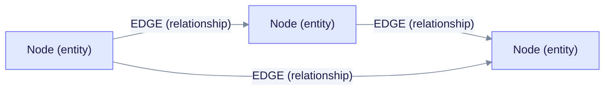
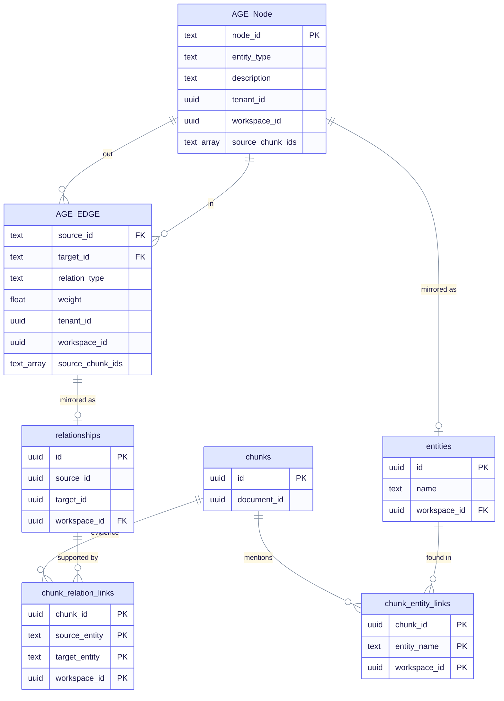
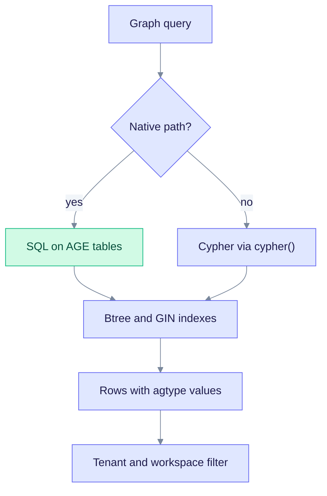

# Apache AGE: the knowledge graph

Apache AGE is a PostgreSQL extension that adds a graph database inside PostgreSQL. You query it with Cypher, a graph query language, wrapped in a SQL call. EdgeQuake stores entities (people, places, concepts) as nodes and the links between them as edges. This page explains the graph model and how the code reads and writes it. The overview is in [README.md](./README.md).

## Graph model

There is one graph per namespace. The namespace defaults to `default` (set `EDGEQUAKE_NAMESPACE` to change it), so the graph is named `eq_eq_default_graph`. `age_graph_name_for_namespace` in `edgequake/crates/edgequake-storage/src/namespace_tables.rs` builds the name. Migration 013 defines a helper function but does not create the graph. The storage adapter creates the graph and its two labels at run time, using `create_graph`, `create_vlabel`, and `create_elabel` in `edgequake/crates/edgequake-storage/src/adapters/postgres/graph/helpers/graph_lifecycle.rs`.

The first diagram is the graph itself: every `Node` can point to any other `Node` through an `EDGE`. The second diagram lists the properties on each label and how they mirror the relational read models.

Read the second diagram left to right: the AGE labels are the live graph; `entities` / `relationships` are searchable copies; the link tables record which chunk produced which fact. Full relational E/R diagrams for these tables (and every other domain) are in [schema-er.md](./schema-er.md).

### Node properties (label `Node`)

| Property | Meaning |
|---|---|
| `node_id` | The entity name in upper case with underscores, for example `SARAH_CHEN`. Unique. |
| `entity_type` | Type such as `PERSON` or `ORGANIZATION`. |
| `description` | Merged description text. |
| `importance`, `sources`, `label`, `display_name` | Ranking and display data. |
| `tenant_id`, `workspace_id` | Who owns the node. |
| `source_ids`, `source_chunk_ids` | Which chunks and documents produced it. |
| `page_num`, `figure_index`, `asset_id`, `mm_subtype` | Set only for multimodal figure nodes. |

### Edge properties (label `EDGE`)

| Property | Meaning |
|---|---|
| `source_id`, `target_id` | `node_id` of each end. |
| `relation_type` | Kind of link, for example `WORKS_AT`. |
| `description`, `weight`, `keywords` | Content and strength. |
| `source_chunk_ids`, `source_chunk_id` | Evidence chunks. |
| `tenant_id`, `workspace_id` | Who owns the edge. |

AGE keeps each label in its own table, inside a schema named after the graph (`Node` and `EDGE` here). The extra columns `eq_node_id`, `eq_source_id`, `eq_target_id`, and `eq_rel_type` are copies of the properties above, kept up to date by triggers (`edgequake/migrations/support/092/apply.sql`) so that plain btree indexes can find rows fast. The function `eq_merge_graph_properties` (migration 090) merges property maps.

The same entities and relationships also exist as plain rows in `entities` and `relationships`. See [postgres.md](./postgres.md). The graph is used for traversal; the tables are used for search and counts.

## How the code talks to AGE

Each connection that touches the graph first runs `LOAD 'age'` and sets `search_path = ag_catalog, "$user", public` (`edgequake/crates/edgequake-storage/src/adapters/postgres/graph/helpers/session.rs`). It also sets a `statement_timeout`. DDL sessions set `statement_timeout = 0` and use a short `lock_timeout` instead.

There are two ways to write and read:

| Path | Used for | Notes |
|---|---|---|
| Native SQL | Batch node and edge upserts, deletes, BFS expansion, neighbor lists | Default. Plain `INSERT ... ON CONFLICT (eq_node_id)` with `unnest` batches. Fast and predictable. |
| Cypher | Fallback writes, a few scoped deletes (`DETACH DELETE`), ad-hoc queries | Sent as `SELECT ... FROM cypher('graph', $tag$ ... $tag$, $1) AS (...)`. |

Native writes are on by default. Set `EDGEQUAKE_NATIVE_GRAPH_WRITES` to `0`, `false`, `off`, or `no` to force the Cypher `MERGE` path. Leave it unset in normal use.

The diagram shows the read path for a graph query.

Practical limits that the code enforces:

- Neighbor expansion depth is clamped to the range 1 to 3, and a single call returns at most 500 neighbors.
- Full scans (`get_all_nodes`, `get_all_edges`) are forbidden on the request path. They exist for admin and tests.
- AGE has no `=` operator for its `graphid` type, so the SQL casts with `graphid::text`.
- The COPY bulk loader is used when a batch has at least `EDGEQUAKE_BULK_COPY_MIN_ROWS` rows (default 1000) and AGE is 1.7.0 or later.

## Indexes

The adapter creates these indexes if they are missing (`ensure_indexes` in `edgequake/crates/edgequake-storage/src/adapters/postgres/graph/helpers/graph_lifecycle.rs`). A single-flight lock (SPEC-069) lets only one build run at a time in a process. AGE does not add property indexes by itself, so these indexes keep lookups fast.

| Label | Indexes |
|---|---|
| `Node` | `idx_node_props_gin`, `idx_node_id`, `idx_node_tenant_id`, `idx_node_workspace_id`, `idx_node_source_id_expr`, `idx_node_source_ids_gin`, `idx_node_source_chunk_ids_gin`, and the unique `idx_node_prop_node_id_unique` |
| `EDGE` | `idx_edge_start_id`, `idx_edge_end_id`, `idx_edge_source_id`, `idx_edge_target_id`, `idx_edge_source_ids_gin`, `idx_edge_source_chunk_ids_gin`, `idx_edge_source_chunk_id`, `idx_edge_source_document_id`, `idx_edge_props_gin`, `idx_edge_tenant_id`, `idx_edge_workspace_id`, `idx_edge_start_id_text`, `idx_edge_end_id_text` |

Operation-to-index mapping is on [indexes.md](./indexes.md).

## Tenant isolation in the graph

All tenants share one graph. Each node and edge carries `tenant_id` and `workspace_id`, and the code adds those filters to its queries. Row-Level Security on the AGE tables is optional and off by default. Set `EDGEQUAKE_AGE_RLS` to `1`, `true`, `yes`, or `on` to enable it. It needs AGE 1.7.0 or later (PostgreSQL 17 or 18 in the default images). The health endpoint reports whether it is active.

## Version notes

| PostgreSQL | AGE | Notes |
|---|---|---|
| 16 | 1.6.0 | No AGE RLS and no COPY loader. |
| 17 | 1.7.0 | RLS and COPY loader available. See [pg17-differential.md](./pg17-differential.md). |
| 18 | 1.8.0 | Image default. See [pg18-adoption.md](./pg18-adoption.md). |

## Operation catalog

Rows with a linked Ref ID have a benchmark template in [benchmarks/](./benchmarks/README.md). Cost and failure notes are in [complexity-matrix.md](./complexity-matrix.md). File paths are relative to `edgequake/crates/`. Line numbers were removed because they drift; search by entry point name. Some entry points are descriptive, not exact function names.

### Graph reads (34)

Lookups, batches, search, traversal, and counts. Entries marked FORBIDDEN in the notes must not run on the request path.

| Ref ID | Entry point | File | Type | Tx | Notes |
|---|---|---|---|---|---|
| `DATA-AGE-GRAPH-HAS-NODE-025` | `GraphStorage::has_node` | `edgequake-storage/src/adapters/postgres/graph/graph_storage_impl.rs` | Read | Yes |  |
| `DATA-AGE-GRAPH-GET-NODE-026` | `GraphStorage::get_node` | `edgequake-storage/src/adapters/postgres/graph/graph_storage_impl.rs` | Read | Yes |  |
| `DATA-AGE-GRAPH-NODE-DEGREE-027` | `GraphStorage::node_degree` | `edgequake-storage/src/adapters/postgres/graph/graph_storage_impl.rs` | Read | Yes |  |
| `DATA-AGE-GRAPH-NODE-DEGREES-BATCH-028` | `GraphStorage::node_degrees_batch` | `edgequake-storage/src/adapters/postgres/graph/graph_storage_impl.rs` | Read | Yes |  |
| `DATA-AGE-GRAPH-GET-ALL-NODES-029` | `GraphStorage::get_all_nodes` | `edgequake-storage/src/adapters/postgres/graph/graph_storage_impl.rs` | Read | Yes | FORBIDDEN request path |
| `DATA-AGE-GRAPH-GET-NODES-BY-IDS-030` | `GraphStorage::get_nodes_by_ids` | `edgequake-storage/src/adapters/postgres/graph/graph_storage_impl.rs` | Read | Yes |  |
| [`DATA-AGE-GRAPH-GET-NODES-BATCH-031`](./benchmarks/031.md) | `GraphStorage::get_nodes_batch` | `edgequake-storage/src/adapters/postgres/graph/graph_storage_impl.rs` | Read | Yes | native SQL preferred |
| `DATA-AGE-GRAPH-GET-EDGES-FOR-NODES-BATCH-032` | `GraphStorage::get_edges_for_nodes_batch` | `edgequake-storage/src/adapters/postgres/graph/graph_storage_impl.rs` | Read | Yes |  |
| `DATA-AGE-GRAPH-HAS-EDGE-033` | `GraphStorage::has_edge` | `edgequake-storage/src/adapters/postgres/graph/graph_storage_impl.rs` | Read | Yes |  |
| `DATA-AGE-GRAPH-GET-EDGE-034` | `GraphStorage::get_edge` | `edgequake-storage/src/adapters/postgres/graph/graph_storage_impl.rs` | Read | Yes |  |
| `DATA-AGE-GRAPH-GET-NODE-EDGES-035` | `GraphStorage::get_node_edges` | `edgequake-storage/src/adapters/postgres/graph/graph_storage_impl.rs` | Read | Yes |  |
| `DATA-AGE-GRAPH-GET-INCIDENT-EDGES-BATCH-036` | `GraphStorage::get_incident_edges_batch` | `edgequake-storage/src/adapters/postgres/graph/graph_storage_impl.rs` | Read | Yes |  |
| `DATA-AGE-GRAPH-GET-ALL-EDGES-037` | `GraphStorage::get_all_edges` | `edgequake-storage/src/adapters/postgres/graph/graph_storage_impl.rs` | Read | Yes | FORBIDDEN request path |
| `DATA-AGE-GRAPH-GET-KNOWLEDGE-GRAPH-038` | `GraphStorage::get_knowledge_graph` | `edgequake-storage/src/adapters/postgres/graph/graph_storage_impl.rs` | Read | Yes | bounded expand |
| `DATA-AGE-GRAPH-GET-POPULAR-LABELS-039` | `GraphStorage::get_popular_labels` | `edgequake-storage/src/adapters/postgres/graph/graph_storage_impl.rs` | Read | Yes |  |
| `DATA-AGE-GRAPH-SEARCH-LABELS-040` | `GraphStorage::search_labels` | `edgequake-storage/src/adapters/postgres/graph/graph_storage_impl.rs` | Read | Yes |  |
| `DATA-AGE-GRAPH-SEARCH-NODES-041` | `GraphStorage::search_nodes` | `edgequake-storage/src/adapters/postgres/graph/graph_storage_impl.rs` | Read | Yes |  |
| `DATA-AGE-GRAPH-GET-NEIGHBORS-042` | `GraphStorage::get_neighbors` | `edgequake-storage/src/adapters/postgres/graph/graph_storage_impl.rs` | Read | Yes |  |
| `DATA-AGE-GRAPH-GET-POPULAR-NODES-DEGREE-043` | `GraphStorage::get_popular_nodes_with_degree` | `edgequake-storage/src/adapters/postgres/graph/graph_storage_impl.rs` | Read | Yes |  |
| `DATA-AGE-GRAPH-GET-EDGES-FOR-NODE-SET-044` | `GraphStorage::get_edges_for_node_set` | `edgequake-storage/src/adapters/postgres/graph/graph_storage_impl.rs` | Read | Yes |  |
| `DATA-AGE-GRAPH-NODE-COUNT-057` | `GraphStorage::node_count` | `edgequake-storage/src/adapters/postgres/graph/graph_storage_impl.rs` | Read | Yes | O(N) exact |
| `DATA-AGE-GRAPH-EDGE-COUNT-058` | `GraphStorage::edge_count` | `edgequake-storage/src/adapters/postgres/graph/graph_storage_impl.rs` | Read | Yes |  |
| `DATA-AGE-GRAPH-NODE-COUNT-FAST-059` | `GraphStorage::node_count_fast` | `edgequake-storage/src/adapters/postgres/graph/graph_storage_impl.rs` | Read | Yes | reltuples |
| `DATA-AGE-GRAPH-EDGE-COUNT-FAST-060` | `GraphStorage::edge_count_fast` | `edgequake-storage/src/adapters/postgres/graph/graph_storage_impl.rs` | Read | Yes |  |
| `DATA-AGE-GRAPH-NODE-COUNT-BY-WORKSPACE-061` | `GraphStorage::node_count_by_workspace` | `edgequake-storage/src/adapters/postgres/graph/graph_storage_impl.rs` | Read | Yes |  |
| `DATA-AGE-GRAPH-EDGE-COUNT-BY-WORKSPACE-062` | `GraphStorage::edge_count_by_workspace` | `edgequake-storage/src/adapters/postgres/graph/graph_storage_impl.rs` | Read | Yes |  |
| `DATA-AGE-GRAPH-DISTINCT-NODE-TYPE-COUNT-063` | `GraphStorage::distinct_node_type_count_by_workspace` | `edgequake-storage/src/adapters/postgres/graph/graph_storage_impl.rs` | Read | Yes |  |
| `DATA-AGE-GRAPH-NODE-COUNT-BY-SOURCE-PREFIX-064` | `GraphStorage::node_count_by_source_prefix` | `edgequake-storage/src/adapters/postgres/graph/graph_storage_impl.rs` | Read | Yes |  |
| `DATA-AGE-GRAPH-NODE-COUNTS-BY-SOURCE-PREFIXES-065` | `GraphStorage::node_counts_by_source_prefixes` | `edgequake-storage/src/adapters/postgres/graph/graph_storage_impl.rs` | Read | Yes | batched list reconcile |
| `DATA-AGE-GRAPH-LIST-NODES-FILTERED-066` | `GraphStorage::list_nodes_filtered` | `edgequake-storage/src/adapters/postgres/graph/graph_storage_impl.rs` | Read | Yes |  |
| `DATA-AGE-GRAPH-LIST-EDGES-FILTERED-067` | `GraphStorage::list_edges_filtered` | `edgequake-storage/src/adapters/postgres/graph/graph_storage_impl.rs` | Read | Yes |  |
| `DATA-AGE-GRAPH-FIND-NODES-BY-SOURCE-PREFIXES-068` | `GraphStorage::find_nodes_by_source_prefixes` | `edgequake-storage/src/adapters/postgres/graph/graph_storage_impl.rs` | Read | Yes |  |
| `DATA-AGE-GRAPH-FIND-EDGES-BY-SOURCE-PREFIXES-069` | `GraphStorage::find_edges_by_source_prefixes` | `edgequake-storage/src/adapters/postgres/graph/graph_storage_impl.rs` | Read | Yes |  |
| `DATA-AGE-GRAPH-FIND-EDGE-BY-RELATIONSHIP-ID-070` | `GraphStorage::find_edge_by_relationship_id` | `edgequake-storage/src/adapters/postgres/graph/graph_storage_impl.rs` | Read | Yes |  |

### Graph writes (13)

Upserts and deletes. Batch forms use native SQL by default.

| Ref ID | Entry point | File | Type | Tx | Notes |
|---|---|---|---|---|---|
| `DATA-AGE-GRAPH-UPSERT-NODE-045` | `GraphStorage::upsert_node` | `edgequake-storage/src/adapters/postgres/graph/graph_storage_impl.rs` | Write | Yes |  |
| [`DATA-AGE-GRAPH-UPSERT-NODES-BATCH-046`](./benchmarks/046.md) | `GraphStorage::upsert_nodes_batch` | `edgequake-storage/src/adapters/postgres/graph/graph_storage_impl.rs` | Write | Yes | native ON CONFLICT |
| `DATA-AGE-GRAPH-DELETE-NODE-047` | `GraphStorage::delete_node` | `edgequake-storage/src/adapters/postgres/graph/graph_storage_impl.rs` | Write | Yes |  |
| `DATA-AGE-GRAPH-DELETE-NODES-BATCH-048` | `GraphStorage::delete_nodes_batch` | `edgequake-storage/src/adapters/postgres/graph/graph_storage_impl.rs` | Write | Yes |  |
| `DATA-AGE-GRAPH-DELETE-NODE-SCOPED-049` | `GraphStorage::delete_node_scoped` | `edgequake-storage/src/adapters/postgres/graph/graph_storage_impl.rs` | Write | Yes |  |
| `DATA-AGE-GRAPH-UPSERT-EDGE-050` | `GraphStorage::upsert_edge` | `edgequake-storage/src/adapters/postgres/graph/graph_storage_impl.rs` | Write | Yes |  |
| `DATA-AGE-GRAPH-UPSERT-EDGES-BATCH-051` | `GraphStorage::upsert_edges_batch` | `edgequake-storage/src/adapters/postgres/graph/graph_storage_impl.rs` | Write | Yes |  |
| `DATA-AGE-GRAPH-DELETE-EDGE-052` | `GraphStorage::delete_edge` | `edgequake-storage/src/adapters/postgres/graph/graph_storage_impl.rs` | Write | Yes |  |
| `DATA-AGE-GRAPH-DELETE-EDGES-BATCH-053` | `GraphStorage::delete_edges_batch` | `edgequake-storage/src/adapters/postgres/graph/graph_storage_impl.rs` | Write | Yes |  |
| `DATA-AGE-GRAPH-DELETE-EDGE-SCOPED-054` | `GraphStorage::delete_edge_scoped` | `edgequake-storage/src/adapters/postgres/graph/graph_storage_impl.rs` | Write | Yes |  |
| `DATA-AGE-GRAPH-CLEAR-055` | `GraphStorage::clear` | `edgequake-storage/src/adapters/postgres/graph/graph_storage_impl.rs` | Write | Yes | ADMIN |
| `DATA-AGE-GRAPH-CLEAR-WORKSPACE-056` | `GraphStorage::clear_workspace` | `edgequake-storage/src/adapters/postgres/graph/graph_storage_impl.rs` | Write | Yes | ADMIN |
| `DATA-AGE-GRAPH-COPY-LOAD-VERTICES-073` | `load_vertices_from_csv` | `edgequake-storage/src/adapters/postgres/age_csv_loader.rs` | Write | Yes | COPY bulk |

### Graph infrastructure (3)

Cypher execution, index setup, the COPY loader, and session setup.

| Ref ID | Entry point | File | Type | Tx | Notes |
|---|---|---|---|---|---|
| `DATA-AGE-GRAPH-CYPHER-EXEC-071` | `execute_cypher / cypher_query` | `edgequake-storage/src/adapters/postgres/graph/helpers/cypher_exec.rs` | Read/Write | Yes | AGE session wrapper |
| `DATA-AGE-GRAPH-LIFECYCLE-ENSURE-INDEXES-072` | `ensure_indexes` | `edgequake-storage/src/adapters/postgres/graph/helpers/graph_lifecycle.rs` | DDL | No | boot-time index reconcile |
| `DATA-AGE-GRAPH-SESSION-LOAD-AGE-074` | `set_age_session / search_path` | `edgequake-storage/src/adapters/postgres/graph/helpers/session.rs` | Session | Yes |  |

### Workspace statistics (1)

Counts a workspace's graph size. Its main data lives in PostgreSQL tables.

| Ref ID | Entry point | File | Type | Tx | Notes |
|---|---|---|---|---|---|
| `DATA-AGE-WORKSPACE-GET-STATS-157` | `pg_get_workspace_stats` | `edgequake-core/src/workspace_service_impl/workspace_ops.rs` | Read | Yes | secondary: PG |
