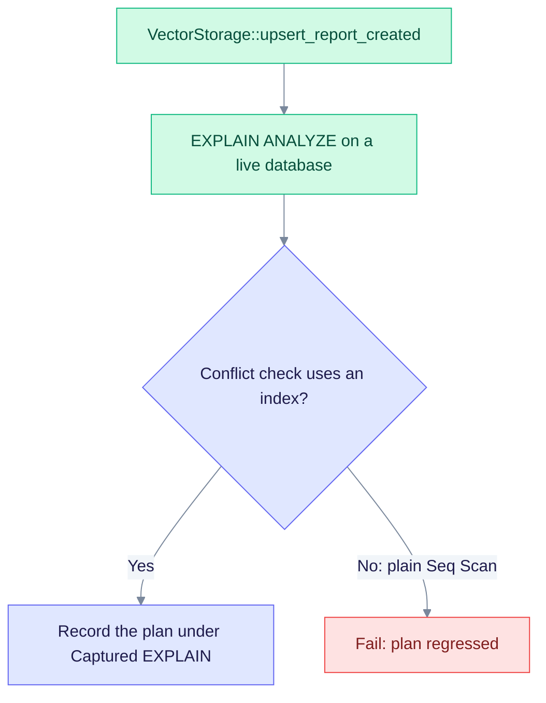

# Benchmark 004 — `DATA-PGVEC-VECTORS-UPSERT-BATCH-004`

This page covers the batch upsert of embeddings, the write behind `VectorStorage::upsert_report_created`. The method also reports which rows were newly inserted. The page gives the cost to expect and the plan to check. It is a template, so it holds no measured timings.

> **Plan template, not a measurement.** The test harness can append a real plan under "Captured EXPLAIN" (see the [README](./README.md)).

| Item | Value |
|------|-------|
| Engine | PGVEC (pgvector) |
| Entry point | `VectorStorage::upsert_report_created` |
| Source | `edgequake/crates/edgequake-storage/src/adapters/postgres/vector/storage_impl.rs` |
| Expected time | O(log N) per row with an index on the conflict key; O(N) if the plan scans |
| Pass rule | The conflict check uses an index. A plain Seq Scan on a large table fails the test |

## Plan check



The matrix test fails a plain Seq Scan. It accepts one only when the plan also mentions an index, or when the plan is four lines or fewer (a tiny table).

## How the write reports inserts

The batch uses `INSERT ... ON CONFLICT DO UPDATE` through `UNNEST`. It returns `RETURNING (xmax = 0) AS inserted`, so the caller learns which IDs are new in the same statement.

## Complexity

- Variables: N = table rows, K = result or limit, B = batch size
- Time: O(log N) per row with an index; O(N) for a scan
- Space: O(K)
- I/O: index or sequential

## EXPLAIN evidence

Representative plan shape (capture it against a live database):

```sql
/* DATA-PGVEC-VECTORS-UPSERT-BATCH-004 */ EXPLAIN (ANALYZE, BUFFERS, VERBOSE, SETTINGS, FORMAT TEXT)
-- bind representative parameters for this operation
```

The index path to expect is documented in [indexes.md](../indexes.md).

## Scaling (relative)

| N | Relative latency class |
|---|------------------------|
| 1e3 | baseline |
| 1e5 | ≤ 5× baseline (log-like) for indexed operations |
| 1e6 | ≤ 10× baseline for ANN and primary-key lookups; fail on a linear full scan |

Absolute timings are not part of these templates. For measured SPEC-088 timings, see [improvements.md](../improvements.md).
