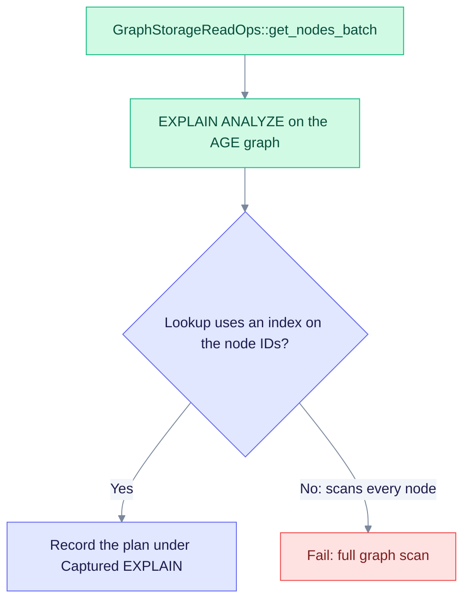

# Benchmark 031 — `DATA-AGE-GRAPH-GET-NODES-BATCH-031`

This page covers the batch node read on the Apache AGE graph, the query behind `GraphStorageReadOps::get_nodes_batch`. It gives the cost to expect and the plan to check. It is a template, so it holds no measured timings.

> **Plan template, not a measurement.** The test harness can append a real plan under "Captured EXPLAIN" (see the [README](./README.md)).

| Item | Value |
|------|-------|
| Engine | AGE (Apache AGE on PostgreSQL) |
| Entry point | `GraphStorageReadOps::get_nodes_batch`, implemented by `PostgresAGEGraphStorage` |
| Source | `edgequake/crates/edgequake-storage/src/adapters/postgres/graph/graph_storage_impl.rs` |
| Expected time | O(K log N) for a batch of K node IDs |
| Pass rule | Node lookup uses an index. A full scan of all nodes is forbidden |

## Plan check



A scan of every node in the graph is a failure at any size. Batch reads must stay bounded by K.

## Complexity

- Variables: N = nodes, E = edges, K = batch size, depth = hops, branch = average degree
- Time: O(K log N) for the batch ID lookup; O(branch^depth) when expanding neighbours; a full O(N) scan is forbidden
- Space: O(K) or O(branch^depth)
- I/O: property index and edge endpoints

## EXPLAIN evidence

Representative plan shape (capture it against a live database):

```sql
/* DATA-AGE-GRAPH-GET-NODES-BATCH-031 */ EXPLAIN (ANALYZE, BUFFERS, VERBOSE, SETTINGS, FORMAT TEXT)
-- bind representative parameters for this operation
```

The index path to expect is documented in [indexes.md](../indexes.md).

## Scaling (relative)

| N | Relative latency class |
|---|------------------------|
| 1e3 | baseline |
| 1e5 | ≤ 5× baseline (log-like) for indexed operations |
| 1e6 | ≤ 10× baseline for ANN and primary-key lookups; fail on a linear full scan |

Absolute timings are not part of these templates. For measured SPEC-088 timings, see [improvements.md](../improvements.md).
