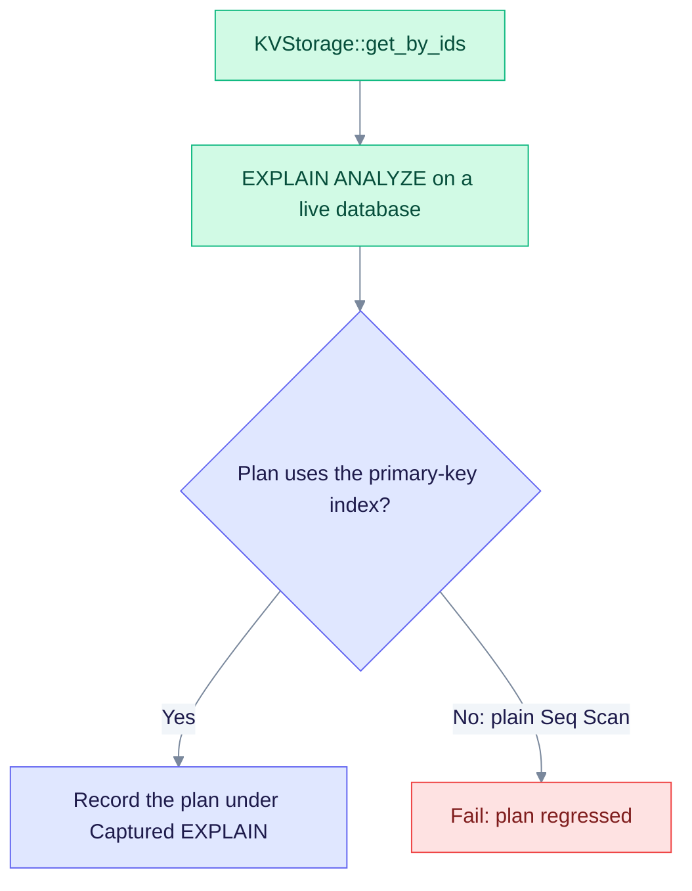

# Benchmark 076 — `DATA-PG-KV-GET-BY-IDS-076`

This page covers the batch key read behind `KVStorage::get_by_ids`. It gives the cost to expect and the plan to check. It is a template, so it holds no measured timings.

> **Legacy.** The `eq_*_kv` tables this read used were dropped by migration 125. The template describes the pre-drop access path. See the [README](./README.md).

| Item | Value |
|------|-------|
| Engine | PG (PostgreSQL) |
| Entry point | `KVStorage::get_by_ids`, implemented by `PostgresKVStorage` |
| Source | `edgequake/crates/edgequake-storage/src/adapters/postgres/kv.rs` |
| Expected time | O(K log N) for a batch of K keys |
| Pass rule | The primary-key index is used. A plain Seq Scan on a large table fails the test |

## Plan check



The matrix test fails a plain Seq Scan. It accepts one only when the plan also mentions an index, or when the plan is four lines or fewer (a tiny table).

## Complexity

- Variables: N = keys, K = batch size, M = prefix matches
- Time: O(log N) for one key; O(K log N) for a batch; O(M) for a prefix scan
- Space: O(K) or O(M)
- I/O: index plus heap page per key

## EXPLAIN evidence

Representative plan shape (capture it against a live database):

```sql
/* DATA-PG-KV-GET-BY-IDS-076 */ EXPLAIN (ANALYZE, BUFFERS, VERBOSE, SETTINGS, FORMAT TEXT)
-- bind representative parameters for this operation, with a batch of keys
```

The index path to expect is documented in [indexes.md](../indexes.md).

## Scaling (relative)

| N | Relative latency class |
|---|------------------------|
| 1e3 | baseline |
| 1e5 | ≤ 5× baseline (log-like) for indexed operations |
| 1e6 | ≤ 10× baseline for ANN and primary-key lookups; fail on a linear full scan |

Absolute timings are not part of these templates. For measured SPEC-088 timings, see [improvements.md](../improvements.md).
