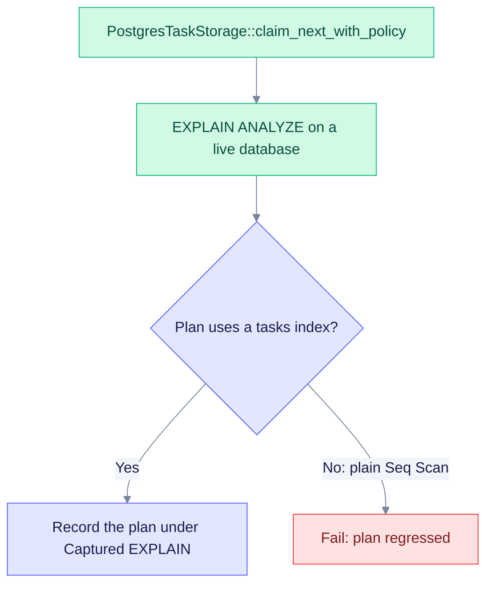

# Benchmark 140 — `DATA-PG-TASKS-CLAIM-NEXT-140`

This page covers the task claim that a worker runs to take the next pending task, the path behind `TaskStorage::claim_next`. The claim locks one row with `FOR UPDATE SKIP LOCKED`, so concurrent workers never take the same task. The page gives the cost to expect and the plan to check. It is a template, so it holds no measured timings.

> **Plan template, not a measurement.** The test harness can append a real plan under "Captured EXPLAIN" (see the [README](./README.md)).

| Item | Value |
|------|-------|
| Engine | PG (PostgreSQL) |
| Entry point | `TaskStorage::claim_next` default, which calls `PostgresTaskStorage::claim_next_with_policy` |
| Source | `edgequake/crates/edgequake-tasks/src/postgres.rs` |
| Expected time | O(B + W) for a sample of B ≈ 1000 pending rows and W active workspaces, not the full backlog |
| Pass rule | The plan uses a tasks index. A plain Seq Scan on the tasks table fails the test |

## Plan check



The matrix test fails a plain Seq Scan. It accepts one only when the plan also mentions an index, or when the plan is four lines or fewer (a tiny table).

## Complexity

- Variables: N = tasks, W = active workspaces, B = sampled candidate rows
- Time: O(log N) for a point lookup; claim O(B + W) plus the row lock
- Space: O(1) for a claim; O(page) for a list
- I/O: index on status, workspace and lease

## Indexes to expect

The claim relies on these indexes from the migrations and the source annotations:

- `idx_tasks_claim_pending_workspace_created` (pending tasks by workspace and creation time)
- `idx_tasks_stale_processing_lease` (processing tasks with an expired lease)
- `idx_tasks_fairness_hold_until` (tasks held by the fairness policy)

## EXPLAIN evidence

Representative plan shape (capture it against a live database):

```sql
/* DATA-PG-TASKS-CLAIM-NEXT-140 */ EXPLAIN (ANALYZE, BUFFERS, VERBOSE, SETTINGS, FORMAT TEXT)
-- bind representative parameters for this operation
```

The index path to expect is documented in [indexes.md](../indexes.md).

## Scaling (relative)

| N | Relative latency class |
|---|------------------------|
| 1e3 | baseline |
| 1e5 | ≤ 5× baseline (log-like) for indexed operations |
| 1e6 | ≤ 10× baseline for ANN and primary-key lookups; fail on a linear full scan |

Absolute timings are not part of these templates. For measured SPEC-088 timings, see [improvements.md](../improvements.md).
