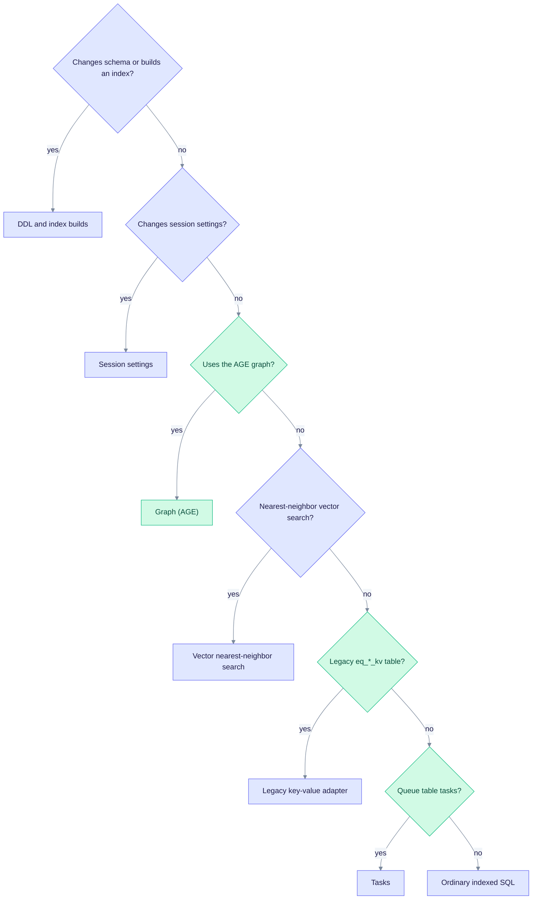

# Complexity matrix

This page describes what each class of data-layer operation costs, which limits apply, and how it tends to fail. The figures are design-time estimates from the SPEC-088 inventory, not measured timings. For measured results, see [improvements.md](./improvements.md).

Notation: N is the number of rows in the table, and K is the number of rows you ask for.

Each of the 235 registered operations belongs to exactly one class. A Ref number is the `NNN` suffix of an ID such as `DATA-AGE-GRAPH-HAS-NODE-025`. Look up the full entry in [postgres.md](./postgres.md), [pgvector.md](./pgvector.md), or [age.md](./age.md).

## Which class is an operation in?

Walk the questions from top to bottom and stop at the first yes.

Each operation belongs to the first question it answers yes to, so ask them in order.

## Classes

| Class | Operations | Time | Space | Key limits | Failure modes |
|---|---|---|---|---|---|
| **Vector nearest-neighbor search** | 3 | O(ef * log N) expected; O(N) worst case if the planner picks a sequential scan | O(K + ef) | `hnsw.ef_search` = clamp(4 * K, 40, 1000). Filtered search uses iterative scan (`max_scan_tuples` = 20000). | Timeout, fewer than K results, silent recall loss, sequential-scan cliff |
| **Ordinary indexed SQL** | 115 | O(log N) with an index; O(N) without | O(K) | Use keyset pagination, not large OFFSET. Keep `statement_timeout` set. | Timeout, lock wait, out of memory on an unbounded SELECT |
| **DDL and index builds** | 30 | O(N log N) for an HNSW build; O(N) for a btree | `maintenance_work_mem` | Never REINDEX on the request path. Use `max_parallel_maintenance_workers` for HNSW. Use pgvector 0.8.2 or later. | ACCESS EXCLUSIVE lock contention, out of memory during build |
| **Session settings** | 4 | O(1) | O(1) | Use `SET LOCAL` only inside short transactions. Never leak settings across pooled connections. | A leaked setting changes recall or plans for the next user of the connection |
| **Graph (AGE)** | 51 | O(K log N) for a batch by ID; O(branch^depth) for an expansion; a full scan (O(N)) is forbidden on the request path | O(K) or O(branch^depth) | Prefer native writes (unique `node_id`). Cypher MERGE is for fallback and debugging. | Cartesian expansion, timeout, out of memory on an unbounded MATCH |
| **Legacy key-value adapter** | 18 | O(log N) for one key; O(K log N) for a batch; O(M) for a prefix scan | O(K) or O(M) | Upsert batches of at most 1000. PostgreSQL allows 65535 bind parameters per statement. | Timeout on a large prefix scan; slow COUNT on a large table |
| **Tasks** | 14 | O(log N) for a get; claim is O(W + log N) plus a row lock | O(1) for a claim; O(page) for a list | `SKIP LOCKED` for concurrency. A lease lets another worker reclaim an abandoned task. | Starvation without the fair claim; lease expiry race |

## Ref numbers per class

| Class | Ref numbers |
|---|---|
| **Vector nearest-neighbor search** | 001 to 002, 017 |
| **Ordinary indexed SQL** | 003 to 016, 093 to 130, 145 to 156, 158 to 194, 198 to 206, 209 to 213 |
| **DDL and index builds** | 018 to 021, 023 to 024, 207 to 208, 214 to 235 |
| **Session settings** | 022, 195 to 197 |
| **Graph (AGE)** | 025 to 074, 157 |
| **Legacy key-value adapter** | 075 to 092 |
| **Tasks** | 131 to 144 |

The counts add up to 235: 3 + 115 + 30 + 4 + 51 + 18 + 14.

## Reading notes

- The vector classes describe the original SPEC-088 view of the adapter. In the default typed mode, the search also runs inside a bounded transaction with a statement timeout. See [pgvector.md](./pgvector.md#how-a-vector-search-runs).
- The generic key-value relation is no longer created at runtime (SPEC-091 Wave D), and migration 125 dropped the `eq_*_kv` tables.
- The DDL class includes the `SCHEMA` entries for migrations. Every migration is applied by `edgequake migrate`, which takes the locks listed in [postgres.md](./postgres.md#schema-and-migrations).
- "Forbidden" in the graph class means the request path must not call the operation. Admin tools and tests may.
