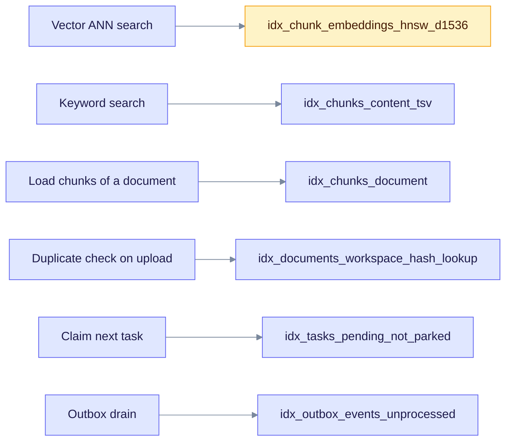

# Index catalog

An index lets PostgreSQL find rows without reading the whole table. This page lists the indexes that matter for the hot paths and the operations that use them. Index names were checked against the migrations in `edgequake/migrations/` (001 to 169).

## Indexes on relational tables

| Table | Index | Kind | What it serves |
|---|---|---|---|
| `chunks` | `chunks_unique_doc_index` | unique btree `(document_id, chunk_index)` | Order and uniqueness of chunks in a document |
| `chunks` | `idx_chunks_document` | btree `(document_id)` | Load or delete all chunks of a document |
| `chunks` | `idx_chunks_tenant_workspace` | btree `(tenant_id, workspace_id)` | Scoped scans |
| `chunks` | `idx_chunks_content_tsv` | GIN `(content_tsv)` | Keyword search |
| `chunks` | `idx_chunks_created_at_brin` | BRIN `(created_at)` | Cheap range scans on time |
| `chunks` | `idx_chunks_page_span` | partial btree `(document_id, page_start, page_end)` where `page_start` is not null | Page lookups |
| `documents` | `idx_documents_workspace_created` | btree `(workspace_id, created_at DESC)` | Document list per workspace |
| `documents` | `idx_documents_tenant_status` | partial btree `(tenant_id, status)` with included columns, where `tenant_id` is not null | Status counts and lists |
| `documents` | `idx_documents_workspace_content_hash_unique` | partial unique `(workspace_id, content_hash)` where status is `indexed` | No duplicate indexed content per workspace |
| `documents` | `idx_documents_workspace_hash_lookup` | partial btree `(workspace_id, content_hash)` | Duplicate check on upload |
| `documents` | `idx_documents_track_id` | btree `(track_id)` | Look up by track ID |
| `entities` | `entities_unique_name` | unique `(tenant_id, workspace_id, name)` nulls not distinct | One entity per name and scope |
| `entities` | `idx_entities_tsv`, `idx_entities_source_chunk_ids` | GIN | Entity text search and chunk lineage |
| `relationships` | `relationships_unique` | unique `(tenant_id, workspace_id, source_id, target_id, relation_type)` | One edge per kind and pair |
| `relationships` | `idx_relationships_source`, `idx_relationships_target` | btree | Neighbors of an entity |
| `chunk_entity_links`, `chunk_relation_links` | `idx_cel_*`, `idx_crl_*` | btree | Lineage lookups by chunk, entity, or workspace |
| `chunk_serving_state` | `idx_chunk_serving_state_state` | btree `(state, updated_at DESC)` | Find chunks stuck in a state |
| `llm_cache` | `llm_cache_pkey`, `idx_llm_cache_expiry` | primary key `(cache_key, namespace)`; partial index on `expires_at` | Cache hit and expiry sweep |
| `outbox_events` | `idx_outbox_events_unprocessed` | partial btree `(created_at)` where `processed_at IS NULL` | Outbox drain (migration 109) |
| `conversations` | `idx_conversations_tenant_user` and others | btree and GIN | Conversation lists and title search |
| `messages` | `idx_messages_conversation`, `idx_messages_content_fts` | btree; GIN | Load a thread; search messages |
| `memberships` | `memberships_user_tenant_workspace_uidx` | unique, nulls not distinct (migration 164) | One membership per user and scope |
| `pdf_documents` | `idx_pdf_documents_workspace_checksum_unique` | unique `(workspace_id, sha256_checksum)` | PDF deduplication |

## Task indexes

The `tasks` table is partitioned by month, so each index below is created on every partition. Its primary key is `(id, created_at)`.

| Index | Kind | What it serves |
|---|---|---|
| `idx_tasks_pending_not_parked` | partial btree `(created_at)` where pending and not parked (migration 111) | Fair claim of the next task |
| `idx_tasks_available_pending` | partial btree `(available_at, created_at)` where pending | Delayed retries |
| `idx_tasks_fairness_hold_until` | partial btree | Release of parked tenants |
| `idx_tasks_document_active` | partial btree `(document_id)` where the task is still active | Find the active task of a document |
| `idx_tasks_workspace_document_id` | partial btree `(workspace_id, document_id)` | Per-workspace lookups |
| `idx_tasks_cancel_requested_processing` | partial btree | Cancel handling |
| `idx_tasks_job`, `idx_tasks_parent` | partial btree | Job and parent-task trees |

## Vector indexes

Each embedding table has three partial HNSW indexes, for 768, 1024, and 1536 dimensions. They are named `idx_<table>_hnsw_d<dims>` (for example, `idx_chunk_embeddings_hnsw_d1536`). They use `halfvec_cosine_ops` with `m = 16` and `ef_construction = 128`, and each has a `WHERE dimensions = <dims>` clause. Migration 132 creates them. See [pgvector.md](./pgvector.md) for details.

## Graph indexes

The AGE graph indexes (`idx_node_prop_node_id_unique`, `idx_node_id`, and the `EDGE` and `source_ids` indexes) are listed in [age.md](./age.md#indexes). The adapter creates them at run time.

## Hot paths and their indexes

The diagram links six hot-path operations to the index that serves each one. If a query cannot use its index, PostgreSQL falls back to a scan, so check the plan with `EXPLAIN` when you change a filter.

## Which operations use which index

Numbers below are the `NNN` suffix of a Ref ID. For example, `025` is `DATA-AGE-GRAPH-HAS-NODE-025`. Find the full entry in the engine catalog: [postgres.md](./postgres.md), [pgvector.md](./pgvector.md), or [age.md](./age.md). Rows marked **Legacy** refer to tables that migrations 125, 126, and 131 dropped. They are used only in rollback mode.

| Index group | Status | Ref numbers |
|---|---|---|
| Unique `node_id` on AGE `Node` (`idx_node_prop_node_id_unique`, `idx_node_id`) | Current | 025 to 032, 035, 041, 043 to 049, 057, 059, 061, 063 to 066, 068 |
| `EDGE` start, end, source, and target btrees (`idx_edge_*`) | Current | 027 to 028, 032 to 038, 042 to 044, 050 to 054, 058, 060, 062, 067, 069 to 070 |
| GIN on `source_ids` (`idx_node_source_ids_gin`, `idx_edge_source_ids_gin`) | Current | 064 to 065, 068 to 069 |
| `tasks` indexes above | Current | 131 to 144 |
| RLS policies and the `app.current_*` settings (not an index) | Current | 195 to 196 |
| Full-text GIN (`idx_chunks_content_tsv`) | Current | 003, 221 |
| `PRIMARY KEY (key)` on `eq_*_kv` | Legacy | 075 to 091 |
| HNSW or IVF on `eq_*_vectors` | Legacy. Typed tables replace them. | 001 to 002, 004, 017 to 020, 022, 024 |
| btree tenant, workspace, document on `eq_*_vectors` | Legacy | 002 to 003, 016 |

The Ref-number column is the author's mapping from the Phase 0 inventory. It was not re-derived from the code, so treat it as a starting point and confirm against the entry point.
