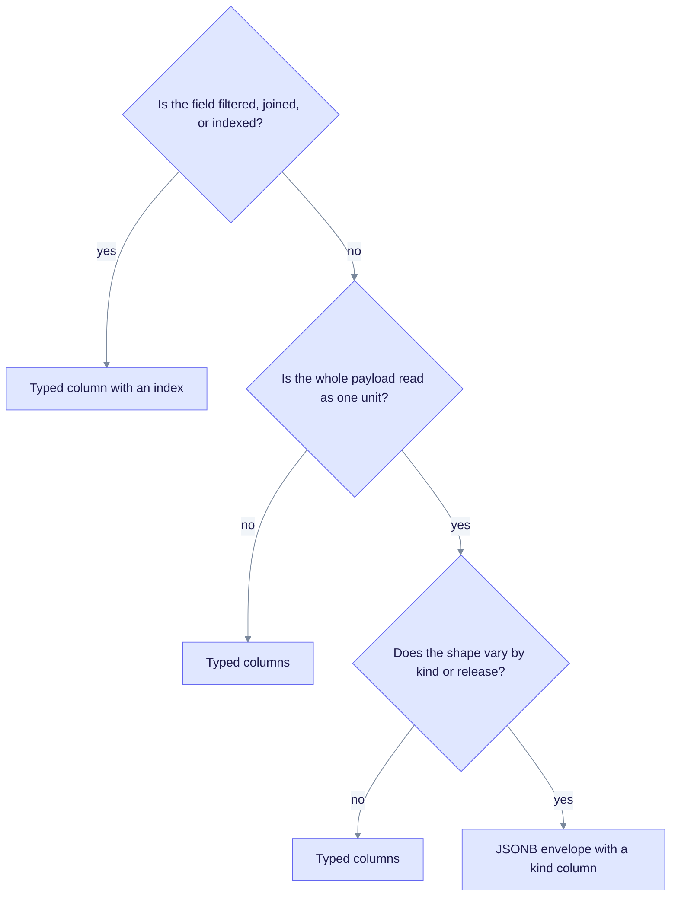

# JSONB envelope acceptance (GAP-091-05)

**Status:** Accepted by design. This is not a missing migration.

**Spec:** SPEC-091 IW3, [19-improvement-plan.md](../../specs/091-simplify-data-layer/19-improvement-plan.md).

JSONB is a PostgreSQL column type that stores flexible JSON. Four typed tables keep one JSONB payload column instead of splitting it into many typed columns. The application defines the shape of each payload (an "envelope"). This was a deliberate choice, not unfinished work.

## Tables that keep a JSONB payload

| Table | JSONB column | Key | What it holds | Why JSONB stays |
|---|---|---|---|---|
| `pipeline_checkpoints` | `payload` | `(document_id, kind)`, where `kind` is `checkpoint` or `snapshot` | Pipeline resume data | Pipeline stages change often, and few queries read inside the payload. |
| `document_artifacts` | `payload` | `(document_id, kind)` | Lineage, multimodal manifests, multimodal chunks, and multimodal cache entries | The shape varies by `kind`. |
| `llm_cache` | `value` | `(cache_key, namespace)` | Cached LLM, keyword, and multimodal answers | Keyed by hash. The provider payload is opaque. |
| `compensation_quarantine` | `payload` | `entry_id` | Dead-letter records from failed merges | The failure details vary by merge, so the payload stays flexible. |

Migration 116 creates the first two tables, migration 124 creates `llm_cache`, and migration 107 creates `compensation_quarantine`.

## Related data outside this decision

Some tables also store JSON, but they are not envelopes:

- `documents.metadata` is JSONB. It is a plain column with a relational compare-and-set in `edgequake/crates/edgequake-storage/src/adapters/postgres/document_shell.rs`, so this decision does not cover it.
- Chunk text lives in `chunks.content` (text). `content_tsv` is generated from it.
- Chunk vectors live in `chunk_embeddings.embedding` (`halfvec`).

## Decision guide

Use a JSONB envelope only when a payload is read as one unit and its shape varies. Otherwise use typed columns.

## What operators should know

- The advisor's durable-residue check counts only families marked durable. Checkpoints and compensation quarantine are marked non-durable (`edgequake/crates/edgequake-storage/src/migration_engine/advisor/types.rs`). When migration 125 drained the old key-value data, those rows were not counted as residue. They are transient by design.
- The drain worker (`edgequake/crates/edgequake-storage/src/compensation_drain.rs`) claims quarantine rows and processes their `payload`. A manual change to a row can race with it, so make changes through the compensation applier (`edgequake/crates/edgequake-storage/src/compensation.rs`) instead of plain SQL.

## Where it is verified

- Writers: `edgequake/crates/edgequake-api/src/services/relational_sidecar_store.rs` and `edgequake/crates/edgequake-api/src/services/postgres_checkpoint_artifact_store.rs` for the checkpoint and artifact tables, `edgequake/crates/edgequake-storage/src/adapters/postgres/llm_cache.rs` for `llm_cache`, and `PgQuarantineSink` in `edgequake/crates/edgequake-storage/src/adapters/postgres/quarantine_sink.rs`.
- Tests: `edgequake/crates/edgequake-storage/tests/contract_spec091_llm_cache_scope.rs`, and the compensation tests in `edgequake/crates/edgequake-storage/src/compensation.rs`.

See also: [llm-cache-scope.md](./llm-cache-scope.md), and the legacy key-value section in [postgres.md](./postgres.md#legacy-key-value-store).
