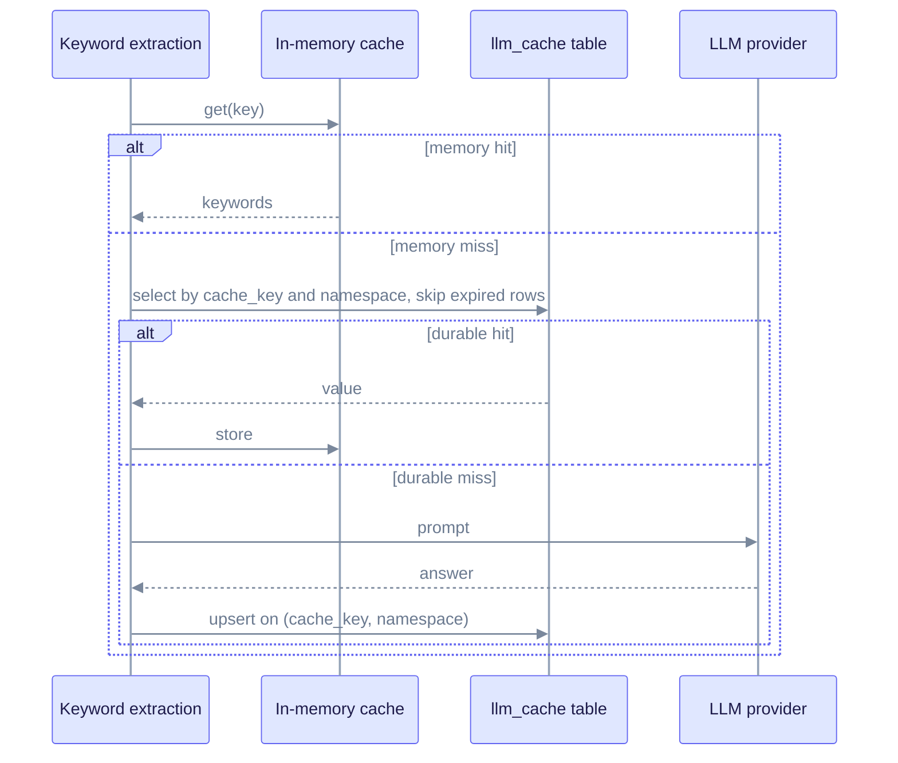

# LLM cache scope decision (SPEC-091, GAP-091-14)

**Status:** Accepted on 2026-07-30 (IW0). A contract test pins the decision: `edgequake/crates/edgequake-storage/tests/contract_spec091_llm_cache_scope.rs`.

The LLM cache stores the answers a language model gave to a prompt, so the same prompt does not cost money twice. This record explains which callers can share an entry, and why the table has no tenant or workspace column.

## Decision

The table `public.llm_cache` is keyed by `(cache_key, namespace)` (migration 124). `cache_key` is a content hash. The table has no `tenant_id` or `workspace_id` column, on purpose.

- Two workspaces in the same namespace share entries. A hit returns the output computed earlier for the same prompt and model.
- Different namespaces never see each other. Every read and write in `edgequake/crates/edgequake-storage/src/adapters/postgres/llm_cache.rs` filters on `namespace`. The column defaults to `default`.

## Reason

The cache guards against recomputing. It is not document data. The same input gives the same output, so sharing across workspaces is safe. Sharing also saves money when workspaces ingest overlapping documents or send identical keyword prompts. A lost entry costs one recomputation and never harms correctness. The table comment says the same: rows are recomputable and may expire.

## Keys

- Keyword entries use the storage key from `llm_cache_storage_key(mode, LlmCacheType::Keywords, hash)`. The hash comes from `hash_keyword_args(query, mode, model, language)` in `edgequake/crates/edgequake-query/src/cache/llm_response_cache.rs`. The model and language are part of the hash.

## Lookup flow

The sequence shows how a keyword lookup uses the two cache layers. The in-memory layer is checked first; the `llm_cache` table is checked only on a miss.

## Accepted risks

- **Timing side channel.** Inside one namespace, workspace B can notice from latency that workspace A already sent the same prompt. No content crosses, because the output depends only on the input, but the access pattern leaks. This is accepted: a namespace maps to a deployment trust boundary.
- **Provider drift.** An entry written for model X is served to a request for model Y only if the keys match. Keyword keys include the model (see [Keys](#keys)). If you need hard isolation per tenant, deploy one namespace per tenant. Set the namespace with `EDGEQUAKE_NAMESPACE`.

## Consequences

- Do not add a workspace or tenant column to `llm_cache` without updating this record and the contract test.
- Rows leave the table in two ways. Reads skip rows whose `expires_at` has passed, and code can delete a key and namespace explicitly with `cache_delete` in `edgequake/crates/edgequake-storage/src/adapters/postgres/llm_cache.rs`.
- Document deletion does not touch these rows, because the table has no document column.
- `llm_cache` is also the durable layer of the keyword cache (SPEC-103). Its `value` column is JSONB; see [jsonb-envelope-acceptance.md](./jsonb-envelope-acceptance.md).
