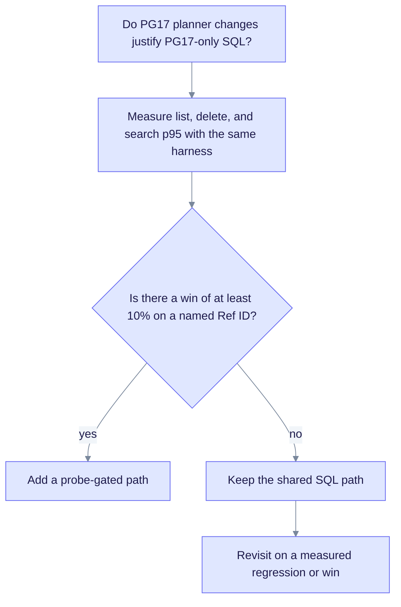

# PG17 differential measurement (SPEC-091 IW4)

**Status:** Closed (LAW-I2). The result was measured against the IW1 typed-CRUD scorecard. **No PG17-specific SQL was adopted.** This is a historical decision record. The measured numbers are in the SPEC-091 measurements, not here.

## Question

GAP-091-31 asked: do PostgreSQL 17 planner improvements, such as skip scan and better join ordering, justify SQL or index shapes that differ from the shared PG16, PG17, and PG18 path?

## Method

- Same corpus and test harness as IW1 (`perf_harness`): typed relational create, read, update, and delete on `documents`, `chunks`, and `chunk_embeddings`.
- PG17 (`edgequake-postgres:pg17`) against a PG16 baseline. Both had the same migrations. The extension pins were pgvector 0.8.5 and AGE 1.7.0 on PG17.
- The adoption bar was a p95 improvement of at least 10% on list, delete, or search paths.

## Result

No operation met the bar. PG17 varied within noise on the indexed paths. The shared SQL stays the default on all supported majors. This includes the UNION workspace delete in `document_read_model.rs` and the listing indexes from migration 128.

## Decision

- Keep one SQL path. Gate features by runtime capability probes (`edgequake/crates/edgequake-storage/src/adapters/postgres/capabilities.rs`), not by hard-coded version branches.
- Ship no PG17-only migrations in this release train.
- Revisit only when a measured regression, or a win of at least 10% on a named Ref ID in [version-matrix.md](./version-matrix.md), appears.

The flow below records how the decision was reached.

## Related

- Runtime capability report: `/health`, field `schema.postgres_capabilities`.
- Nightly full matrix: `.github/workflows/postgres-matrix-nightly.yml`.
- Pull request smoke test: `.github/workflows/spec091-data-layer.yml` (job `spec091-pg-matrix-smoke`).
- PG18 decisions: [pg18-adoption.md](./pg18-adoption.md).
