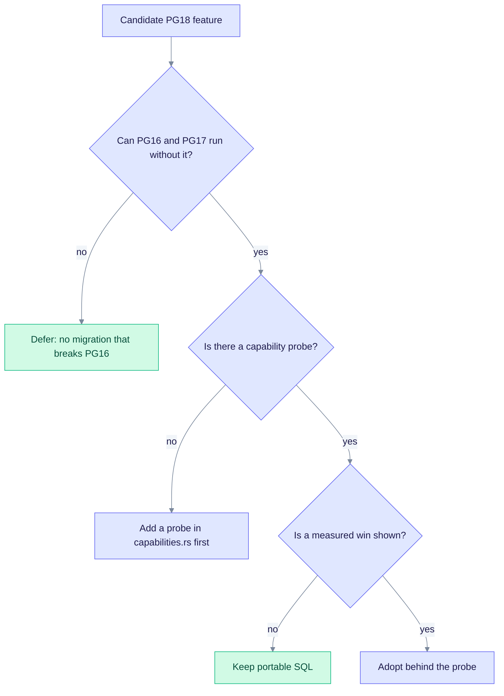

# PG18 capability-gated adoption notes (SPEC-091 IW4)

EdgeQuake supports PostgreSQL 16, 17, and 18 with one SQL path. The code checks at run time which features the database has. The results appear at `/health` under `schema.postgres_capabilities`. A PG18-only feature is used only when a probe confirms it, so PG16 keeps working.

## Adopted through a capability probe

| Feature | Probe | Behavior |
|---|---|---|
| uuidv7 document IDs | `uuidv7_available` (`PostgresCapabilityProbe` in `capabilities.rs`) | On PG18, new document IDs come from `uuidv7()`. Older versions use random v4 UUIDs. |
| Iterative ANN scans | `iterative_scan_available` (pgvector 0.8.0 or later) | Filtered vector queries set `hnsw.iterative_scan` and `hnsw.max_scan_tuples`. See [pgvector.md](./pgvector.md#how-a-vector-search-runs). |
| AGE jsonb to agtype casts | `age_jsonb_agtype_cast_available` (AGE 1.8.0-rc0 or later) | The probe only reports on `/health`. Application SQL stays portable until a win is measured (SPEC-091 RM3). |

The diagram shows the decision for any new PG18 feature.



## Deferred

### Virtual generated column for workspace metadata (GAP-091-24)

PG18 can define a virtual generated column. It could index `metadata->>'workspace_id'` without storing a second copy. A migration that depends on it would break PG16 databases, so it is deferred.

The interim fix works on all versions. The workspace bulk delete in `document_read_model.rs` uses a UNION of indexed predicates, and migration 128 adds listing indexes. See [pg17-differential.md](./pg17-differential.md).

A later option is a migration guarded by `server_version_num >= 180000`, but only when a measured win justifies it.

### `RETURNING OLD` and `RETURNING NEW`

PG18 lets `RETURNING` return both the old and the new row. That would simplify outbox-style change capture, but it needs PG18-only trigger code. It is deferred until a measured need appears.

### Asynchronous I/O (`io_method`)

PG18 async I/O can cut heap-fetch time for large sequential scans and some ANN filter paths. EdgeQuake does not set `io_method` in application code. Operators can try it, but measure first.

`io_method` is a server-start setting. Changing it with `ALTER SYSTEM` takes effect only after a restart, so `pg_reload_conf()` is not enough:

```sql
-- Only at server start. Default is 'worker'.
-- 'io_uring' needs a PostgreSQL build with liburing.
ALTER SYSTEM SET io_method = 'io_uring';
-- Then restart the PostgreSQL server.
```

Before you enable it across a fleet, compare p95 on the same hardware for three settings: `worker` (the PG18 default), `io_uring`, and `sync`. Measure these three paths:

1. Filtered typed vector search with the serving-fence join.
2. The document list on `(workspace_id, created_at)`.
3. AGE neighbor expansion.

Keep the artifacts under `specs/091-simplify-data-layer/measurements/`. Revert if the change is neutral or worse (LAW-I2).

### Skip scan on composite btrees

PG18 may use a skip scan on a composite index where PG16 and PG17 would scan the whole table. When you add a composite index (migration 128 is an example), check the plan with `EXPLAIN (ANALYZE, BUFFERS)` on PG18. No separate SQL branch is needed today.

## Sources of truth

- Runtime probes: `edgequake/crates/edgequake-storage/src/adapters/postgres/capabilities.rs`
- Version pins: `edgequake/docker/extension-pins.sh`
- Operator matrix: [version-matrix.md](./version-matrix.md)
- Related decision: [pg17-differential.md](./pg17-differential.md)
