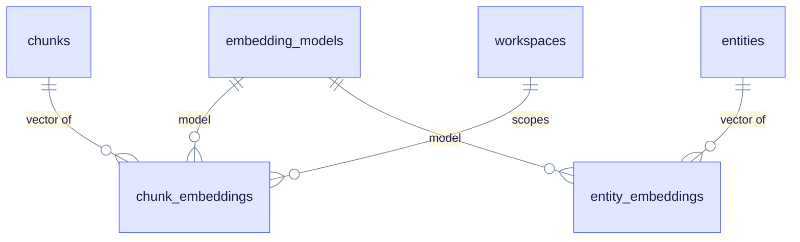
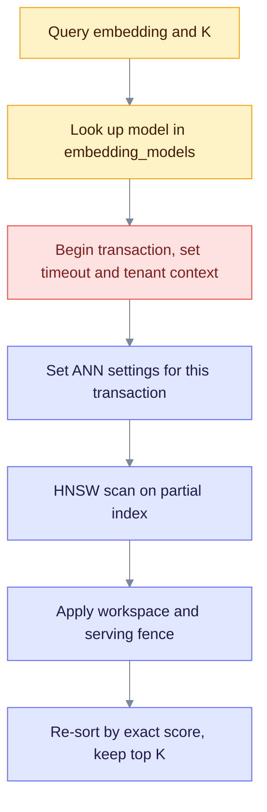

# pgvector: embeddings and similarity search

pgvector is a PostgreSQL extension that stores vectors and finds the nearest ones. An embedding is a list of numbers that represents the meaning of a text. EdgeQuake compares embeddings with cosine distance to find chunks, entities, and relationships that are close to a question. This page explains the tables, indexes, and settings. The overview is in [README.md](./README.md).

## Where embeddings live

Since SPEC-091, embeddings live in typed tables. There is one row per object and model. The old per-workspace `eq_*_vectors` tables were dropped by migrations 126 and 131.

| Table | Holds | Primary key |
|---|---|---|
| `embedding_models` | One row per model name and dimension. Unique on `(name, dimensions)`. | `id` |
| `chunk_embeddings` | Chunk vectors | `(model_id, chunk_id)` |
| `entity_embeddings` | Entity vectors | `(model_id, entity_id)` |
| `relationship_embeddings` | Relationship vectors | `(model_id, relationship_id)` |
| `report_embeddings` | Community report vectors | `(model_id, report_id)` |

Each embedding table has the same core columns: `model_id`, an object ID, `workspace_id`, `embedding` (type `halfvec`), `dimensions`, and `created_at`. The entity, relationship, and report tables also have `legacy_vector_id`, used while data moved from the old tables. A CHECK constraint (`vector_dims(embedding) = dimensions`) keeps the stored length equal to the `dimensions` column.

The diagram shows how the typed tables link. Solid lines are foreign keys with `ON DELETE CASCADE`.



## Rules the code follows

- **Cosine only.** Queries use the cosine operator `<=>` and indexes use `halfvec_cosine_ops`. L2 and inner product are not wired.
- **`halfvec` by default.** A `halfvec` stores each number in 16 bits, so it is half the size of a normal `vector`. `EDGEQUAKE_VECTOR_STORAGE` selects the mode; the default is `halfvec`.
- **Index size limits.** HNSW can index a `vector` up to 2000 dimensions and a `halfvec` up to 4000.
- **Versions.** Iterative scans need pgvector 0.8.0 or later. The code treats 0.8.2 as the CVE-safe floor (`PGVECTOR_MIN_CVE_SAFE` in `capabilities.rs`): CVE-2026-3172 affected parallel HNSW builds in 0.8.0 and 0.8.1. The images pin 0.8.5.
- **Model key.** The model name comes from `EDGEQUAKE_EMBEDDING_MODEL` and defaults to `text-embedding-3-small`. The `embedding_models` row for that model selects the rows to search.
- **Backend switch.** `EDGEQUAKE_VECTOR_BACKEND` defaults to `typed_embeddings`. The value `legacy_tables` is a rollback switch for databases that still have the old tables. Unknown values fall back to typed.

## Indexes

HNSW (Hierarchical Navigable Small World) is a graph-based index for approximate nearest-neighbor search. It trades a little accuracy for a large speedup. The migrations create one partial HNSW index per embedding table and per common dimension: 768, 1024, and 1536. Each index covers only rows with that `dimensions` value, so one table can hold several models.

Example, as created in migration 132:

```sql
CREATE INDEX idx_chunk_embeddings_hnsw_d1536
  ON chunk_embeddings
  USING hnsw ((embedding::halfvec(1536)) halfvec_cosine_ops)
  WITH (m = 16, ef_construction = 128)
  WHERE dimensions = 1536;
```

| Table | Other indexes |
|---|---|
| `chunk_embeddings` | `idx_chunk_embeddings_workspace (workspace_id, model_id)` |
| `entity_embeddings`, `relationship_embeddings`, `report_embeddings` | `(workspace_id, model_id)` and a unique `(workspace_id, legacy_vector_id)` index on the non-null legacy IDs |

Other dimensions are accepted (up to the limits above), but the migrations create no HNSW index for them. Searches on such a model fall back to a scan. If you use one, add the index in a new migration.

## How a vector search runs

The typed search runs inside one short transaction. The diagram shows the steps. Read it top to bottom.



The settings in step D are all `SET LOCAL`, so they end with the transaction:

| Setting | Value | Override |
|---|---|---|
| `statement_timeout` | Budget of 2000 ms, minus 250 ms of headroom, so PostgreSQL gives up before the application does (1750 ms by default) | `EDGEQUAKE_VECTOR_QUERY_TIMEOUT_MS` |
| `plan_cache_mode` | `force_custom_plan` (filters vary a lot per workspace) | none |
| `hnsw.ef_search` | `4 x K`, clamped to 40..1000 | `EDGEQUAKE_HNSW_EF_SEARCH` (1..1000) |
| `hnsw.iterative_scan` | `relaxed_order` (filtered queries, pgvector 0.8 or later) | `EDGEQUAKE_HNSW_ITERATIVE_SCAN` = `strict`, `off`, or default |
| `hnsw.max_scan_tuples` | 20000 | `EDGEQUAKE_HNSW_MAX_SCAN_TUPLES` |
| `hnsw.scan_mem_multiplier` | not set | `EDGEQUAKE_HNSW_SCAN_MEM_MULTIPLIER` (1..1000) |

Iterative scan matters for filtered search. Without it, PostgreSQL filters the index results after the scan, and a strict filter can leave fewer than K rows. With it, the index keeps scanning until it has enough matches or reaches `max_scan_tuples`.

The SQL wraps the index query as `WITH candidates AS MATERIALIZED (...) SELECT ... ORDER BY score + 0 DESC LIMIT K`. The index returns candidates in approximate order. The outer sort uses the exact stored-vector score, which removes small ordering errors from `halfvec` rounding.

Chunk writes batch with `unnest` and use `ON CONFLICT (model_id, chunk_id) DO NOTHING`, so a retry is safe. Entity, relationship, and report writes use `ON CONFLICT ... DO UPDATE` instead.

### Index build settings (older per-workspace adapter)

These settings only matter if you run the rollback backend. The typed tables use the fixed indexes from the migrations (`m = 16`, `ef_construction = 128`).

| Variable | Default | Meaning |
|---|---|---|
| `EDGEQUAKE_HNSW_EF_CONSTRUCTION` | 128 (clamped to 4..1000) | Build quality for indexes that the older adapter creates. Only affects new builds. |
| `EDGEQUAKE_HNSW_PARTIAL_BY_WORKSPACE` | on | Per-workspace partial indexes, built by the older adapter (`PgVectorStorage`). Not used by the typed tables. |
| `EDGEQUAKE_HNSW_PARTIAL_MIN_ROWS` | 1000 | Minimum rows before that adapter builds a workspace partial index. |

## Keyword search

Chunks have a stored generated column, `content_tsv`, with a GIN index (`idx_chunks_content_tsv`, migration 136). Keyword search reads it next to vector search. The column is built with the `english` configuration. Under the typed backend, `EDGEQUAKE_FTS_LANGUAGE` has no effect; it applies only to the legacy rollback path.

## Serving fence

The fence hides chunks that are not ready. It is on by default. Only `off`, `false`, `0`, or `no` in `EDGEQUAKE_SERVING_FENCE` turn it off. When it is on, a chunk is visible only if its row in `chunk_serving_state` has `state = 'ready'`. See [serving-fence-decision.md](./serving-fence-decision.md).

## Capability check

At start the storage layer reads the installed versions of PostgreSQL, pgvector, and AGE. The `/health` response shows them under `schema.postgres_capabilities`. Use it to confirm that the database meets the minimums above.

## Operation catalog

These entries come from the SPEC-088 inventory, written before the typed tables. Their entry points name the `VectorStorage` trait. With the default `typed_embeddings` backend, the typed adapters serve the same calls from the tables above. Operations that create or drop `eq_*_vectors` tables (`DDL-CREATE-TABLE`, `DDL-ENSURE-ANN-INDEX`, `DDL-PARTIAL-HNSW`, `WS-DROP-TABLE`, and `DIM-RECONCILE`) describe the legacy adapter and run only in rollback mode. Ref IDs never change, so the entries stay.

Rows with a linked Ref ID have a benchmark template in [benchmarks/](./benchmarks/README.md). Cost and failure notes are in [complexity-matrix.md](./complexity-matrix.md). File paths are relative to `edgequake/crates/`. Some entry points are descriptive, not exact function names.

### Vector reads (9)

Nearest-neighbor search, keyword search, lookups, and counts.

| Ref ID | Entry point | File | Type | Tx | Notes |
|---|---|---|---|---|---|
| [`DATA-PGVEC-VECTORS-ANN-QUERY-001`](./benchmarks/001.md) | `VectorStorage::query` | `edgequake-storage/src/adapters/postgres/vector/storage_impl.rs` | Read | Yes | unfiltered HNSW/IVF |
| [`DATA-PGVEC-VECTORS-ANN-QUERY-FILTERED-002`](./benchmarks/002.md) | `VectorStorage::query_filtered` | `edgequake-storage/src/adapters/postgres/vector/storage_impl.rs` | Read | Yes | tenant/ws/doc + iterative_scan |
| `DATA-PG-VECTORS-TEXT-SEARCH-FILTERED-003` | `VectorStorage::text_search_filtered` | `edgequake-storage/src/adapters/postgres/vector/storage_impl.rs` | Read | Yes | FTS GIN |
| `DATA-PG-VECTORS-GET-BY-ID-009` | `VectorStorage::get_by_id` | `edgequake-storage/src/adapters/postgres/vector/storage_impl.rs` | Read | Yes |  |
| `DATA-PG-VECTORS-GET-BY-IDS-010` | `VectorStorage::get_by_ids` | `edgequake-storage/src/adapters/postgres/vector/storage_impl.rs` | Read | Yes |  |
| `DATA-PG-VECTORS-COUNT-011` | `VectorStorage::count` | `edgequake-storage/src/adapters/postgres/vector/storage_impl.rs` | Read | Yes | stats O(1) or COUNT* |
| `DATA-PG-VECTORS-IS-EMPTY-012` | `VectorStorage::is_empty` | `edgequake-storage/src/adapters/postgres/vector/storage_impl.rs` | Read | Yes |  |
| `DATA-PG-VECTORS-PING-013` | `VectorStorage::ping` | `edgequake-storage/src/adapters/postgres/vector/storage_impl.rs` | Read | No |  |
| `DATA-PGVEC-VECTORS-WARMUP-ANN-017` | `VectorStorage::warmup_workspace_ann` | `edgequake-storage/src/adapters/postgres/vector/storage_impl.rs` | Read | Yes |  |

### Vector writes (8)

Upserts and deletes.

| Ref ID | Entry point | File | Type | Tx | Notes |
|---|---|---|---|---|---|
| [`DATA-PGVEC-VECTORS-UPSERT-BATCH-004`](./benchmarks/004.md) | `VectorStorage::upsert_report_created` | `edgequake-storage/src/adapters/postgres/vector/storage_impl.rs` | Write | Yes | UNNEST ON CONFLICT |
| `DATA-PG-VECTORS-DELETE-BY-ID-005` | `VectorStorage::delete` | `edgequake-storage/src/adapters/postgres/vector/storage_impl.rs` | Write | Yes |  |
| `DATA-PG-VECTORS-DELETE-ENTITY-006` | `VectorStorage::delete_entity` | `edgequake-storage/src/adapters/postgres/vector/storage_impl.rs` | Write | Yes |  |
| `DATA-PG-VECTORS-DELETE-ENTITIES-BATCH-007` | `VectorStorage::delete_entities_batch` | `edgequake-storage/src/adapters/postgres/vector/storage_impl.rs` | Write | Yes |  |
| `DATA-PG-VECTORS-DELETE-ENTITY-RELATIONS-008` | `VectorStorage::delete_entity_relations` | `edgequake-storage/src/adapters/postgres/vector/storage_impl.rs` | Write | Yes |  |
| `DATA-PG-VECTORS-CLEAR-014` | `VectorStorage::clear` | `edgequake-storage/src/adapters/postgres/vector/storage_impl.rs` | Write | Yes | ADMIN |
| `DATA-PG-VECTORS-CLEAR-WORKSPACE-015` | `VectorStorage::clear_workspace` | `edgequake-storage/src/adapters/postgres/vector/storage_impl.rs` | Write | Yes | ADMIN |
| `DATA-PG-VECTORS-DELETE-BY-DOCUMENT-016` | `VectorStorage::delete_by_document` | `edgequake-storage/src/adapters/postgres/vector/storage_impl.rs` | Write | Yes |  |

### Vector DDL and session (7)

Table and index setup, dimension handling, and search settings. Most of these belong to the legacy adapter.

| Ref ID | Entry point | File | Type | Tx | Notes |
|---|---|---|---|---|---|
| `DATA-PGVEC-VECTORS-DDL-CREATE-TABLE-018` | `create_table` | `edgequake-storage/src/adapters/postgres/vector/ddl.rs` | DDL | Yes |  |
| `DATA-PGVEC-VECTORS-DDL-ENSURE-ANN-INDEX-019` | `ensure_ann_index` | `edgequake-storage/src/adapters/postgres/vector/ddl.rs` | DDL | No |  |
| `DATA-PGVEC-VECTORS-DDL-PARTIAL-HNSW-020` | `ensure_partial_hnsw_for_workspace` | `edgequake-storage/src/adapters/postgres/vector/ddl.rs` | DDL | No |  |
| `DATA-PG-VECTORS-DDL-ENSURE-FTS-021` | `ensure_content_fts` | `edgequake-storage/src/adapters/postgres/vector/ddl.rs` | DDL | No |  |
| `DATA-PGVEC-VECTORS-SESSION-SEARCH-TUNING-022` | `search_tuning_statements` | `edgequake-storage/src/adapters/postgres/vector/search_tuning.rs` | Session | Yes |  |
| `DATA-PG-VECTORS-WS-DROP-TABLE-023` | `PgWorkspaceVectorRegistry::drop_workspace_table` | `edgequake-storage/src/adapters/postgres/workspace_vector.rs` | DDL | Yes |  |
| `DATA-PGVEC-VECTORS-DIM-RECONCILE-024` | `reconcile_dimension` | `edgequake-storage/src/adapters/postgres/vector/migration.rs` | DDL | Yes |  |
