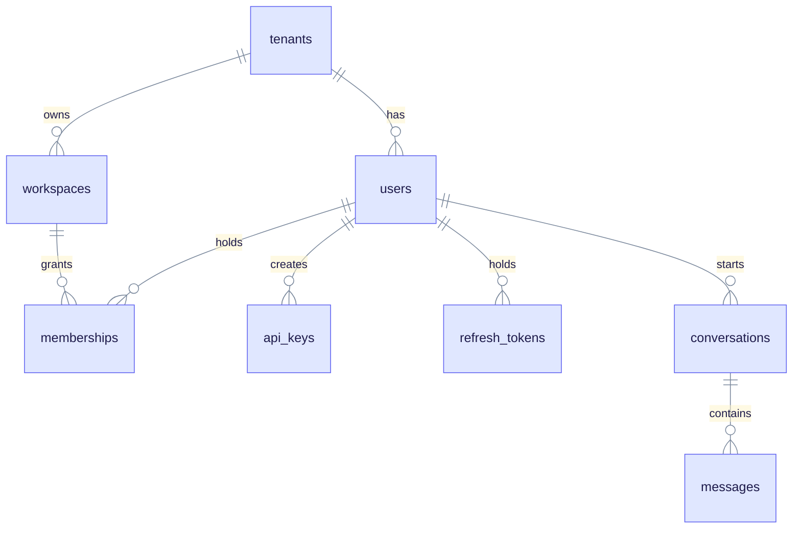
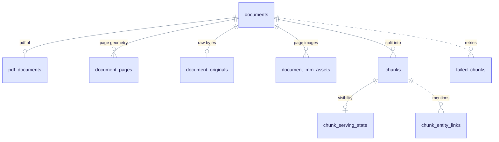
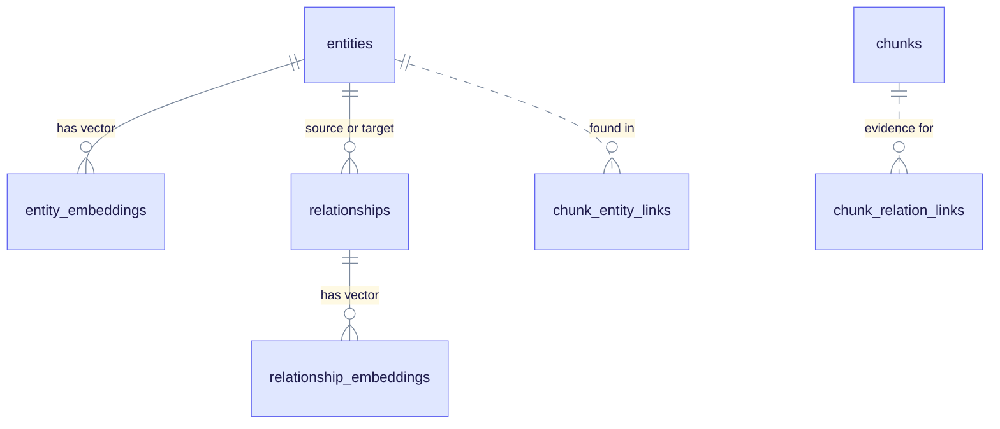
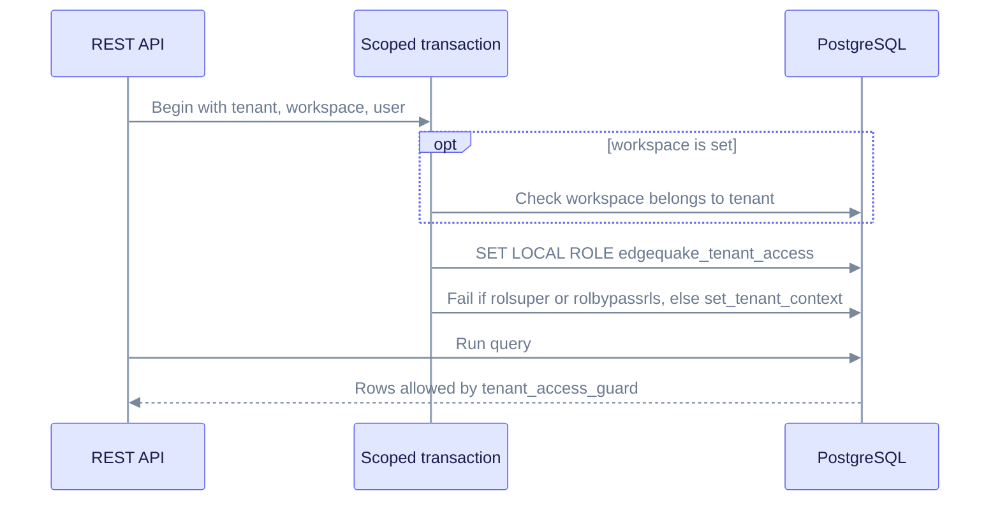
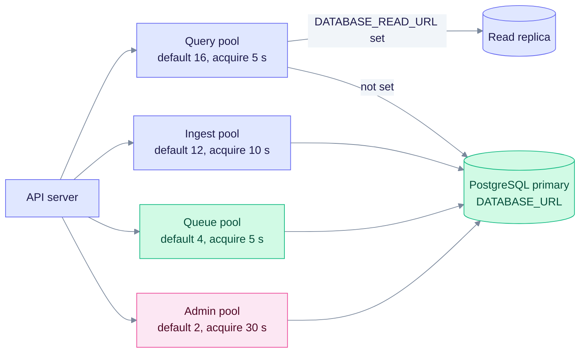
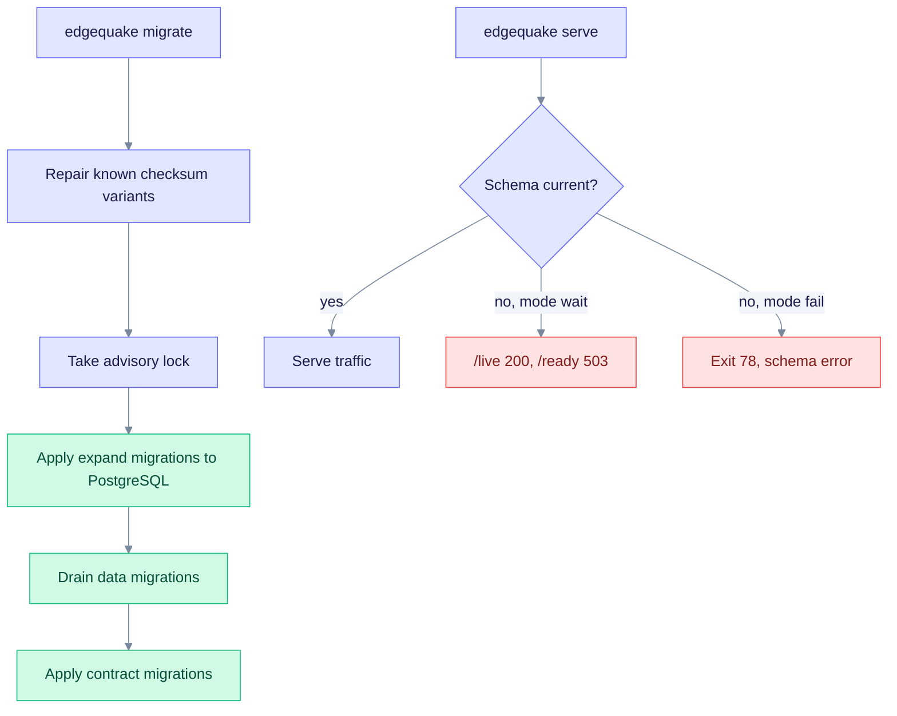

# PostgreSQL: tables, tenancy, pools, and operations

This page covers the relational (plain SQL) side of the EdgeQuake data layer: documents, chunks, tasks, tenants, users, conversations, and the settings around them. Operators and developers use it to find which table holds what, how tenant isolation and connection pools work, and how migrations run. Vectors are on [pgvector.md](./pgvector.md). The graph is on [age.md](./age.md). The overview is in [README.md](./README.md).

Facts on this page come from the migrations in `edgequake/migrations/` and the Rust code in `edgequake/crates/edgequake-storage` and `edgequake-tasks`.

## Table catalog

After all 169 migration versions, the `public` schema has these main groups of tables. Names in the "Tables" column are exact.

| Area | Tables | What they hold |
|---|---|---|
| Tenancy | `tenants`, `workspaces`, `memberships`, `tenant_lane_quota`, `tenant_vruntime` | Who owns what. `tenant_lane_quota` and `tenant_vruntime` support fair task scheduling (SPEC-120). |
| Identity | `users`, `api_keys`, `refresh_tokens`, `jwt_jti_denylist`, `oauth_refresh_grants`, `auth_handoff_codes` | Login, API keys, and token revocation. |
| Single sign-on | `identity_providers`, `federated_identities`, `federated_sessions`, `federated_access_jti`, `oidc_login_attempts`, `oidc_logout_jti` | OIDC providers and sessions (SPEC-158). |
| Documents | `documents`, `chunks`, `chunk_serving_state`, `document_artifacts`, `document_originals`, `ingestion_dedup`, `failed_chunks` | Uploaded documents, their chunk text, and per-chunk visibility. |
| PDF | `pdf_documents`, `pdf_document_blobs`, `document_pages`, `document_page_states`, `page_layout_regions`, `document_mm_assets` | PDF files, page geometry, layout, and page images. |
| Graph read models | `entities`, `relationships`, `chunk_entity_links`, `chunk_relation_links`, `graph_contributions` | Relational copies of graph data for search and analytics, plus lineage from chunks. |
| Embeddings | `embedding_models`, `chunk_embeddings`, `entity_embeddings`, `relationship_embeddings`, `report_embeddings`, `embedding_manifests`, `embedding_projections` | See [pgvector.md](./pgvector.md). |
| Jobs | `tasks` (partitioned), `task_events`, `attempts`, `jobs`, `pipeline_checkpoints` | Background work and its audit trail. |
| Durable write path (SPEC-149) | `mutation_requests`, `object_revisions`, `ingest_batches`, `projection_events`, `projection_event_items`, `projection_event_role_proofs`, `projection_deliveries`, `projection_visibility`, `projection_cleanup_intents`, `outbox_events`, `data_bindings`, `vector_provider_cutovers`, `compensation_quarantine` | One-transaction commits, idempotency, and events for downstream stores. |
| Conversations | `conversations`, `messages`, `conversation_history`, `folders` | Chat history. |
| Caches | `llm_cache`, `decision_cache`, `decision_review` | Recomputable results. See [llm-cache-scope.md](./llm-cache-scope.md). |
| Operations | `server_config`, `audit_logs` (partitioned), `rls_audit_log`, `workspace_metrics_history`, `provider_connections`, `edgequake_schema_generation`, `edgequake_reconcile_state` | Settings, audit, metrics, encrypted provider connections, and migration bookkeeping. |

There are also five views: `rate_limit_violations`, `recent_security_events`, `tenant_activity_summary`, `tenant_document_stats`, and `tenant_entity_stats`.

The `edgequake` schema holds migration and scheduling bookkeeping: `schema_compat`, `migration_run`, `migration_run_step`, `edgequake_migration_job`, `edgequake_migration_batch`, `provider_budget`, `provider_slot`, and `audit_log`.

Tables that no longer exist: `eq_*_kv` and `eq_*_vectors`. Migrations 125, 126, and 131 dropped them. No migration creates a table named `edgequake_tasks`. That name survives only in function names, and the `edgequake.tasks` view reads from `public.tasks`. See [Legacy key-value store](#legacy-key-value-store).

## Entity-relationship diagrams

For the full column-level picture of every domain (including SSO, durable writes, tasks, caches, and provider connections), see **[schema-er.md](./schema-er.md)**. The three diagrams below are the short versions of the busiest areas.

### Tenancy and identity

A tenant owns workspaces and users. Memberships tie a user to a tenant and, optionally, to one workspace. Read from the top: everything else hangs off `tenants`.



### Documents and PDFs

A document has chunks, optional PDF data, and optional original bytes. Solid lines are foreign keys with `ON DELETE CASCADE`. Dashed lines link by ID only. `failed_chunks` and the lineage tables (`chunk_entity_links`, `chunk_relation_links`) have no foreign key, so application code must clean up their rows.



### Entities and relationships

`entities` and `relationships` are relational copies of the graph. Solid lines are foreign keys; dashed lines link by ID only. `relationships.source_id` and `target_id` reference `entities(id)` with `ON DELETE CASCADE`. Entity names are unique per tenant and workspace.



## Key tables in detail

### `documents`

| Column group | Columns |
|---|---|
| Identity and scope | `id`, `tenant_id`, `workspace_id`, `track_id` |
| Content | `title`, `content`, `content_hash`, `content_type`, `file_path`, `file_size_bytes`, `metadata` (JSONB) |
| Progress | `status`, `error_message`, `processing_time_ms`, `chunk_count`, `entity_count`, `relationship_count` |
| Cost | `cost_usd`, `input_tokens`, `output_tokens`, `total_tokens` |
| Concurrency | `fence_epoch`, `created_at`, `updated_at` |

Allowed `status` values (a CHECK constraint): `pending`, `processing`, `chunking`, `extracting`, `embedding`, `indexing`, `completed`, `indexed`, `failed`, `partial_failure`, `cancelled`, `deleting`, `delete_failed`.

A partial unique index, `idx_documents_workspace_content_hash_unique`, stops two `indexed` documents with the same content hash in one workspace.

### `chunks` and `chunk_serving_state`

`chunks` stores the text (`content`), its position (`chunk_index`, `start_offset`, `end_offset`, `char_start`, `char_end`, `page_start`, `page_end`), `token_count`, `context_preamble`, and a generated full-text column `content_tsv`. The pair `(document_id, chunk_index)` is unique.

`chunk_serving_state` has one row per chunk. Its `state` is one of `declared`, `embedded`, `graphed`, `ready`, `quarantined`, `deleting`. With the serving fence on (the default), queries only see chunks in state `ready`. See [serving-fence-decision.md](./serving-fence-decision.md).

### `tasks`

`tasks` is range-partitioned by `created_at`, one partition per month. The function `edgequake_ensure_tasks_month_partitions()` creates the current month and the next three. The task service calls it before each task insert, and `edgequake migrate` calls it at the end of a run. The function `edgequake_detach_old_task_partitions` detaches old partitions.

Workers claim tasks with a lease: `lease_owner`, `lease_token`, `lease_expires_at`. Fair scheduling uses `fairness_parked_at` and `fairness_hold_until`. Cancel requests use `cancel_requested_at`. Retries use `available_at`.

### `provider_connections` (migration 169, SPEC-163)

Stores LLM connections that an operator saves in the UI. The API key is stored encrypted (`api_key_ciphertext`, `api_key_nonce`), with `key_id` and `key_fingerprint` beside it. Other columns: `slug`, `display_name`, `api_shape`, `locality`, `base_url`, `auth_scheme`, `extra_headers_enc`, `timeout_secs`, `allow_private_network`, and the last test result (`last_test_at`, `last_test_ok`, `last_test_error`). The pair `(tenant_id, slug)` is unique. The table has no RLS policy; queries filter by `tenant_id`.

## Tenant isolation

Isolation uses two layers: columns on every scoped row, and Row-Level Security (RLS, rules that PostgreSQL applies to every query).

1. Migration 096 enables and forces RLS on the core tables.
2. Migration 167 creates the role `edgequake_tenant_access` (`NOLOGIN NOSUPERUSER NOBYPASSRLS NOINHERIT`).
3. Each protected table gets two policies. `tenant_access_allow` is permissive and applies to that role. `tenant_access_guard` is restrictive and applies to everyone: it requires `tenant_id = current_tenant_id()` and, when a workspace is set, `workspace_id = current_workspace_id()`.
4. Tables that have only a `workspace_id` (the embedding tables, `document_pages`, `chunk_entity_links`, and similar) check the workspace and confirm that it belongs to the current tenant.

At run time, a scoped transaction does this:

```sql
SET LOCAL ROLE edgequake_tenant_access;
SELECT public.set_tenant_context(:tenant, :workspace, :user);
-- the query runs here; RLS filters rows
```

The sequence below shows what a scoped transaction does before the first query. Each step runs inside the transaction, so a failed check leaves no tenant context behind.



The helper functions are `current_tenant_id()`, `current_workspace_id()`, `set_tenant_context`, and `clear_tenant_context`. They read the settings `app.current_tenant_id`, `app.current_workspace_id`, and `app.current_user_id`. The Rust code in `rls.rs` first checks that the workspace belongs to the tenant, and it fails if the connected role is a superuser or has `BYPASSRLS`. Superusers skip RLS, so production must not connect as one. Administration and queue connections keep their privileged path, and not every query uses a scoped transaction, so the application layer filters by scope as well. Read [rls-superuser-acceptance.md](./rls-superuser-acceptance.md) for the decision history.

The graph is outside RLS by default. See [age.md](./age.md#tenant-isolation-in-the-graph).

## Connection pools

The API opens four separate pools so that one kind of work cannot starve another. Source: `pool_bundle.rs`.

| Pool | Size variable | Default size | Acquire timeout |
|---|---|---|---|
| Query | `EDGEQUAKE_DB_POOL_SIZE_QUERY` | 16 | 5 s |
| Ingest | `EDGEQUAKE_DB_POOL_SIZE_INGEST` | 12 | 10 s |
| Queue | `EDGEQUAKE_DB_POOL_SIZE_QUEUE` | 4 | 5 s |
| Admin | `EDGEQUAKE_DB_POOL_SIZE_ADMIN` | 2 | 30 s |

Sizes are clamped to 1 to 128. Each pool keeps at least one connection open. If `DATABASE_READ_URL` is set, the query pool connects there.

The query pool can read from a replica. The ingest, queue, and admin pools always use the primary.



| Variable | Default | Meaning |
|---|---|---|
| `EDGEQUAKE_DB_POOL_BUDGET_MODE` | `warn` | `warn` or `fail` when pools times instances exceed what the server allows. |
| `EDGEQUAKE_DB_POOL_INSTANCE_COUNT` | 1 (clamped to 1 to 256) | How many API replicas share the database, used by the budget check. |
| `EDGEQUAKE_DB_POOL_IDLE_TIMEOUT_SECS` | 600 | Close idle connections (30 to 86400). |
| `EDGEQUAKE_DB_POOL_MAX_LIFETIME_SECS` | 1800 | Recycle connections (60 to 86400). |
| `EDGEQUAKE_DB_IDLE_IN_XACT_TIMEOUT_SECS` | 60 | Kill sessions stuck in a transaction (5 to 3600). |

Every new connection sets `application_name` to `edgequake:<role>`, `search_path=public`, and the idle-in-transaction timeout. After each use, the pool runs `RESET ALL` and sets that baseline again, so a `SET` in one request cannot leak into the next. The older single-pool config (`PostgresConfig`) defaults to 32 connections.

## Statement timeouts

Each kind of query has its own time limit. The code subtracts 250 ms so that PostgreSQL gives up before the client does. Source: `statement_timeout.rs`.

| Query kind | Variable | Default |
|---|---|---|
| Graph reads | `EDGEQUAKE_GRAPH_QUERY_TIMEOUT_SECS` | 15 s (applied as 14.75 s) |
| Document list and reads | `EDGEQUAKE_DOCUMENTS_READ_TIMEOUT_MS` | 2500 ms (500 to 30000) |
| Vector search | `EDGEQUAKE_VECTOR_QUERY_TIMEOUT_MS` | 2000 ms |
| Community detection | `EDGEQUAKE_COMMUNITY_STATEMENT_TIMEOUT_MS` | 30000 ms |
| Graph DDL lock wait | `EDGEQUAKE_GRAPH_DDL_LOCK_TIMEOUT` | 5 s (120 s when `EDGEQUAKE_EQ_MAINTENANCE` is set) |

## Schema and migrations

Only `edgequake migrate` changes the schema. The API never runs migrations. If the schema is behind, `edgequake serve` either exits or waits, depending on `EDGEQUAKE_SCHEMA_GATE`. The diagram shows both commands. Read the left column first, then the right.



| Fact | Value |
|---|---|
| Migration files | 167 files, versions 001 to 169 (018 and 127 are not used) |
| Phases | 154 expand, 10 data, 3 contract |
| Contract migrations | 125, 126, 131 (drop legacy tables). They need `--confirm-drop`. |
| Lock classes | `ddl_access_exclusive` 135, `ddl_share` 22, `dml_batch` 10 |
| Serve window | `compat_serve_min` 149 to `compat_serve_max` 169 (in `manifest.toml`) |
| Exit codes | 78 schema behind, 75 lock busy, 65 unknown checksum |
| Down migrations | None. Rollback means restoring a backup. |
| Immutability | `checksums.lock` pins every file. Run `scripts/check_migration_checksums.sh`. |
| Support scripts | `edgequake/migrations/support/NNN/`. Not scanned by sqlx. Migrations 083, 086, and 092 have reconcile scripts that run on every boot. |

`edgequake/docker/init.sql` is a legacy file. No compose file mounts it. Do not rely on it.

Related reading: [Upgrading](../operations/upgrading.md), [edgequake/docs/migrations.md](../../edgequake/docs/migrations.md), and the [SPEC-150 spec](../../specs/150-reliable-migration-system/README.md).

## Legacy key-value store

Before SPEC-091, a per-workspace table `eq_<prefix>_kv` held chunks, metadata, checkpoints, and caches as JSON. Migration 125 drained those into typed tables and dropped the old ones. The adapter `PostgresKVStorage` still exists. It checks once whether the relation is present and caches the answer. Key families (`CHUNK`, `METADATA`, `WSDOC`, `DOC_HASH`, `COMPENSATION_QUARANTINE`, `CHECKPOINT`, `ARTIFACT`, `INJECTION`, `CACHE`) now default to relational storage. Setting `EDGEQUAKE_KV_FAMILY_<NAME>=kv` is a rollback switch only. After the drop, an unclassified key fails loudly.

| Data | Typed home |
|---|---|
| Artifacts | `document_artifacts` |
| Checkpoints | `pipeline_checkpoints` |
| LLM caches | `llm_cache` |
| Quarantine | `compensation_quarantine` |
| Document metadata | `documents.metadata` |
| Chunk text | `chunks.content` |
| Chunk vectors | `chunk_embeddings.embedding` |

The 18 `DATA-PG-KV-*` entries below describe the legacy adapter. They stay in the registry because Ref IDs never change.

## Operation catalog

Every row is a registered operation with a permanent Ref ID. Ref IDs that link to a page have a benchmark template in [benchmarks/](./benchmarks/README.md). Cost and failure behavior for each operation class is in [complexity-matrix.md](./complexity-matrix.md). Line numbers were dropped on purpose: they drift. Search by entry point name instead. Some entry points are descriptive, not exact function names.

Vector operations (`DATA-PG-VECTORS-*`) are listed on [pgvector.md](./pgvector.md). Graph operations are on [age.md](./age.md).

### Documents (`DOCS`, 6)

Table: `documents`. The list endpoint reads through `document_read_model.rs`.

| Ref ID | Entry point | File | Type | Tx | Notes |
|---|---|---|---|---|---|
| `DATA-PG-DOCS-ENSURE-RECORD-101` | `ensure_document_record` | `edgequake-storage/src/adapters/postgres/pdf_storage_impl.rs` | Write | Yes |  |
| `DATA-PG-DOCS-UPDATE-STATS-102` | `update_document_stats` | `edgequake-storage/src/adapters/postgres/pdf_storage_impl.rs` | Write | Yes |  |
| `DATA-PG-DOCS-TOUCH-STATUS-103` | `touch_document_status` | `edgequake-storage/src/adapters/postgres/pdf_storage_impl.rs` | Write | Yes |  |
| `DATA-PG-DOCS-DELETE-RECORD-104` | `delete_document_record` | `edgequake-storage/src/adapters/postgres/pdf_storage_impl.rs` | Write | Yes |  |
| `DATA-PG-DOCS-LIST-SUMMARIES-106` | `list_relational_document_summaries` | `edgequake-api/src/document_read_model.rs` | Read | Yes |  |
| `DATA-PG-DOCS-DELETE-WORKSPACE-107` | `delete_relational_documents_for_workspace` | `edgequake-api/src/document_read_model.rs` | Write | Yes |  |

### PDF storage (`PDF`, 9)

Tables: `pdf_documents`, `pdf_document_blobs`.

| Ref ID | Entry point | File | Type | Tx | Notes |
|---|---|---|---|---|---|
| `DATA-PG-PDF-STORE-093` | `PdfStorage::create_pdf` | `edgequake-storage/src/adapters/postgres/pdf_storage_impl.rs` | Write | Yes |  |
| `DATA-PG-PDF-GET-094` | `PdfStorage::get_pdf` | `edgequake-storage/src/adapters/postgres/pdf_storage_impl.rs` | Read | Yes |  |
| `DATA-PG-PDF-UPDATE-MARKDOWN-095` | `PdfStorage::update_pdf_processing` | `edgequake-storage/src/adapters/postgres/pdf_storage_impl.rs` | Write | Yes | Writes `markdown_content`. No separate `update_markdown` method exists. |
| `DATA-PG-PDF-UPDATE-STATUS-096` | `PdfStorage::update_pdf_processing` | `edgequake-storage/src/adapters/postgres/pdf_storage_impl.rs` | Write | Yes |  |
| `DATA-PG-PDF-LINK-TO-DOCUMENT-097` | `PdfStorage::link_pdf_to_document` | `edgequake-storage/src/adapters/postgres/pdf_storage_impl.rs` | Write | Yes |  |
| `DATA-PG-PDF-LIST-098` | `PdfStorage::list_pdfs` | `edgequake-storage/src/adapters/postgres/pdf_storage_impl.rs` | Read | Yes |  |
| `DATA-PG-PDF-DELETE-099` | `PdfStorage::delete_pdf` | `edgequake-storage/src/adapters/postgres/pdf_storage_impl.rs` | Write | Yes |  |
| `DATA-PG-PDF-CLEAR-MARKDOWN-100` | `PdfStorage::clear_markdown` | `edgequake-storage/src/adapters/postgres/pdf_storage_impl.rs` | Write | Yes |  |
| `DATA-PG-PDF-COUNT-105` | `count_pdfs` | `edgequake-storage/src/adapters/postgres/pdf_storage_impl.rs` | Read | Yes |  |

### Original uploads (`ORIGINAL`, 1)

Table: `document_originals`.

| Ref ID | Entry point | File | Type | Tx | Notes |
|---|---|---|---|---|---|
| `DATA-PG-ORIGINAL-STORE-108` | `OriginalStorage store/get/delete` | `edgequake-storage/src/adapters/postgres/original_storage_impl.rs` | Write | Yes |  |

### Multimodal assets (`MM-ASSET`, 1)

Table: `document_mm_assets`.

| Ref ID | Entry point | File | Type | Tx | Notes |
|---|---|---|---|---|---|
| `DATA-PG-MM-ASSET-STORE-109` | `MmAssetStorage CRUD` | `edgequake-storage/src/adapters/postgres/mm_asset_storage_impl.rs` | Write | Yes |  |

### Failed chunks (`FAILED-CHUNKS`, 3)

Table: `failed_chunks`. Used for retry.

| Ref ID | Entry point | File | Type | Tx | Notes |
|---|---|---|---|---|---|
| `DATA-PG-FAILED-CHUNKS-INSERT-192` | `insert_failed_chunks` | `edgequake-storage/src/failed_chunks.rs` | Write | Yes |  |
| `DATA-PG-FAILED-CHUNKS-LIST-193` | `list_failed_chunks` | `edgequake-storage/src/failed_chunks.rs` | Read | Yes |  |
| `DATA-PG-FAILED-CHUNKS-MARK-STATUS-194` | `mark_chunk_status` | `edgequake-storage/src/failed_chunks.rs` | Write | Yes |  |

### Entity read model (`ENTITY`, 2)

Table: `entities`.

| Ref ID | Entry point | File | Type | Tx | Notes |
|---|---|---|---|---|---|
| `DATA-PG-ENTITY-UPSERT-184` | `PostgresEntitySink::upsert_entity` | `edgequake-api/src/postgres_entity_sink.rs` | Write | Yes |  |
| `DATA-PG-ENTITY-REMOVE-SOURCES-185` | `remove_entity_sources` | `edgequake-api/src/postgres_entity_sink.rs` | Write | Yes |  |

### Chunk lineage (`LINEAGE`, 6)

Tables: `chunk_entity_links`, `chunk_relation_links`, and `entities.description_history`.

| Ref ID | Entry point | File | Type | Tx | Notes |
|---|---|---|---|---|---|
| `DATA-PG-LINEAGE-RECORD-ENTITY-LINK-186` | `record_entity_link` | `edgequake-api/src/postgres_lineage_sink.rs` | Write | Yes |  |
| `DATA-PG-LINEAGE-RECORD-RELATION-LINK-187` | `record_relation_link` | `edgequake-api/src/postgres_lineage_sink.rs` | Write | Yes |  |
| `DATA-PG-LINEAGE-RECORD-RELATION-LINKS-BATCH-188` | `record_relation_links_batch` | `edgequake-api/src/postgres_lineage_sink.rs` | Write | Yes |  |
| `DATA-PG-LINEAGE-RECORD-ENTITY-LINKS-BATCH-189` | `record_entity_links_batch` | `edgequake-api/src/postgres_lineage_sink.rs` | Write | Yes |  |
| `DATA-PG-LINEAGE-APPEND-DESC-HISTORY-190` | `append_description_history` | `edgequake-api/src/postgres_lineage_sink.rs` | Write | Yes |  |
| `DATA-PG-LINEAGE-LOAD-DOC-FROM-CHUNKS-191` | `load_document_lineage_from_chunk_links` | `edgequake-api/src/services/postgres_chunk_lineage.rs` | Read | Yes |  |

### Tasks (`TASKS`, 14)

Table: `tasks`. Claims use `FOR UPDATE SKIP LOCKED` and a lease.

| Ref ID | Entry point | File | Type | Tx | Notes |
|---|---|---|---|---|---|
| `DATA-PG-TASKS-CREATE-131` | `PostgresTaskStorage::create_task` | `edgequake-tasks/src/postgres.rs` | Write | Yes |  |
| `DATA-PG-TASKS-GET-132` | `PostgresTaskStorage::get_task` | `edgequake-tasks/src/postgres.rs` | Read | Yes |  |
| `DATA-PG-TASKS-TOUCH-133` | `PostgresTaskStorage::touch_task` | `edgequake-tasks/src/postgres.rs` | Write | Yes |  |
| `DATA-PG-TASKS-UPDATE-134` | `PostgresTaskStorage::update_task` | `edgequake-tasks/src/postgres.rs` | Write | Yes |  |
| `DATA-PG-TASKS-DELETE-135` | `PostgresTaskStorage::delete_task` | `edgequake-tasks/src/postgres.rs` | Write | Yes |  |
| `DATA-PG-TASKS-LIST-136` | `PostgresTaskStorage::list_tasks` | `edgequake-tasks/src/postgres.rs` | Read | Yes |  |
| `DATA-PG-TASKS-STATS-137` | `PostgresTaskStorage::get_statistics` | `edgequake-tasks/src/postgres.rs` | Read | Yes |  |
| `DATA-PG-TASKS-FIND-ACTIVE-PDF-138` | `PostgresTaskStorage::find_active_pdf_processing_task` | `edgequake-tasks/src/postgres.rs` | Read | Yes |  |
| `DATA-PG-TASKS-FIND-ACTIVE-INGEST-139` | `PostgresTaskStorage::find_active_pdf_ingest_task` | `edgequake-tasks/src/postgres.rs` | Read | Yes |  |
| [`DATA-PG-TASKS-CLAIM-NEXT-140`](./benchmarks/140.md) | `PostgresTaskStorage::claim_next` | `edgequake-tasks/src/postgres.rs` | Write | Yes |  |
| `DATA-PG-TASKS-REFRESH-LEASE-141` | `PostgresTaskStorage::refresh_lease` | `edgequake-tasks/src/postgres.rs` | Write | Yes |  |
| `DATA-PG-TASKS-RELEASE-CLAIM-142` | `PostgresTaskStorage::release_claim` | `edgequake-tasks/src/postgres.rs` | Write | Yes |  |
| `DATA-PG-TASKS-QUEUE-METRICS-143` | `PostgresTaskStorage::get_queue_metrics_filtered` | `edgequake-tasks/src/postgres.rs` | Read | Yes |  |
| `DATA-PG-TASKS-TOTAL-COUNT-144` | `PostgresTaskStorage::get_total_count` | `edgequake-tasks/src/postgres.rs` | Read | Yes | No method with this name in code. Nearest: `get_estimated_count`. |

### Tenants (`TENANT`, 6)

Table: `tenants`.

| Ref ID | Entry point | File | Type | Tx | Notes |
|---|---|---|---|---|---|
| `DATA-PG-TENANT-CREATE-145` | `pg_create_tenant` | `edgequake-core/src/workspace_service_impl/tenant_ops.rs` | Write | Yes |  |
| `DATA-PG-TENANT-GET-146` | `pg_get_tenant` | `edgequake-core/src/workspace_service_impl/tenant_ops.rs` | Read | Yes |  |
| `DATA-PG-TENANT-GET-BY-SLUG-147` | `pg_get_tenant_by_slug` | `edgequake-core/src/workspace_service_impl/tenant_ops.rs` | Read | Yes |  |
| `DATA-PG-TENANT-UPDATE-148` | `pg_update_tenant` | `edgequake-core/src/workspace_service_impl/tenant_ops.rs` | Write | Yes |  |
| `DATA-PG-TENANT-DELETE-149` | `pg_delete_tenant` | `edgequake-core/src/workspace_service_impl/tenant_ops.rs` | Write | Yes |  |
| `DATA-PG-TENANT-LIST-150` | `pg_list_tenants` | `edgequake-core/src/workspace_service_impl/tenant_ops.rs` | Read | Yes |  |

### Workspaces (`WORKSPACE`, 6)

Table: `workspaces`. Statistics (`DATA-AGE-WORKSPACE-GET-STATS-157`) are on [age.md](./age.md).

| Ref ID | Entry point | File | Type | Tx | Notes |
|---|---|---|---|---|---|
| `DATA-PG-WORKSPACE-CREATE-151` | `pg_create_workspace` | `edgequake-core/src/workspace_service_impl/workspace_ops.rs` | Write | Yes |  |
| `DATA-PG-WORKSPACE-GET-152` | `pg_get_workspace` | `edgequake-core/src/workspace_service_impl/workspace_ops.rs` | Read | Yes |  |
| `DATA-PG-WORKSPACE-GET-BY-SLUG-153` | `pg_get_workspace_by_slug` | `edgequake-core/src/workspace_service_impl/workspace_ops.rs` | Read | Yes |  |
| `DATA-PG-WORKSPACE-UPDATE-154` | `pg_update_workspace` | `edgequake-core/src/workspace_service_impl/workspace_ops.rs` | Write | Yes |  |
| `DATA-PG-WORKSPACE-DELETE-155` | `pg_delete_workspace` | `edgequake-core/src/workspace_service_impl/workspace_ops.rs` | Write | Yes |  |
| `DATA-PG-WORKSPACE-LIST-156` | `pg_list_workspaces` | `edgequake-core/src/workspace_service_impl/workspace_ops.rs` | Read | Yes |  |

### Memberships (`MEMBERSHIP`, 8)

Table: `memberships`.

| Ref ID | Entry point | File | Type | Tx | Notes |
|---|---|---|---|---|---|
| `DATA-PG-MEMBERSHIP-ADD-158` | `pg_add_membership` | `edgequake-core/src/workspace_service_impl/membership_ops.rs` | Write | Yes |  |
| `DATA-PG-MEMBERSHIP-GET-USER-159` | `pg_get_user_memberships` | `edgequake-core/src/workspace_service_impl/membership_ops.rs` | Read | Yes |  |
| `DATA-PG-MEMBERSHIP-GET-TENANT-160` | `pg_get_tenant_memberships` | `edgequake-core/src/workspace_service_impl/membership_ops.rs` | Read | Yes |  |
| `DATA-PG-MEMBERSHIP-UPDATE-ROLE-161` | `pg_update_membership_role` | `edgequake-core/src/workspace_service_impl/membership_ops.rs` | Write | Yes |  |
| `DATA-PG-MEMBERSHIP-REMOVE-162` | `pg_remove_membership` | `edgequake-core/src/workspace_service_impl/membership_ops.rs` | Write | Yes |  |
| `DATA-PG-MEMBERSHIP-CHECK-TENANT-163` | `pg_check_tenant_access` | `edgequake-core/src/workspace_service_impl/membership_ops.rs` | Read | Yes |  |
| `DATA-PG-MEMBERSHIP-CHECK-WORKSPACE-164` | `pg_check_workspace_access` | `edgequake-core/src/workspace_service_impl/membership_ops.rs` | Read | Yes |  |
| `DATA-PG-MEMBERSHIP-GET-ROLE-165` | `pg_get_user_role` | `edgequake-core/src/workspace_service_impl/membership_ops.rs` | Read | Yes |  |

### Quota (`QUOTA`, 1)

Updates the quota columns on `tenants`.

| Ref ID | Entry point | File | Type | Tx | Notes |
|---|---|---|---|---|---|
| `DATA-PG-QUOTA-UPDATE-TENANT-166` | `pg_update_tenant_quota` | `edgequake-core/src/workspace_service_impl/quota_ops.rs` | Write | Yes |  |

### Workspace metrics (`METRICS`, 2)

Table: `workspace_metrics_history`.

| Ref ID | Entry point | File | Type | Tx | Notes |
|---|---|---|---|---|---|
| `DATA-PG-METRICS-RECORD-SNAPSHOT-167` | `pg_record_metrics_snapshot` | `edgequake-core/src/workspace_service_impl/metrics_ops.rs` | Write | Yes |  |
| `DATA-PG-METRICS-GET-HISTORY-168` | `pg_get_metrics_history` | `edgequake-core/src/workspace_service_impl/metrics_ops.rs` | Read | Yes |  |

### Users and login (`AUTH`, 8)

Table: `users`, plus default tenant and membership setup.

| Ref ID | Entry point | File | Type | Tx | Notes |
|---|---|---|---|---|---|
| `DATA-PG-AUTH-SYNC-USER-169` | `sync_auth_user_to_postgres` | `edgequake-api/src/services/identity_storage.rs` | Write | Yes |  |
| `DATA-PG-AUTH-ENSURE-DEFAULT-TENANT-WS-170` | `ensure_default_tenant_workspace` | `edgequake-api/src/services/identity_storage.rs` | Write | Yes |  |
| `DATA-PG-AUTH-SYNC-MEMBERSHIP-171` | `sync_default_membership_to_postgres` | `edgequake-api/src/services/identity_storage.rs` | Write | Yes |  |
| `DATA-PG-AUTH-VERIFY-MEMBERSHIP-172` | `verify_membership_active` | `edgequake-api/src/services/identity_storage.rs` | Read | Yes |  |
| `DATA-PG-AUTH-LOAD-USER-173` | `load_user_record_pg` | `edgequake-api/src/services/identity_storage.rs` | Read | Yes |  |
| `DATA-PG-AUTH-FIND-USER-BY-LOGIN-174` | `find_user_record_by_login_pg` | `edgequake-api/src/services/identity_storage.rs` | Read | Yes |  |
| `DATA-PG-AUTH-LIST-USERS-175` | `list_user_records_pg` | `edgequake-api/src/services/identity_storage.rs` | Read | Yes |  |
| `DATA-PG-AUTH-DELETE-USER-176` | `delete_user_pg` | `edgequake-api/src/services/identity_storage.rs` | Write | Yes |  |

### Refresh tokens and API keys (`SESSION`, 7)

Tables: `refresh_tokens`, `api_keys`.

| Ref ID | Entry point | File | Type | Tx | Notes |
|---|---|---|---|---|---|
| `DATA-PG-SESSION-PERSIST-REFRESH-177` | `persist_refresh_token_pg` | `edgequake-api/src/services/session_storage.rs` | Write | Yes |  |
| `DATA-PG-SESSION-LOAD-REFRESH-178` | `load_refresh_token_pg` | `edgequake-api/src/services/session_storage.rs` | Read | Yes |  |
| `DATA-PG-SESSION-REVOKE-REFRESH-179` | `revoke_refresh_token_pg` | `edgequake-api/src/services/session_storage.rs` | Write | Yes |  |
| `DATA-PG-SESSION-PERSIST-API-KEY-180` | `persist_api_key_pg` | `edgequake-api/src/services/session_storage.rs` | Write | Yes |  |
| `DATA-PG-SESSION-LIST-API-KEYS-181` | `list_api_keys_pg` | `edgequake-api/src/services/session_storage.rs` | Read | Yes |  |
| `DATA-PG-SESSION-FIND-API-KEY-PREFIX-182` | `find_api_keys_by_prefix_pg` | `edgequake-api/src/services/session_storage.rs` | Read | Yes |  |
| `DATA-PG-SESSION-REVOKE-API-KEY-183` | `revoke_api_key_pg` | `edgequake-api/src/services/session_storage.rs` | Write | Yes |  |

### Conversations (`CONV`, 21)

Tables: `conversations`, `messages`, `folders`.

| Ref ID | Entry point | File | Type | Tx | Notes |
|---|---|---|---|---|---|
| `DATA-PG-CONV-CREATE-110` | `ConversationStorage::create_conversation` | `edgequake-storage/src/adapters/postgres/conversation.rs` | Write | Yes |  |
| `DATA-PG-CONV-GET-111` | `ConversationStorage::get_conversation` | `edgequake-storage/src/adapters/postgres/conversation.rs` | Read | Yes |  |
| `DATA-PG-CONV-UPDATE-112` | `ConversationStorage::update_conversation` | `edgequake-storage/src/adapters/postgres/conversation.rs` | Write | Yes |  |
| `DATA-PG-CONV-DELETE-113` | `ConversationStorage::delete_conversation` | `edgequake-storage/src/adapters/postgres/conversation.rs` | Write | Yes |  |
| `DATA-PG-CONV-LIST-114` | `ConversationStorage::list_conversations` | `edgequake-storage/src/adapters/postgres/conversation.rs` | Read | Yes |  |
| `DATA-PG-CONV-SHARE-115` | `ConversationStorage::share_conversation` | `edgequake-storage/src/adapters/postgres/conversation.rs` | Write | Yes |  |
| `DATA-PG-CONV-UNSHARE-116` | `ConversationStorage::unshare_conversation` | `edgequake-storage/src/adapters/postgres/conversation.rs` | Write | Yes |  |
| `DATA-PG-CONV-GET-SHARED-117` | `ConversationStorage::get_shared_conversation` | `edgequake-storage/src/adapters/postgres/conversation.rs` | Read | Yes |  |
| `DATA-PG-CONV-MSG-CREATE-118` | `ConversationStorage::create_message` | `edgequake-storage/src/adapters/postgres/conversation.rs` | Write | Yes |  |
| `DATA-PG-CONV-MSG-UPDATE-119` | `ConversationStorage::update_message` | `edgequake-storage/src/adapters/postgres/conversation.rs` | Write | Yes |  |
| `DATA-PG-CONV-MSG-GET-120` | `ConversationStorage::get_message` | `edgequake-storage/src/adapters/postgres/conversation.rs` | Read | Yes |  |
| `DATA-PG-CONV-MSG-DELETE-121` | `ConversationStorage::delete_message` | `edgequake-storage/src/adapters/postgres/conversation.rs` | Write | Yes |  |
| `DATA-PG-CONV-MSG-LIST-122` | `ConversationStorage::list_messages` | `edgequake-storage/src/adapters/postgres/conversation.rs` | Read | Yes |  |
| `DATA-PG-CONV-FOLDER-CREATE-123` | `ConversationStorage::create_folder` | `edgequake-storage/src/adapters/postgres/conversation.rs` | Write | Yes |  |
| `DATA-PG-CONV-FOLDER-LIST-124` | `ConversationStorage::list_folders` | `edgequake-storage/src/adapters/postgres/conversation.rs` | Read | Yes |  |
| `DATA-PG-CONV-FOLDER-UPDATE-125` | `ConversationStorage::update_folder` | `edgequake-storage/src/adapters/postgres/conversation.rs` | Write | Yes |  |
| `DATA-PG-CONV-FOLDER-GET-126` | `ConversationStorage::get_folder` | `edgequake-storage/src/adapters/postgres/conversation.rs` | Read | Yes |  |
| `DATA-PG-CONV-FOLDER-DELETE-127` | `ConversationStorage::delete_folder` | `edgequake-storage/src/adapters/postgres/conversation.rs` | Write | Yes |  |
| `DATA-PG-CONV-BULK-DELETE-128` | `ConversationStorage::bulk_delete` | `edgequake-storage/src/adapters/postgres/conversation.rs` | Write | Yes |  |
| `DATA-PG-CONV-BULK-ARCHIVE-129` | `ConversationStorage::bulk_archive` | `edgequake-storage/src/adapters/postgres/conversation.rs` | Write | Yes |  |
| `DATA-PG-CONV-BULK-MOVE-130` | `ConversationStorage::bulk_move_to_folder` | `edgequake-storage/src/adapters/postgres/conversation.rs` | Write | Yes |  |

### Server configuration (`CONFIG`, 4)

Table: `server_config`.

| Ref ID | Entry point | File | Type | Tx | Notes |
|---|---|---|---|---|---|
| `DATA-PG-CONFIG-LOAD-LLM-DEFAULTS-200` | `load_llm_defaults` | `edgequake-api/src/server_config_store.rs` | Read | Yes |  |
| `DATA-PG-CONFIG-SAVE-LLM-DEFAULTS-201` | `save_llm_defaults` | `edgequake-api/src/server_config_store.rs` | Write | Yes |  |
| `DATA-PG-CONFIG-LOAD-PRIORITY-MODE-202` | `load_priority_mode` | `edgequake-api/src/server_config_store.rs` | Read | Yes |  |
| `DATA-PG-CONFIG-SAVE-PRIORITY-MODE-203` | `save_priority_mode` | `edgequake-api/src/server_config_store.rs` | Write | Yes |  |

### Audit log (`AUDIT`, 2)

Table: `audit_logs` (partitioned by month).

| Ref ID | Entry point | File | Type | Tx | Notes |
|---|---|---|---|---|---|
| `DATA-PG-AUDIT-WRITE-EVENT-198` | `write_audit_event` | `edgequake-audit/src/logger.rs` | Write | Yes |  |
| `DATA-PG-AUDIT-QUERY-LOGS-199` | `query_audit_logs` | `edgequake-audit/src/logger.rs` | Read | Yes |  |

### Tenant context (`RLS`, 2)

Functions `set_tenant_context` and `clear_tenant_context`.

| Ref ID | Entry point | File | Type | Tx | Notes |
|---|---|---|---|---|---|
| `DATA-PG-RLS-SET-TENANT-CONTEXT-195` | `set_tenant_context_on_conn` | `edgequake-storage/src/adapters/postgres/rls.rs` | Session | Yes |  |
| `DATA-PG-RLS-CLEAR-TENANT-CONTEXT-196` | `clear_tenant_context_on_conn` | `edgequake-storage/src/adapters/postgres/rls.rs` | Session | Yes |  |

### Pool (`POOL`, 1)

Connection setup in `connection.rs`.

| Ref ID | Entry point | File | Type | Tx | Notes |
|---|---|---|---|---|---|
| `DATA-PG-POOL-ACQUIRE-CONNECT-197` | `PostgresPool connect/acquire` | `edgequake-storage/src/adapters/postgres/connection.rs` | Session | No |  |

### Row-count statistics (`STATS`, 1)

Keeps cheap row counts.

| Ref ID | Entry point | File | Type | Tx | Notes |
|---|---|---|---|---|---|
| `DATA-PG-STATS-ENSURE-ROW-COUNT-208` | `ensure_row_count_stats` | `edgequake-storage/src/adapters/postgres/row_count_stats.rs` | DDL | Yes |  |

### ID allocation (`ID`, 1)

New document IDs use `uuidv7()` on PostgreSQL 18 and random v4 UUIDs on older versions.

| Ref ID | Entry point | File | Type | Tx | Notes |
|---|---|---|---|---|---|
| `DATA-PG-ID-ALLOCATE-DOCUMENT-209` | `allocate_document_id` | `edgequake-storage/src/adapters/postgres/id_allocation.rs` | Write | Yes |  |

### Storage inspector (`INSPECT`, 4)

Admin checks and repairs.

| Ref ID | Entry point | File | Type | Tx | Notes |
|---|---|---|---|---|---|
| `DATA-PG-INSPECT-CHECK-EXTENSIONS-210` | `check_extensions` | `edgequake-api/src/storage_inspector.rs` | Read | No | ADMIN |
| `DATA-PG-INSPECT-CHECK-TABLES-211` | `check_required_tables` | `edgequake-api/src/storage_inspector.rs` | Read | No | ADMIN |
| `DATA-PG-INSPECT-CHECK-INVARIANTS-212` | `check_inv* family` | `edgequake-api/src/storage_inspector.rs` | Read | No | ADMIN integrity suite |
| `DATA-PG-INSPECT-APPLY-REPAIR-213` | `apply_repair` | `edgequake-api/src/storage_inspector.rs` | Write | Yes | ADMIN |

### Keyword cache (`KEYWORDS`, 4)

The durable layer of the keyword cache now uses `llm_cache` (SPEC-103). These IDs predate that change.

| Ref ID | Entry point | File | Type | Tx | Notes |
|---|---|---|---|---|---|
| `DATA-PG-KEYWORDS-CACHE-GET-204` | `KeywordCache::get` | `edgequake-query/src/keywords/cache.rs` | Read | Yes |  |
| `DATA-PG-KEYWORDS-CACHE-SET-205` | `KeywordCache::set` | `edgequake-query/src/keywords/cache.rs` | Write | Yes |  |
| `DATA-PG-KEYWORDS-CACHE-DELETE-206` | `KeywordCache::delete` | `edgequake-query/src/keywords/cache.rs` | Write | Yes |  |
| `DATA-PG-KEYWORDS-CACHE-INIT-207` | `KeywordCache::initialize` | `edgequake-query/src/keywords/cache.rs` | DDL | Yes |  |

### Schema entries (`SCHEMA`, 22)

Historical entries for the first 92 migrations. The full current list is under Schema and migrations above.

| Ref ID | Entry point | File | Type | Tx | Notes |
|---|---|---|---|---|---|
| `DATA-PG-SCHEMA-MIGRATE-RUNNER-214` | `sqlx migrate + reconcile hooks` | `edgequake-api/src/state/migration_bootstrap/mod.rs` | DDL | Yes | Count was 97 at SPEC-088 time. Today: 167 files, 169 versions. |
| `DATA-PG-SCHEMA-MIG-INIT-BASE-215` | `migration 001 (001_init_database.sql)` | `migrations/001_init_database.sql` | DDL | Yes |  |
| `DATA-PG-SCHEMA-MIG-TASKS-TABLE-216` | `migration 002` | `migrations/002_add_tasks_table.sql` | DDL | Yes |  |
| `DATA-PG-SCHEMA-MIG-CONVERSATION-TABLE-217` | `migration 004` | `migrations/004_add_conversation_history_table.sql` | DDL | Yes |  |
| `DATA-PG-SCHEMA-MIG-AUDIT-LOG-218` | `migration 005` | `migrations/005_add_audit_log_table.sql` | DDL | Yes |  |
| `DATA-PG-SCHEMA-MIG-RLS-POLICIES-219` | `migration 009` | `migrations/009_add_rls_policies.sql` | DDL | Yes |  |
| `DATA-PG-SCHEMA-MIG-AGE-GRAPH-220` | `migration 013` | `migrations/013_add_age_graph.sql` | DDL | Yes |  |
| `DATA-PG-SCHEMA-MIG-FULLTEXT-SEARCH-221` | `migration 015` | `migrations/015_add_fulltext_search.sql` | DDL | Yes |  |
| `DATA-PG-SCHEMA-MIG-FAILED-CHUNKS-222` | `migration 021` | `migrations/021_add_failed_chunks_table.sql` | DDL | Yes |  |
| `DATA-PG-SCHEMA-MIG-PDF-DOCUMENTS-223` | `migration 022` | `migrations/022_add_pdf_documents_table.sql` | DDL | Yes |  |
| `DATA-PG-SCHEMA-MIG-VECTOR-BTREE-INDEXES-224` | `migration 029` | `migrations/029_add_vector_btree_indexes.sql` | DDL | Yes |  |
| `DATA-PG-SCHEMA-MIG-SOURCE-IDS-GIN-225` | `migration 038` | `migrations/038_add_source_ids_gin_indexes.sql` | DDL | Yes |  |
| `DATA-PG-SCHEMA-MIG-CQRS-ENTITIES-226` | `migration 039` | `migrations/039_cqrs_entities_schema.sql` | DDL | Yes |  |
| `DATA-PG-SCHEMA-MIG-CHUNK-LINEAGE-227` | `migration 066` | `migrations/066_chunk_lineage_tables.sql` | DDL | Yes |  |
| `DATA-PG-SCHEMA-MIG-AGE-INDEXES-CONSOLIDATE-228` | `migration 070` | `migrations/070_consolidate_age_indexes.sql` | DDL | Yes |  |
| `DATA-PG-SCHEMA-MIG-HNSW-OPTIMIZE-229` | `migration 071` | `migrations/071_hnsw_optimize.sql` | DDL | Yes |  |
| `DATA-PG-SCHEMA-MIG-HALFVEC-EMBEDDINGS-230` | `migration 080` | `migrations/080_halfvec_embeddings_marker.sql` | DDL | Yes |  |
| `DATA-PG-SCHEMA-MIG-DOCUMENT-ORIGINALS-231` | `migration 082` | `migrations/082_add_document_originals.sql` | DDL | Yes |  |
| `DATA-PG-SCHEMA-MIG-MM-ASSETS-232` | `migration 084` | `migrations/084_add_document_mm_assets.sql` | DDL | Yes |  |
| `DATA-PG-SCHEMA-MIG-TASK-LEASE-233` | `migration 088` | `migrations/088_task_lease_columns.sql` | DDL | Yes |  |
| `DATA-PG-SCHEMA-MIG-MERGE-GRAPH-PROPS-234` | `migration 090` | `migrations/090_eq_merge_graph_properties.sql` | DDL | Yes |  |
| `DATA-PG-SCHEMA-MIG-EQ-ID-DENORM-235` | `migration 092` | `migrations/092_eq_id_denorm_marker.sql` | DDL | Yes |  |

### Legacy key-value adapter (`KV`, 18)

Legacy. The `eq_*_kv` tables are gone after migration 125. Rollback only.

| Ref ID | Entry point | File | Type | Tx | Notes |
|---|---|---|---|---|---|
| [`DATA-PG-KV-GET-BY-ID-075`](./benchmarks/075.md) | `KVStorage::get_by_id` | `edgequake-storage/src/adapters/postgres/kv.rs` | Read | Yes |  |
| [`DATA-PG-KV-GET-BY-IDS-076`](./benchmarks/076.md) | `KVStorage::get_by_ids` | `edgequake-storage/src/adapters/postgres/kv.rs` | Read | Yes |  |
| `DATA-PG-KV-GET-BY-IDS-ORDERED-077` | `KVStorage::get_by_ids_ordered` | `edgequake-storage/src/adapters/postgres/kv.rs` | Read | Yes |  |
| `DATA-PG-KV-FILTER-KEYS-078` | `KVStorage::filter_keys` | `edgequake-storage/src/adapters/postgres/kv.rs` | Read | Yes |  |
| [`DATA-PG-KV-UPSERT-079`](./benchmarks/079.md) | `KVStorage::upsert` | `edgequake-storage/src/adapters/postgres/kv.rs` | Write | Yes |  |
| `DATA-PG-KV-DELETE-080` | `KVStorage::delete` | `edgequake-storage/src/adapters/postgres/kv.rs` | Write | Yes |  |
| `DATA-PG-KV-COUNT-081` | `KVStorage::count` | `edgequake-storage/src/adapters/postgres/kv.rs` | Read | Yes |  |
| `DATA-PG-KV-IS-EMPTY-082` | `KVStorage::is_empty` | `edgequake-storage/src/adapters/postgres/kv.rs` | Read | Yes |  |
| `DATA-PG-KV-PING-083` | `KVStorage::ping` | `edgequake-storage/src/adapters/postgres/kv.rs` | Read | No |  |
| `DATA-PG-KV-COUNT-EMBEDDED-CHUNKS-084` | `KVStorage::count_embedded_chunks_for_docs` | `edgequake-storage/src/adapters/postgres/kv.rs` | Read | Yes |  |
| `DATA-PG-KV-KEYS-WITH-PREFIX-085` | `KVStorage::keys_with_prefix` | `edgequake-storage/src/adapters/postgres/kv.rs` | Read | Yes |  |
| `DATA-PG-KV-KEYS-WITH-PREFIX-LIMITED-086` | `KVStorage::keys_with_prefix_limited` | `edgequake-storage/src/adapters/postgres/kv.rs` | Read | Yes |  |
| `DATA-PG-KV-KEYS-WITH-SUFFIX-087` | `KVStorage::keys_with_suffix` | `edgequake-storage/src/adapters/postgres/kv.rs` | Read | Yes |  |
| `DATA-PG-KV-KEYS-WITH-SUFFIX-LIMITED-088` | `KVStorage::keys_with_suffix_limited` | `edgequake-storage/src/adapters/postgres/kv.rs` | Read | Yes |  |
| `DATA-PG-KV-KEYS-089` | `KVStorage::keys` | `edgequake-storage/src/adapters/postgres/kv.rs` | Read | Yes | ADMIN mid-wildcard |
| `DATA-PG-KV-CLEAR-090` | `KVStorage::clear` | `edgequake-storage/src/adapters/postgres/kv.rs` | Write | Yes | ADMIN |
| `DATA-PG-KV-TRANSITION-IF-STATUS-091` | `KVStorage::transition_if_status` | `edgequake-storage/src/adapters/postgres/kv.rs` | Write | Yes |  |
| `DATA-PG-KV-DDL-CREATE-TABLE-092` | `PostgresKVStorage::create_table` | `edgequake-storage/src/adapters/postgres/kv.rs` | DDL | Yes |  |
