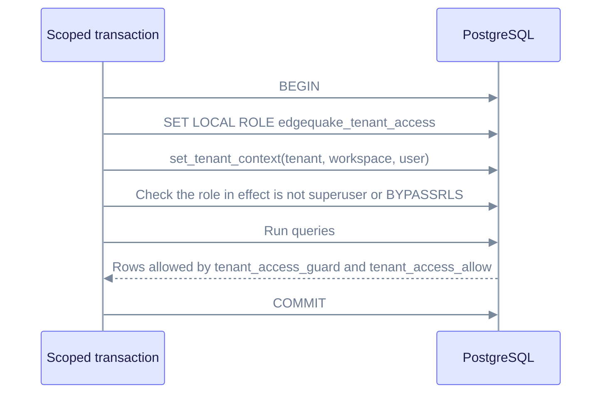

# RLS superuser acceptance (GAP-091-12)

**Status:** Accepted on 2026-07-30 (SPEC-091 IW0). **Partly superseded** by migration 167. Read [What changed with migration 167](#what-changed-with-migration-167) first.

**Decision owner:** EdgeQuake maintainers.

Row-Level Security (RLS) is a PostgreSQL feature that filters the rows each query can see, based on policies on the table. This record explains how EdgeQuake relies on RLS, and where the application layer still has to enforce isolation.

## Context at the time of the decision

- Tenant and workspace policies existed (migrations 009 and 096). A test suite (`e2e_postgres_rls`) ran them in CI against a non-superuser role named `app_user`.
- In production, the server connected as the database owner (`edgequake`). PostgreSQL superusers always bypass RLS. Table owners bypass it too, unless the table uses `FORCE ROW LEVEL SECURITY`. So RLS did nothing on the production connection.
- Apache AGE stores the whole knowledge graph in one global graph. You cannot express per-tenant label policies there. That stayed out of scope (GAP-091-15).

## Decision

RLS was accepted as defense in depth. The application layer was named the enforcement boundary:

1. Fail-closed scope headers. A malformed `X-Tenant-ID` or `X-Workspace-ID` never matches everything (`ScopeHeader` in `edgequake/crates/edgequake-api/src/middleware.rs`).
2. Task scope checks always run (`get_task_for_context` in `edgequake/crates/edgequake-api/src/services/task_scope.rs`). A request without headers resolves to the built-in default scope on purpose.
3. Relational isolation is covered by `e2e_tenant_isolation` and `contract_spec091_strict_scope_headers`.
4. The RLS suite stayed in CI, so a future non-superuser runtime role could turn it on without policy changes.

## What changed with migration 167

Migration 167 created the role `edgequake_tenant_access` with `NOLOGIN NOSUPERUSER NOBYPASSRLS NOINHERIT`. For each protected table it added a restrictive policy (`tenant_access_guard`), which requires the current tenant and, if one is set, the current workspace. It also added a permissive policy (`tenant_access_allow`) for that role, and forced RLS on the tables. The full policy text is in `edgequake/migrations/167*.sql`, and [postgres.md](./postgres.md#tenant-isolation) summarizes it.

The Rust code runs scoped data-access transactions as that role. `install_rls_context` in `edgequake/crates/edgequake-storage/src/adapters/postgres/rls.rs` does three things:

1. Runs `SET LOCAL ROLE edgequake_tenant_access`.
2. Calls `set_tenant_context` for the tenant, workspace, and user.
3. Checks whether the role now in effect (`current_user`) is a superuser or has `BYPASSRLS`. If so, it returns an error.

The check looks at the role in effect after the switch, not at the login role. So the policies apply to scoped transactions even when the login role owns the tables.

What still holds from the original decision:

- Administration and queue connections keep their privileged path.
- Not every query goes through a scoped transaction, so every scoped read path must still filter in the application.
- The AGE graph has no tenant policies by default. Isolation there is by `tenant_id` and `workspace_id` properties and application filters. An optional AGE RLS mode exists (set `EDGEQUAKE_AGE_RLS` to `1`, `true`, `yes`, or `on`, with AGE 1.7.0 or later). See [age.md](./age.md#tenant-isolation-in-the-graph).

## Consequences

- Do not rely on RLS as the only isolation mechanism for a new table. Add the table to the policy list in a migration, and also filter in code.
- Keep admin and queue credentials separate from the runtime login. Scoped transactions use the tenant role, so RLS applies to them whatever the login role is.

## References

- `specs/091-simplify-data-layer/18-full-completeness-assessment.md` (GAP-091-12)
- `edgequake/crates/edgequake-api/tests/e2e_postgres_rls.rs` and `edgequake/crates/edgequake-api/tests/e2e_tenant_rls.rs` (RLS suites)
- `edgequake/crates/edgequake-api/tests/e2e_tenant_isolation.rs` (application-layer isolation suite)
- `edgequake/crates/edgequake-api/tests/contract_spec091_strict_scope_headers.rs` (strict scope header contract)
- [llm-cache-scope.md](./llm-cache-scope.md), an adjacent scope decision (GAP-091-14)
