# Schema entity-relationship diagrams

This page is the full picture of the EdgeQuake relational schema. It is for operators who inspect the database and for developers who add columns or foreign keys.

Every diagram below was built from `edgequake/migrations/` through migration **169** (SPEC-163 provider connections). Column types are simplified for Mermaid (for example `TIMESTAMP WITH TIME ZONE` becomes `timestamptz`, and size arguments like `VARCHAR(64)` become `varchar`). Primary keys are marked `PK` and declared foreign keys are marked `FK`.

> How to read the diagrams: boxes are tables, lines are foreign keys, and `|o` / `}o` mean "zero or one / zero or many". Attributes inside a box are a representative subset when a table has many columns; the migration SQL is the authority for the full list.

Related pages: [PostgreSQL overview](./postgres.md) · [pgvector](./pgvector.md) · [Apache AGE](./age.md) · [Storage model](../architecture/storage-model.md) · [Upgrading](../operations/upgrading.md)

## Domain map

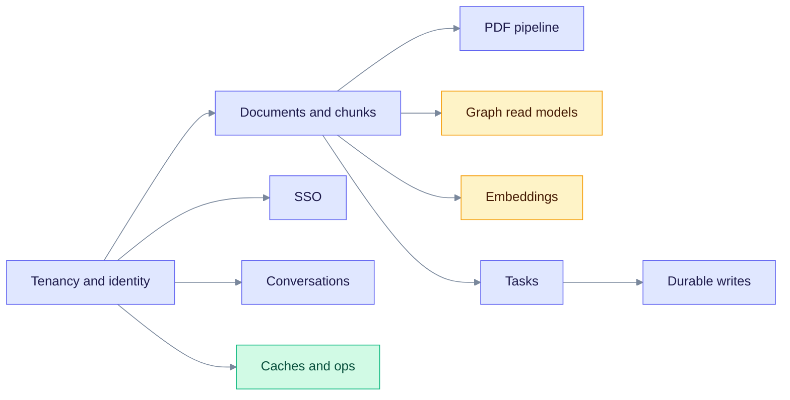

Start at **Tenancy and identity**. Everything else is scoped by a tenant and usually by a workspace.

## Tenancy and identity

Who owns what, and how a person signs in. Start at `tenants`: every other row in this diagram hangs off a tenant or a user.

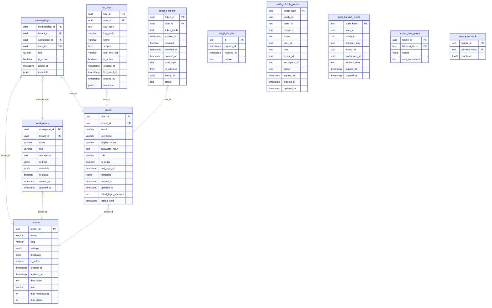

Read the boxes as tables and the arrows as foreign keys that point toward the parent. Tables in this section: `tenants`, `workspaces`, `users`, `memberships`, `api_keys`, `refresh_tokens`, `jwt_jti_denylist`, `oauth_refresh_grants`, `auth_handoff_codes`, `tenant_lane_quota`, `tenant_vruntime`.

## Single sign-on (OIDC)

External identity providers and the sessions they create. Read left to right: a provider links to federated identities, which open sessions.

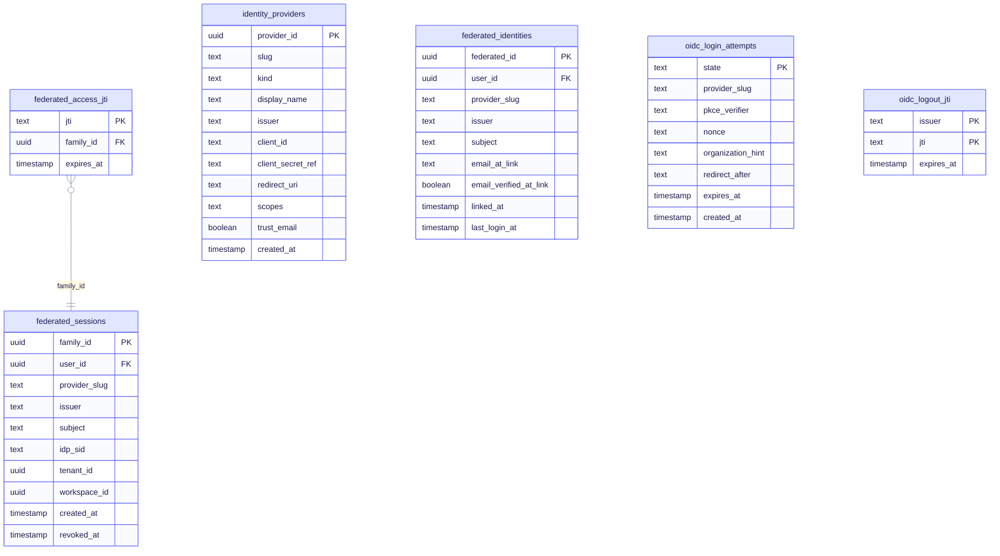

Read the boxes as tables and the arrows as foreign keys that point toward the parent. Tables in this section: `identity_providers`, `federated_identities`, `federated_sessions`, `federated_access_jti`, `oidc_login_attempts`, `oidc_logout_jti`.

## Documents and chunks

Uploaded content and how it is split for retrieval. A document owns its chunks; `chunk_serving_state` is the visibility fence.

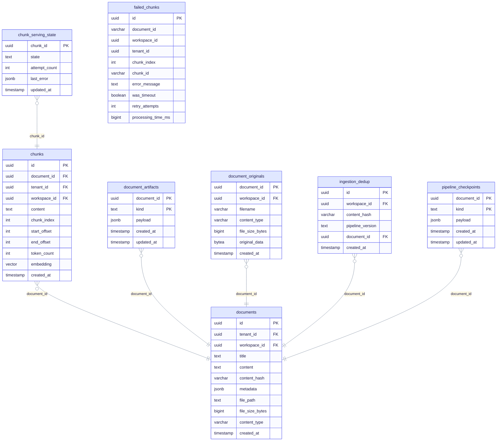

Read the boxes as tables and the arrows as foreign keys that point toward the parent. Tables in this section: `documents`, `chunks`, `chunk_serving_state`, `document_artifacts`, `document_originals`, `ingestion_dedup`, `failed_chunks`, `pipeline_checkpoints`.

## PDF pipeline

Binary PDFs, per-page geometry, layout regions, and rendered page images. Every PDF row points at a document.

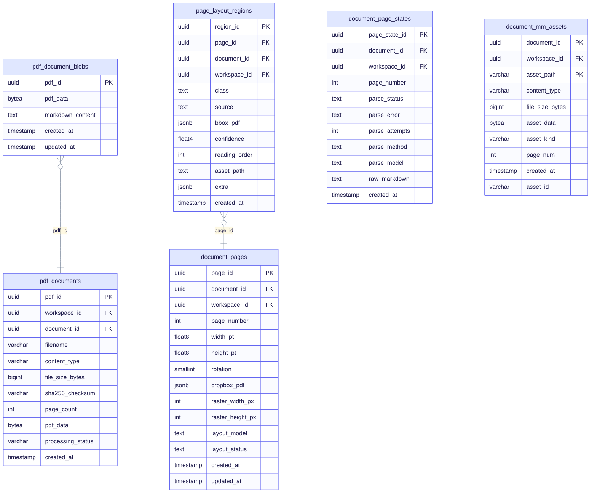

Read the boxes as tables and the arrows as foreign keys that point toward the parent. Tables in this section: `pdf_documents`, `pdf_document_blobs`, `document_pages`, `document_page_states`, `page_layout_regions`, `document_mm_assets`.

## Graph read models and lineage

Relational copies of the knowledge graph, plus the link tables that record which chunk produced which entity or relationship. The live graph itself lives in Apache AGE (see the AGE page).

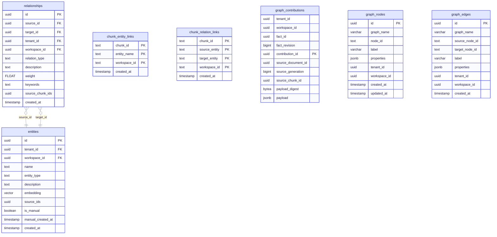

Read the boxes as tables and the arrows as foreign keys that point toward the parent. Tables in this section: `entities`, `relationships`, `chunk_entity_links`, `chunk_relation_links`, `graph_contributions`, `graph_nodes`, `graph_edges`.

## Embeddings (pgvector)

Vectors for chunks, entities, relationships, and reports, keyed by embedding model. Manifests and projections track which model revision produced which vector.

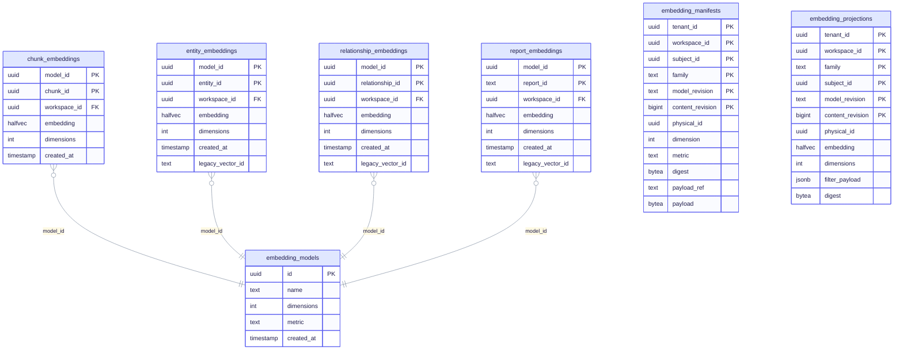

Read the boxes as tables and the arrows as foreign keys that point toward the parent. Tables in this section: `embedding_models`, `chunk_embeddings`, `entity_embeddings`, `relationship_embeddings`, `report_embeddings`, `embedding_manifests`, `embedding_projections`.

## Background tasks and jobs

Work the API queues for workers. `tasks` is partitioned by month; `task_events` and `attempts` are the audit trail.

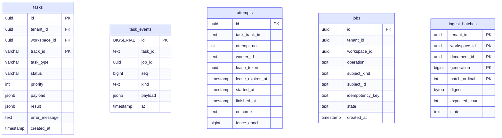

Read the boxes as tables and the arrows as foreign keys that point toward the parent. Tables in this section: `tasks`, `task_events`, `attempts`, `jobs`, `ingest_batches`.

## Durable write path (SPEC-149)

Idempotent commits, object revisions, and projection events that feed downstream stores. Start at `mutation_requests` and follow the arrows to deliveries.

```mermaid
%%{init: {"theme":"base","themeVariables":{"primaryColor":"#E0E7FF","primaryBorderColor":"#6366F1","primaryTextColor":"#1E1B4B","secondaryColor":"#D1FAE5","secondaryBorderColor":"#10B981","secondaryTextColor":"#064E3B","tertiaryColor":"#FEF3C7","tertiaryBorderColor":"#F59E0B","tertiaryTextColor":"#6B7A90","lineColor":"#7A889C","clusterBkg":"rgba(99,102,241,0.07)","clusterBorder":"#A5B4FC","noteBkgColor":"#FEF9C3","noteTextColor":"#422006","textColor":"#6B7A90","titleColor":"#6B7A90","signalColor":"#7A889C","signalTextColor":"#6B7A90","loopTextColor":"#6B7A90","edgeLabelBackground":"#F1F5F9","actorLineColor":"#94A3B8"}}}%%
%% eq-theme:v1
erDiagram
    projection_event_items }o--|| projection_events : "event_id"
    projection_event_role_proofs }o--|| projection_events : "event_id"
    projection_deliveries }o--|| projection_events : "event_id"
    projection_deliveries }o--|| data_bindings : "binding_id"
    projection_visibility }o--|| data_bindings : "binding_id"
    projection_cleanup_intents }o--|| data_bindings : "binding_id"
    vector_provider_cutovers }o--|| data_bindings : "old_binding_id"
    vector_provider_cutovers }o--|| data_bindings : "new_binding_id"
    mutation_requests {
        uuid tenant_id PK
        uuid workspace_id PK
        text operation PK
        text idempotency_key PK
        bytea digest
        bytea receipt
        timestamp created_at
    }
    object_revisions {
        uuid tenant_id PK
        uuid workspace_id PK
        text kind PK
        uuid logical_id PK
        bigint revision PK
        text state
        uuid physical_id
        bytea digest
        text payload_ref
        bytea payload
        timestamp created_at
    }
    projection_events {
        uuid event_id PK
        uuid tenant_id
        uuid workspace_id
        text object_kind
        uuid object_id
        bigint object_revision
        int schema_version
        text operation
        text manifest_ref
        bytea digest
        timestamp created_at
    }
    projection_event_items {
        uuid event_id PK
        text role PK
        int ordinal PK
        text item_kind
        uuid record_id
        bigint record_revision
        bytea digest
        text logical_key
    }
    projection_event_role_proofs {
        uuid event_id PK
        text role PK
        bytea expected_digest
    }
    projection_deliveries {
        uuid event_id PK
        uuid binding_id PK
        text state
        timestamp next_attempt_at
        timestamp lease_until
        uuid lease_owner
        bigint epoch
        int attempts
        bytea receipt
        text provider_receipt
    }
    projection_visibility {
        uuid tenant_id PK
        uuid workspace_id PK
        text object_kind PK
        uuid object_id PK
        bigint object_revision PK
        uuid binding_id PK
        bytea completion_receipt
        bigint verified_generation
    }
    projection_cleanup_intents {
        uuid cleanup_manifest_id PK
        uuid binding_id PK
        uuid tenant_id
        uuid workspace_id
        uuid document_id
        bigint tombstone_revision
        text state
        timestamp created_at
    }
    outbox_events {
        uuid id PK
        text aggregate_type
        uuid aggregate_id
        text event_type
        jsonb payload
        timestamp created_at
        timestamp processed_at
        uuid workspace_id
        timestamp available_at
        int attempt_count
    }
    data_bindings {
        uuid binding_id PK
        uuid tenant_id
        uuid workspace_id
        text role
        text provider
        text config_ref
        text layout
        text physical_index
        text model_descriptor
        bigint generation
        text state
        timestamp created_at
    }
    vector_provider_cutovers {
        uuid cutover_id PK
        uuid tenant_id
        uuid workspace_id
        uuid old_binding_id FK
        uuid new_binding_id FK
        jsonb backfill_cursor
        text state
        timestamp created_at
        timestamp updated_at
    }
    compensation_quarantine {
        uuid entry_id PK
        uuid document_id FK
        uuid workspace_id FK
        text status
        timestamp next_attempt_at
        int attempt_count
        jsonb payload
        jsonb last_error
        timestamp created_at
        timestamp updated_at
    }
```

Read the boxes as tables and the arrows as foreign keys that point toward the parent. Tables in this section: `mutation_requests`, `object_revisions`, `projection_events`, `projection_event_items`, `projection_event_role_proofs`, `projection_deliveries`, `projection_visibility`, `projection_cleanup_intents`, `outbox_events`, `data_bindings`, `vector_provider_cutovers`, `compensation_quarantine`.

## Conversations

Chat history for the query UI. A conversation holds messages; folders group conversations.

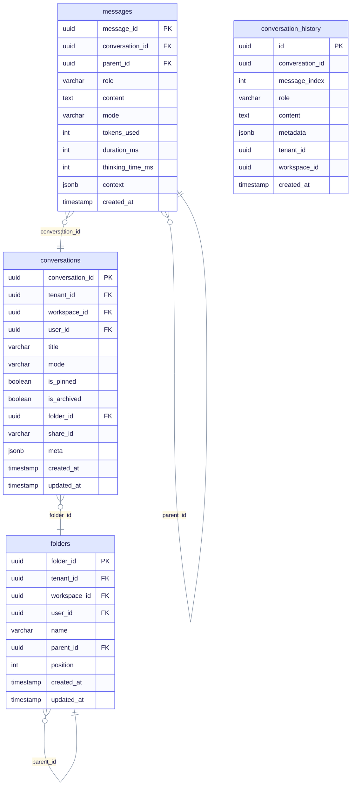

Read the boxes as tables and the arrows as foreign keys that point toward the parent. Tables in this section: `conversations`, `messages`, `conversation_history`, `folders`.

## Caches, providers, and operations

Recomputable results, encrypted provider connections (SPEC-163), audit logs, and migration bookkeeping.

```mermaid
%%{init: {"theme":"base","themeVariables":{"primaryColor":"#E0E7FF","primaryBorderColor":"#6366F1","primaryTextColor":"#1E1B4B","secondaryColor":"#D1FAE5","secondaryBorderColor":"#10B981","secondaryTextColor":"#064E3B","tertiaryColor":"#FEF3C7","tertiaryBorderColor":"#F59E0B","tertiaryTextColor":"#6B7A90","lineColor":"#7A889C","clusterBkg":"rgba(99,102,241,0.07)","clusterBorder":"#A5B4FC","noteBkgColor":"#FEF9C3","noteTextColor":"#422006","textColor":"#6B7A90","titleColor":"#6B7A90","signalColor":"#7A889C","signalTextColor":"#6B7A90","loopTextColor":"#6B7A90","edgeLabelBackground":"#F1F5F9","actorLineColor":"#94A3B8"}}}%%
%% eq-theme:v1
erDiagram
    llm_cache {
        text cache_key PK
        text namespace PK
        jsonb value
        timestamp created_at
        timestamp updated_at
        timestamp expires_at
    }
    decision_cache {
        uuid workspace_id PK
        text key_hash PK
        uuid tenant_id
        text contract
        text model
        jsonb answer
        timestamp created_at
        timestamp last_used_at
    }
    decision_review {
        uuid review_id PK
        uuid workspace_id
        uuid document_id
        uuid tenant_id
        text chunk_id
        text kind
        text subject
        text label
        text object
        float4 score
        timestamp created_at
    }
    provider_connections {
        uuid id PK
        uuid tenant_id
        text slug
        text display_name
        text api_shape
        text locality
        text base_url
        text auth_scheme
        bytea api_key_ciphertext
        bytea api_key_nonce
        timestamp created_at
    }
    server_config {
        text key PK
        jsonb value
        timestamp updated_at
    }
    audit_logs {
        uuid id PK
        timestamp timestamp PK
        varchar tenant_id
        varchar workspace_id
        varchar user_id
        audit_event_type event_type
        varchar event_category
        varchar event_action
        varchar resource_type
        varchar resource_id
    }
    rls_audit_log {
        BIGSERIAL id PK
        timestamp event_time
        uuid tenant_id
        uuid workspace_id
        uuid user_id
        varchar action
        varchar table_name
        text record_id
        jsonb details
    }
    workspace_metrics_history {
        uuid id PK
        uuid workspace_id FK
        timestamp recorded_at
        text trigger_type
        bigint document_count
        bigint chunk_count
        bigint entity_count
        bigint relationship_count
        bigint embedding_count
        bigint storage_bytes
    }
    edgequake_schema_generation {
        text relation_name PK
        int generation
        timestamp retired_at
        text notes
        timestamp updated_at
    }
    edgequake_reconcile_state {
        text support_version PK
        text apply_sha384
        timestamp applied_at
        bigint duration_ms
        text outcome
    }
    eq_hot_ann_workspaces {
        text table_prefix PK
        text workspace_id PK
        timestamp created_at
    }
```

Read the boxes as tables and the arrows as foreign keys that point toward the parent. Tables in this section: `llm_cache`, `decision_cache`, `decision_review`, `provider_connections`, `server_config`, `audit_logs`, `rls_audit_log`, `workspace_metrics_history`, `edgequake_schema_generation`, `edgequake_reconcile_state`, `eq_hot_ann_workspaces`.

## What these diagrams leave out

- **Apache AGE graph.** Entities and relationships also exist as nodes and edges in the AGE graph (`ag_catalog`). Isolation there uses `tenant_id` / `workspace_id` properties, not foreign keys. See [age.md](./age.md).
- **Per-workspace vector tables.** Hot workspaces can get dedicated ANN tables (`eq_hot_ann_workspaces`). Those tables are created at runtime and are not listed above.
- **The `edgequake` schema.** Migration bookkeeping (`schema_compat`, `migration_run`, …) lives in a separate schema and is covered in [Upgrading](../operations/upgrading.md).
- **Views.** Five reporting views (`rate_limit_violations`, `recent_security_events`, `tenant_activity_summary`, `tenant_document_stats`, `tenant_entity_stats`) are not drawn.

## Regenerating

When you add a migration, update this page so the diagrams stay honest. The column lists and foreign keys should match the SQL in `edgequake/migrations/`. Prefer several domain diagrams over one giant diagram: Mermaid stays readable with about a dozen tables per figure.
