# Schema entity-relationship diagrams

This page maps the EdgeQuake PostgreSQL schema as Mermaid E/R diagrams. Read the **build-up path** first. It goes in steps, from tenant scope to the audit tables. Each step is one topic, and it shows only the tables that topic needs, plus the context tables it connects to. The **full data model** at the end shows all 84 base tables in one diagram, for reference.

## Build-up path

Follow the steps in order. Each arrow means "then read about".

```mermaid
%%{init: {"theme":"base","themeVariables":{"primaryColor":"#E0E7FF","primaryBorderColor":"#6366F1","primaryTextColor":"#1E1B4B","secondaryColor":"#D1FAE5","secondaryBorderColor":"#10B981","secondaryTextColor":"#064E3B","tertiaryColor":"#FEF3C7","tertiaryBorderColor":"#F59E0B","tertiaryTextColor":"#6B7A90","lineColor":"#7A889C","clusterBkg":"rgba(99,102,241,0.07)","clusterBorder":"#A5B4FC","noteBkgColor":"#FEF9C3","noteTextColor":"#422006","textColor":"#6B7A90","titleColor":"#6B7A90","signalColor":"#7A889C","signalTextColor":"#6B7A90","loopTextColor":"#6B7A90","edgeLabelBackground":"#F1F5F9","actorLineColor":"#94A3B8"}}}%%
%% eq-theme:v1
flowchart LR
    S1["1. Tenants and workspaces"]
    S2["2. Store an uploaded document"]
    S3["3. Extract entities and relationships"]
    S4["4. Search by meaning"]
    S5["5. Track and recover ingestion"]
    S6["6. Convert PDFs and keep page layouts"]
    S7["7. Write durably and project to the stores"]
    S8["8. Users, memberships and API keys"]
    S9["9. Single sign-on"]
    S10["10. Chat with saved conversations"]
    S11["11. Caches, provider settings and metrics"]
    S12["12. Audit and schema migrations"]
    S1 --> S2
    S2 --> S3
    S3 --> S4
    S4 --> S5
    S5 --> S6
    S6 --> S7
    S7 --> S8
    S8 --> S9
    S9 --> S10
    S10 --> S11
    S11 --> S12
%% eq-classes
classDef eqLlm fill:#FEF3C7,stroke:#F59E0B,color:#451A03
classDef eqStore fill:#D1FAE5,stroke:#10B981,color:#064E3B
class S11 eqLlm
class S12 eqStore
```


## Step 1: Tenants and workspaces

Most data tables carry a tenant and an optional workspace reference. Start here, because later steps repeat these two tables as context.

**New tables in this step:** `tenants`, `workspaces`

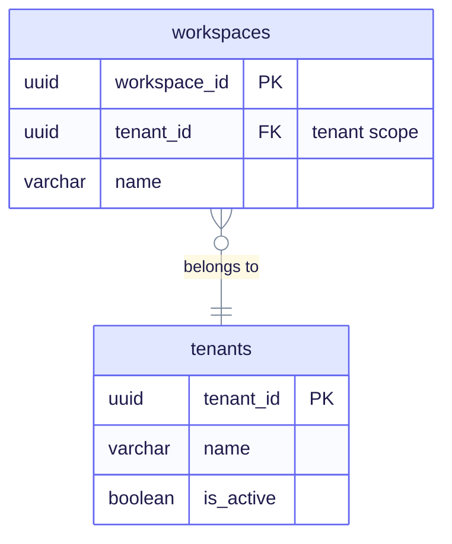

Everything else hangs off these two tables, so the later steps show them as context.

## Step 2: Store an uploaded document

A text upload creates a document, keeps the original bytes, and is split into chunks. The `tasks` table tracks background work for the workspace.

**New tables in this step:** `documents`, `document_originals`, `chunks`, `chunk_serving_state`, `tasks`

**Context tables:** `tenants`, `workspaces`

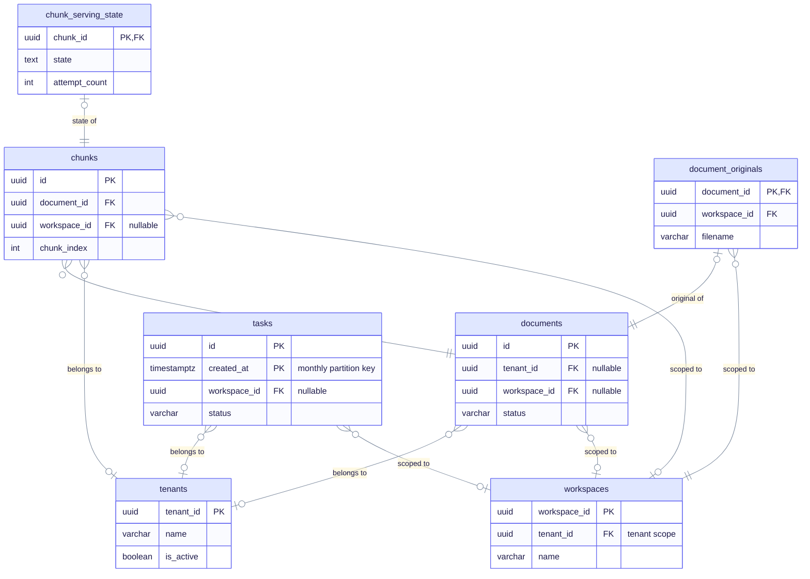

`chunk_serving_state` is the serving fence (migration 109). It controls when a chunk can be served to queries.

## Step 3: Extract entities and relationships

The model reads each chunk and records entities (nodes) and relationships (edges). Link tables record which chunk produced each one.

**New tables in this step:** `entities`, `relationships`, `chunk_entity_links`, `chunk_relation_links`, `graph_contributions`, `graph_nodes`, `graph_edges`

**Context tables:** `chunks`, `tenants`, `workspaces`

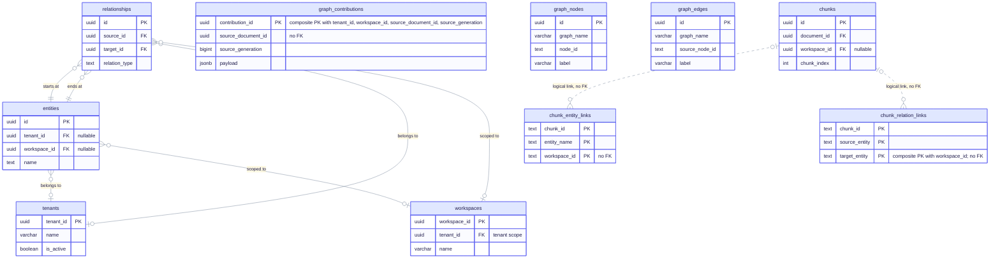

`chunk_entity_links` and `chunk_relation_links` are dashed because they have no foreign key. `graph_nodes` and `graph_edges` are the fallback storage used when Apache AGE is not available, and they have no foreign keys.

## Step 4: Search by meaning

Chunks, entities and relationships each get a vector. Embedding rows record which model made the vector.

**New tables in this step:** `embedding_models`, `chunk_embeddings`, `entity_embeddings`, `relationship_embeddings`, `report_embeddings`, `embedding_manifests`, `embedding_projections`

**Context tables:** `chunks`, `entities`, `relationships`, `workspaces`

```mermaid
%%{init: {"theme":"base","themeVariables":{"primaryColor":"#E0E7FF","primaryBorderColor":"#6366F1","primaryTextColor":"#1E1B4B","secondaryColor":"#D1FAE5","secondaryBorderColor":"#10B981","secondaryTextColor":"#064E3B","tertiaryColor":"#FEF3C7","tertiaryBorderColor":"#F59E0B","tertiaryTextColor":"#6B7A90","lineColor":"#7A889C","clusterBkg":"rgba(99,102,241,0.07)","clusterBorder":"#A5B4FC","noteBkgColor":"#FEF9C3","noteTextColor":"#422006","textColor":"#6B7A90","titleColor":"#6B7A90","signalColor":"#7A889C","signalTextColor":"#6B7A90","loopTextColor":"#6B7A90","edgeLabelBackground":"#F1F5F9","actorLineColor":"#94A3B8"}}}%%
%% eq-theme:v1
erDiagram
    embedding_models {
        uuid id PK
        text name
        int dimensions
    }
    chunk_embeddings {
        uuid model_id PK, FK
        uuid chunk_id PK, FK
        uuid workspace_id FK
        halfvec embedding
    }
    entity_embeddings {
        uuid model_id PK, FK
        uuid entity_id PK, FK
        uuid workspace_id FK
        halfvec embedding
    }
    relationship_embeddings {
        uuid model_id PK, FK
        uuid relationship_id PK, FK
        uuid workspace_id FK
        halfvec embedding
    }
    report_embeddings {
        uuid model_id PK, FK
        text report_id PK
        uuid workspace_id FK
        halfvec embedding
    }
    embedding_manifests {
        uuid subject_id PK "composite PK with tenant_id, workspace_id"
        text family PK
        text model_revision PK
        bigint content_revision PK
    }
    embedding_projections {
        uuid subject_id PK "composite PK with tenant_id, workspace_id, family, model_revision, content_revision"
        text family PK
        text model_revision PK
        halfvec embedding
    }
    workspaces {
        uuid workspace_id PK
        uuid tenant_id FK "tenant scope"
        varchar name
    }
    chunks {
        uuid id PK
        uuid document_id FK
        uuid workspace_id FK "nullable"
        int chunk_index
    }
    entities {
        uuid id PK
        uuid tenant_id FK "nullable"
        uuid workspace_id FK "nullable"
        text name
    }
    relationships {
        uuid id PK
        uuid source_id FK
        uuid target_id FK
        text relation_type
    }
    chunk_embeddings }o--|| embedding_models : "uses model"
    chunk_embeddings }o--|| chunks : "embeds"
    chunk_embeddings }o--|| workspaces : "scoped to"
    entity_embeddings }o--|| embedding_models : "uses model"
    entity_embeddings }o--|| entities : "embeds"
    entity_embeddings }o--|| workspaces : "scoped to"
    relationship_embeddings }o--|| embedding_models : "uses model"
    relationship_embeddings }o--|| relationships : "embeds"
    relationship_embeddings }o--|| workspaces : "scoped to"
    report_embeddings }o--|| embedding_models : "uses model"
    report_embeddings }o--|| workspaces : "scoped to"
```

The vector columns themselves are described in [vector storage](../deep-dives/vector-storage.md).

## Step 5: Track and recover ingestion

A long ingestion runs as jobs and attempts. `pipeline_checkpoints` records each stage per document, `failed_chunks` stores chunks to retry, and `ingestion_dedup` avoids reprocessing.

**New tables in this step:** `jobs`, `attempts`, `task_events`, `ingest_batches`, `tenant_lane_quota`, `tenant_vruntime`, `pipeline_checkpoints`, `document_artifacts`, `ingestion_dedup`, `failed_chunks`, `compensation_quarantine`

**Context tables:** `documents`, `tasks`, `workspaces`

```mermaid
%%{init: {"theme":"base","themeVariables":{"primaryColor":"#E0E7FF","primaryBorderColor":"#6366F1","primaryTextColor":"#1E1B4B","secondaryColor":"#D1FAE5","secondaryBorderColor":"#10B981","secondaryTextColor":"#064E3B","tertiaryColor":"#FEF3C7","tertiaryBorderColor":"#F59E0B","tertiaryTextColor":"#6B7A90","lineColor":"#7A889C","clusterBkg":"rgba(99,102,241,0.07)","clusterBorder":"#A5B4FC","noteBkgColor":"#FEF9C3","noteTextColor":"#422006","textColor":"#6B7A90","titleColor":"#6B7A90","signalColor":"#7A889C","signalTextColor":"#6B7A90","loopTextColor":"#6B7A90","edgeLabelBackground":"#F1F5F9","actorLineColor":"#94A3B8"}}}%%
%% eq-theme:v1
erDiagram
    document_artifacts {
        uuid document_id PK, FK
        text kind PK
        jsonb payload
    }
    pipeline_checkpoints {
        uuid document_id PK, FK
        text kind PK
        jsonb payload
    }
    ingestion_dedup {
        uuid id PK
        uuid workspace_id FK
        uuid document_id FK "nullable"
        varchar content_hash
    }
    compensation_quarantine {
        uuid entry_id PK
        uuid document_id FK
        uuid workspace_id FK "nullable"
        text status
    }
    failed_chunks {
        uuid id PK
        varchar document_id "text id, no FK"
        varchar status
    }
    task_events {
        bigint id PK
        text task_id
        text kind
    }
    attempts {
        uuid id PK
        text task_track_id "no FK"
        int attempt_no
        text outcome
    }
    jobs {
        uuid id PK
        text operation
        text state
    }
    ingest_batches {
        uuid tenant_id PK "composite PK with workspace_id, document_id, generation, batch_ordinal"
        text state
        int expected_count
        bytea digest
    }
    tenant_lane_quota {
        uuid tenant_id PK
        text fairness_class PK
        float8 weight
        int max_concurrent
    }
    tenant_vruntime {
        uuid tenant_id PK
        text fairness_class PK
        float8 vruntime
    }
    workspaces {
        uuid workspace_id PK
        uuid tenant_id FK "tenant scope"
        varchar name
    }
    documents {
        uuid id PK
        uuid tenant_id FK "nullable"
        uuid workspace_id FK "nullable"
        varchar status
    }
    tasks {
        uuid id PK
        timestamptz created_at PK "monthly partition key"
        uuid workspace_id FK "nullable"
        varchar status
    }
    document_artifacts }o--|| documents : "derived from"
    pipeline_checkpoints }o--|| documents : "checkpoints"
    ingestion_dedup }o--|| workspaces : "scoped to"
    ingestion_dedup }o--o| documents : "points to"
    compensation_quarantine }o--|| documents : "holds"
    compensation_quarantine }o--o| workspaces : "scoped to"
    tasks }o..o| jobs : "grouped under"
    task_events }o..o| jobs : "logs for"
    attempts }o..o| tasks : "attempts of"
```

Each task belongs to at most one job, and `attempts` records each run of a task.

## Step 6: Convert PDFs and keep page layouts

A PDF is stored as bytes, converted page by page, and its layout regions and figures are kept as assets.

**New tables in this step:** `pdf_documents`, `pdf_document_blobs`, `document_pages`, `page_layout_regions`, `document_page_states`, `document_mm_assets`

**Context tables:** `documents`, `workspaces`

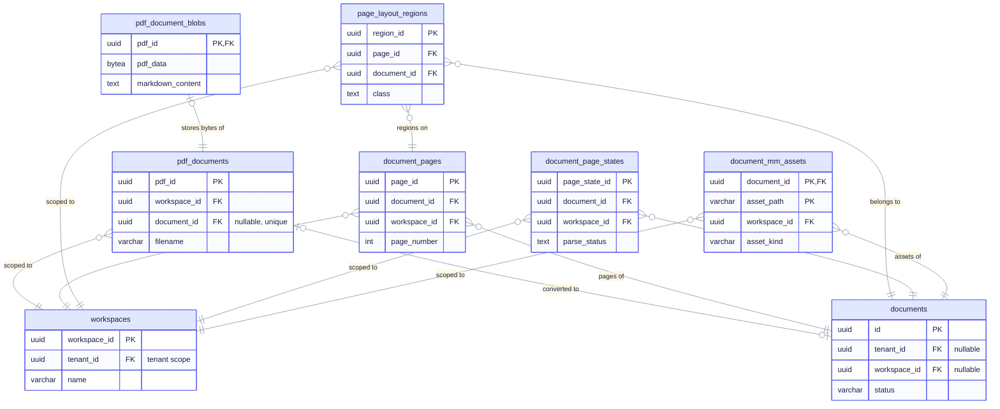

The PDF bytes live in `pdf_document_blobs`, not in `pdf_documents`.

## Step 7: Write durably and project to the stores

Each write is recorded as a mutation, then delivered to the graph and vector stores through projection events, with cutovers and cleanup tracked separately.

**New tables in this step:** `mutation_requests`, `object_revisions`, `projection_events`, `projection_event_items`, `projection_event_role_proofs`, `projection_deliveries`, `projection_visibility`, `data_bindings`, `vector_provider_cutovers`, `projection_cleanup_intents`, `outbox_events`, `edgequake_schema_generation`

```mermaid
%%{init: {"theme":"base","themeVariables":{"primaryColor":"#E0E7FF","primaryBorderColor":"#6366F1","primaryTextColor":"#1E1B4B","secondaryColor":"#D1FAE5","secondaryBorderColor":"#10B981","secondaryTextColor":"#064E3B","tertiaryColor":"#FEF3C7","tertiaryBorderColor":"#F59E0B","tertiaryTextColor":"#6B7A90","lineColor":"#7A889C","clusterBkg":"rgba(99,102,241,0.07)","clusterBorder":"#A5B4FC","noteBkgColor":"#FEF9C3","noteTextColor":"#422006","textColor":"#6B7A90","titleColor":"#6B7A90","signalColor":"#7A889C","signalTextColor":"#6B7A90","loopTextColor":"#6B7A90","edgeLabelBackground":"#F1F5F9","actorLineColor":"#94A3B8"}}}%%
%% eq-theme:v1
erDiagram
    edgequake_schema_generation {
        text relation_name PK
        int generation
        timestamptz retired_at
    }
    mutation_requests {
        uuid tenant_id PK "composite PK with workspace_id, operation, idempotency_key"
        text idempotency_key PK
        bytea digest
    }
    object_revisions {
        uuid logical_id PK "composite PK with tenant_id, workspace_id, kind, revision"
        bigint revision PK
        text state
        uuid physical_id
    }
    projection_events {
        uuid event_id PK
        text object_kind
        bigint object_revision
        text operation
    }
    projection_event_items {
        uuid event_id PK, FK
        text role PK
        int ordinal PK
        text item_kind
    }
    projection_event_role_proofs {
        uuid event_id PK, FK
        text role PK
        bytea expected_digest
    }
    projection_deliveries {
        uuid event_id PK, FK
        uuid binding_id PK, FK
        text state
        int attempts
    }
    projection_visibility {
        uuid binding_id PK, FK
        uuid object_id PK "composite PK with tenant_id, workspace_id, object_kind, object_revision"
        bigint verified_generation
    }
    data_bindings {
        uuid binding_id PK
        text role
        text provider
        text state
    }
    vector_provider_cutovers {
        uuid cutover_id PK
        uuid old_binding_id FK
        uuid new_binding_id FK
        text state
    }
    projection_cleanup_intents {
        uuid cleanup_manifest_id PK "composite PK"
        uuid binding_id PK, FK
        bigint tombstone_revision
        text state
    }
    outbox_events {
        uuid id PK
        text event_type
        uuid aggregate_id
        timestamptz available_at
    }
    projection_event_items }o--|| projection_events : "items of"
    projection_event_role_proofs }o--|| projection_events : "proof for"
    projection_deliveries }o--|| projection_events : "delivers"
    projection_deliveries }o--|| data_bindings : "targets"
    projection_visibility }o--|| data_bindings : "visible via"
    vector_provider_cutovers }o--|| data_bindings : "moves from"
    vector_provider_cutovers }o--|| data_bindings : "moves to"
    projection_cleanup_intents }o--|| data_bindings : "cleans up"
```

The outbox and projection tables implement the durable write path.

## Step 8: Users, memberships and API keys

A user joins workspaces through memberships, and signs in with a refresh token or an API key.

**New tables in this step:** `users`, `memberships`, `api_keys`, `refresh_tokens`

**Context tables:** `tenants`, `workspaces`

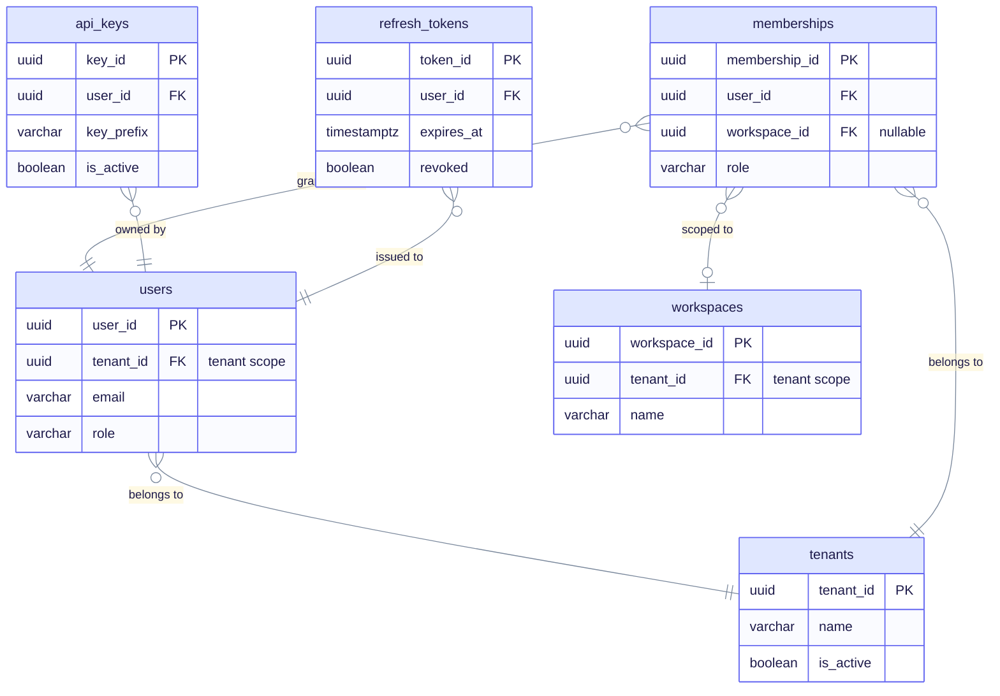

`memberships.workspace_id` is nullable. NULL means access to all workspaces in the tenant (migration 008).

## Step 9: Single sign-on

External identity providers link to users through federated identities and sessions. OIDC login, logout and handoff state is kept in short-lived tables.

**New tables in this step:** `identity_providers`, `federated_identities`, `federated_sessions`, `federated_access_jti`, `oidc_login_attempts`, `oidc_logout_jti`, `auth_handoff_codes`, `oauth_refresh_grants`, `jwt_jti_denylist`

**Context tables:** `users`

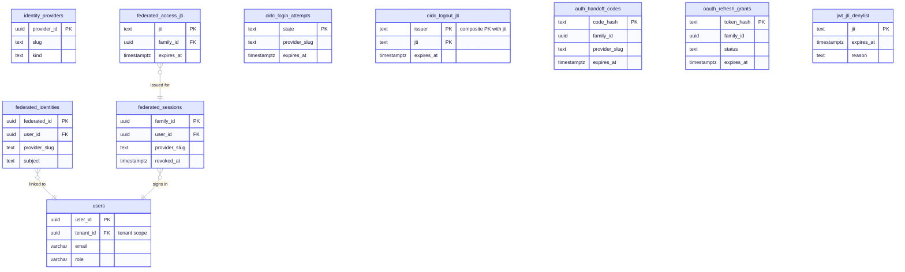

Sessions and single-use token IDs (`federated_access_jti`, `oidc_logout_jti`) are recorded so they can be checked and revoked.

## Step 10: Chat with saved conversations

Conversations belong to a user and can be filed in folders. Messages form a tree through replies.

**New tables in this step:** `folders`, `conversations`, `messages`, `conversation_history`

**Context tables:** `tenants`, `users`, `workspaces`

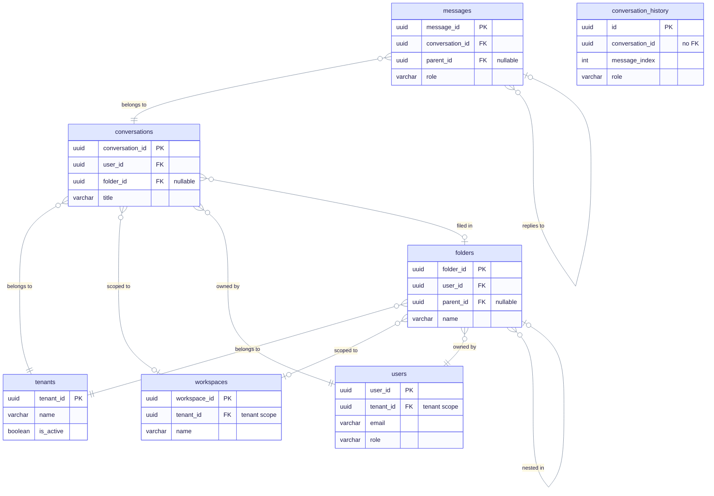

Folders can nest, so `folders` points at itself.

## Step 11: Caches, provider settings and metrics

Caches store model answers and decisions. Provider connections and server settings are kept per tenant or workspace.

**New tables in this step:** `llm_cache`, `decision_cache`, `decision_review`, `provider_connections`, `server_config`, `workspace_metrics_history`, `edgequake_reconcile_state`, `edgequake_provider_budget`, `edgequake_provider_slot`

**Context tables:** `workspaces`

```mermaid
%%{init: {"theme":"base","themeVariables":{"primaryColor":"#E0E7FF","primaryBorderColor":"#6366F1","primaryTextColor":"#1E1B4B","secondaryColor":"#D1FAE5","secondaryBorderColor":"#10B981","secondaryTextColor":"#064E3B","tertiaryColor":"#FEF3C7","tertiaryBorderColor":"#F59E0B","tertiaryTextColor":"#6B7A90","lineColor":"#7A889C","clusterBkg":"rgba(99,102,241,0.07)","clusterBorder":"#A5B4FC","noteBkgColor":"#FEF9C3","noteTextColor":"#422006","textColor":"#6B7A90","titleColor":"#6B7A90","signalColor":"#7A889C","signalTextColor":"#6B7A90","loopTextColor":"#6B7A90","edgeLabelBackground":"#F1F5F9","actorLineColor":"#94A3B8"}}}%%
%% eq-theme:v1
erDiagram
    llm_cache {
        text cache_key PK
        text namespace PK
        jsonb value
        timestamptz expires_at
    }
    decision_cache {
        uuid workspace_id PK
        text key_hash PK
        text contract
        text model
    }
    decision_review {
        uuid review_id PK
        uuid document_id "no FK"
        text kind
        float4 score
    }
    provider_connections {
        uuid id PK
        uuid tenant_id "no FK"
        text slug
        text api_shape
    }
    server_config {
        text key PK
        jsonb value
        timestamptz updated_at
    }
    workspace_metrics_history {
        uuid id PK
        uuid workspace_id FK
        timestamptz recorded_at
        bigint document_count
    }
    edgequake_reconcile_state {
        text support_version PK
        text outcome
        timestamptz applied_at
    }
    edgequake_provider_budget {
        text provider_key PK
        int budget
        text source
    }
    edgequake_provider_slot {
        text provider_key PK
        int slot_id PK
        text lease_owner
    }
    workspaces {
        uuid workspace_id PK
        uuid tenant_id FK "tenant scope"
        varchar name
    }
    workspace_metrics_history }o--|| workspaces : "samples"
```

`llm_cache` is the typed cache table that replaced the old KV cache (migration 124).

## Step 12: Audit and schema migrations

Security and audit events are logged, and the schema-migration tables record every migration job and run.

**New tables in this step:** `audit_logs`, `rls_audit_log`, `edgequake_audit_log`, `edgequake_migration_job`, `edgequake_migration_batch`, `edgequake_migration_run`, `edgequake_migration_run_step`, `edgequake_schema_compat`

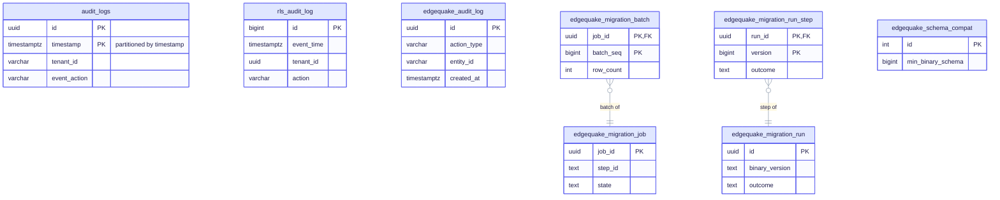

`audit_logs` is partitioned by month. The diagram shows the parent table only.

## Full data model (reference)

This diagram shows all 84 base tables at migration 169 in one view. Use it to find a table. The steps above explain each one in context.

```mermaid
%%{init: {"theme":"base","themeVariables":{"primaryColor":"#E0E7FF","primaryBorderColor":"#6366F1","primaryTextColor":"#1E1B4B","secondaryColor":"#D1FAE5","secondaryBorderColor":"#10B981","secondaryTextColor":"#064E3B","tertiaryColor":"#FEF3C7","tertiaryBorderColor":"#F59E0B","tertiaryTextColor":"#6B7A90","lineColor":"#7A889C","clusterBkg":"rgba(99,102,241,0.07)","clusterBorder":"#A5B4FC","noteBkgColor":"#FEF9C3","noteTextColor":"#422006","textColor":"#6B7A90","titleColor":"#6B7A90","signalColor":"#7A889C","signalTextColor":"#6B7A90","loopTextColor":"#6B7A90","edgeLabelBackground":"#F1F5F9","actorLineColor":"#94A3B8"}}}%%
%% eq-theme:v1
erDiagram
    %% Tenancy
    tenants {
        uuid tenant_id PK
        varchar name
        boolean is_active
    }
    workspaces {
        uuid workspace_id PK
        uuid tenant_id FK "tenant scope"
        varchar name
    }
    users {
        uuid user_id PK
        uuid tenant_id FK "tenant scope"
        varchar email
        varchar role
    }
    memberships {
        uuid membership_id PK
        uuid user_id FK
        uuid workspace_id FK "nullable"
        varchar role
    }
    api_keys {
        uuid key_id PK
        uuid user_id FK
        varchar key_prefix
        boolean is_active
    }
    refresh_tokens {
        uuid token_id PK
        uuid user_id FK
        timestamptz expires_at
        boolean revoked
    }

    %% Auth
    identity_providers {
        uuid provider_id PK
        text slug
        text kind
    }
    federated_identities {
        uuid federated_id PK
        uuid user_id FK
        text provider_slug
        text subject
    }
    federated_sessions {
        uuid family_id PK
        uuid user_id FK
        text provider_slug
        timestamptz revoked_at
    }
    federated_access_jti {
        text jti PK
        uuid family_id FK
        timestamptz expires_at
    }
    oidc_login_attempts {
        text state PK
        text provider_slug
        timestamptz expires_at
    }
    oidc_logout_jti {
        text issuer PK "composite PK with jti"
        text jti PK
        timestamptz expires_at
    }
    auth_handoff_codes {
        text code_hash PK
        uuid family_id
        text provider_slug
        timestamptz expires_at
    }
    oauth_refresh_grants {
        text token_hash PK
        uuid family_id
        text status
        timestamptz expires_at
    }
    jwt_jti_denylist {
        text jti PK
        timestamptz expires_at
        text reason
    }

    %% Documents and tasks
    documents {
        uuid id PK
        uuid tenant_id FK "nullable"
        uuid workspace_id FK "nullable"
        varchar status
    }
    chunks {
        uuid id PK
        uuid document_id FK
        uuid workspace_id FK "nullable"
        int chunk_index
    }
    chunk_serving_state {
        uuid chunk_id PK, FK
        text state
        int attempt_count
    }
    document_artifacts {
        uuid document_id PK, FK
        text kind PK
        jsonb payload
    }
    document_originals {
        uuid document_id PK, FK
        uuid workspace_id FK
        varchar filename
    }
    pipeline_checkpoints {
        uuid document_id PK, FK
        text kind PK
        jsonb payload
    }
    ingestion_dedup {
        uuid id PK
        uuid workspace_id FK
        uuid document_id FK "nullable"
        varchar content_hash
    }
    compensation_quarantine {
        uuid entry_id PK
        uuid document_id FK
        uuid workspace_id FK "nullable"
        text status
    }
    failed_chunks {
        uuid id PK
        varchar document_id "text id, no FK"
        varchar status
    }
    pdf_documents {
        uuid pdf_id PK
        uuid workspace_id FK
        uuid document_id FK "nullable, unique"
        varchar filename
    }
    pdf_document_blobs {
        uuid pdf_id PK, FK
        bytea pdf_data
        text markdown_content
    }
    document_pages {
        uuid page_id PK
        uuid document_id FK
        uuid workspace_id FK
        int page_number
    }
    page_layout_regions {
        uuid region_id PK
        uuid page_id FK
        uuid document_id FK
        text class
    }
    document_page_states {
        uuid page_state_id PK
        uuid document_id FK
        uuid workspace_id FK
        text parse_status
    }
    document_mm_assets {
        uuid document_id PK, FK
        varchar asset_path PK
        uuid workspace_id FK
        varchar asset_kind
    }
    tasks {
        uuid id PK
        timestamptz created_at PK "monthly partition key"
        uuid workspace_id FK "nullable"
        varchar status
    }
    task_events {
        bigint id PK
        text task_id
        text kind
    }
    attempts {
        uuid id PK
        text task_track_id "no FK"
        int attempt_no
        text outcome
    }
    jobs {
        uuid id PK
        text operation
        text state
    }
    ingest_batches {
        uuid tenant_id PK "composite PK with workspace_id, document_id, generation, batch_ordinal"
        text state
        int expected_count
        bytea digest
    }
    tenant_lane_quota {
        uuid tenant_id PK
        text fairness_class PK
        float8 weight
        int max_concurrent
    }
    tenant_vruntime {
        uuid tenant_id PK
        text fairness_class PK
        float8 vruntime
    }

    %% Graph
    entities {
        uuid id PK
        uuid tenant_id FK "nullable"
        uuid workspace_id FK "nullable"
        text name
    }
    relationships {
        uuid id PK
        uuid source_id FK
        uuid target_id FK
        text relation_type
    }
    chunk_entity_links {
        text chunk_id PK
        text entity_name PK
        text workspace_id PK "no FK"
    }
    chunk_relation_links {
        text chunk_id PK
        text source_entity PK
        text target_entity PK "composite PK with workspace_id; no FK"
    }
    graph_contributions {
        uuid contribution_id PK "composite PK with tenant_id, workspace_id, source_document_id, source_generation"
        uuid source_document_id "no FK"
        bigint source_generation
        jsonb payload
    }
    graph_nodes {
        uuid id PK
        varchar graph_name
        text node_id
        varchar label
    }
    graph_edges {
        uuid id PK
        varchar graph_name
        text source_node_id
        varchar label
    }

    %% Vectors
    embedding_models {
        uuid id PK
        text name
        int dimensions
    }
    chunk_embeddings {
        uuid model_id PK, FK
        uuid chunk_id PK, FK
        uuid workspace_id FK
        halfvec embedding
    }
    entity_embeddings {
        uuid model_id PK, FK
        uuid entity_id PK, FK
        uuid workspace_id FK
        halfvec embedding
    }
    relationship_embeddings {
        uuid model_id PK, FK
        uuid relationship_id PK, FK
        uuid workspace_id FK
        halfvec embedding
    }
    report_embeddings {
        uuid model_id PK, FK
        text report_id PK
        uuid workspace_id FK
        halfvec embedding
    }
    embedding_manifests {
        uuid subject_id PK "composite PK with tenant_id, workspace_id"
        text family PK
        text model_revision PK
        bigint content_revision PK
    }
    embedding_projections {
        uuid subject_id PK "composite PK with tenant_id, workspace_id, family, model_revision, content_revision"
        text family PK
        text model_revision PK
        halfvec embedding
    }
    edgequake_schema_generation {
        text relation_name PK
        int generation
        timestamptz retired_at
    }

    %% Durable writes
    mutation_requests {
        uuid tenant_id PK "composite PK with workspace_id, operation, idempotency_key"
        text idempotency_key PK
        bytea digest
    }
    object_revisions {
        uuid logical_id PK "composite PK with tenant_id, workspace_id, kind, revision"
        bigint revision PK
        text state
        uuid physical_id
    }
    projection_events {
        uuid event_id PK
        text object_kind
        bigint object_revision
        text operation
    }
    projection_event_items {
        uuid event_id PK, FK
        text role PK
        int ordinal PK
        text item_kind
    }
    projection_event_role_proofs {
        uuid event_id PK, FK
        text role PK
        bytea expected_digest
    }
    projection_deliveries {
        uuid event_id PK, FK
        uuid binding_id PK, FK
        text state
        int attempts
    }
    projection_visibility {
        uuid binding_id PK, FK
        uuid object_id PK "composite PK with tenant_id, workspace_id, object_kind, object_revision"
        bigint verified_generation
    }
    data_bindings {
        uuid binding_id PK
        text role
        text provider
        text state
    }
    vector_provider_cutovers {
        uuid cutover_id PK
        uuid old_binding_id FK
        uuid new_binding_id FK
        text state
    }
    projection_cleanup_intents {
        uuid cleanup_manifest_id PK "composite PK"
        uuid binding_id PK, FK
        bigint tombstone_revision
        text state
    }
    outbox_events {
        uuid id PK
        text event_type
        uuid aggregate_id
        timestamptz available_at
    }

    %% Conversations
    folders {
        uuid folder_id PK
        uuid user_id FK
        uuid parent_id FK "nullable"
        varchar name
    }
    conversations {
        uuid conversation_id PK
        uuid user_id FK
        uuid folder_id FK "nullable"
        varchar title
    }
    messages {
        uuid message_id PK
        uuid conversation_id FK
        uuid parent_id FK "nullable"
        varchar role
    }
    conversation_history {
        uuid id PK
        uuid conversation_id "no FK"
        int message_index
        varchar role
    }

    %% Caches
    llm_cache {
        text cache_key PK
        text namespace PK
        jsonb value
        timestamptz expires_at
    }
    decision_cache {
        uuid workspace_id PK
        text key_hash PK
        text contract
        text model
    }
    decision_review {
        uuid review_id PK
        uuid document_id "no FK"
        text kind
        float4 score
    }

    %% Providers and ops
    provider_connections {
        uuid id PK
        uuid tenant_id "no FK"
        text slug
        text api_shape
    }
    server_config {
        text key PK
        jsonb value
        timestamptz updated_at
    }
    workspace_metrics_history {
        uuid id PK
        uuid workspace_id FK
        timestamptz recorded_at
        bigint document_count
    }
    edgequake_reconcile_state {
        text support_version PK
        text outcome
        timestamptz applied_at
    }

    %% Audit
    audit_logs {
        uuid id PK
        timestamptz timestamp PK "partitioned by timestamp"
        varchar tenant_id
        varchar event_action
    }
    rls_audit_log {
        bigint id PK
        timestamptz event_time
        uuid tenant_id
        varchar action
    }
    edgequake_audit_log {
        uuid id PK
        varchar action_type
        varchar entity_id
        timestamptz created_at
    }

    %% Migrations (edgequake schema)
    edgequake_migration_job {
        uuid job_id PK
        text step_id
        text state
    }
    edgequake_migration_batch {
        uuid job_id PK, FK
        bigint batch_seq PK
        int row_count
    }
    edgequake_migration_run {
        uuid id PK
        text binary_version
        text outcome
    }
    edgequake_migration_run_step {
        uuid run_id PK, FK
        bigint version PK
        text outcome
    }
    edgequake_schema_compat {
        int id PK
        bigint min_binary_schema
    }
    edgequake_provider_budget {
        text provider_key PK
        int budget
        text source
    }
    edgequake_provider_slot {
        text provider_key PK
        int slot_id PK
        text lease_owner
    }

    %% Foreign keys: tenancy and identity
    workspaces }o--|| tenants : "belongs to"
    users }o--|| tenants : "belongs to"
    memberships }o--|| tenants : "belongs to"
    memberships }o--o| workspaces : "scoped to"
    memberships }o--|| users : "grants role to"
    api_keys }o--|| users : "owned by"
    refresh_tokens }o--|| users : "issued to"

    %% Foreign keys: SSO
    federated_identities }o--|| users : "linked to"
    federated_sessions }o--|| users : "signs in"
    federated_access_jti }o--|| federated_sessions : "issued for"

    %% Foreign keys: documents and tasks
    documents }o--o| tenants : "belongs to"
    documents }o--o| workspaces : "scoped to"
    chunks }o--|| documents : "split from"
    chunks }o--o| tenants : "belongs to"
    chunks }o--o| workspaces : "scoped to"
    chunk_serving_state |o--|| chunks : "state of"
    document_artifacts }o--|| documents : "derived from"
    pipeline_checkpoints }o--|| documents : "checkpoints"
    document_originals |o--|| documents : "original of"
    document_originals }o--|| workspaces : "scoped to"
    ingestion_dedup }o--|| workspaces : "scoped to"
    ingestion_dedup }o--o| documents : "points to"
    compensation_quarantine }o--|| documents : "holds"
    compensation_quarantine }o--o| workspaces : "scoped to"
    pdf_documents }o--|| workspaces : "scoped to"
    pdf_documents |o--o| documents : "converted to"
    pdf_document_blobs |o--|| pdf_documents : "stores bytes of"
    document_pages }o--|| documents : "pages of"
    document_pages }o--|| workspaces : "scoped to"
    page_layout_regions }o--|| document_pages : "regions on"
    page_layout_regions }o--|| documents : "belongs to"
    page_layout_regions }o--|| workspaces : "scoped to"
    document_page_states }o--|| documents : "parse state of"
    document_page_states }o--|| workspaces : "scoped to"
    document_mm_assets }o--|| documents : "assets of"
    document_mm_assets }o--|| workspaces : "scoped to"
    tasks }o--o| tenants : "belongs to"
    tasks }o--o| workspaces : "scoped to"
    tasks }o..o| jobs : "grouped under"
    task_events }o..o| jobs : "logs for"
    attempts }o..o| tasks : "attempts of"

    %% Foreign keys: graph
    entities }o--o| tenants : "belongs to"
    entities }o--o| workspaces : "scoped to"
    relationships }o--|| entities : "starts at"
    relationships }o--|| entities : "ends at"
    relationships }o--o| tenants : "belongs to"
    relationships }o--o| workspaces : "scoped to"

    %% Foreign keys: vectors
    chunk_embeddings }o--|| embedding_models : "uses model"
    chunk_embeddings }o--|| chunks : "embeds"
    chunk_embeddings }o--|| workspaces : "scoped to"
    entity_embeddings }o--|| embedding_models : "uses model"
    entity_embeddings }o--|| entities : "embeds"
    entity_embeddings }o--|| workspaces : "scoped to"
    relationship_embeddings }o--|| embedding_models : "uses model"
    relationship_embeddings }o--|| relationships : "embeds"
    relationship_embeddings }o--|| workspaces : "scoped to"
    report_embeddings }o--|| embedding_models : "uses model"
    report_embeddings }o--|| workspaces : "scoped to"

    %% Foreign keys: durable writes
    projection_event_items }o--|| projection_events : "items of"
    projection_event_role_proofs }o--|| projection_events : "proof for"
    projection_deliveries }o--|| projection_events : "delivers"
    projection_deliveries }o--|| data_bindings : "targets"
    projection_visibility }o--|| data_bindings : "visible via"
    vector_provider_cutovers }o--|| data_bindings : "moves from"
    vector_provider_cutovers }o--|| data_bindings : "moves to"
    projection_cleanup_intents }o--|| data_bindings : "cleans up"

    %% Foreign keys: conversations
    folders }o--|| tenants : "belongs to"
    folders }o--o| workspaces : "scoped to"
    folders }o--|| users : "owned by"
    folders }o--o| folders : "nested in"
    conversations }o--|| tenants : "belongs to"
    conversations }o--o| workspaces : "scoped to"
    conversations }o--|| users : "owned by"
    conversations }o--o| folders : "filed in"
    messages }o--|| conversations : "belongs to"
    messages }o--o| messages : "replies to"

    %% Foreign keys: ops and migrations
    workspace_metrics_history }o--|| workspaces : "samples"
    edgequake_migration_batch }o--|| edgequake_migration_job : "batch of"
    edgequake_migration_run_step }o--|| edgequake_migration_run : "step of"
    chunks |o..o{ chunk_entity_links : "logical link, no FK"
    chunks |o..o{ chunk_relation_links : "logical link, no FK"
```

**How to read this diagram**

- `PK` marks a primary key column and `FK` marks a declared foreign key column. A composite key marks each key column, or says so in the comment. Dashed lines are logical links with no foreign key.
- Cardinality follows the marker next to each table: `||` is exactly one, `o|` or `|o` is zero or one, and `}o` is zero or many. A nullable foreign key uses `o|` on the parent side. Relationship labels are verbs, and each foreign key column is named in the attribute list.
- The 12 views and the Apache AGE graph are not base tables, so they are not drawn above. They are listed in the note below the bullets, and the AGE graph is described in [age.md](./age.md).

**Not base tables, so not drawn above.** The schema also has 12 views. The public views are `recent_security_events`, `rate_limit_violations`, `tenant_activity_summary`, `tenant_document_stats`, and `tenant_entity_stats`. The `edgequake` schema views are `documents`, `chunks`, `entities`, `relationships`, `tasks`, `migration_progress`, and `provider_inflight`. The Apache AGE graph is created at run time by the storage adapter, not by a migration. See [age.md](./age.md). Table partitions are also not drawn: `audit_logs` has monthly children (`audit_logs_YYYY_MM`), and `tasks` has `tasks_history` plus monthly `tasks_p_YYYY_MM` children.

The `edgequake` schema tables carry an `edgequake_` prefix in the diagram, because Mermaid names cannot contain a dot. For example, `edgequake.audit_log` is drawn as `edgequake_audit_log`.


## What these diagrams leave out

- **Views and the Apache AGE graph.** The 12 views and the AGE graph are listed under the full diagram, not drawn. See [age.md](./age.md).
- **Partitions.** `audit_logs` and `tasks` are partitioned. The diagrams show each parent once, and they omit the monthly child tables.
- **Runtime and legacy tables.** The legacy `eq_*_kv`, `eq_*_vectors`, and `eq_*_stats` tables were dropped by migrations 125, 126, 131 and 142. The runtime adapter creates `eq_hot_ann_workspaces` only when legacy vector writes are still active, and migration 131 drops it, so it is not part of the head schema. See `edgequake/crates/edgequake-storage/src/adapters/postgres/vector/ddl.rs`.
- **Migrator ledger.** `_sqlx_migrations` is created by the sqlx migrator, not by the SQL files, so it is not counted. Migration bookkeeping in the `edgequake` schema (`edgequake_migration_job`, `edgequake_migration_batch`, `edgequake_migration_run`, `edgequake_migration_run_step`, `edgequake_schema_compat`, `edgequake_provider_budget`, `edgequake_provider_slot`) is part of the full diagram, and it is covered in [Upgrading](../operations/upgrading.md).

## Regenerating

When you add a migration, update the full diagram and the matching build-up step so they stay accurate.

1. Find the latest migration that touches the table with `rg -n "<table>" edgequake/migrations/`. It defines the current shape.
2. Remember that `CREATE TABLE IF NOT EXISTS` is skipped when the table already exists. For example, `008_add_multi_tenancy_tables.sql` repeats `tenants`, but `001_init_database.sql` creates it first, so the `plan` and `max_workspaces` columns from 008 never reach the table.
3. Apply the shared palette and run the docs checks: `node scripts/style_docs_mermaid.mjs docs/data-layer/schema-er.md`, then `node scripts/check_docs_mermaid.mjs docs/data-layer/schema-er.md`.
