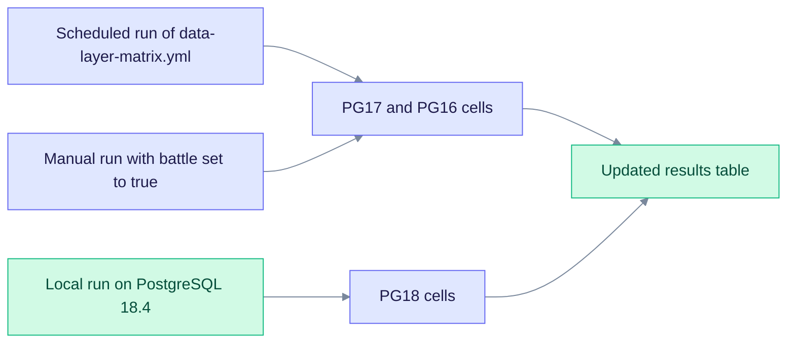

# Version matrix live results

This page records one run of the data-layer test suites. The PG18 column comes from a local run. The PG17 and PG16 columns were left for CI.

> **Historical record.** These results were captured on **2026-07-25**, on a local PostgreSQL 18.4 database (pgvector 0.8.5, AGE 1.8.0). The code and the migrations have changed since then, so they may not reflect the current code. Re-run the suites for current results.

| Suite | PG18 | PG17 | PG16 |
|---|---|---|---|
| `data_layer_ops_matrix` (235 Ref IDs) | **pass** | pending CI | pending CI |
| `data_layer_scaling` | **pass** | pending CI | pending CI |
| `data_layer_limits` | **pass** | pending CI | pending CI |
| `data_layer_registry` | **pass** (no database needed) | **pass** | **pass** |
| `lint_dataop_xref` | **pass** | **pass** | **pass** |

## How the cells are filled

The PG18 cells come from the local run above. The PG17 and PG16 cells marked "pending CI" are filled by the scheduled run of `.github/workflows/data-layer-matrix.yml`, or by starting that workflow with the `battle` input set to `true`.

For the version pins and per-operation status, see [version-matrix.md](./version-matrix.md). To run the suites yourself, see the commands in [README.md](./README.md#ref-ids-and-tests).
