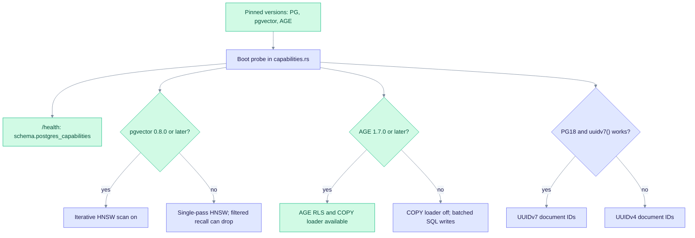

# Version matrix (PG16, PG17, PG18)

EdgeQuake runs the same SQL on PostgreSQL 16, 17, and 18. This page shows the version pins, which features need which version, how each registered operation is tracked, and where the version decisions are recorded.

## Versions

Source of truth: `edgequake/docker/extension-pins.sh`. The default image uses PostgreSQL 18.

| Profile | PostgreSQL | pgvector | Apache AGE | Image tag (GHCR) | Local build file |
|---|---|---|---|---|---|
| pg18 (default) | 18 | 0.8.5 | 1.8.0 | `latest` | `edgequake/docker/Dockerfile.postgres.pg18` |
| pg17 | 17 | 0.8.5 | 1.7.0 | `latest-pg17` | `edgequake/docker/Dockerfile.postgres.pg17` |
| pg16 (legacy) | 16 | 0.8.5 | 1.6.0 | `latest-pg16` | `edgequake/docker/Dockerfile.postgres` |

Extensions in every image: `vector`, `age`, `pg_trgm`, `btree_gin`, and `uuid-ossp`. An optional PG18 image with vectorscale (DiskANN) is built from `edgequake/docker/Dockerfile.postgres.pg18-vectorscale`.

## How the code handles versions

The code does not switch on the PostgreSQL version string. At boot it probes each capability it needs and falls back when a probe fails. The results appear on `/health` under `schema.postgres_capabilities`.

| Capability | Needs |
|---|---|
| Iterative HNSW scan for filtered search | pgvector 0.8.0 or later |
| AGE row-level security and COPY loader | AGE 1.7.0 or later (PG17 and PG18) |
| `uuidv7()` document IDs | PostgreSQL 18 |
| AGE jsonb to agtype cast probe | AGE 1.8.0-rc0 or later |

## Decisions

- [pg17-differential.md](./pg17-differential.md): no PG17-specific SQL. Closed.
- [pg18-adoption.md](./pg18-adoption.md): which PG18 features are used through probes, and which are deferred.

## Test coverage

Four workflows run the matrix: `.github/workflows/data-layer-matrix.yml`, `.github/workflows/postgres-matrix-nightly.yml`, `.github/workflows/spec091-data-layer.yml` (pull request smoke test), and `.github/workflows/postgres-integration.yml`. One captured run is recorded in [version-matrix-results.md](./version-matrix-results.md).

## Per-operation status

Each of the 235 registered operations has a status for each PostgreSQL version.

| Status | Meaning |
|---|---|
| `artifact` | A plan-shape contract is recorded in [rm4-explain-hot-paths.md](../../specs/091-simplify-data-layer/measurements/rm4-explain-hot-paths.md) (SPEC-091 RM4, 2026-07-31). |
| `pending` | No checked-in `EXPLAIN ANALYZE` exists yet. The CI recall fixtures are the executable gate. Runs at 100k rows or more are deferred to soak tests. |

Current counts: 3 operations are `artifact` on all three versions, and 232 are `pending` on all three versions.

### Hot-path operations with a recorded plan

| Ref number | Operation | Status | Note |
|---|---|---|---|
| 001 | `DATA-PGVEC-VECTORS-ANN-QUERY-001` | artifact | ANN query. Typed HNSW; iterative scan (pgvector 0.8 or later); PG18 async I/O is optional. |
| 002 | `DATA-PGVEC-VECTORS-ANN-QUERY-FILTERED-002` | artifact | Filtered ANN query. HNSW with `relaxed_order` and a workspace filter. |
| 003 | `DATA-PG-VECTORS-TEXT-SEARCH-FILTERED-003` | artifact | Filtered keyword search. Uses `idx_chunks_content_tsv` (migration 136). |

### Version notes on the other operations

Numbers are Ref ID suffixes. Find each entry in [postgres.md](./postgres.md), [pgvector.md](./pgvector.md), or [age.md](./age.md).

| Note | Ref numbers |
|---|---|
| PG18 skip scan may use more composite btrees. | 009 to 013, 075 to 078, 081 to 089, 094, 098, 105 to 106, 111, 114, 117, 120, 122, 124, 126, 132, 136 to 139, 143 to 144, 146 to 147, 150, 152 to 153, 156, 159 to 160, 163 to 165, 168, 172 to 175, 178, 181 to 182, 191, 193, 199 to 200, 202, 204, 210 to 212, 224 |
| pgvector 0.8 iterative scan applies. PG18 async I/O may cut heap-fetch latency. | 004, 017 to 020, 022, 024 |
| AGE 1.7 and later add automatic ID indexes. A unique index on the `node_id` property is still required. | 025 to 074, 157 |
| No version note. | 005 to 008, 014 to 016, 021, 023, 079 to 080, 090 to 093, 095 to 097, 099 to 104, 107 to 110, 112 to 113, 115 to 116, 118 to 119, 121, 123, 125, 127 to 131, 133 to 135, 140 to 142, 145, 148 to 149, 151, 154 to 155, 158, 161 to 162, 166 to 167, 169 to 171, 176 to 177, 179 to 180, 183 to 190, 192, 194 to 198, 201, 203, 205 to 209, 213 to 223, 225 to 235 |
