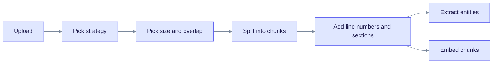
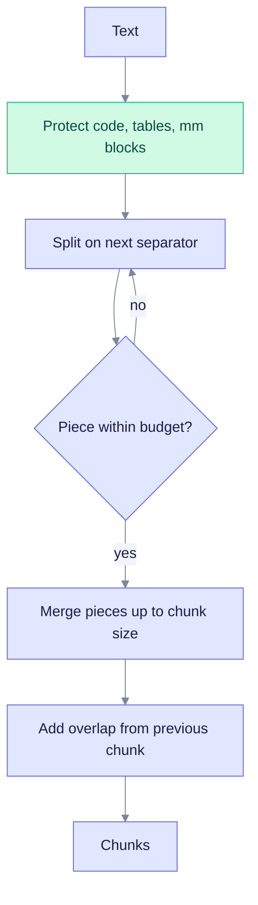
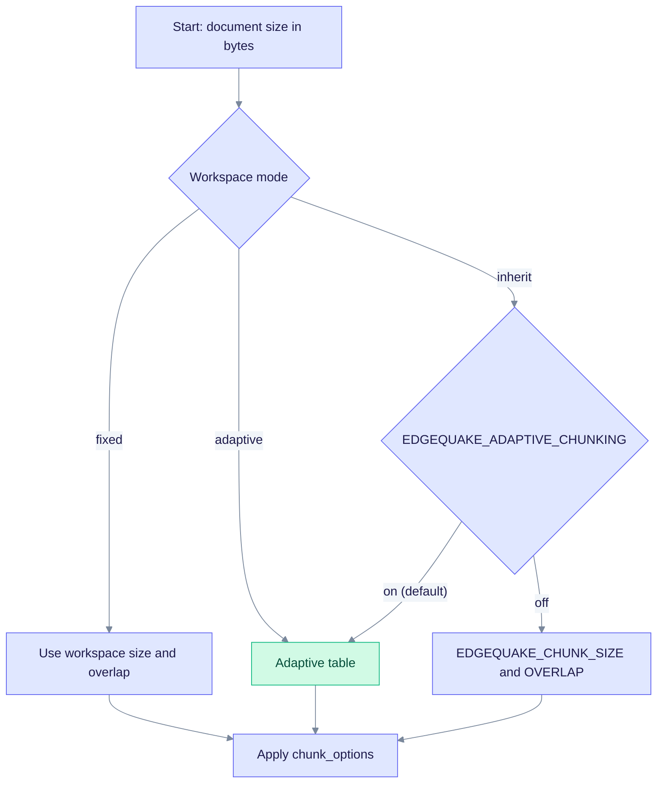

> **Product: v0.32.2** · Contract: OpenAPI · Spec ops: [Ingestion cancel & fairness](../ingestion-cancel-and-fairness.md)

# Deep Dive: Chunking Strategies

**What this page explains:** how EdgeQuake cuts a document into chunks, which strategy and size it picks, and how you override them.
**Who it is for:** operators tuning ingestion and developers working on `edgequake-pipeline`.
**Read first:** [LightRAG Algorithm](lightrag-algorithm.md) (where chunking fits in the pipeline).

A **chunk** is a slice of a document, sized in tokens. A **token** is the unit an LLM reads, roughly three-quarters of an English word. Chunks are the unit that EdgeQuake embeds, searches, and sends to the LLM for entity extraction.

## Why chunk at all

A whole document is too big for three jobs:

- The LLM extracts entities from a limited context window.
- Embedding models accept a limited input size (for example 2048 tokens for `embeddinggemma`).
- Retrieval is more precise when each vector covers one topic.

All chunking code lives in `edgequake/crates/edgequake-pipeline/src/chunker/`.

## Where chunking sits

Chunking is the first step after text extraction. The flowchart shows the path from an upload to chunks that are ready for extraction and embedding.



Read it left to right: the strategy and the size are chosen separately, and every chunk goes to both extraction and embedding.

## The five strategies

The enum `ChunkStrategy` in `chunker/registry.rs` defines what you can request. Pass it as `chunk_strategy` on upload.

| API value | Aliases | Code type | What it does |
| --- | --- | --- | --- |
| `recursive` | `r` | `RecursiveCharacterChunking` | **Default.** Tries a list of separators from coarse to fine. Matches LightRAG strategy `R`. |
| `fixed` | `f` | `TokenBasedChunking` | Sliding window of a fixed token size with overlap. Matches LightRAG `F`. |
| `markdown` | `md`, `p` | `MarkdownChunking` | Splits at headings, packs sibling sections up to the token budget, and keeps a heading path. |
| `pdf` | none | `PageAwareChunking` | Splits at page markers first, then packs each page with the markdown packer. |
| `semantic` | `v`, `semantic_vector` | `SemanticChunking` | Cuts where the meaning changes, using embeddings. Opt-in. |

If you do not set a strategy, `ChunkStrategy::resolve_for_upload` chooses one from the file:

- `.md`, `.markdown`, or a markdown MIME type gives `markdown`.
- `.pdf` or a PDF MIME type gives `pdf`.
- Anything else gives `recursive`.

The code also contains `SentenceBoundaryChunking`, `ParagraphBoundaryChunking`, and `CharacterBasedChunking`. They are library building blocks. The upload API cannot select them because `ChunkStrategy::parse` accepts only the five values above.

### Recursive (default)

The recursive splitter walks a separator list. It splits on the first separator, then re-splits any piece that is still too large with the next separator. The default list is `default_recursive_separators()`:

| Priority | Separator |
| --- | --- |
| 1 | paragraph break (`\n\n`) |
| 2 | line break (`\n`) |
| 3 to 6 | CJK sentence and clause marks (`。` `！` `？` `；`) |
| 7 | CJK comma (`，`) |
| 8 | space |
| 9 | empty string (split anywhere) |

Fenced code blocks, pipe tables, and multimodal blocks such as `[Table Name]` are kept whole. The helper `split_preserving_atomic_regions` in `atomic_blocks.rs` does this, so a table row never separates from its header.



Read it top to bottom: oversize pieces loop back to a finer separator until every piece fits.

### Markdown

`MarkdownChunking` treats headings as preferred cut points, not forced ones (SPEC-125). Small sibling sections are packed together up to the token budget. When a section must continue in a new chunk, the chunk repeats the heading path. Oversized tables repeat their header row. Each chunk carries `SectionMetadata` with `heading_path` and `heading_level`.

Set `EDGEQUAKE_MARKDOWN_PACK=0` to return to one chunk per heading. The flag is on by default; `0`, `false`, `off`, and `no` turn it off.

### PDF (page-aware)

PDF conversion writes a marker line before each page: `<!-- edgequake-page:N -->`. `PageAwareChunking` splits on those markers and packs inside each page, so each chunk knows its `page_start` and `page_end`. Citations use `page_start` for deep links.

A short tail left at the end of page N may merge with the start of page N+1 if both fit the budget (SPEC-135). The merged chunk then has `page_end` greater than `page_start`.

| Flag | Default | Effect when set to `0` |
| --- | --- | --- |
| `EDGEQUAKE_PDF_PACK` | on | Inner splitter becomes Recursive instead of the markdown packer. |
| `EDGEQUAKE_PDF_CROSS_PAGE_PACK` | on | Chunks never span pages (`page_start == page_end`). |

See [PDF Processing](pdf-processing.md) for how the markers are produced.

### Semantic

Semantic chunking runs only when you request it, and it needs an embedding provider. Without one, the chunk step fails. Set `EDGEQUAKE_SEMANTIC_ALLOW_FALLBACK=true` to fall back to Recursive instead. Use that flag only for emergency recovery.

```mermaid
%%{init: {"theme":"base","themeVariables":{"primaryColor":"#E0E7FF","primaryBorderColor":"#6366F1","primaryTextColor":"#1E1B4B","secondaryColor":"#D1FAE5","secondaryBorderColor":"#10B981","secondaryTextColor":"#064E3B","tertiaryColor":"#FEF3C7","tertiaryBorderColor":"#F59E0B","tertiaryTextColor":"#6B7A90","lineColor":"#7A889C","clusterBkg":"rgba(99,102,241,0.07)","clusterBorder":"#A5B4FC","noteBkgColor":"#FEF9C3","noteTextColor":"#422006","textColor":"#6B7A90","titleColor":"#6B7A90","signalColor":"#7A889C","signalTextColor":"#6B7A90","loopTextColor":"#6B7A90","edgeLabelBackground":"#F1F5F9","actorLineColor":"#94A3B8"}}}%%
%% eq-theme:v1
flowchart LR
    A["Split into sentences"] --> B["Embed each sentence window"]
    B --> C["Cosine distance between neighbours"]
    C --> D["Find breakpoints above threshold"]
    D --> E["Hard-split oversize groups"]
```



Read it left to right: a break goes where two neighbouring sentences are least alike.

| Setting | Env var | Default |
| --- | --- | --- |
| Threshold type | `EDGEQUAKE_SEMANTIC_BREAKPOINT` | percentile (`std` and `iqr` also work) |
| Threshold amount | `EDGEQUAKE_SEMANTIC_BREAKPOINT_AMOUNT` | 95 |
| Neighbour sentences per window | `EDGEQUAKE_SEMANTIC_BUFFER_SIZE` | 1 (clamped to 0-5) |

## Choosing chunk size

Size and overlap come from three layers. The most specific layer wins (LAW-116-2).

1. **Per document:** `chunk_options` on the upload.
2. **Per workspace:** workspace metadata `chunking_mode` (`inherit`, `adaptive`, or `fixed`) with optional `chunk_token_size` and `chunk_overlap_token_size`.
3. **Fleet environment:** the variables below.



Read it top to bottom: the workspace mode decides the base size, then per-document options override it.

**Adaptive sizing** (the default) picks a size from the document's byte length. It follows LightRAG's empirical thresholds (`adaptive_chunking.rs`):

| Document size | Chunk size (tokens) | Overlap (tokens) |
| --- | --- | --- |
| 50 KB or less | 1200 | 99 |
| 50 KB to 100 KB | 800 | 66 |
| over 100 KB | 600 | 49 |

Overlap is 8.3 percent of the size, rounded down. With adaptive sizing, any strategy except `fixed` gets a floor of 800 tokens for documents of 50 KB or less.

**Fixed sizing** uses `EDGEQUAKE_CHUNK_SIZE` (default 1200) and `EDGEQUAKE_CHUNK_OVERLAP` (default 100). Overlap must be smaller than size. A workspace `fixed` policy that breaks this rule falls back to 1200/100.

`ChunkerConfig::default()` itself uses `chunk_size: 800`, `chunk_overlap: 100`, `min_chunk_size: 100`. The 800 is deliberately smaller than the 1200 paper default. Dense text such as tables or formulas can use two to three times more real tokens than the estimate, and 800 keeps chunks under a 2048-token embedding limit. The value 1200 is used only through the fixed and adaptive paths above.

### Override per document

Send `chunk_options` as a JSON string field in the multipart file upload, or as an object in the text upload body. Invalid JSON is ignored silently:

```json
{ "chunk_token_size": 1500, "chunk_overlap_token_size": 150, "separators": ["\n\n", "\n", " "] }
```

The aliases `chunk_size`, `chunk_overlap`, and `chunk_overlap_size` are also accepted. Validation allows at most 16 separators of at most 8 characters each.

## Overlap

Overlap repeats the end of one chunk at the start of the next. An entity or pronoun that sits on a boundary then appears whole in at least one chunk.

With the default 1,200-token chunks, 100 tokens of overlap adds about 8 percent more text. Raise the overlap if answers lose context at boundaries.

## What every chunk records

`TextChunk` (`chunker/types.rs`) holds:

| Field | Meaning |
| --- | --- |
| `id` | Built from the document ID and chunk index (`kv_keys::doc_chunk`). |
| `content` | The chunk text. |
| `index` | Position in the document. |
| `start_offset`, `end_offset` | Byte offsets in the source text. |
| `start_line`, `end_line` | 1-based line numbers, used for citations. |
| `token_count` | Token count of the chunk. |
| `section` | Heading path and level (markdown chunks). |
| `page_start`, `page_end` | PDF page span. |
| `modality` | `chart`, `figure`, `table`, or `equation` for multimodal chunks. |
| `embedding` | Filled after the embedding step. |

## How tokens are counted

`token_estimator::count_tokens` is the single token counter. It uses the `cl100k_base` tokenizer from `tiktoken-rs`. Only if the tokenizer fails to start does the code fall back to "characters divided by 4". The recursive splitter uses its own word-based length (about 1.5 characters per token for CJK text) so it matches LightRAG.

## Add your own strategy

Implement the `ChunkingStrategy` trait and pass it to `Chunker::with_strategy`:

```rust
#[async_trait]
pub trait ChunkingStrategy: Send + Sync {
    async fn chunk(&self, content: &str, config: &ChunkerConfig) -> Result<Vec<ChunkResult>>;
    fn name(&self) -> &str;
}
```

`ChunkResult` carries `content`, `tokens`, `chunk_order_index`, and optional `section`, offsets, and page span.

## Troubleshooting

| Symptom | Likely cause | Fix |
| --- | --- | --- |
| Embedding request fails with a context-length error | Dense text; chunks too large for the embedding model | Lower `chunk_token_size` (try 600). |
| Answers miss facts at boundaries | Overlap too small | Raise overlap, keeping it below the size. |
| Many tiny chunks | Many short paragraphs | Use `markdown` or raise `min_chunk_size` through the library config. |

## See also

- [Embedding Models](embedding-models.md): how chunks become vectors.
- [Entity Extraction](entity-extraction.md): what happens to each chunk next.
- [PDF Processing](pdf-processing.md): where page markers come from.
