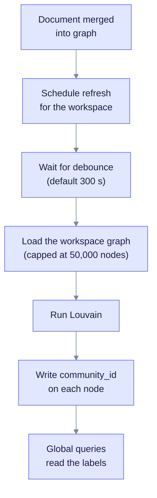
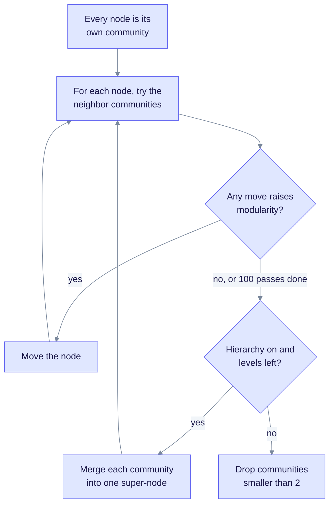
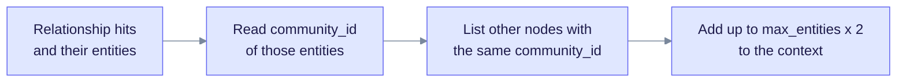

> **Product: v0.32.2** · Contract: OpenAPI · Spec ops: [Ingestion cancel & fairness](../ingestion-cancel-and-fairness.md)

# Deep Dive: Community Detection

**What this page explains:** how EdgeQuake finds clusters of tightly connected entities, stores a `community_id` on each node, and uses it in global queries.
**Who it is for:** operators sizing large graphs and developers working on `edgequake-storage` or global retrieval.
**What you should know first:** the graph holds entities (nodes) and relationships (edges). See [Graph Storage](graph-storage.md).

A **community** is a group of entities that link to each other more than to the rest of the graph. For example, all the people and projects of one research lab.

The code is in `edgequake/crates/edgequake-storage/src/`: `community.rs` (algorithms), `community_persist.rs` (writing labels), `community_index_service.rs` (when to refresh) and `community_reports.rs` (optional summaries).

## What communities are used for

| Use | Where |
| --- | --- |
| Expand **global** queries with entities from the same community | [Query Modes, global mode](query-modes.md#6-global-mode) |
| Group nodes in the graph viewer (`GET /api/v1/graph/communities`) | Web UI and API |
| Optional short "community report" vectors for thematic questions | Off by default |

Communities do not change how documents are indexed. They are a **read model** that can be rebuilt from the graph at any time.

## The lifecycle

The diagram shows how labels are kept fresh. Read it top to bottom; the work runs in the background and never blocks the upload.

Key points:

- **Trigger.** After a document merges into the graph, the pipeline starts a background task that schedules a refresh for that workspace. A failure is logged and does not fail the upload.
- **Debounce.** Several uploads in a row share one refresh. The wait is `EDGEQUAKE_COMMUNITY_REFRESH_DEBOUNCE_SECS` (default 300).
- **Safety.** One refresh runs at a time per workspace. A database advisory lock stops two server replicas from running the same refresh.
- **Scope.** Detection always runs for one workspace. Unscoped detection on the shared graph is rejected.
- **Backfill.** On startup, graphs created before communities existed get labels once (migration 044). It is skipped for any workspace above the size limit, and it only touches workspaces whose nodes carry a UUID `workspace_id`.
- **No REST trigger.** No HTTP route starts detection. `GET /api/v1/graph/communities` only reads the stored labels.

## The three algorithms

`CommunityAlgorithm` has three values. Ingestion always uses the default, Louvain.

| Algorithm | Idea | Notes |
| --- | --- | --- |
| **Louvain** (default) | Move each node to the neighbor community that raises *modularity* the most. Repeat until nothing improves. | Edge `weight` is used (default 1.0). Best quality of the three. |
| **Label propagation** | Each node adopts the most common label among its neighbors. | Fast, simple, and less precise than Louvain. |
| **Connected components** | Each separate piece of the graph is one community. | Baseline. Finds isolated sub-graphs only. |

**Modularity** is a score for a partition. It compares the weight of edges inside communities with what a random graph would give. Higher is better. EdgeQuake computes and returns it with every result.

### Louvain step by step

The diagram shows the loop. Read it from the top: the inner loop is "try moves until stable"; the outer loop (hierarchy) is optional.

Defaults from `CommunityConfig`:

| Setting | Default | Meaning |
| --- | --- | --- |
| `min_community_size` | 2 | Smaller groups get **no** label. A node with no neighbors has no `community_id`. |
| `max_iterations` | 100 | Cap on passes in the inner loop. |
| `resolution` | 1.0 | Higher gives more, smaller communities. Lower gives fewer, larger ones. |
| `max_nodes` | 50,000 | Hard cap on nodes loaded (`EDGEQUAKE_COMMUNITY_MAX_NODES`, range 100 to 5,000,000). |
| `enable_hierarchy` | off | `EDGEQUAKE_LOUVAIN_HIERARCHY=1` turns on the merge-and-repeat levels. |
| `max_hierarchy_levels` | 3 | Used only when hierarchy is on. |

Only the final partition is stored. With hierarchy on, the stored `community_id` is the one from the last level that ran.

### Size limits

The graph is loaded in pages of up to 2,000 nodes. If the workspace has more than `max_nodes` nodes, only the first `max_nodes` are used and a warning is logged ("sampled subgraph"). The startup backfill is stricter: a workspace above `EDGEQUAKE_COMMUNITY_BACKFILL_MAX_NODES` (default 50,000) is skipped. The API helper `detect_communities_guarded` also asks the resource guard first and rejects graphs over the scan threshold.

## What gets stored

Detection writes properties onto existing graph nodes:

| Property | Written when | Meaning |
| --- | --- | --- |
| `community_id` | Always | Integer id of the community (per workspace run) |
| `community_report` | Only if `EDGEQUAKE_COMMUNITY_REPORTS=true` | A one-line member list |

Community ids are plain integers renumbered from 0 on every run. They are **not stable** between runs. Do not store them outside the graph.

### Optional reports

With `EDGEQUAKE_COMMUNITY_REPORTS=true` (default off), each refresh also builds a short text per community and embeds it as a `community_report` vector. The text is built **without an LLM** from the first 24 member names, for example: `Community 7 (31 entities): A, B, C, and 28 more.` Global queries can add the best matching reports as extra context (at most 8). This is a light hint, not the LLM-written summaries used by Microsoft GraphRAG.

## How global queries use communities

The diagram shows the lookup at query time. No clustering runs during a query; the labels are read from the graph.

Global mode first finds relationships by vector search. Then, if community expansion is on, it collects the `community_id` values of those entities and adds more members of the same communities. Switch it off with `EDGEQUAKE_COMMUNITY_GLOBAL=false`. That switch also stops index-time refresh and the startup backfill.

## Settings summary

| Variable | Default | Effect |
| --- | --- | --- |
| `EDGEQUAKE_COMMUNITY_GLOBAL` | on | Master switch for labels, refresh, backfill and query expansion |
| `EDGEQUAKE_COMMUNITY_REFRESH_DEBOUNCE_SECS` | 300 | Wait before a refresh |
| `EDGEQUAKE_COMMUNITY_MAX_NODES` | 50,000 | Nodes loaded per detection |
| `EDGEQUAKE_COMMUNITY_BACKFILL_MAX_NODES` | 50,000 | Largest workspace the startup backfill will process |
| `EDGEQUAKE_LOUVAIN_HIERARCHY` | off | Multi-level Louvain |
| `EDGEQUAKE_COMMUNITY_REPORTS` | off | Build and embed member-list reports |

## Troubleshooting

| Symptom | Likely cause | What to do |
| --- | --- | --- |
| Global answers never include community neighbors | Labels missing: master switch off, graph still within the debounce window, or entities are isolated | Check `EDGEQUAKE_COMMUNITY_GLOBAL`; wait for the debounce; check `GET /api/v1/graph/communities` |
| One giant community | `resolution` too low or a hub node connects everything | Raise the resolution in code. It is not exposed as an environment variable. |
| Log says "sampled subgraph" | Workspace has more nodes than `max_nodes` | Raise `EDGEQUAKE_COMMUNITY_MAX_NODES` if the server has memory for it |
| Many nodes without `community_id` | They have no neighbors, or sit in groups smaller than 2 | Expected |

## Related pages

- [Query Modes](query-modes.md): where global mode uses communities.
- [Graph Storage](graph-storage.md): the node and edge model.
- [Data Layer](data-layer.md): where labels and vectors live.
