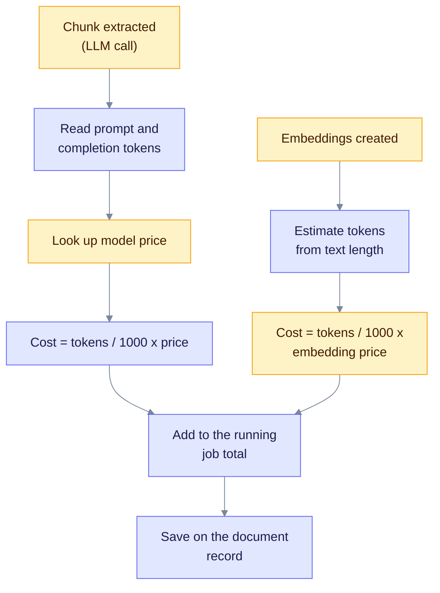

> **Product: v0.32.2** · Contract: OpenAPI · Spec ops: [Ingestion cancel & fairness](../ingestion-cancel-and-fairness.md)

# Deep Dive: Cost Tracking

**What this page explains:** how EdgeQuake computes the dollar cost of ingesting a document, how that cost reaches the API, and how far you can trust it.
**Who it is for:** operators who watch spend and developers who work on the cost endpoints.
**What you should know first:** an LLM call has input tokens and output tokens, priced per 1,000 tokens.

**Short version.** EdgeQuake multiplies token counts by a built-in price table. The result is an **estimate**, not a bill. Only **ingestion** is costed (entity extraction, gleaning and embeddings). Query and chat answers are not part of the `/costs/*` totals. Base URL for the examples is `http://localhost:8080/api/v1`.

## How a cost is computed



The diagram shows two cost sources that feed one job total. Read it top to bottom; the left branch is the LLM, the right branch is the embedding model.

### Extraction cost

- The LLM response reports prompt and completion tokens. The pipeline sums them per chunk.
- Gleaning passes add their tokens to the same chunk total (see [Gleaning](gleaning.md)), so gleaning cost is included but **not reported separately**.
- The price comes from the model name, using the table in `edgequake-pipeline/src/progress/cost.rs`.
- Progress events carry `chunk_cost_usd` and `cumulative_cost_usd`, so a UI can show cost as the job runs.

### Embedding cost

Embedding providers do not always report tokens, so EdgeQuake **estimates** them: characters divided by 2.5, rounded up, summed over the chunk, entity and relationship texts sent for embedding. The price is the embedding model's entry in the table, or `text-embedding-3-small` ($0.00002 per 1K tokens) when the model is not listed. The estimate is deliberately on the high side.

### Where it is stored

At the end of ingestion the document record keeps `cost_usd`, `input_tokens` and `output_tokens`. The progress and document-detail endpoints read them from there.

## Price table

`default_model_pricing()` holds prices in USD per 1,000 tokens. `GET /pipeline/costs/pricing` returns the live table. Do not copy numbers from this page; check the endpoint or the source.

Groups in the table:

| Group | Examples |
| --- | --- |
| OpenAI chat | `gpt-4.1-nano`, `gpt-4.1-mini`, `gpt-4.1`, `gpt-4o`, `gpt-4o-mini`, `o4-mini`, `gpt-4-turbo`, `gpt-3.5-turbo` |
| Anthropic | `claude-opus-4-6`, `claude-sonnet-4-5-20250929`, `claude-haiku-4-5-20251001`, plus three `claude-3-*` aliases |
| Google | `gemini-2.5-pro`, `gemini-2.5-flash`, `gemini-2.5-flash-lite`, `gemini-2.0-flash` |
| xAI | `grok-4-1-fast`, `grok-4-0709`, `grok-3`, `grok-3-mini` |
| Embeddings | `text-embedding-3-small`, `text-embedding-3-large`, `gemini-embedding-001` |

Model names must match exactly. A model that is not in the table is priced with a fallback, which matters for local models (next section).

### Unknown and local models

| Case | Price used |
| --- | --- |
| Model in the table | Its table price |
| Decision-extraction backend (provider name starts with `decision:`) | $0, because it runs on your hardware |
| Any other model, **including local Ollama and LM Studio models** | Fallback estimate: `gpt-4.1-nano` priced at $0.00015 input and $0.0006 output per 1K tokens |

So a job on a local model shows a **non-zero** estimated cost. Treat it as "what a small cloud model would have cost", not as money spent. This replaces the old claim that local providers report $0.00.

## API endpoints

| Method | Path | What it returns |
| --- | --- | --- |
| `GET` | `/pipeline/costs/pricing` | The price table |
| `POST` | `/pipeline/costs/estimate` | Cost for a model and token counts you supply |
| `GET` | `/costs/summary` | Workspace totals |
| `GET` | `/costs/history` | Totals per period |
| `GET` | `/costs/budget` | Budget status (placeholder, see below) |
| `PATCH` | `/costs/budget` | Accepts a budget (does not save it, see below) |

```bash
# Price table
curl "http://localhost:8080/api/v1/pipeline/costs/pricing"

# Estimate: 5,000 input and 2,000 output tokens on gpt-4o
curl -X POST "http://localhost:8080/api/v1/pipeline/costs/estimate" \
  -H "Content-Type: application/json" \
  -d '{"model": "gpt-4o", "input_tokens": 5000, "output_tokens": 2000}'

# Workspace summary (needs tenant and workspace headers)
curl "http://localhost:8080/api/v1/costs/summary" \
  -H "X-Tenant-ID: {tenant_id}" -H "X-Workspace-ID: {workspace_id}"
```

### Summary and history

Both endpoints read the document records of the caller's workspace.

- Only documents with status `completed` or `indexed` count.
- Without a full tenant and workspace context the summary is empty and the history is `[]`.
- `summary` returns `total_cost`, `document_count`, `total_tokens`, `average_cost_per_document` and a `by_operation` list.
- `history` takes `start_date`, `end_date` and `granularity` (`hour`, `day`, `week`, `month`; default `day`). Documents are grouped by `processed_at` (or `created_at`).

**Read `by_operation` with care.** The list has two rows, `extraction` and `embedding`. The split is a **fixed 90 percent and 10 percent** of each document's total cost. It is not measured. The real embedding cost is saved only inside the total. Use the progress endpoint for exact per-job numbers.

### Budget endpoints are placeholders

In this version `GET /costs/budget` always returns the same fixed object (monthly budget $100, spent $0, alert threshold 80). `PATCH /costs/budget` checks for tenant context and then echoes your body back without saving it. Nothing enforces a budget or sends an alert. Do not build on these two endpoints yet.

## Following the cost of one upload

Uploads return a task or track id. Poll the ingestion progress endpoint to see cost while the job runs.

```bash
# Upload a PDF
curl -X POST "http://localhost:8080/api/v1/documents/pdf" \
  -H "X-Workspace-ID: {workspace_id}" \
  -F "file=@document.pdf"

# Progress, including cost_usd when known
curl "http://localhost:8080/api/v1/ingestion/{track_id}/progress" \
  -H "X-Workspace-ID: {workspace_id}"
```

Text and file uploads use `POST /documents/upload`. See [Pipeline Progress](pipeline-progress.md) for the full progress payload and the WebSocket events that carry token and cost counts.

## Ways to lower the cost

1. **Pick a cheaper extraction model.** Extraction is most of the spend because every chunk is sent to the LLM.
2. **Turn gleaning down or off.** Each extra pass is another LLM call per chunk. See [Gleaning](gleaning.md#defaults-and-limits).
3. **Use a local embedding model.** Set `EDGEQUAKE_EMBEDDING_PROVIDER=ollama` to keep embeddings on your machine while the LLM stays in the cloud. See [Embedding Models](embedding-models.md).
4. **Use bigger chunks where safe.** Fewer chunks means fewer calls. See [Chunking Strategies](chunking-strategies.md).
5. **Keep the answer and keyword caches on.** They cut query-side LLM calls. See [Query Modes](query-modes.md#10-caching).

EdgeQuake does not publish a cost-per-megabyte figure. Costs depend on the model, the chunk size, the entity density and gleaning. Run a sample of your own documents and read `cost_usd`.

## Known gaps

- Budgets are not stored or enforced (placeholder endpoints).
- `by_operation` uses a fixed 90/10 split.
- Query and chat costs are not tracked by the `/costs/*` endpoints.
- Unknown models fall back to a `gpt-4.1-nano` price. The fallback used in the pipeline ($0.00015 and $0.0006) differs from the listed `gpt-4.1-nano` entry ($0.0001 and $0.0004), and the handler source comments mention a `gpt-4o-mini` fallback. The code, not the comment, decides.

## Related pages

- [Pipeline Progress](pipeline-progress.md): where `cost_usd` appears in progress payloads.
- [Entity Extraction](entity-extraction.md): what each LLM call does.
- [REST API reference](../api-reference/rest-api.md): all endpoints.
- [Configuration](../operations/configuration.md): provider and model settings.
