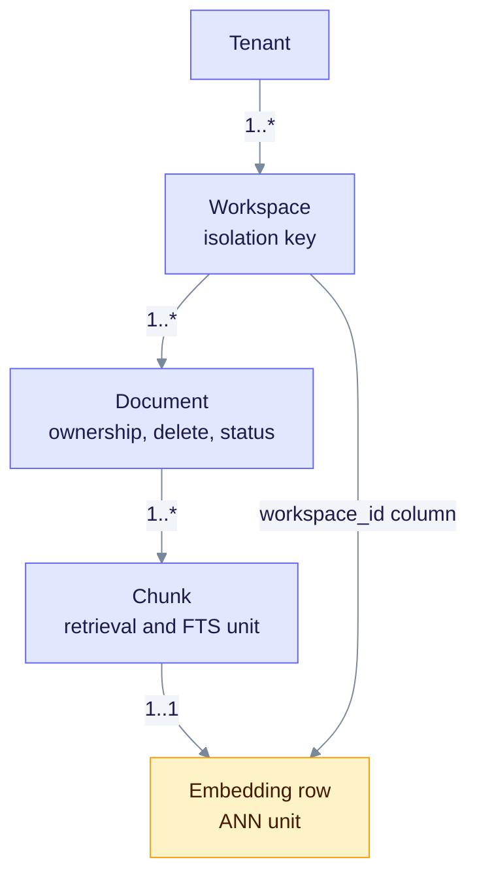
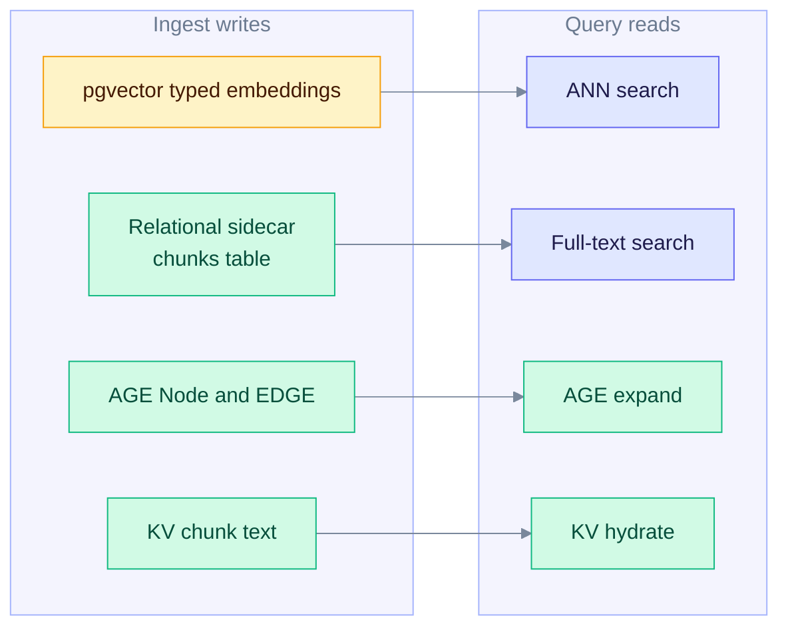
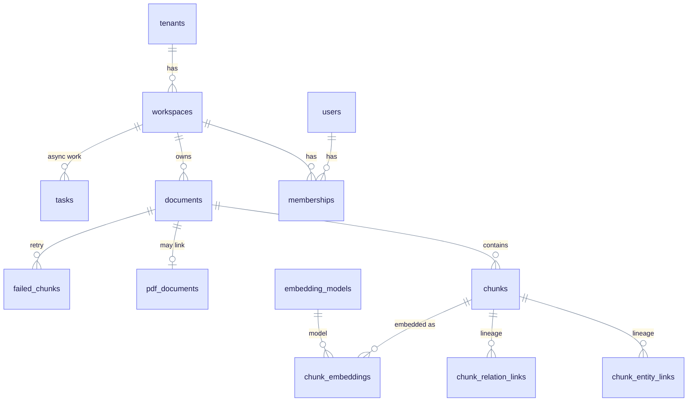
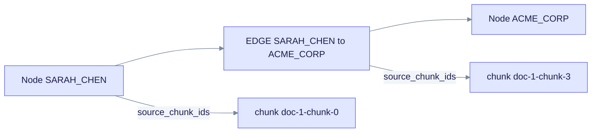
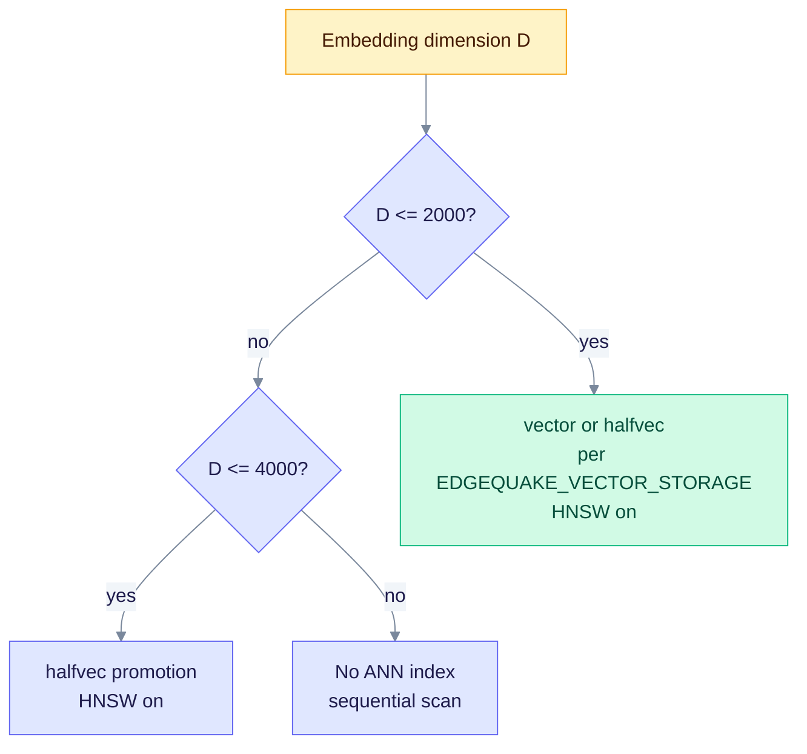
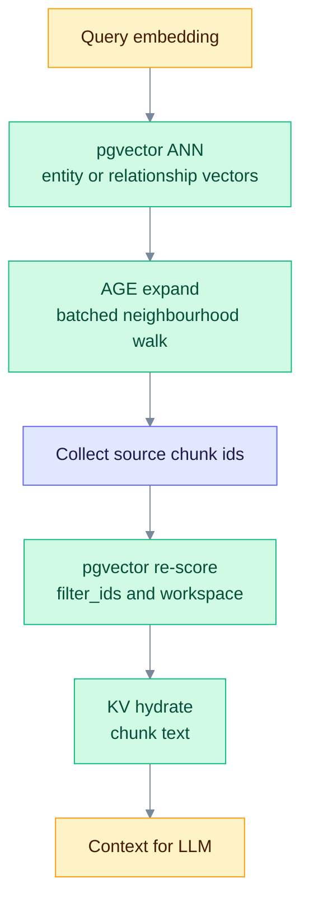
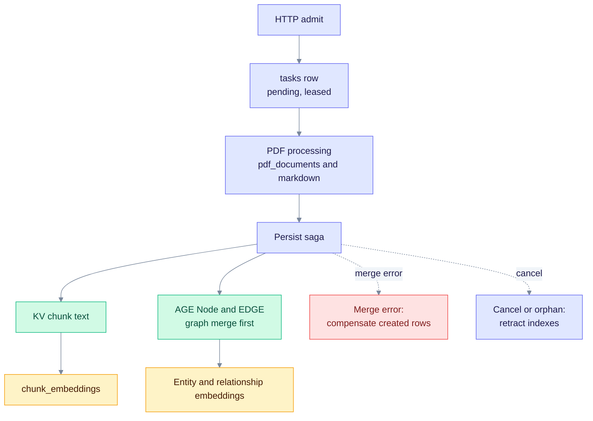

# Data Layer — PostgreSQL, AGE, pgvector, and Text Search

> **Product: v0.32.2** · Contract: [OpenAPI snapshot](../../edgequake_webui/openapi/openapi.snapshot.json) · Spec ops: [Ingestion cancel & fairness](../ingestion-cancel-and-fairness.md)

This page explains where EdgeQuake stores data, how each store is indexed, and which store each query mode reads. It is for operators and contributors who debug storage, tune indexes, or change the schema. The code is the source of truth: physical names and SQL come from the `edgequake-storage` adapters and `edgequake/migrations/`.

**Related:** [Graph Storage](graph-storage.md) · [Vector Storage](vector-storage.md) · [Query Modes](query-modes.md) · [Lineage Tracking](../architecture/lineage-tracking.md) · [Data Flow](../architecture/data-flow.md) · [Product limits](../product-limits.md) · [SPEC-073 relational RAG layout](../../specs/073-relational-rag-layout/000-index.md) · [ADR-073 multi-lens decision](../../specs/073-relational-rag-layout/007-adr-relational-rag-layout.md)

---

## Contents

1. [Mental model](#1-mental-model--three-stores--relational-sidecar)
2. [Physical naming and tenancy](#2-physical-naming-and-tenancy)
3. [PostgreSQL ER (relational)](#3-postgresql-er-schema-relational)
4. [KV store](#4-kv-store-document-text-ssot)
5. [Apache AGE](#5-apache-age-property-graph)
6. [pgvector](#6-pgvector)
7. [Text search](#7-text-search-fts)
8. [Query mode × store matrix](#8-how-information-is-queried)
9. [Ingest write path](#9-write-path-summary-ingest)
10. [Migration and index map](#10-migration--index-map)
11. [Operator SQL cookbook](#11-operator-debugging-cookbook)

---

## 1. Mental model — three stores + relational sidecar

### 1.1 Four units of meaning

Mixing up these units causes integrity and capacity bugs. The details are in [SPEC-073 first principles](../../specs/073-relational-rag-layout/001-first-principles.md).



Each level owns the next one. The embedding row carries `workspace_id`, so ANN searches can filter by workspace in SQL.

### 1.2 Physical stores

By default (`EDGEQUAKE_VECTOR_BACKEND` unset or `typed_embeddings`), embeddings live in typed tables such as `chunk_embeddings`. The legacy `eq_*_vectors` tables are used only for an explicit rollback.

| Store | Tables (default backend) | Role | Source of truth? |
| ----- | ------------------------ | ---- | ---------------- |
| **KV** | `public.eq_<prefix>_kv` (`public.eq_eq_default_kv` for namespace `default`) | Document metadata and chunk text (JSONB) | Yes, for chunk text |
| **AGE** | Graph `eq_<prefix>_graph` (`eq_eq_default_graph`), labels `Node` and `EDGE` | Entities and relationships | Yes, for the graph |
| **pgvector (typed)** | `chunk_embeddings`, `entity_embeddings`, `relationship_embeddings`, `report_embeddings` | Embeddings and ANN indexes | Yes, for vectors |
| **Relational** | `documents`, `chunks`, `pdf_documents`, `tasks`, lineage tables, CQRS `entities` and `relationships` | Ownership, ops state, analytics | Sidecar |



*Notice that no single arm reads every store: each query path reads the subset it needs, so a broken store affects only the paths that use it.*

All stores live in one PostgreSQL instance, which keeps latency low and the operations surface small. This is **not** a single transaction across KV, pgvector and AGE. Ingest is a best-effort saga: persist, merge, then compensate on failure.

**Do not treat `public.documents` and `public.chunks` as the whole RAG corpus.** Ingest writes KV, AGE and vectors. The relational tables add PDF linkage, lineage and CQRS read models. The CQRS `entities` and `relationships` tables are optional mirrors, controlled by `entity_sync_mode` (see [section 3](#3-postgresql-er-schema-relational)).

### 1.3 Integrity rules (SPEC-058 / SPEC-059)

- **Compensation** deletes only the vectors that the current write created. Creation is detected atomically with `upsert_report_created` (`RETURNING (xmax = 0)`), not with a pre-check.
- **Cancel and orphan failures** retract indexes on every surface. The boot orphan janitor does this when `EDGEQUAKE_ORPHAN_RETRACT_ON_RECOVER` is on (default). Checklist: [SPEC-074](../../specs/074-storage-p0-hardening/001-retract-checklist.md).
- **Native AGE upsert** merges `source_ids` and `source_chunk_ids` through `eq_merge_graph_properties` instead of overwriting the whole property map.
- **Native graph writes** are on by default (`EDGEQUAKE_NATIVE_GRAPH_WRITES`). Setting it to `0`, `false`, `off` or `no` falls back to Cypher MERGE loops. Compensation uses `delete_nodes_batch`.
- **Dimension mismatch on the write path fails closed.** `EDGEQUAKE_ALLOW_VECTOR_TABLE_REBUILD=1` allows a wipe and recreate.

---

## 2. Physical naming and tenancy

### Namespace to table names

The namespace becomes a table prefix. Characters outside `[A-Za-z0-9_]` map to `_`. The helpers in [`config.rs`](../../edgequake/crates/edgequake-storage/src/adapters/postgres/config.rs) add the `eq_` prefix:

| Object | Formula | Example (`namespace = default`) |
| ------ | ------- | ------------------------------- |
| Table prefix | `eq_{prefix}` | `eq_default` |
| KV table | `public.eq_{prefix}_kv` | `public.eq_eq_default_kv` |
| KV stats table | `public.eq_{prefix}_kv_stats` | `public.eq_eq_default_kv_stats` |
| Legacy vectors | `public.eq_{prefix}_vectors` | `public.eq_eq_default_vectors` |
| AGE graph | `eq_{prefix}_graph` | `eq_eq_default_graph` |

API boot uses `.with_namespace("default")` ([`state/postgres.rs`](../../edgequake/crates/edgequake-api/src/state/postgres.rs)).

### Legacy per-workspace vector tables

`WorkspaceVectorConfig` in [`workspace_vector.rs`](../../edgequake/crates/edgequake-storage/src/traits/workspace_vector.rs) names one table per workspace. These tables are not written under the default typed backend.

| Item | Rule | Example |
| ---- | ---- | ------- |
| Full slug (new tables) | Workspace UUID with `-` replaced by `_` | `4e32a055_1b2c_…` |
| Legacy slug (reads) | First 8 characters of the UUID | `4e32a055` |
| Table name | `eq_{namespace}_ws_{slug}_vectors` | `eq_default_ws_4e32a055_1b2c_…_vectors` |

The chunk text for FTS and hydration still comes from the shared default KV table, even when ANN runs on a workspace table (SPEC-024 2.5).

### Isolation

- **Graph:** one AGE graph per namespace. Isolation uses the `workspace_id` and `tenant_id` properties on `Node` and `EDGE`.
- **RLS:** policies call `public.current_tenant_id()` and `public.current_workspace_id()` ([migration 167](../../edgequake/migrations/167_tenant_access_rls.sql)).
- **AGE RLS** is opt-in with `EDGEQUAKE_AGE_RLS` (marker migration 081).

---

## 3. PostgreSQL ER schema (relational)

Relational tables hold ownership, lineage and ops state. Vectors link to chunks through `chunk_embeddings`, not through AGE.



*Notice that `chunk_embeddings` joins a chunk, a model and a workspace. That join is the typed ANN unit.*

### Identity and tenancy

| Table | Purpose | Migrations |
| ----- | ------- | ---------- |
| `tenants`, `workspaces`, `users`, `memberships` | Multi-tenant identity | 001, 008 |
| RLS policies | Tenant and workspace isolation | 009, 096, 167 |

### Content sidecar

| Table | Purpose | Migrations |
| ----- | ------- | ---------- |
| `documents` | Document row: status, hashes, PDF link. Not the only RAG text source | 001 |
| `chunks` | Chunk rows, `content_tsv` for FTS, and lineage columns (`char_*`, `page_*`, `embedding_id`) | 001, 066, 136 |
| `embedding_models` | Model registry: `name`, `dimensions`, cosine metric | 108 |
| `chunk_embeddings` | `halfvec(1536)` per chunk and model, with `workspace_id` | 108, 129 |
| `entity_embeddings`, `relationship_embeddings`, `report_embeddings` | Typed fleet tables with `halfvec(1536)` and HNSW | 130 |

The typed tables use HNSW with `m = 16` and `ef_construction = 128`. Migration 129 builds the chunk index.

### Lineage (M066)

| Table | Primary key | Written by |
| ----- | ----------- | ---------- |
| `chunk_entity_links` | `(chunk_id, entity_name, workspace_id)` | `postgres_lineage_sink` ([`postgres_lineage_sink.rs`](../../edgequake/crates/edgequake-api/src/postgres_lineage_sink.rs)) |
| `chunk_relation_links` | `(chunk_id, source_entity, target_entity, workspace_id)` | `postgres_lineage_sink` |

### CQRS entities (M039)

| Table | Purpose |
| ----- | ------- |
| `entities` | Analytics and FTS read model: generated `tsv` and a GIN index on `source_chunk_ids` |
| `relationships` | Same for edges, plus `sync_status` for the AGE dual-write |

`server_config.entity_sync_mode` defaults to `"disabled"`. AGE stays the graph source of truth until you enable sync.

### PDF and multimodal

| Table | Migration | Role |
| ----- | --------- | ---- |
| `pdf_documents` | 022 | PDF metadata and markdown. Status includes `cancelled` (087) |
| `pdf_document_blobs` | 103 (cutover 105) | PDF bytes, moved out of the main row |
| `document_originals` | 082 | Non-PDF originals |
| `document_mm_assets` | 084, 085 | Page and chart images with a stable `asset_id` |

Rust side: `pdf_storage_impl.rs`, `mm_asset_storage_impl.rs` and `original_storage_impl.rs` in `adapters/postgres/`.

### Async delivery

| Object | Migration | Role |
| ------ | --------- | ---- |
| `tasks` | 002, 088 | Job rows with `lease_owner`, `lease_token` and `lease_expires_at` |
| `edgequake.tasks` view | 031, 089 | Must be refreshed after lease columns are added, or the view hides them |
| `failed_chunks` | 021 | Extraction retry queue |

Claim indexes: `idx_tasks_claimable_pending` and `idx_tasks_stale_processing_lease` (088). Ops details: [Ingestion cancel & fairness](../ingestion-cancel-and-fairness.md).

### Other tables

`conversations`, `messages`, `folders`, `audit_logs`, `server_config` and `workspace_metrics_history` are not on the RAG hot path.

---

## 4. KV store (document text SSOT)

The KV adapter ([`kv.rs`](../../edgequake/crates/edgequake-storage/src/adapters/postgres/kv.rs)) stores JSONB values under a text primary key. It also keeps `eq_{prefix}_kv_stats` for O(1) counts.

All reads and writes must build keys through [`kv_key_schema.rs`](../../edgequake/crates/edgequake-storage/src/kv_key_schema.rs):

| Key pattern | Payload |
| ----------- | ------- |
| `{doc_id}-metadata` | Document metadata JSON |
| `{doc_id}-chunk-{n}` | Chunk JSON: text, offsets, token count |
| `{doc_id}-chunk-` | Prefix for scanning all chunks of a document |
| `wsdoc:{workspace_id}:{document_id}` | Workspace document index |
| `staging:{doc_id}-…` | Admit staging (SPEC-026) |
| `compensation_quarantine:{doc_id}:{entry_id}` | Saga dead-letter entry (SPEC-057) |
| `{hash}-cache`, `{hash}-kwcache` | LLM and keyword caches |

**Hydration:** `batch_fetch_chunk_contents` in [`chunk_content.rs`](../../edgequake/crates/edgequake-storage/src/chunk_content.rs) reads chunk text from the shared default KV table when vector metadata has no content.

---

## 5. Apache AGE (property graph)

AGE stores a labeled property graph inside PostgreSQL. The graph for namespace `default` is `eq_eq_default_graph`. It has two labels: `Node` (vertices) and `EDGE` (edges). AGE keeps parent tables (`_ag_label_vertex`, `_ag_label_edge`) and one child table per label. Queries hit the child tables.

The labels are created at boot by `create_graph`, `create_vlabel` and `create_elabel` in [`graph_lifecycle.rs`](../../edgequake/crates/edgequake-storage/src/adapters/postgres/graph/helpers/graph_lifecycle.rs).



*Notice that lineage lives on the graph objects themselves: each node and edge lists the chunks it came from, which is how a graph hit leads back to chunk text.*

### Properties

| Object | Important properties |
| ------ | -------------------- |
| **Node** | `node_id` (entity name), `entity_type`, `description`, `source_ids`, `source_chunk_ids`, `tenant_id`, `workspace_id`, `community_id` |
| **EDGE** | `source_id`, `target_id`, weight, keywords, description, plus the same lineage and tenancy properties |

Communities are not separate labels. `community_id` is a property on `Node`.

### Native SQL and Cypher

| Path | Used for |
| ---- | -------- |
| Native SQL on `{graph}."Node"` and `{graph}."EDGE"` | Batch upsert, degrees, incident edges, workspace stats, lineage probes |
| Cypher through `ag_catalog.cypher()` | Traversals, some deletes and clears, searches |

Hot-path expansion uses the native batch helpers. They run on the child tables, which carry the indexes below.

### Indexes on child tables

| Index | Purpose | Migration |
| ----- | ------- | --------- |
| `idx_node_prop_node_id_unique` | Native upsert `ON CONFLICT` | 074, 083 |
| `idx_node_source_ids_gin`, `idx_edge_source_ids_gin` | Document-to-entity lineage | 038 |
| `idx_edge_source_id`, `idx_edge_target_id` | BFS, incident edges, degrees | 086 |
| `idx_edge_start_id`, `idx_edge_end_id` | `graphid` navigation | 072 |
| `idx_node_workspace_id`, `idx_node_tenant_id` | Isolation filters | 078 |

### Lineage probes

[`source_lineage_sql.rs`](../../edgequake/crates/edgequake-storage/src/adapters/postgres/graph/helpers/source_lineage_sql.rs) matches the `source_ids` and `source_chunk_ids` JSON arrays with GIN `@>` predicates. Each batch probe is capped at `SOURCE_CHUNK_PROBE_LIMIT = 256`.

If AGE is missing, a fallback table `graph_nodes` (migration 013) exists. Production expects AGE to be loaded.

---

## 6. pgvector

### Current authority

`EDGEQUAKE_VECTOR_BACKEND` selects the store that serves embeddings:

| Value | Behaviour |
| ----- | --------- |
| unset, `typed_embeddings`, `chunk_embeddings`, or any unknown value | **Default.** Reads and writes the typed tables |
| `legacy_tables` or `legacy` | Explicit rollback only. Restores legacy `eq_*_vectors` writes |

Unknown values fall back to the typed backend. They never select legacy tables ([`vector_backend.rs`](../../edgequake/crates/edgequake-storage/src/vector_backend.rs)).

### Typed ANN search

The typed path computes cosine similarity from a candidate set and sorts the scores again. The shape is:

```sql
WITH candidates AS MATERIALIZED (
  SELECT chunk_id, 1 - (embedding <=> $1::halfvec) AS score
  FROM chunk_embeddings
  WHERE model_id = $2 AND workspace_id = $3
  ORDER BY embedding <=> $1::halfvec
  LIMIT $4
)
SELECT * FROM candidates ORDER BY score DESC LIMIT $5;
```

The code is in [`typed_ann_search.rs`](../../edgequake/crates/edgequake-storage/src/adapters/postgres/typed_ann_search.rs). The sketch is simplified, so check the source for the exact SQL.

### Column type and HNSW policy

`AnnIndexPolicy` in [`capabilities.rs`](../../edgequake/crates/edgequake-storage/src/adapters/postgres/capabilities.rs) decides the column type. It follows the [pgvector HNSW limits](https://github.com/pgvector/pgvector#hnsw).



*Notice that only the `vector` type has the 2000-dimension ceiling. Above that, the column must be `halfvec`, and above 4000 there is no ANN index at all.*

`EDGEQUAKE_VECTOR_STORAGE` sets the mode for legacy tables and for the policy:

| Value | Column | Opclass |
| ----- | ------ | ------- |
| unset or `halfvec` / `half` | `halfvec` (**default**) | `halfvec_cosine_ops` |
| `full` (and any other value) | `vector` | `vector_cosine_ops` |

Migration 080 converts legacy `vector` columns to `halfvec` when the mode is `halfvec`. Migration 071 promotes dimensions in (2000, 4000] to `halfvec` before it builds the index.

### HNSW settings

| Setting | Default | Source |
| ------- | ------- | ------ |
| `m` | 16 | `PostgresConfig::default` |
| `ef_construction` | 128 | `EDGEQUAKE_HNSW_EF_CONSTRUCTION` (clamped to 4–1000) |
| `hnsw.ef_search` | pgvector default, unless overridden | `EDGEQUAKE_HNSW_EF_SEARCH` (1–1000) |
| `max_scan_tuples` | 20000 | `EDGEQUAKE_HNSW_MAX_SCAN_TUPLES` |
| Iterative scans | On for filtered search when pgvector ≥ 0.8.0 | [`hnsw_runtime_policy.rs`](../../edgequake/crates/edgequake-storage/src/adapters/postgres/hnsw_runtime_policy.rs) |
| Partial HNSW per workspace | Off (opt-in) | `EDGEQUAKE_HNSW_PARTIAL_BY_WORKSPACE=1`, minimum rows `EDGEQUAKE_HNSW_PARTIAL_MIN_ROWS` (default 1000) |

Notes:

- The index name pattern is `eq_{prefix}_vectors_embedding_idx`. Failed ANN DDL is not swallowed (SPEC-046).
- **Partial HNSW:** `PgVectorStorage::ensure_partial_hnsw_for_workspace` builds an index with `WHERE workspace_id = …` for hot workspaces. Other workspaces use the global index with iterative scans.
- **REINDEX:** changing `EDGEQUAKE_HNSW_EF_CONSTRUCTION` affects only new indexes. Existing indexes need an operator `REINDEX INDEX CONCURRENTLY`. Boot never rebuilds them.
- **Cosine only:** the supported distance metric is cosine (`SUPPORTED_VECTOR_METRIC`).

### Legacy table DDL (rollback only)

The runtime DDL for `eq_{prefix}_vectors` ([`ddl.rs`](../../edgequake/crates/edgequake-storage/src/adapters/postgres/vector/ddl.rs)) is:

```sql
CREATE TABLE IF NOT EXISTS public.eq_eq_default_vectors (
    id TEXT PRIMARY KEY,
    embedding halfvec(1536) NOT NULL,  -- or vector(D), per policy
    metadata JSONB DEFAULT '{}',
    created_at TIMESTAMPTZ NOT NULL DEFAULT NOW()
);
-- Migration 028 adds document_id, tenant_id and workspace_id columns.
-- Migration 091 adds a writable content_tsv column.
```

The legacy btree indexes are on `document_id` and `(tenant_id, workspace_id)`.

---

## 7. Text search (FTS)

### Chunk sparse retrieval

Under the default typed backend, FTS reads `public.chunks.content_tsv` (migration 136). The column has a GIN index, `idx_chunks_content_tsv`. The query is in [`fts.rs`](../../edgequake/crates/edgequake-storage/src/adapters/postgres/vector/fts.rs) (`TYPED_CHUNKS_FTS_SQL`):

```sql
SELECT coalesce(c.metadata->>'legacy_chunk_key', c.id::text) AS id,
       c.metadata,
       ts_rank_cd(c.content_tsv, websearch_to_tsquery('english', $1))::float4 AS score
FROM public.chunks c
JOIN public.documents d ON d.id = c.document_id
WHERE c.content_tsv @@ websearch_to_tsquery('english', $1)
  -- workspace, tenant, document, modality and id filters
ORDER BY score DESC
LIMIT $k;
```

- The language is `english` by default. `EDGEQUAKE_FTS_LANGUAGE` overrides it for rollback.
- The older `eq_*_vectors.content_tsv` query runs only on `legacy_tables`.

### Entity CQRS FTS

`entities.tsv` is a generated column with a GIN index (migration 039). It serves analytics and search over the relational mirror. It is not on the AGE hot path.

---

## 8. How information is queried

A query runs in three steps: prepare (keywords and embeddings), retrieve by mode, and finalize (truncate, then the LLM call). The entry point is [`query_pipeline.rs`](../../edgequake/crates/edgequake-query/src/engine_impl/query_entry/query_pipeline.rs). The default mode is `Mix`.

| Mode | Vector arm | AGE | Chunk text and FTS |
| ---- | ---------- | --- | ------------------ |
| **Naive** | Chunk ANN | — | Hydrate; optional FTS fused in |
| **Local** | Entity vectors, then chunk re-score by source ids | Batch node, degree and neighbourhood expansion | Hydrate |
| **Global** | Relationship vectors (degree fallback) | Same expansion | Hydrate |
| **Hybrid** | Local, Global and Naive arms, gated by query intent | Through Local and Global | Through Naive, then hydrate |
| **Mix** (default) | Local, Global and Naive arms fused with RRF | Through Local and Global | Through Naive, then hydrate |
| **Bypass** | None | None | None (direct LLM call) |

Global search uses relationship vectors. Community reports are used only when extractive `community_report` properties exist. It is not MS GraphRAG hierarchical search ([`modes.rs`](../../edgequake/crates/edgequake-query/src/modes.rs)).

### Local and Mix bridge



*Notice that the graph does not return text. It only returns chunk ids, and the vector store then re-scores those chunks before hydration.*

`context_only` stops the flow before the LLM call and returns the assembled context.

---

## 9. Write path summary (ingest)



*Notice that under the typed backend the graph merge runs before the fleet vector write. Failures compensate only the rows that this run created.*

The full sequence, cancel handling and convert-versus-ingest split are in [Data Flow](../architecture/data-flow.md) and [Ingestion cancel & fairness](../ingestion-cancel-and-fairness.md). Integrity hardening: [SPEC-058](../../specs/058-data-layer-hardening/000-index.md) and [SPEC-059](../../specs/059-data-layer-integrity/000-index.md).

---

## 10. Migration & index map

Migration files live in `edgequake/migrations/`. Marker migrations often pair with `migrations/support/*/apply.sql`, which runs from API bootstrap.

| Migration | Concern | Runtime note |
| --------- | ------- | ------------ |
| 001, 008, 009 | Base schema, tenancy, RLS | Base |
| 013–015 | AGE helpers, fallback `graph_nodes`, early FTS | Superseded by later child-table indexes |
| 021, 022, 082, 084, 085, 087 | Failed chunks, PDFs, originals, multimodal assets, cancelled PDF status | Pipeline and PDF storage |
| 027, 028, 029, 071, 073 | Legacy vector metadata columns, btree and HNSW tuning, GIN drop | Legacy `eq_*_vectors` tables |
| 038 | `source_ids` GIN indexes on AGE | Lineage probes |
| 039, 040 | CQRS `entities` and `relationships`, backfill marker | `entity_sync_mode` defaults to `disabled` |
| 066 | Chunk lineage tables | Lineage sink |
| 070, 072, 074, 078, 083, 086 | AGE child indexes, unique `node_id`, BFS indexes | `graph_lifecycle` `ensure_indexes` |
| 080 | Halfvec conversion marker (`support/080/apply.sql`) | When `EDGEQUAKE_VECTOR_STORAGE=halfvec` |
| 081 | AGE RLS marker | `EDGEQUAKE_AGE_RLS` |
| 088, 089 | Task leases and view refresh | Refresh `edgequake.tasks` after lease columns |
| 090 | `eq_merge_graph_properties` | Native AGE upsert |
| 091, 136 | Writable legacy `content_tsv`, `chunks.content_tsv` | FTS |
| 093 | `eq_serving_chunk_presence` (SPEC-081) | Serving view |
| 108, 129, 130 | Typed `chunk_embeddings`, chunk HNSW, fleet embedding tables | Typed backend (default) |

---

## 11. Operator debugging cookbook

Examples assume `namespace = default`. Replace the names if yours differs.

### Inventory

```sql
-- Document metadata keys in KV
SELECT count(*) FROM public.eq_eq_default_kv
WHERE key LIKE '%-metadata';

-- Chunk embeddings for the typed backend
SELECT model_id, count(*) FROM chunk_embeddings GROUP BY model_id;

-- Legacy workspace vector tables (rollback only)
SELECT tablename FROM pg_tables
WHERE schemaname = 'public'
  AND tablename LIKE 'eq_eq_default_ws_%_vectors';

-- AGE graphs
SELECT name FROM ag_catalog.ag_graph ORDER BY name;

-- Approximate Node count (child table)
SELECT reltuples::bigint
FROM pg_class c
JOIN pg_namespace n ON n.oid = c.relnamespace
WHERE n.nspname = 'eq_eq_default_graph' AND c.relname = 'Node';
```

### Cosine ANN smoke test

```sql
-- Use a real query vector of the matching dimension
EXPLAIN (ANALYZE, BUFFERS)
SELECT chunk_id, 1 - (embedding <=> '[0,0,...]'::halfvec) AS score
FROM chunk_embeddings
WHERE model_id = '<model-uuid>'
ORDER BY embedding <=> '[0,0,...]'::halfvec
LIMIT 10;
```

### Full-text search

```sql
SELECT c.id,
       ts_rank_cd(c.content_tsv, websearch_to_tsquery('english', 'your query')) AS score
FROM public.chunks c
WHERE c.content_tsv @@ websearch_to_tsquery('english', 'your query')
ORDER BY score DESC
LIMIT 10;
```

### Lineage probe (AGE child table)

```sql
-- Nodes that cite a chunk id in source_ids
SELECT id, properties
FROM "eq_eq_default_graph"."Node"
WHERE properties->'source_ids' @> '["your-doc-id-chunk-0"]'::jsonb
LIMIT 20;
```

### Task leases

```sql
SELECT id, status, task_type, lease_owner, lease_expires_at, created_at
FROM edgequake.tasks
WHERE status IN ('pending', 'processing')
ORDER BY created_at
LIMIT 50;
```

If the lease columns are missing from the view, apply migration 089 or refresh the view.

### Queue pressure (API)

```bash
curl -s http://localhost:8080/api/v1/pipeline/queue-metrics | jq
curl -s http://localhost:8080/ready
```

`/ready` is served at the root path. `/api/v1/pipeline/queue-metrics` is under the API prefix.

---

## Performance proof (SPEC-060 / SPEC-061)

Complexity catalog: [`specs/054-fix-bugs-17/005-query-complexity-catalog.md`](../../specs/054-fix-bugs-17/005-query-complexity-catalog.md). Stage matrix: [`specs/060-data-layer-perf-proof/002-stage-matrix.md`](../../specs/060-data-layer-perf-proof/002-stage-matrix.md). Multi-version op matrix: [`specs/061-multi-version-data-access-perf/002-op-matrix.md`](../../specs/061-multi-version-data-access-perf/002-op-matrix.md).

| Layer | How it is proven |
| ----- | ---------------- |
| Asymptotic class | Catalog entries and `contract_spec060_forbidden_request_path` |
| Plan shape | `EXPLAIN (ANALYZE, BUFFERS)`. Index, HNSW and GIN scans pass. Sequential scans fail on hot paths |
| Scale | Same query at 2k and 50k rows, p95 within the SLO |
| Stages | Prometheus ingest stage and query arm histograms |
| Major versions | PostgreSQL 16, 17 and 18 through `make data-access-perf-matrix` |
| Stress | Concurrent ANN, FTS, expand and Mix. Gate: pg16 p95 ≤ 2× single-client at N=8. pg17 and pg18 ≤ 1.5× at N=16 ([SLOs](../../specs/061-multi-version-data-access-perf/003-slos.md)) |
| CI | Nightly `spec061-data-access-perf` matrix with `EDGEQUAKE_REQUIRE_POSTGRES_TESTS=1` |
| Artifacts | `/tmp/eq-perf-{profile}.jsonl` (`PERF_REPORT` lines) |

### Version matrix

Pins live in [`edgequake/docker/extension-pins.sh`](../../edgequake/docker/extension-pins.sh). pgvector must be at least 0.8.5. AGE is pinned per major version: 1.6.0 on pg16, 1.7.0 on pg17, 1.8.0 on pg18.

| PostgreSQL | Posture | Notes |
| ---------- | ------- | ----- |
| **pg16** | Legacy supported | Existing deployments (AGE 1.6.0) |
| **pg17** | Modern supported | AGE 1.7.0 |
| **pg18** | Recommended for new installs | AGE 1.8.0 |

```bash
make data-access-perf-matrix          # all majors, debug build
make data-access-perf-matrix-release  # release build (SPEC-062)
make data-access-perf-matrix-prod     # release, EDGEQUAKE_PERF_SCALE=prod
make data-access-perf-capacity-ladder # SPEC-063: EDGEQUAKE_CAPACITY_LADDER=L1|L2|L3, pg18 by default
make compare-eq-perf                  # cross-major 2× gate on archived JSONL
EQ_PERF_PROFILES=pg18 make data-access-perf-matrix
```

**Stress scope:** the matrix measures DataAccess concurrency, using storage and Mix orchestration with `MockProvider` and `context_only`. It is not a full LLM round-trip soak. Use `EDGEQUAKE_PERF_SCALE=prod` for 50k ANN and FTS and Mix at 5k with 1536 dimensions.

### Capacity limits (SPEC-063)

The product limits are in [`docs/product-limits.md`](../product-limits.md). Summary:

- **50k** vectors: **Proven**. This is the comfortable default.
- **100k** with filtered ANN: **Supported** with Wave-2 partial HNSW and residency.
- **250k** with DiskANN: **Supported as opt-in** (not the default).
- Above 100k with Wave-2: **Not promoted**.

Rough sizing from [SPEC-063](../../specs/063-architecture-capacity-assessment/001-first-principles.md) at 1536 dimensions in `vector`: table size is about `N_chunks × 6.5 × 10⁻⁶` GB. `halfvec` is about half that. Treat these as estimates and measure before you commit.

**Halfvec:** `EDGEQUAKE_VECTOR_STORAGE=halfvec` is the default for new tables. Converting an existing `vector` column needs an explicit migration or rebuild. It is never flipped silently.

**Cold ingest:** create vectors with `VectorIndexType::None`, bulk-insert with `upsert_report_created`, then call `ensure_ann_index()`. This avoids the HNSW insert cost during the load.

Criterion benchmarks under `edgequake/benches/` are informational only.

### Stage and query metrics

| Metric | Labels |
| ------ | ------ |
| `edgequake_ingest_stage_duration_seconds` | `stage`: `kv_upsert`, `chunk_vector_upsert`, `entity_vector_upsert`, `age_node_upsert`, `rel_vector_upsert`, `age_edge_upsert`, `compensate` |
| `edgequake_query_arm_duration_seconds` | `arm`: `local`, `global`, `naive` |
| `edgequake_storage_op_duration_seconds` | `op`: for example `text_search_filtered` and `incident_edges` |

---

## Code map

| Concern | Path |
| ------- | ---- |
| Naming and config | `edgequake/crates/edgequake-storage/src/adapters/postgres/config.rs` |
| Vector backend flag | `edgequake/crates/edgequake-storage/src/vector_backend.rs` |
| KV keys | `edgequake/crates/edgequake-storage/src/kv_key_schema.rs` |
| KV adapter | `edgequake/crates/edgequake-storage/src/adapters/postgres/kv.rs` |
| Vectors (DDL, FTS, ANN) | `edgequake/crates/edgequake-storage/src/adapters/postgres/vector/` |
| Typed ANN search | `edgequake/crates/edgequake-storage/src/adapters/postgres/typed_ann_search.rs` |
| Workspace vectors | `edgequake/crates/edgequake-storage/src/traits/workspace_vector.rs` |
| AGE graph | `edgequake/crates/edgequake-storage/src/adapters/postgres/graph/` |
| Lineage SQL | `edgequake/crates/edgequake-storage/src/adapters/postgres/graph/helpers/source_lineage_sql.rs` |
| Query modes | `edgequake/crates/edgequake-query/src/engine_impl/modes/` |
| Migrations | `edgequake/migrations/` |
| Perf proof tests | `edgequake/crates/edgequake-storage/tests/e2e_spec054_*`, `e2e_spec059_*`, `e2e_spec060_*` |

A live schema dump for a real database is in `specs/044-upgrate-issue-study/edgequakeSchema.sql`.
