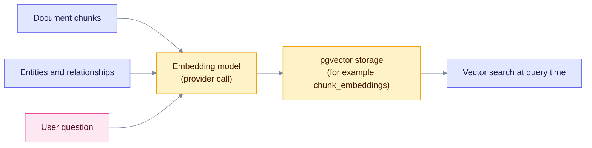
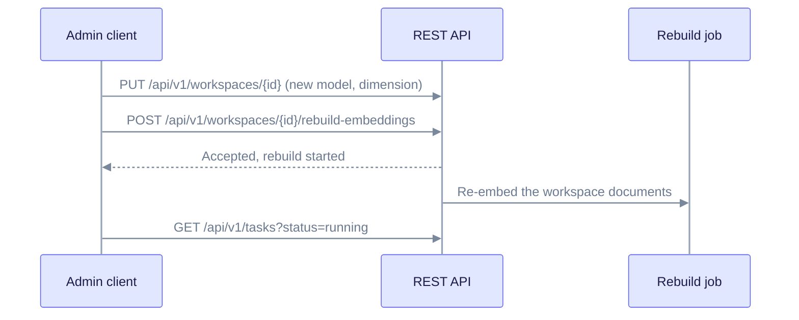

> **Product: v0.32.2** · Contract: OpenAPI · Spec ops: [Ingestion cancel & fairness](../ingestion-cancel-and-fairness.md)

# Deep Dive: Embedding Models

An embedding model turns text into a vector, a list of numbers that represents the text's meaning. EdgeQuake uses these vectors to find passages, entities and relationships by meaning rather than exact words. This page explains where embeddings are used, which models EdgeQuake knows, how to configure them, and how to change models safely.

---

## What Are Embeddings?

An embedding is a dense vector of floats. Texts with similar meaning get vectors that point in similar directions, so a search compares vectors instead of words.

For example, "The cat sat on the mat" becomes a vector such as `[0.23, -0.15, 0.87, 0.42, ..., -0.31]`. The length of that vector is the model's **dimension**, for example 1536.

---

## Where EdgeQuake Uses Embeddings



Ingestion embeds chunks, entities and relationships. A query embeds only the question and its keyword lists, then searches the stored vectors.

- **Ingestion:** document chunks, entities and relationships are embedded and stored in pgvector.
- **Queries:** the question and the keyword lists are embedded. See [Query Modes](query-modes.md).

---

## Supported Embedding Models

The model catalog is `models.toml` (see [models.toml Configuration](#modelstoml-configuration)). The tables below list the embedding models it defines.

### OpenAI

| Model | Dimensions | Max input tokens | Price per 1M tokens | Notes |
| --- | --- | --- | --- | --- |
| `text-embedding-3-small` | 1536 | 8191 | $0.02 | Recommended default |
| `text-embedding-3-large` | 3072 | 8191 | $0.13 | Higher dimension, more precise |
| `text-embedding-ada-002` | 1536 | 8191 | $0.10 | Deprecated; use `text-embedding-3-small` |

**Recommendation:** use `text-embedding-3-small` for most workloads. It gives the best cost and quality balance.

```bash
# Defaults from .env.example (workspace bootstrap)
export EDGEQUAKE_DEFAULT_EMBEDDING_PROVIDER=openai
export EDGEQUAKE_DEFAULT_EMBEDDING_MODEL=text-embedding-3-small
export EDGEQUAKE_DEFAULT_EMBEDDING_DIMENSION=1536
```

### Ollama (local)

| Model | Dimensions | Max input tokens | Notes |
| --- | --- | --- | --- |
| `embeddinggemma:latest` | 768 | 2048 | Default for `make dev` |
| `nomic-embed-text` | 768 | 2048 | Same 768-dimension size, different model |
| `mxbai-embed-large` | 1024 | 512 | Larger vectors, short inputs |
| `snowflake-arctic-embed` | 1024 | 512 | Larger vectors, short inputs |
| `all-minilm` | 384 | 256 | Smallest vectors, fastest, least precise |

Ollama models have no per-token API cost. Their cost is the hardware that runs them.

```bash
ollama pull embeddinggemma:latest
export EDGEQUAKE_DEFAULT_EMBEDDING_PROVIDER=ollama
export EDGEQUAKE_DEFAULT_EMBEDDING_MODEL=embeddinggemma:latest
export EDGEQUAKE_DEFAULT_EMBEDDING_DIMENSION=768
```

### Other providers

| Provider | Model | Dimensions | Max input tokens | Notes |
| --- | --- | --- | --- | --- |
| Mistral | `mistral-embed` | 1024 | 8192 | Native Mistral embedding model |
| Gemini | `gemini-embedding-001` | see `models.toml` | see `models.toml` | Listed in the default catalog |
| LM Studio | `text-embedding-nomic-embed-text-v1.5` | see `models.toml` | see `models.toml` | Local OpenAI-compatible server |

**Recommendation:** use `embeddinggemma:latest` for a local Ollama setup (the `make dev` default). Use `nomic-embed-text` as an alternative with the same 768-dimension size.

---

## Dimension Tradeoffs

Higher dimensions capture more nuance, but they cost more storage, memory and search time.

| Dimensions | Storage for 100K vectors (float32) | Trade-off |
| --- | --- | --- |
| 384 | 153 MB | Fast, small, less semantic precision |
| 768 | 307 MB | Good balance for local models |
| 1536 | 614 MB | Default for OpenAI small |
| 3072 | 1.2 GB | Most precise, slowest and largest |

Storage is computed at float32 precision. EdgeQuake stores vectors as `halfvec` by default, which uses about half the space. The `EDGEQUAKE_VECTOR_STORAGE` setting controls this:

- `halfvec` (default): 16-bit floats. pgvector's `vector` type indexes only up to 2000 dimensions, so `halfvec` is what allows HNSW indexes for models from 2000 up to 4000 dimensions. See [Vector Storage](/docs/deep-dives/vector-storage/).
- Any other value: 32-bit floats.

---

## EmbeddingProvider Trait

The trait is defined in the `edgequake-llm` crate, which EdgeQuake depends on. Abridged:

```rust
#[async_trait]
pub trait EmbeddingProvider: Send + Sync {
    fn name(&self) -> &str;
    fn model(&self) -> &str;
    /// Dimension of the vectors this model returns.
    fn dimension(&self) -> usize;
    /// Maximum number of tokens per input.
    fn max_tokens(&self) -> usize;
    /// Texts per request. Defaults to 2048; overridable with EDGEQUAKE_EMBEDDING_BATCH_SIZE.
    fn max_batch_size(&self) -> usize;

    /// Embed one request's worth of texts.
    async fn embed(&self, texts: &[String]) -> Result<Vec<Vec<f32>>>;
    /// Embed any number of texts, split into batches of max_batch_size().
    async fn embed_batched(&self, texts: &[String]) -> Result<Vec<Vec<f32>>>;
    /// Embed a single text.
    async fn embed_one(&self, text: &str) -> Result<Vec<f32>>;
}
```

**Why a trait:**

- **Swappable providers:** the pipeline and query code depend on the trait, not on OpenAI or Ollama.
- **Caching:** `EmbeddingCache` wraps any provider (see [Performance](#performance-optimization)).

---

## Similarity Metrics

EdgeQuake uses **cosine similarity** with pgvector. HNSW indexes use the cosine operator class (`vector_cosine_ops`, or `halfvec_cosine_ops` for `halfvec` columns above 2000 dimensions).

```sql
-- Cosine distance (<=>): a smaller value means more similar.
-- $1 is the query vector, in the same type as the column.
SELECT id
FROM chunk_embeddings
ORDER BY embedding <=> $1
LIMIT 10;
```

pgvector also provides `<#>` (negative inner product) and `<->` (L2 distance). EdgeQuake's indexes use cosine.

**Why cosine:**

- It compares direction, so vector length does not affect the result.
- It works well for text embeddings.
- Its similarity range is -1 to 1, where 1 means identical direction.

---

## Embedding Pipeline

```mermaid
%%{init: {"theme":"base","themeVariables":{"primaryColor":"#E0E7FF","primaryBorderColor":"#6366F1","primaryTextColor":"#1E1B4B","secondaryColor":"#D1FAE5","secondaryBorderColor":"#10B981","secondaryTextColor":"#064E3B","tertiaryColor":"#FEF3C7","tertiaryBorderColor":"#F59E0B","tertiaryTextColor":"#6B7A90","lineColor":"#7A889C","clusterBkg":"rgba(99,102,241,0.07)","clusterBorder":"#A5B4FC","noteBkgColor":"#FEF9C3","noteTextColor":"#422006","textColor":"#6B7A90","titleColor":"#6B7A90","signalColor":"#7A889C","signalTextColor":"#6B7A90","loopTextColor":"#6B7A90","edgeLabelBackground":"#F1F5F9","actorLineColor":"#94A3B8"}}}%%
%% eq-theme:v1
flowchart LR
  A["Texts<br>(chunks, entities, relationships)"] --> B["embed_batched<br>splits by max_batch_size"]
  B --> C["Provider call<br>OpenAI /embeddings<br>Ollama /api/embed"]
  C --> D["One vector per text"]
  D --> E["Stored in pgvector<br>with model name and dimension"]
%% eq-classes
classDef eqLlm fill:#FEF3C7,stroke:#F59E0B,color:#451A03
class C,E eqLlm
```



The batches run through the provider, and every vector is stored with the model name and dimension that produced it. That is what keeps vector spaces separate (see the registry rules below).

- **Batching:** `embed_batched` splits inputs into batches of `max_batch_size()`. The default is 2048 texts. Set `EDGEQUAKE_EMBEDDING_BATCH_SIZE` to change it.
- **OpenAI:** each batch is one `POST /embeddings` request.
- **Ollama:** each batch is one `POST /api/embed` request. Inputs are truncated to the model's context rather than rejected.

---

## Choosing the Right Model

### Decision Matrix

| Requirement | Recommended model |
| --- | --- |
| Lowest cost | `nomic-embed-text` (Ollama, free) |
| Best quality | `text-embedding-3-large` (OpenAI) |
| Best value | `text-embedding-3-small` (OpenAI) |
| Privacy (local) | `nomic-embed-text` or `embeddinggemma` (Ollama) |
| Smallest, fastest vectors | `all-minilm` (Ollama, 384 dimensions) |
| Highest dimension | `text-embedding-3-large` (3072 dimensions) |

### Domain Considerations

| Domain | Recommendation |
| --- | --- |
| General knowledge | `text-embedding-3-small` |
| Legal or medical text, where precision matters | `text-embedding-3-large` |
| Multi-language content | `text-embedding-3-small` |
| Code or technical text | `text-embedding-3-small`, with chunks sized to the function or section |

---

## Configuration

### Global Defaults

Environment variables follow the `.env.example` naming:

| Variable | Role |
| --- | --- |
| `EDGEQUAKE_DEFAULT_EMBEDDING_PROVIDER` | Provider for new workspaces (bootstrap default) |
| `EDGEQUAKE_DEFAULT_EMBEDDING_MODEL` | Model for new workspaces |
| `EDGEQUAKE_DEFAULT_EMBEDDING_DIMENSION` | Dimension for new workspaces; must match the model output |
| `EDGEQUAKE_EMBEDDING_PROVIDER` | Provider override, used only when the `DEFAULT_` provider variable is unset |
| `EDGEQUAKE_EMBEDDING_MODEL` | Model override, used only when the `DEFAULT_` model variable is unset |
| `EDGEQUAKE_EMBEDDING_DIMENSION` | Dimension override; must match the model output |
| `EDGEQUAKE_VECTOR_STORAGE` | `halfvec` (default) or `full`; see [Vector Storage](/docs/deep-dives/vector-storage/) |

The resolver reads `EDGEQUAKE_DEFAULT_EMBEDDING_*` first. Set one variable pair, not both.

```bash
export EDGEQUAKE_DEFAULT_EMBEDDING_PROVIDER=openai
export EDGEQUAKE_DEFAULT_EMBEDDING_MODEL=text-embedding-3-small
export EDGEQUAKE_DEFAULT_EMBEDDING_DIMENSION=1536
```

### Per-Workspace Settings

A workspace can choose its own embedding model when it is created. Set `embedding_model`, `embedding_dimension` and, optionally, `embedding_provider`:

```bash
# Create a workspace with a specific embedding model
curl -X POST http://localhost:8080/api/v1/tenants/default/workspaces \
  -H "Content-Type: application/json" \
  -d '{
    "name": "research",
    "embedding_model": "text-embedding-3-large",
    "embedding_dimension": 3072
  }'
```

### models.toml Configuration

Model cards live in `models.toml`. EdgeQuake looks for it in this order: the path in `EDGEQUAKE_MODELS_CONFIG`, then `./models.toml`, then `~/.edgequake/models.toml`, then the built-in defaults.

The file lists providers, then models under each provider:

```toml
[defaults]
embedding_provider = "openai"
embedding_model = "text-embedding-3-small"

[[providers]]
name = "openai"
api_key_env = "OPENAI_API_KEY"

[[providers.models]]
name = "text-embedding-3-large"
model_type = "embedding"

[providers.models.capabilities]
context_length = 8191
embedding_dimension = 3072

[providers.models.cost]
embedding_per_1k = 0.00013
```

---

## Changing Embedding Models

**Warning:** changing the model or the dimension requires rebuilding the embeddings. Vectors from different models are not comparable, so mixing them gives wrong search results.

1. Update the workspace with the new model and dimension:

   ```bash
   curl -X PUT http://localhost:8080/api/v1/workspaces/$WORKSPACE_ID \
     -H "Content-Type: application/json" \
     -d '{"embedding_model": "text-embedding-3-large", "embedding_dimension": 3072}'
   ```

2. Rebuild the embeddings:

   ```bash
   curl -X POST http://localhost:8080/api/v1/workspaces/$WORKSPACE_ID/rebuild-embeddings
   ```

3. Monitor the running tasks:

   ```bash
   curl "http://localhost:8080/api/v1/tasks?status=running"
   ```



The sequence shows the three calls. The rebuild runs as a job, and the client follows its progress through the tasks endpoint.

---

## Performance Optimization

### Query Embedding Cache

`EmbeddingCache` wraps a provider and keeps up to 10,000 entries for one hour. A repeated text returns its cached vector without an API call.

### HNSW Index Tuning

The typed `chunk_embeddings` index is created by migration `129_spec091_chunk_hnsw_ef_converge.sql`. It uses `halfvec_cosine_ops` with `m = 16` and `ef_construction = 128`. The build value comes from `EDGEQUAKE_HNSW_EF_CONSTRUCTION` (default 128, clamped to 4 to 1000).

```sql
CREATE INDEX IF NOT EXISTS idx_chunk_embeddings_hnsw
ON public.chunk_embeddings
USING hnsw (embedding halfvec_cosine_ops)
WITH (m = 16, ef_construction = 128);
```

The legacy `eq_*_vectors` tables use an older index built by migration `071_hnsw_optimize.sql` with `ef_construction = 32`. That migration is checksum-locked and is not rewritten.

Tune the search side per session. A higher `ef_search` gives better recall and is slower. pgvector's default is 40:

```sql
SET hnsw.ef_search = 100;
```

---

## Cost Analysis

### OpenAI Embedding Costs

| Model | Cost per 1M tokens | 100K docs (500 tokens each) |
| --- | --- | --- |
| `text-embedding-3-small` | $0.02 | $1.00 |
| `text-embedding-3-large` | $0.13 | $6.50 |
| `text-embedding-ada-002` | $0.10 | $5.00 |

Ollama models have no per-token cost, so their cost is the hardware that runs them.

---

## Troubleshooting

### Dimension Mismatch

The error looks like this:

```
Dimension mismatch for workspace <workspace-id>: cached=1536, requested=768.
```

**Cause:** the model or dimension changed without rebuilding the embeddings.

**Solution:** rebuild the workspace embeddings (see [Changing Embedding Models](#changing-embedding-models)).

```bash
curl -X POST http://localhost:8080/api/v1/workspaces/$WORKSPACE_ID/rebuild-embeddings
```

### Out of Memory (Ollama)

**Cause:** the model does not fit in GPU memory.

**Solution:** use a smaller model, such as `all-minilm` (384 dimensions). Its dimension is different, so rebuild the embeddings after switching.

```bash
ollama pull all-minilm
```

### Rate Limiting (OpenAI)

**Cause:** the account has hit its request or token limit.

**Solution:**

- Lower the batch size with `EDGEQUAKE_EMBEDDING_BATCH_SIZE`.
- Retry later, or move to a higher usage tier.
- Use a local model such as Ollama `embeddinggemma:latest`.

---

## Typed ANN registry key (ingest = query)

Ingest and typed ANN **must share the same** `embedding_models(name, dimensions)` key as the workspace embedder. EdgeQuake never searches another model's vector space when the preferred key misses.

| Concern | Source | Role |
| --- | --- | --- |
| Which embedder process loads | `EDGEQUAKE_EMBEDDING_PROVIDER` / provider setup | Runtime client construction, **not** the ANN registry key |
| ANN / typed write and read registry name | Workspace lineage model, else `embedding_model_key_from_env()` (storage SSOT) | `embedding_models.name` plus dimensions. An empty Compose `EDGEQUAKE_EMBEDDING_MODEL=` falls through to the product default |
| Query filter | `QueryEmbeddings.model` → `MetadataFilter.embedding_model` | Preferred key only, via `serving_embedding_model_candidates`. A miss returns an empty ANN result, and graph label or seed admission still applies |

**Rules**

1. Stamp every typed upsert with the active embedder or lineage model name.
2. When `MetadataFilter.embedding_model` (workspace or lineage) is set, typed ANN searches **only** that `embedding_models(name, dimensions)` key. A miss is empty. It never falls through to the model in the process environment.
3. An empty environment value (`EDGEQUAKE_EMBEDDING_MODEL=`, from the Compose `:-` default) must resolve through the SSOT helper. Never treat `Ok("")` as a distinct registry name.
4. When rows were written under the wrong name, rename or backfill the registry and typed tables. See [Embedding registry audit & backfill](/docs/operations/embedding-registry-backfill/).

---

## Best Practices

1. **Consistency:** use the same embedding model for the whole workspace.
2. **Match dimensions:** the workspace dimension must equal the model's output size.
3. **Same ANN key:** ingest and query must share `embedding_models(name, dimensions)`.
4. **Batch when possible:** send texts in batches to reduce API calls.
5. **Track costs:** follow embedding token usage in [Cost Tracking](cost-tracking.md).
6. **Consider local models:** use Ollama for sensitive data or high volume.
7. **Test before switching:** compare retrieval quality before changing models.
8. **Tune the index:** adjust the HNSW parameters for your workload.

---

## See Also

- [Vector Search](/docs/deep-dives/vector-storage/): how similarity search works
- [Configuration Reference](/docs/operations/configuration/): all embedding settings
- [Performance Tuning](/docs/operations/performance-tuning/): optimization guide
- [Embedding registry audit & backfill](/docs/operations/embedding-registry-backfill/): ops SQL for model-key mismatches
