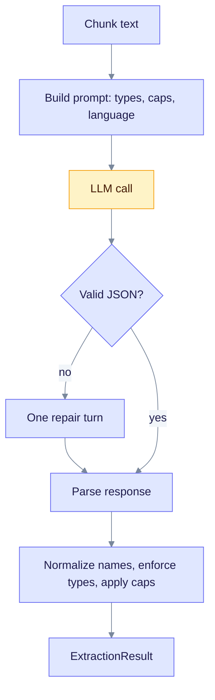
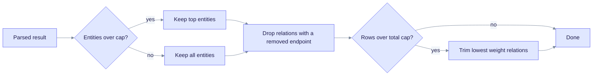
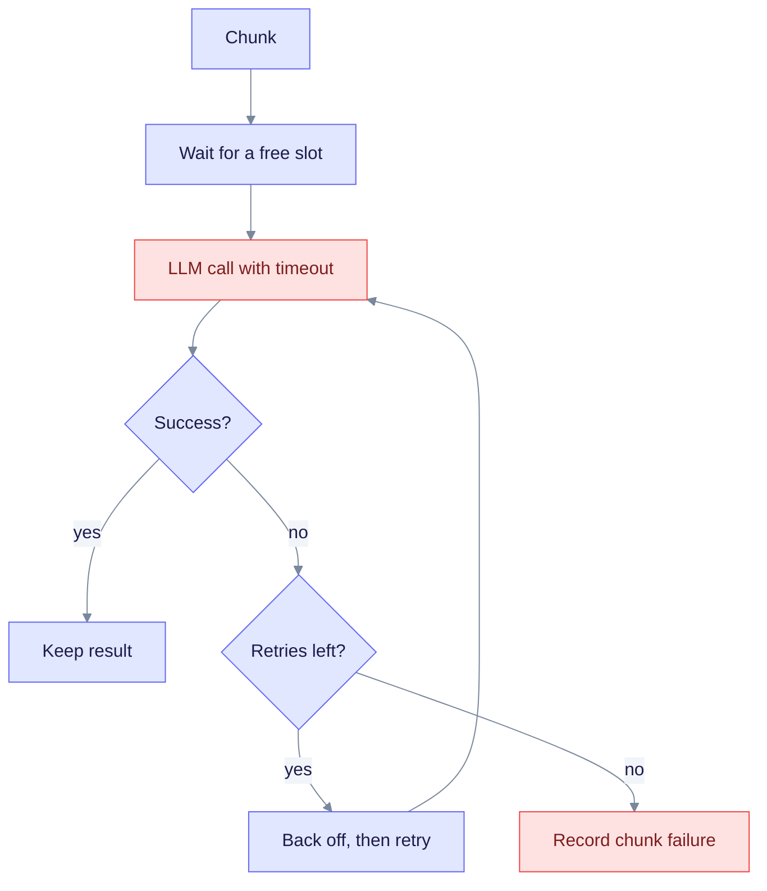

> **Product: v0.32.2** · Contract: OpenAPI · Spec ops: [Ingestion cancel & fairness](../ingestion-cancel-and-fairness.md)

# Deep Dive: Entity Extraction

**What this page explains:** how one chunk of text becomes a set of entities and relationships.
**Who it is for:** operators tuning ingestion cost and quality, and developers working on `edgequake-pipeline`.
**Read first:** [Chunking Strategies](chunking-strategies.md) and the overview in [LightRAG Algorithm](lightrag-algorithm.md).

An **entity** is a named thing in the text, such as a person, an organization, or a concept. A **relationship** is a link between two entities. Extraction is the step that builds the raw material of the knowledge graph. It is also the largest LLM cost in ingestion.

Code lives in `edgequake/crates/edgequake-pipeline/src/` (`extractor/`, `prompts/`, `pipeline/`).

## The big picture

Each chunk goes through the same steps. The flowchart shows one chunk from prompt to result.



Read it top to bottom: a bad response gets exactly one repair turn before the chunk is treated as failed.

## Which extractor runs

All extractors implement the `EntityExtractor` trait (`extract`, `extract_batch`, `name`, `model_name`, `provider_name`).

| Extractor | Format | Status in the shipping pipeline |
| --- | --- | --- |
| `LLMExtractor` | JSON object | **Production default.** Built by `build_ingestion_pipeline` and the API bootstrap. |
| `GleaningExtractor` | JSON | Wraps another extractor and runs extra passes. See [Gleaning](gleaning.md). |
| `SOTAExtractor` | Delimited tuples | Ported from LightRAG. Exported and tested, but not wired into the production ingestion path. |
| `SimpleExtractor` | Regex patterns | Tests and demos only. |
| Decision extractor | Closed questions | Optional mode (SPEC-160). See below. |

`LLMExtractor` is the production extractor. `ingestion_pipeline.rs` and `edgequake-api/src/state/query_bootstrap.rs` both build it.

### Extraction modes

A document is extracted in exactly one mode (`extraction_mode.rs`):

| Mode | Meaning |
| --- | --- |
| `llm` | Open extraction by a chat LLM. This is the default. |
| `decision` | A small decision model answers closed yes/no and pick-one questions. Text stays on the decision backend. |

The winning mode comes from, in order: the upload, the workspace default, the `EDGEQUAKE_EXTRACTION_MODE` environment variable, then `llm`. An unknown value is an error. It never silently falls back to `llm`, so private text cannot leak to a cloud model by mistake. The rest of this page describes `llm` mode.

## The JSON prompt (production)

`LLMExtractor` sends two messages (`prompts/json_prompts.rs`):

- **System message** (stable, so providers can cache it): the allowed entity types, optional relation types, the quantity limits, the output language, naming rules, and the JSON format.
- **User message** (changes per chunk): `## Text to Analyze` followed by the chunk text, with the section heading path added when the chunk has one.

The response must look like this:

```json
{
  "entities": [
    { "name": "Entity Name", "type": "ENTITY_TYPE", "description": "Brief description" }
  ],
  "relationships": [
    { "source": "Source Entity", "target": "Target Entity", "type": "RELATIONSHIP_TYPE", "description": "Brief description" }
  ]
}
```

Naming rule in the prompt: use a readable, title-case name, and never use a UUID, hash, ARN, or other opaque ID as the name. An ID may appear in the description.

### Output budget and repair

- `max_tokens` for the extraction call is 16,384 (`extractor/llm.rs`).
- The call gets provider-aware reasoning settings. Local providers such as Ollama and LM Studio run with reasoning off. If an endpoint rejects "reasoning off", the extractor lifts the effort and retries once.
- If parsing fails, the extractor sends one repair turn that includes the validator error. If that also fails, the chunk fails with "Invalid JSON after repair".
- Truncated JSON is recovered where possible (`recover_truncated: true`). A response with no JSON at all is an error, not an empty result.

## The tuple prompt (`SOTAExtractor`)

`SOTAExtractor` uses the LightRAG tuple format. It is kept for parity and tests. The system prompt asks for one record per line, with the delimiter `<|#|>` and the end marker `<|COMPLETE|>`:

```text
entity<|#|>Sarah Chen<|#|>PERSON<|#|>Lead researcher at Quantum Dynamics Lab.
relation<|#|>Sarah Chen<|#|>Quantum Dynamics Lab<|#|>employment, research<|#|>Sarah Chen works there.
<|COMPLETE|>
```

An entity line has 4 fields. A relation line has 5 fields. `TupleParser` reads each line on its own, so a truncated answer still yields every complete line. `HybridExtractionParser` detects whether a response is tuple or JSON and falls back to the other format if the first returns nothing.

The `SOTAExtractor` also has its own retry loop: three attempts, `max_tokens` starting at 4096 (chunks under 25 KB) and doubling up to 32,768 when the answer is cut off, with 100 ms, 200 ms, and 400 ms backoff. It rejects chunks above about 1500 estimated tokens up front.

## Entity types

Types come from a schema, `EntityExtractionSchema`. The built-in default (`default_entity_types()`) has 12 types:

`PERSON`, `CREATURE`, `ORGANIZATION`, `LOCATION`, `EVENT`, `CONCEPT`, `METHOD`, `CONTENT`, `DATA`, `ARTIFACT`, `NATURALOBJECT`, `OTHER`.

A workspace can override the list through its metadata keys `entity_types`, `entity_types_strict`, `relation_types`, `relation_types_strict`, and `relation_edges`.

In **strict** mode (the default), a type the LLM invents is mapped to the closest allowed type, or to `OTHER` when nothing fits. Parsing and gleaning both apply this rule, so gleaned entities cannot slip in a new type.

## Names and quality rules

Names are normalized right after parsing by `normalize_entity_name`. The single implementation is in `edgequake-storage/src/entity_id.rs`. See [Entity Normalization](entity-normalization.md) for the full rules. The result is `UPPERCASE_WITH_UNDERSCORES`, for example `Dr. Sarah Chen` becomes `DR._SARAH_CHEN` (titles are not stripped). The parser also applies these rules:

| Rule | Behavior |
| --- | --- |
| Empty name | The entity is skipped. |
| Opaque ID name (UUID, ULID, hash, ARN) | The entity is skipped. |
| Tiny numbers (for example `7` or `3.5`) | The entity is skipped. |
| BR0006 | A relationship whose source and target normalize to the same name is dropped. |
| BR0004 | A relationship keeps at most 5 keywords. |
| Empty endpoint | A relationship with an empty normalized endpoint is dropped. |

## Per-response caps

The prompt tells the LLM how many records to return. The parser then enforces the same limit (`prompts/extract_caps.rs`, SPEC-117).

| Setting | Default | Env var |
| --- | --- | --- |
| Max entities per response | 40 | `EDGEQUAKE_MAX_EXTRACTION_ENTITIES` |
| Max total rows (entities plus relationships) | 100 | `EDGEQUAKE_MAX_EXTRACTION_RECORDS` |
| Selection when over the cap | `relation_aware` | `EDGEQUAKE_EXTRACT_CAPS_SELECTION` (`fifo` for LightRAG parity) |

Caps can also be set per workspace and per upload (`extract_max_entities` and `extract_max_records`, always as a pair). The most specific layer wins: document, then workspace, then environment. Both values must satisfy `max_entities >= 1` and `max_records >= max_entities`.



Read it left to right: entities are cut first, then relationships are trimmed so the total fits.

When the cap truncated a result, the gleaning prompt changes to ask for additional high-value items instead of "missed" ones.

## Language

The prompt asks for output in one natural language. The default is English. A workspace or document can override it. With a non-English language, the tuple prompt drops its English few-shot examples so the model does not copy them. See `prompts/language.rs` and `EDGEQUAKE_EXTRACTION_LANGUAGE`.

## Resilience: timeouts, retries, concurrency

The pipeline extracts many chunks at once and isolates failures (`pipeline/extraction.rs`). One failed chunk does not discard the others.



Read it top to bottom: slots limit concurrency, and each chunk gets its own timeout and retry budget.

| Setting | Cloud default | Local default (Ollama, LM Studio, and similar) | Env var |
| --- | --- | --- | --- |
| Per-chunk timeout | 180 s | 600 s | `EDGEQUAKE_CHUNK_TIMEOUT_SECS` (minimum 10) |
| Concurrent extractions | 16 | 1 | `EDGEQUAKE_MAX_CONCURRENT_EXTRACTIONS` (hard cap 32) |
| Max retries per chunk | 3 | 3 | `EDGEQUAKE_CHUNK_MAX_RETRIES` (1 to 20) |
| First retry delay | 1000 ms | 5000 ms minimum on overload | `EDGEQUAKE_CHUNK_RETRY_DELAY_MS` |

The delay doubles on each attempt and is capped at 60 seconds. A local provider stays at concurrency 1 unless you set `EDGEQUAKE_ALLOW_LOCAL_HIGH_CONCURRENCY=1`.

## Multimodal entities

When a PDF has stored figure or table images (mm-assets), the pipeline adds multimodal entity nodes and association edges after the LLM pass (`multimodal/injection.rs`, SPEC-047). They link figures and tables to text entities for the document viewer.

## Cancel

Extraction runs inside an `Insert` task. `POST /api/v1/tasks/{track_id}/cancel` marks the task cancelled and aborts in-flight LLM and embedding calls at their next `.await`. A cancelled task is terminal and is not retried. See [Ingestion cancel & fairness](../ingestion-cancel-and-fairness.md).

## What comes out

`ExtractionResult` holds the entities, the relationships, the `source_chunk_id`, token counts (`input_tokens`, `output_tokens`), `extraction_time_ms`, and a metadata map. Metadata records the extractor name, language, model, and parse attempts. These token counts feed [Cost Tracking](cost-tracking.md).

Each entity has a name, type, description, and an `importance` between 0 and 1 (default 0.5). Each relationship has a source, target, type, keywords, description, and a `weight` between 0 and 1 (default 0.5). Next, the [merger](entity-normalization.md) combines results from all chunks into graph nodes.

## See also

- [Gleaning](gleaning.md): the optional second pass.
- [Entity Normalization](entity-normalization.md): naming, merging, and deduplication.
- [Graph Storage](graph-storage.md): where the results are stored.
- [Cost Tracking](cost-tracking.md): token and cost accounting.
