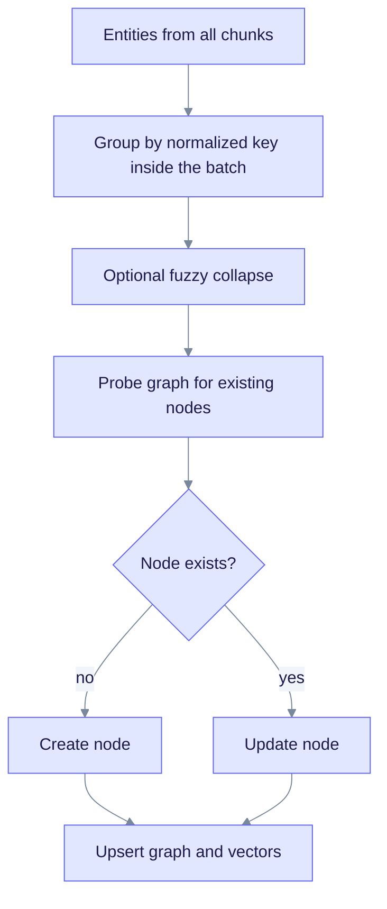
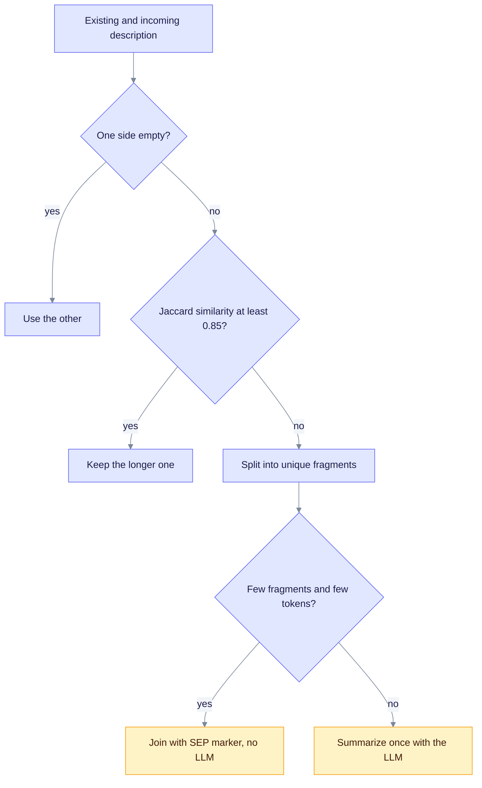

> **Product: v0.32.2** · Contract: OpenAPI · Spec ops: [Ingestion cancel & fairness](../ingestion-cancel-and-fairness.md)

# Entity Normalization and Merging

**What this page explains:** how raw entity names become one canonical ID, and how duplicates merge into a single graph node.
**Who it is for:** anyone who sees duplicate or oddly named entities, and developers working on the merger.
**Read first:** [Entity Extraction](entity-extraction.md).

Two chunks may call the same person "Sarah Chen" and "sarah chen". Without a shared ID they would become two nodes, and their relationships would never connect. EdgeQuake fixes this in two steps: **normalize** every name to a canonical ID, then **merge** items that share an ID.

The name function lives in `edgequake-storage/src/entity_id.rs`. The merger lives in `edgequake-pipeline/src/merger/`.

## Step 1: normalize the name

`normalize_entity_name` is the only name normalizer in the code base. The pipeline re-exports it as `edgequake_pipeline::prompts::normalize_entity_name`. It applies these steps in order:

```mermaid
%%{init: {"theme":"base","themeVariables":{"primaryColor":"#E0E7FF","primaryBorderColor":"#6366F1","primaryTextColor":"#1E1B4B","secondaryColor":"#D1FAE5","secondaryBorderColor":"#10B981","secondaryTextColor":"#064E3B","tertiaryColor":"#FEF3C7","tertiaryBorderColor":"#F59E0B","tertiaryTextColor":"#6B7A90","lineColor":"#7A889C","clusterBkg":"rgba(99,102,241,0.07)","clusterBorder":"#A5B4FC","noteBkgColor":"#FEF9C3","noteTextColor":"#422006","textColor":"#6B7A90","titleColor":"#6B7A90","signalColor":"#7A889C","signalTextColor":"#6B7A90","loopTextColor":"#6B7A90","edgeLabelBackground":"#F1F5F9","actorLineColor":"#94A3B8"}}}%%
%% eq-theme:v1
flowchart LR
    A["Raw name"] --> B["Trim"]
    B --> C["Reject numbers and opaque IDs"]
    C --> D["Unicode NFC and lowercase"]
    D --> E["Strip leading the, a, an"]
    E --> F["Strip possessive 's per word"]
    F --> G["Title-case words, join with underscore, uppercase"]
%% eq-classes
classDef eqBad fill:#FEE2E2,stroke:#EF4444,color:#7F1D1D
class C eqBad
```

Read it left to right: the output is `UPPERCASE_WITH_UNDERSCORES`, or an empty string when the name is rejected.

| Raw input | Normalized |
| --- | --- |
| `Sarah Chen` | `SARAH_CHEN` |
| `sarah chen` | `SARAH_CHEN` |
| `  The Company  ` | `COMPANY` |
| `John's Research` | `JOHN_RESEARCH` |
| `Dr. S. Chen` | `DR._S._CHEN` |
| `New-York` | `NEW-YORK` |
| `C++` | `C++` |
| `42` | empty (rejected) |
| `3.5` | empty (rejected) |
| a UUID, ULID, Mongo ObjectId, long hex hash, or AWS ARN | empty (rejected) |

Things to know:

- **Punctuation is kept.** Only whitespace, a leading article, and a trailing `'s` are changed. Hyphens, dots, `+`, and `&` stay in the ID. `Dr. S. Chen` and `Sarah Chen` stay different IDs.
- **Titles are not stripped.** The code does not remove `Dr.` or `Prof.`.
- **Rejected names are skipped.** An empty result means the entity is dropped with a log line. A pure number under 3 digits, a decimal under 6 characters, and any opaque machine ID are rejected. Multimodal IDs that start with `im-` are kept on purpose.
- **Unicode is safe.** The function works on characters, not bytes, so CJK and accented names are handled.

Entity types follow a related rule: they are upper-cased and mapped onto the allowed list, as described in [Entity Extraction](entity-extraction.md#entity-types).

## From name to storage ID

`EntityId` wraps the normalized name. The graph node ID and the vector ID are both derived from it, so the two can never disagree.

| ID | Format | Example |
| --- | --- | --- |
| Graph node ID (workspace scoped) | `{workspace_uuid}::{NAME}` | `0b1e...::SARAH_CHEN` |
| Graph node ID (no workspace) | `{NAME}` | `SARAH_CHEN` |
| Entity vector ID | `entity:{NAME}` | `entity:SARAH_CHEN` |

The workspace prefix keeps two workspaces from sharing one node. A node from another workspace is never merged into, even if the name matches.

## Step 2: merge duplicates

`merge_with_progress` in `merger/mod.rs` takes the results of all chunks in a document and writes them in batches. Entities are handled first, then relationships.

Read it top to bottom: names are matched inside the batch first, then against nodes already in the graph, and the writes go out in batches.

### Inside one batch

When the same key appears in several chunks, the merger combines them in memory:

- keep the longer description,
- add every source chunk ID,
- take the highest `importance`,
- take a **type vote** (see below),
- treat `-` and `_` as equal, so `NEW-YORK` and `NEW_YORK` collapse (SPEC-162 fold).

### Against the graph

For a key that already exists, `update_entity_node` merges the new data into the stored node:

| Field | Rule |
| --- | --- |
| `description` | Merge policy below. |
| `entity_type` | Vote across all mentions. |
| `importance` | Maximum of old and new. |
| `sources` (text spans) | Append new spans, up to 10 (`max_sources`). |
| Chunk and document lineage | Union of IDs, then cap (see below). |

If a graph lookup misses, the key is probed again with `-` and `_` swapped, so a stored `NEW-YORK` is found for `NEW_YORK`.

### Optional fuzzy matching

Set `EDGEQUAKE_ENTITY_FUZZY=1` (default off) to collapse near-duplicate names, using normalized Levenshtein distance and token overlap. `EDGEQUAKE_ENTITY_FUZZY_THRESHOLD` sets the cut-off (default 0.88, clamped to 0.5-1.0). Turn it on with care: it can merge two different things that look alike.

**Not wired:** `merger/entity_resolution.rs` defines an embedding and LLM resolution ladder (`EDGEQUAKE_ENTITY_EMBED_ER`, `EDGEQUAKE_ER_LLM`, cosine threshold 0.92). Nothing in the merge path calls it today, so those two variables have no effect on ingestion.

## Description merging

Entities seen in many chunks collect many descriptions. The pure function `decide_description_merge` chooses what to do. It follows LightRAG's rules, plus a similarity shortcut.

Read it top to bottom: the LLM is the last resort, used only when there are many fragments or too many tokens.

| Setting | Default | Env var |
| --- | --- | --- |
| Similarity shortcut | 0.85 | `EDGEQUAKE_MERGE_SIMILARITY_THRESHOLD` (0 always summarizes, 1 never does) |
| Fragment count that forces the LLM | 8 | `EDGEQUAKE_FORCE_LLM_SUMMARY_ON_MERGE` |
| Token budget for joining without the LLM | 1200 | `EDGEQUAKE_SUMMARY_MAX_TOKENS` (minimum 64) |
| Maximum stored description | 4096 characters | `MergerConfig.max_description_length` |
| Fragment separator | `<SEP>` | fixed |

The LLM is used only when both gates fail (8 or more fragments, or 1200 or more tokens). If the LLM call fails, the merger falls back to joining the fragments and truncating at a sentence boundary. The separator stays stable so a later merge can split the description again.

## Entity type voting

If two mentions disagree on the type, there is no first-wins rule. Each mention adds a vote weighted by its importance to the `entity_type_votes` property. The type with the highest total wins, and `OTHER` loses to any real type. A tie keeps the current type. A human correction sets `entity_type_locked`, and later votes cannot override it.

## Relationships

Relationship merging follows the same shape (`merger/relationship.rs`). The key is the pair of normalized endpoints. Weights combine under `WeightPolicy`: the default `Max` keeps the strongest weight, and `EDGEQUAKE_WEIGHT_POLICY=mean` switches to a running mean. If a relationship points at an entity that does not exist yet, the merger creates a placeholder node so the edge is not lost.

## Lineage

Every node and edge records where it came from.

| Property | Meaning |
| --- | --- |
| Source chunk IDs | The chunks that mentioned it. |
| `source_document_ids` | The documents behind those chunks. Computed before the cap so a document is never lost. |
| Lineage rows | `chunk_entity_links` and `chunk_relation_links` tables, written best-effort. |
| Description history | Append-only record of description merges. |

The number of stored chunk IDs per node is capped at 200 by default (`EDGEQUAKE_MAX_SOURCE_IDS_PER_ENTITY` and `EDGEQUAKE_MAX_SOURCE_IDS_PER_RELATION`). When a node is full, `EDGEQUAKE_SOURCE_IDS_LIMIT_METHOD` decides what happens:

- `KEEP` (default): keep the first IDs and skip description updates from new chunks.
- `FIFO`: drop the oldest IDs to make room.

Lineage powers citations and cascade delete: deleting a document removes the IDs it contributed.

## Merge concurrency

`EDGEQUAKE_MERGE_MAX_ASYNC` sets how many unique entities or relationships merge in parallel. If unset, it is twice `EDGEQUAKE_LLM_MAX_ASYNC` (or `EDGEQUAKE_EMBED_MAX_ASYNC`), else 8. Local providers such as Ollama are capped at 2.

## Known gaps

- `MergerConfig` has `description_decay` (0.9) and `min_importance` (0.1) fields. Nothing reads them today, so they do not change behavior.
- The code comments mention a 512-token description limit (BR0005). The enforced limit is the 4096-character cap and the merge gates above.

## Troubleshooting

| Symptom | Likely cause | What to do |
| --- | --- | --- |
| `Sarah Chen` and `Dr. Sarah Chen` are two nodes | Titles are not stripped | Enable fuzzy matching, or merge the nodes manually. |
| Two different things merged | Fuzzy matching is on and the threshold is low | Raise `EDGEQUAKE_ENTITY_FUZZY_THRESHOLD` or turn fuzzy off. |
| An entity is missing | Its name was a number or an opaque ID | Check the log for `opaque_entity_name_rejected`. |
| Descriptions look like `A<SEP>B` | Few fragments, joined without the LLM | Expected. Lower the force threshold to summarize sooner. |

## See also

- [Entity Extraction](entity-extraction.md): where names come from.
- [Graph Storage](graph-storage.md): how nodes and edges are stored.
- [Vector Storage](vector-storage.md): the `entity:` vectors.
- [Query Modes](query-modes.md): how normalized entities are looked up.
