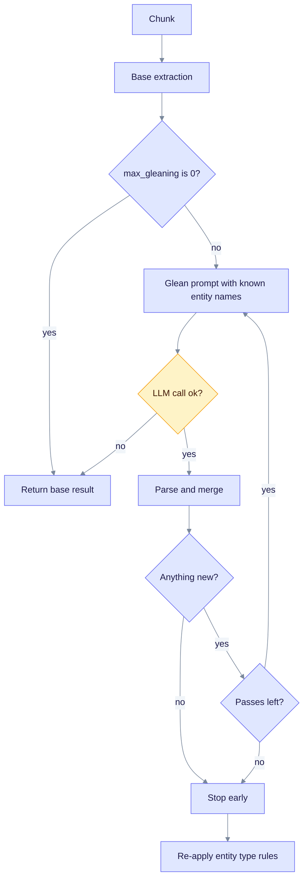
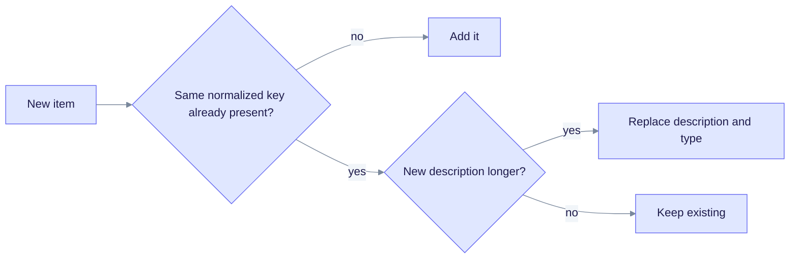

> **Product: v0.32.2** · Contract: OpenAPI · Spec ops: [Ingestion cancel & fairness](../ingestion-cancel-and-fairness.md)

# Deep Dive: Gleaning

**What this page explains:** the optional second extraction pass that looks for entities the first pass missed.
**Who it is for:** operators who trade LLM cost against recall, and developers working on `GleaningExtractor`.
**Read first:** [Entity Extraction](entity-extraction.md).

**Gleaning** means asking the LLM again about the same chunk. The new prompt says "many entities were missed" and lists the entities already found. The model returns only additions. Each extra pass costs one more LLM call per chunk.

The code is `edgequake/crates/edgequake-pipeline/src/extractor/gleaning.rs`. The idea comes from LightRAG.

## Why a second pass helps

A single call can miss items for a few reasons:

| Reason | Example |
| --- | --- |
| Long or dense text competes for attention | Later paragraphs get less detail. |
| Indirect mentions | "The company" refers to an earlier "Apple". |
| Many items at once | The model stops after the most obvious ones. |
| The per-response cap | With a cap of 40 entities, the rest are cut. Gleaning can recover high-value ones. |

EdgeQuake does not publish a recall figure for gleaning. Measure it on your own documents.

## The loop

`GleaningExtractor` wraps a base extractor. In production the base is `LLMExtractor`. The flowchart shows what happens for one chunk.



Read it top to bottom: the loop ends when a pass adds nothing, when the pass limit is reached, or when the LLM call fails.

Details that matter:

- **Fail-open.** If a gleaning call fails, the extractor keeps the base result and stops. You never lose the first pass (SPEC-156).
- **Early stop.** If a pass adds zero entities and zero relationships, the loop ends (SPEC-156).
- **Parse errors** in one pass are logged and the loop continues to the next pass.
- **Token accounting.** Gleaning tokens are added to the result's `input_tokens` and `output_tokens`, so [cost tracking](cost-tracking.md) includes them.
- **Metadata.** The result records `gleaning_iterations`, the number of passes that actually ran.

## The gleaning prompt

Gleaning uses the same JSON format as `LLMExtractor`, not the tuple format (`prompts/json_prompts.rs`). Two messages are sent:

- **System message** (stable): the intro "MANY entities and relationships were missed in the last extraction", instructions to look for implicit entities, extra relationships between known entities, and contextual entities, plus the type schema, the quantity caps, the language, and the JSON format.
- **User message** (per chunk): `## Already Identified Entities`, the comma-separated names found so far, then `## Text to Re-Analyze` and the chunk text.

If the base pass was cut by the per-response cap, the intro changes to "the previous extraction hit the per-response budget" and asks for additional high-value items. The call uses `max_tokens` of 16,384.

## How results are merged

After each pass, `merge_results` folds the new items into the running result. Names are compared after normalization (see [Entity Normalization](entity-normalization.md)).



Read it left to right: gleaning never deletes anything. It only adds new items or replaces a shorter description with a longer one.

For relationships, the key is the pair of normalized source and target names. After the last pass, the extractor applies the workspace entity-type rules again, so gleaned entities follow the same allowed types as the first pass.

## Defaults and limits

| Setting | Value | Where |
| --- | --- | --- |
| Gleaning on by default | yes (`enable_gleaning: true`) | API upload defaults |
| Passes by default | 1 (`max_gleaning: 1`) | `GleaningConfig::default()` and API defaults |
| Hard cap on passes | 2 (`MAX_GLEANING_CAP`) | Any larger request is clamped |
| Local providers | **off** unless you opt in | `resolve_gleaning_for_provider` |
| Large PDFs | **off** at 500 pages or more | `LARGE_PDF_GLEANING_DISABLE_THRESHOLD` |

The local-provider rule applies to Ollama, LM Studio, and similar single-machine servers. Gleaning doubles their load. Opt in with `EDGEQUAKE_LOCAL_ENABLE_GLEANING=1`.

The text-upload JSON body accepts `enable_gleaning` and `max_gleaning`. The worker reads them from the task metadata and applies the defaults in the table when they are missing. File uploads send no gleaning fields, so they use the defaults. There is no `EDGEQUAKE_GLEANING_ITERATIONS` or `EDGEQUAKE_ENABLE_GLEANING` variable in the code; earlier versions of this page named them by mistake.

### Library use

```rust
use edgequake_pipeline::{GleaningConfig, GleaningExtractor};

let extractor = GleaningExtractor::new(llm, base_extractor)
    .with_config(GleaningConfig { max_gleaning: 2 });
```

`GleaningConfig` has one field, `max_gleaning`. Earlier docs listed an `always_glean` flag; it does not exist.

## Cost and latency

Passes run one after another inside a chunk. Different chunks still run in parallel (see [concurrency](entity-extraction.md#resilience-timeouts-retries-concurrency)). With `max_gleaning = 1`, each chunk costs up to two LLM calls. With the cap of 2, up to three. The early stop makes the real cost lower on simple text.

## When to use it

| Turn it on | Turn it off |
| --- | --- |
| Dense, high-value documents such as contracts, papers, and specifications | Short or simple notes |
| Documents you ingest once and query often | Very large batch loads where cost matters most |
| Cloud models with a fast per-call speed | Single-slot local models, which are already slow |

## Troubleshooting

| Symptom | Likely cause | What to do |
| --- | --- | --- |
| `gleaning_iterations` is 0 for every chunk | Local provider, or a 500+ page PDF | Set `EDGEQUAKE_LOCAL_ENABLE_GLEANING=1` for local models. |
| Ingestion is much slower | Extra LLM calls | Lower `max_gleaning` to 0 or 1. |
| Warning "Gleaning LLM failed - keeping base extraction" | Timeout or provider error in the extra call | Normal; the base result is kept. Check provider health. |

## See also

- [Entity Extraction](entity-extraction.md): the base pass.
- [Entity Normalization](entity-normalization.md): how names are matched.
- [Cost Tracking](cost-tracking.md): where the extra tokens appear.
- [Performance Tuning](../operations/performance-tuning.md): ingestion tuning.
