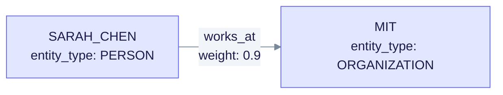
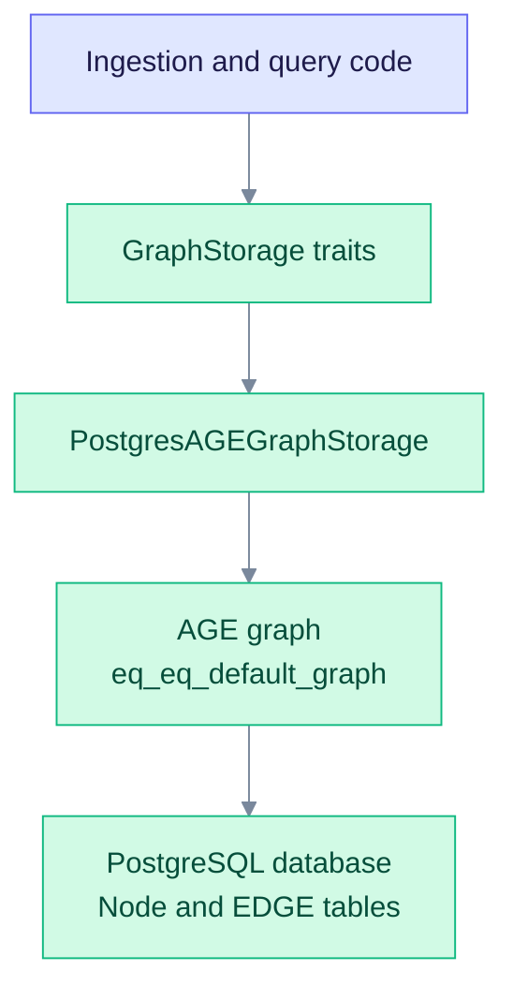
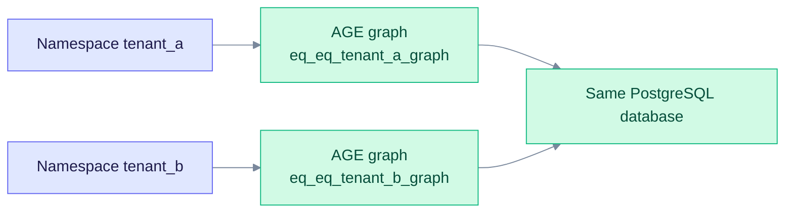

> **Product: v0.32.2** · Contract: OpenAPI · Spec ops: [Ingestion cancel & fairness](../ingestion-cancel-and-fairness.md)

# Deep Dive: Graph Storage

The knowledge graph holds the entities and relationships that EdgeQuake extracts from documents. In production it is stored in PostgreSQL with the Apache AGE extension, which adds Cypher graph queries to PostgreSQL. This page covers the data model, the storage trait, the AGE adapter and the tuning options.

**See also:** [Data Layer](data-layer.md) for the physical storage layout across PostgreSQL tables and the graph, and [Query Modes](query-modes.md) for how the graph is read at query time.

---

## Overview

EdgeQuake stores extracted knowledge as a property graph. Each entity is a node, and each relationship is a directed edge. Both carry arbitrary properties.



The diagram shows one relationship: an edge with its own properties, joining two nodes.

**Production backend.** PostgreSQL with Apache AGE is the only production graph backend. The `GraphStorage` trait has an in-memory implementation (`MemoryGraphStorage`) for tests.

---

## Why Property Graphs?

| Feature | Benefit |
| --- | --- |
| **Arbitrary properties** | Each node or edge can carry different attributes |
| **Rich metadata** | Store descriptions, weights and source chunk ids |
| **Flexible schema** | Adapt to different domains without a migration |
| **Graph traversal** | Efficient neighbor and path queries |
| **Cypher** | Apache AGE exposes Cypher on PostgreSQL |

---

## Core Data Structures

### GraphNode

An entity in the knowledge graph:

```rust
/// A node in the knowledge graph.
#[derive(Debug, Clone, Serialize, Deserialize)]
pub struct GraphNode {
    /// Node identifier (typically the entity name)
    pub id: String,
    /// Node properties
    pub properties: HashMap<String, serde_json::Value>,
}
```

Common keys set by the pipeline are `entity_type`, `description`, `source_chunk_id` and `importance`. The storage layer accepts any key.

### GraphEdge

A relationship between two entities:

```rust
/// An edge in the knowledge graph.
#[derive(Debug, Clone, Serialize, Deserialize)]
pub struct GraphEdge {
    /// Source node identifier
    pub source: String,
    /// Target node identifier
    pub target: String,
    /// Edge properties
    pub properties: HashMap<String, serde_json::Value>,
}
```

Common keys are `relation_type` (for example `works_at`), `weight`, `description` and `keywords`. The extraction parser keeps at most 5 keywords per edge.

### KnowledgeGraph

A subgraph result from a query:

```rust
/// A subgraph extracted from the knowledge graph.
#[derive(Debug, Clone, Serialize, Deserialize)]
pub struct KnowledgeGraph {
    /// Nodes in the subgraph
    pub nodes: Vec<GraphNode>,
    /// Edges in the subgraph
    pub edges: Vec<GraphEdge>,
    /// Whether the result was truncated due to size limits
    pub is_truncated: bool,
}
```

---

## The GraphStorage Trait

Callers depend on the `GraphStorage` trait, not on a backend. The trait is split into read, scan, mutate and analytics sub-traits (interface segregation), and `GraphStorage` combines them:

```rust
// Abridged. The real trait is composed of the read, scan, mutate and analytics traits.
#[async_trait]
pub trait GraphStorage:
    GraphStorageReadOps + GraphScanOps + GraphStorageMutateOps + GraphStorageAnalyticsOps
{
    fn namespace(&self) -> &str;
    async fn initialize(&self) -> Result<()>;
    async fn finalize(&self) -> Result<()>;
}
```

The operations fall into these groups. Names are the real method names.

| Group | Examples |
| --- | --- |
| Nodes | `has_node`, `get_node`, `get_nodes_by_ids`, `get_all_nodes`, `upsert_node`, `delete_node` |
| Edges | `has_edge`, `get_edge`, `get_node_edges`, `get_all_edges`, `upsert_edge`, `delete_edge` |
| Batches | `upsert_nodes_batch`, `upsert_edges_batch`, `delete_nodes_batch`, `get_nodes_batch` |
| Traversal and search | `get_neighbors(node_id, depth, tenant_id, workspace_id)`, `get_knowledge_graph`, `search_nodes`, `get_popular_nodes_with_degree` |
| Analytics | `node_count`, `edge_count`, `node_degree`, `node_count_by_workspace` |
| Reset | `clear`, `clear_workspace` |

---

## Storage Backends

### PostgresAGEGraphStorage (production)

The production adapter is `PostgresAGEGraphStorage`. Source: [`edgequake-storage/src/adapters/postgres/`](https://github.com/raphaelmansuy/edgequake/tree/edgequake-main/edgequake/crates/edgequake-storage/src/adapters/postgres/).

| Attribute | Value |
| --- | --- |
| Persistence | PostgreSQL transactions (ACID) and replication |
| Query language | Cypher, run through the `cypher()` function of AGE |
| Requirements | PostgreSQL 11 to 18 with the Apache AGE extension loaded |
| Use case | Production deployments |

**Features:**

- Each namespace (workspace) gets its own AGE graph, named `eq_eq_<namespace>_graph`. For example, the namespace `default` maps to `eq_eq_default_graph`.
- Indexes are created after the first insert, because AGE creates its label tables lazily.
- Native SQL writes are on by default. `EDGEQUAKE_NATIVE_GRAPH_WRITES=0` falls back to Cypher `MERGE`.
- Community refresh takes a PostgreSQL advisory lock per workspace, so only one replica refreshes at a time.

### Graph layout

Nodes are AGE vertices labelled `Node`, keyed by a `node_id` property. Relationships are AGE edges labelled `EDGE`, with `source_id`, `target_id`, `relation_type` and `weight` properties. Denormalized `eq_*` columns (for example `eq_source_id`, `eq_target_id` and `eq_rel_type`) speed up lookups. When they are missing, the adapter uses a slower property-path SQL fallback.



The adapter sits between the callers and PostgreSQL. Each workspace namespace maps to one AGE graph in the database.

### BFS edge indexes (migration 086)

Migration `086_edge_bfs_index_reconcile.sql` makes sure two btree indexes exist on the `"EDGE"` table of every AGE graph:

- `idx_edge_source_id` on `source_id`;
- `idx_edge_target_id` on `target_id`.

The incident-edge lookups and the node-degree counts use these indexes. The migration is idempotent. Graphs created later get the indexes at bootstrap. Without them, the incident-edge lookup falls back to sequential scans, which slow down at scale.

### Schema (Cypher)

Simplified examples. The adapter issues its own statements.

```sql
-- Create an entity (AGE vertex labelled Node)
SELECT * FROM cypher('eq_eq_default_graph', $$
    CREATE (n:Node {
        node_id: 'SARAH_CHEN',
        entity_type: 'PERSON',
        description: 'Researcher at MIT'
    })
    RETURN n
$$) AS (n agtype);

-- Create a relationship (AGE edge labelled EDGE)
SELECT * FROM cypher('eq_eq_default_graph', $$
    MATCH (a:Node {node_id: 'SARAH_CHEN'})
    MATCH (b:Node {node_id: 'MIT'})
    CREATE (a)-[r:EDGE {
        relation_type: 'works_at',
        source_id: 'SARAH_CHEN',
        target_id: 'MIT',
        weight: 0.9
    }]->(b)
    RETURN r
$$) AS (r agtype);
```

### Opening a storage

```rust
use edgequake_storage::adapters::postgres::{PostgresAGEGraphStorage, PostgresConfig};

let config = PostgresConfig::new("localhost", 5432, "edgequake", "user", "pass")
    .with_namespace("my_workspace");

let storage = PostgresAGEGraphStorage::new(config);
storage.initialize().await?;
```

To share a connection pool across storages, use `PostgresAGEGraphStorage::with_pool(pool, config)`.

---

## Storage Operations

### Nodes and edges

Writes and reads go through the trait. Batch methods such as `upsert_nodes_batch` and `upsert_edges_batch` reduce round trips for large imports.

### Traversal

```rust
// 2-hop neighborhood of an entity, scoped to one workspace
let neighbours = storage
    .get_neighbors("SARAH_CHEN", 2, None, Some("workspace-id"))
    .await?;
```

`get_neighbors` takes the node id, the depth, an optional tenant id and an optional workspace id.

### Analytics

```rust
let node_count = storage.node_count().await?;
let edge_count = storage.edge_count().await?;
let degree = storage.node_degree("SARAH_CHEN").await?;
```

---

## Multi-Tenancy

Each namespace maps to its own AGE graph. Queries in one graph never read another graph's nodes or edges. Vector filtering by namespace is a separate mechanism.



Two namespaces share one database but use separate graphs. The graph name is derived from the namespace.

```rust
// One pool, one storage per namespace
let tenant_a = PostgresAGEGraphStorage::with_pool(
    pool.clone(),
    config.clone().with_namespace("tenant_a"),
);
let tenant_b = PostgresAGEGraphStorage::with_pool(
    pool.clone(),
    config.clone().with_namespace("tenant_b"),
);
```

---

## Performance Considerations

### Indexing

- Indexes are created lazily, after the first node or edge is inserted.
- Migration 086 adds the `EDGE` source and target indexes (see above).
- Entity-type filters use Cypher `MATCH` patterns.

### Connection pooling

`PostgresConfig` sets the pool defaults: `max_connections` 32, `min_connections` 1 and an idle timeout of 600 seconds. Set `EDGEQUAKE_DB_POOL_SIZE_{ROLE}` to override the size for a role.

---

## Best Practices

1. **Normalize entity ids.** Use the UPPERCASE_UNDERSCORE form (rule BR0008).
2. **Keep properties small.** Do not store large text blobs in properties.
3. **Store embeddings separately.** Vectors belong in vector storage, not in the graph.
4. **Batch writes.** Use the batch methods for large imports.
5. **Monitor size.** Track node and edge counts with `node_count` and `edge_count` for capacity planning.

---

## See Also

- [Entity Extraction](/docs/deep-dives/entity-extraction/): how entities are created
- [Query Modes](/docs/deep-dives/query-modes/): how the graph is queried
- [Architecture: Crates](/docs/architecture/crates/): storage crate details
- [Performance Tuning](/docs/operations/performance-tuning/): optimization guide
