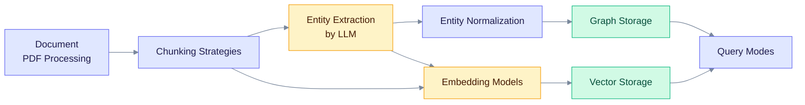

> **Product: v0.32.2** · Contract: OpenAPI · Spec ops: [Ingestion cancel & fairness](../ingestion-cancel-and-fairness.md)

# Deep Dives

These pages explain how EdgeQuake works inside: how a document becomes chunks, entities and vectors, where they are stored, and how a question is answered. Read them when the [concept pages](../concepts/) and the [quick start](../getting-started/quick-start.md) are not enough, for example when you tune retrieval or debug storage.

**Recently rewritten:** [Pipeline Progress](/docs/deep-dives/pipeline-progress/) and [PDF Processing](/docs/deep-dives/pdf-processing/) cover the SPEC-047 vision ingest, the convert and ingest split, and SPEC-057 cancel and status handling.

## How the pages fit together

Read left to right: a document is split, its entities go to the graph, and chunks and entities are embedded into vector storage. Query modes read from both stores.

## Ingestion and extraction

- **[PDF Processing](/docs/deep-dives/pdf-processing/)**: Vision LLM PDF conversion, mm-assets, convert vs ingest.
- **[Chunking Strategies](/docs/deep-dives/chunking-strategies/)**: Document splitting approaches and trade-offs.
- **[Entity Extraction](/docs/deep-dives/entity-extraction/)**: How LLMs extract entities from text.
- **[Gleaning](/docs/deep-dives/gleaning/)**: Multi-pass entity extraction for higher recall.
- **[Entity Normalization](/docs/deep-dives/entity-normalization/)**: Deduplication and canonicalization of entities.

## Algorithm and storage

- **[LightRAG Algorithm](/docs/deep-dives/lightrag-algorithm/)**: The algorithm behind entity extraction and graph construction.
- **[Data Layer](/docs/deep-dives/data-layer/)**: PostgreSQL ER, KV SSOT, AGE, pgvector, FTS, and query×store matrix (code is law).
- **[Graph Storage](/docs/deep-dives/graph-storage/)**: PostgreSQL AGE integration for graph operations.
- **[Vector Storage](/docs/deep-dives/vector-storage/)**: pgvector for embedding-based retrieval.
- **[Community Detection](/docs/deep-dives/community-detection/)**: Graph clustering for global queries.

## Retrieval

- **[Embedding Models](/docs/deep-dives/embedding-models/)**: Supported embedding providers and configuration.
- **[Query Modes](/docs/deep-dives/query-modes/)**: The 6 retrieval modes explained.

## Operations

- **[Cost Tracking](/docs/deep-dives/cost-tracking/)**: Monitor and control LLM API costs.
- **[Pipeline Progress](/docs/deep-dives/pipeline-progress/)**: Real-time processing status and progress tracking.
