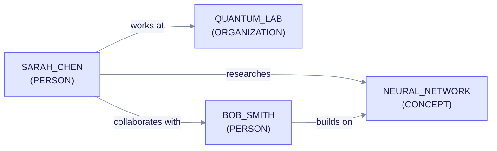
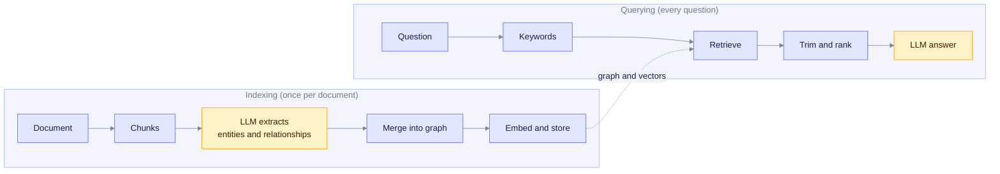
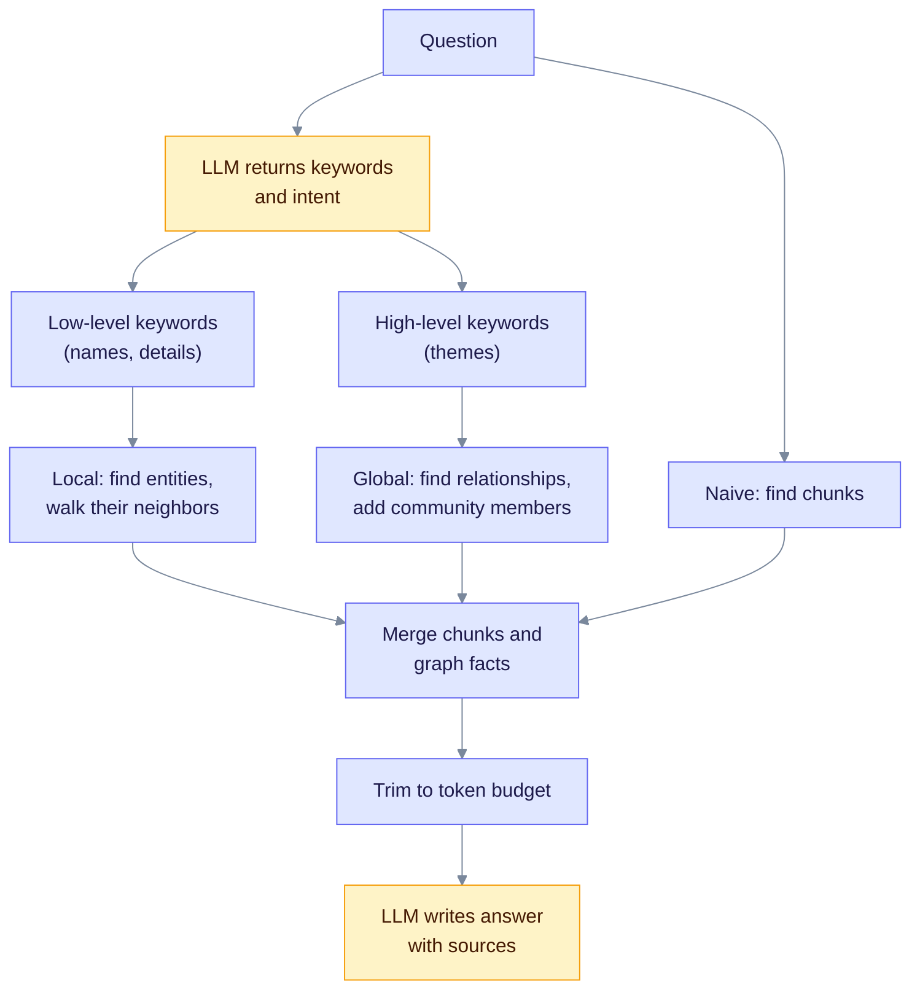

> **Product: v0.32.2** · Contract: OpenAPI · Spec ops: [Ingestion cancel & fairness](../ingestion-cancel-and-fairness.md)

# LightRAG Algorithm Deep-Dive

**What this page explains:** the end-to-end idea behind EdgeQuake: how documents become a knowledge graph, and how a question uses that graph.
**Who it is for:** anyone new to EdgeQuake who wants the mental model before reading the detailed pages.
**What you should know first:** what an LLM and an embedding are. Nothing else.

EdgeQuake is a Rust implementation of the approach from the LightRAG paper (Guo et al., arXiv:2410.05779). It keeps the paper's core idea and adds production features such as multi-tenant storage, streaming, many LLM providers and a PostgreSQL backend. This page is an overview. Each stage links to a page with the details.

## 1. Why a graph helps

Plain RAG (retrieval-augmented generation) cuts documents into chunks, embeds them, and returns the chunks closest to the question. This works for simple fact lookups. It struggles when the answer depends on **how things connect**.

Example question: "How did Sarah Chen's research influence her colleagues at Quantum Lab?" Plain RAG may return one chunk about Sarah, one about her research, and one about the lab. Nothing links them.

A **knowledge graph** stores the links. Each **entity** (a person, organization, concept) is a node. Each **relationship** is an edge with a short description.



The diagram shows a tiny graph. Read an arrow as "source, relation, target". The question above can now follow `SARAH_CHEN` to `BOB_SMITH` to `NEURAL_NETWORK`.

**Entities bridge documents.** If three documents mention "Sarah", "Dr. Chen" and "Sarah Chen", EdgeQuake normalizes the names to one node, `SARAH_CHEN`. That node links the three documents. Names are stored UPPERCASE with underscores. See [Entity Normalization and Merging](entity-normalization.md).

## 2. The two phases



The diagram splits the system in two. Indexing builds the stores once. Querying reads from them for every question. Read each box left to right.

## 3. Indexing

| Step | What happens | Detail page |
| --- | --- | --- |
| Read the file | Text files are read as is. PDFs are converted to markdown first. | [PDF Processing](pdf-processing.md) |
| Chunk | The text is cut into token-sized pieces with some overlap. | [Chunking Strategies](chunking-strategies.md) |
| Extract | For each chunk the LLM returns entities and relationships as JSON. | [Entity Extraction](entity-extraction.md) |
| Glean (optional) | The LLM is asked again for what it missed. | [Gleaning](gleaning.md) |
| Normalize and merge | Names are cleaned. Duplicates merge. Descriptions combine. | [Entity Normalization and Merging](entity-normalization.md) |
| Community labels | A graph algorithm groups related entities. | [Community Detection](community-detection.md) |
| Embed | Chunks, entities and relationships get vectors. | [Embedding Models](embedding-models.md) |
| Store | Vectors go to pgvector. Nodes and edges go to Apache AGE. Documents and chunks go to key-value tables. | [Data Layer](data-layer.md), [Vector Storage](vector-storage.md), [Graph Storage](graph-storage.md) |

Progress and cancellation of this work is described in [Pipeline Progress](pipeline-progress.md). Costs are in [Cost Tracking](cost-tracking.md).

Indexing is **incremental**. A new document is extracted on its own and merged into the existing graph. You never rebuild the whole graph to add a document.

### Extraction output

The production extractor asks the LLM for a JSON object with two lists. Entities have a name, a type and a description. Relationships have a source, a target, keywords and a description. EdgeQuake validates the types, caps the list sizes (40 entities, 100 rows by default) and can ask the model to repair broken JSON once. The tuple format (`entity<|#|>...`) from the original LightRAG prompt exists in the code but is not used in the production path. See [Entity Extraction](entity-extraction.md).

## 4. Querying

A question follows the steps below. [Query Modes](query-modes.md) explains each one.



The diagram shows **dual-level retrieval**. The question yields two keyword lists. Low-level keywords find specific entities. High-level keywords find relationships that describe themes. Read it top to bottom.

- **Local mode** answers "what is X?" by finding entities that look like X and expanding to their neighbors (default 2 hops).
- **Global mode** answers "what are the themes?" by finding relationships that match the high-level keywords, then adding entities from the same community.
- **Naive mode** is plain chunk search.
- **Hybrid** and **mix** run the three together and merge the chunks.
- **Bypass** skips retrieval.

The REST API uses `mix` when no mode is given.

## 5. How EdgeQuake differs from the paper

| Topic | Paper and reference Python code | EdgeQuake |
| --- | --- | --- |
| Language | Python | Rust, async |
| Query modes | `local`, `global`, `hybrid`, `naive`, `mix`, `bypass` | The same six names. `hybrid` here runs local, global and naive. In the reference code `hybrid` is local plus global only. |
| Storage | Several back ends | PostgreSQL in production: pgvector, Apache AGE and key-value tables. The server needs `DATABASE_URL`. |
| Extraction format | Delimited tuples | JSON, with a repair turn |
| Chunk search | Dense vectors | Dense vectors plus a keyword search (PostgreSQL full text), on by default |
| Reranking | Optional | BM25 by default; a neural reranker is opt-in |
| Communities | None | Community ids written at index time and used by global mode |
| Tenancy | Single | Tenants, workspaces and per-workspace settings |
| Providers | Configurable | Many LLM and embedding providers. See [Providers](../providers/index.md). |
| Caching | LLM response cache | Keyword, answer and embedding caches. See [Query Modes](query-modes.md#10-caching). |

EdgeQuake aims for LightRAG-compatible behavior. Its settings reuse LightRAG's token budgets (6,000 entity tokens, 8,000 relationship tokens, 30,000 total). For benchmark results, use the published benchmark reports rather than this page. This page makes no accuracy claims.

## 6. Multi-tenant scoping

Every query and every write is scoped by tenant and workspace. In the library:

```rust
QueryRequest::new("What is AI?")
    .with_tenant_id("acme-corp")
    .with_workspace_id("research-team")
```

In the REST API the scope comes from request headers. See the [REST API reference](../api-reference/rest-api.md).

## 7. Where to go next

| If you want to... | Read |
| --- | --- |
| Understand the shape of the data | [Data Layer](data-layer.md) |
| Pick or tune a query mode | [Query Modes](query-modes.md) |
| Tune extraction | [Entity Extraction](entity-extraction.md), [Gleaning](gleaning.md) |
| Tune chunking | [Chunking Strategies](chunking-strategies.md) |
| Choose an embedding model | [Embedding Models](embedding-models.md) |
| Understand the REST API | [REST API reference](../api-reference/rest-api.md) |

## References

1. Guo et al., "LightRAG: Simple and Fast Retrieval-Augmented Generation", [arXiv:2410.05779](https://arxiv.org/abs/2410.05779).
2. Edge et al., "From Local to Global: A Graph RAG Approach to Query-Focused Summarization", [arXiv:2404.16130](https://arxiv.org/abs/2404.16130).
