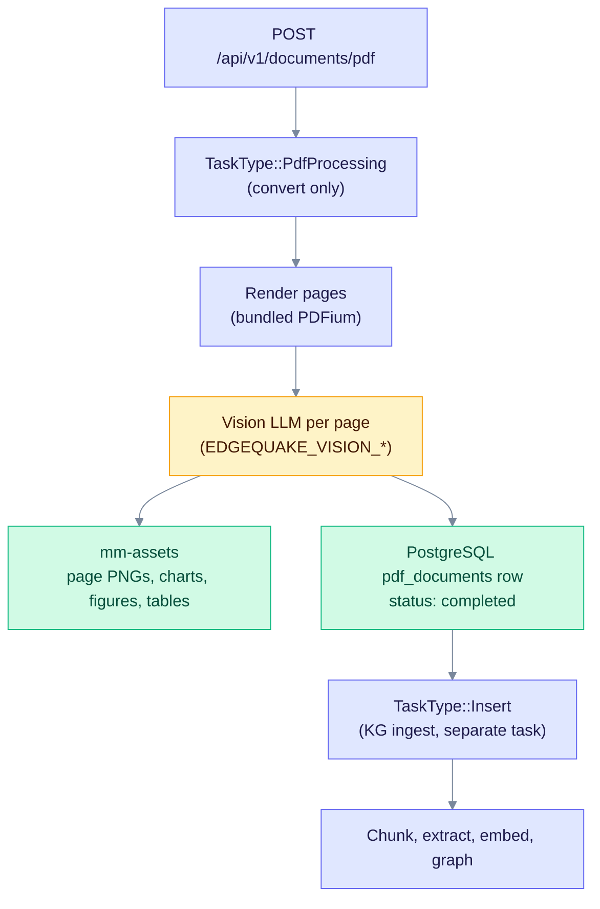
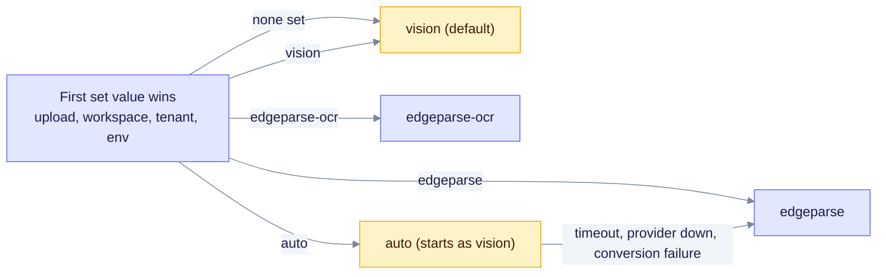
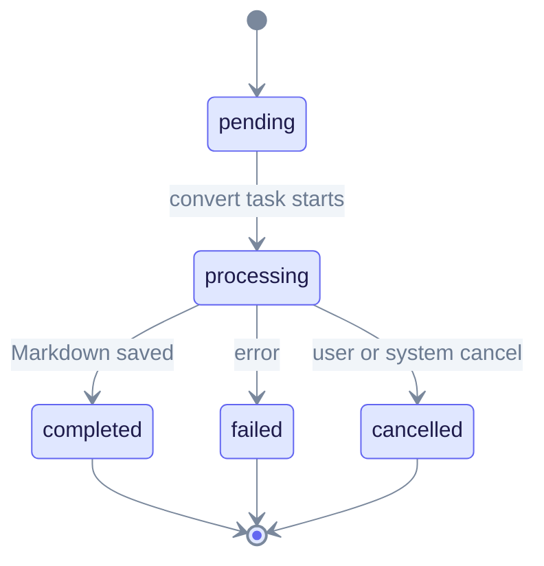
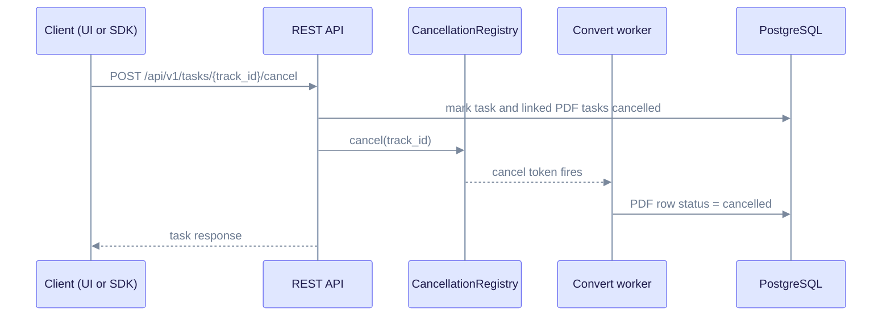

> **Product: v0.32.2** · Contract: OpenAPI · Spec ops: [Ingestion cancel & fairness](../ingestion-cancel-and-fairness.md)

# PDF Processing Deep Dive

**What this page explains:** how a PDF becomes Markdown and then a knowledge graph, which settings control each step, and how cancel and progress work.
**Who it is for:** operators who configure vision models, and developers who call the PDF API or the `edgequake-pdf` crate.
**What you should know first:** PDF ingestion runs in the background. [Pipeline Progress](pipeline-progress.md) explains the task states used here.

**Crate:** `edgequake-pdf` · **Orchestration:** `edgequake-api` processor and task worker (SPEC-047 / SPEC-057)

> **Note:** Earlier versions of this page described a lopdf processor chain (spatial table detection, XY-cut column detection). That code is no longer in `edgequake-pdf`. This page covers only the current path.

## Contents

1. [How it works](#how-it-works)
2. [Choose a parser backend](#choose-a-parser-backend)
3. [Configure the vision model](#configure-the-vision-model)
4. [Multimodal assets](#multimodal-assets)
5. [Status, cancel and progress](#status-cancel-and-progress)
6. [Rust and HTTP entry points](#rust-and-http-entry-points)
7. [Troubleshooting](#troubleshooting)
8. [References](#references)

## How it works

PDF ingestion is a **two-phase pipeline**. The convert phase turns pages into Markdown. The ingest phase then runs the same chunk, extract, embed and graph steps as a text upload. Each phase is its own task, so each has its own timeout and cancel behavior.



*The convert task stops once the Markdown is saved. The insert task never changes the PDF row, so a failed or cancelled ingest keeps the converted Markdown.*

| Phase | Task type | PDF row on success | On cancel |
| --- | --- | --- | --- |
| Convert | `pdf_processing` | `completed`, Markdown saved | `cancelled` (not `failed`) |
| Ingest | `insert` | unchanged | Task and document are cancelled. The PDF row keeps its status. |

## Choose a parser backend

Each upload uses one backend. The first value that is set wins:

1. `pdf_parser_backend` on the upload request (multipart field)
2. The workspace setting
3. The tenant setting
4. `EDGEQUAKE_PDF_PARSER_BACKEND`
5. The default, `vision`

| Backend | What it does | Needs |
| --- | --- | --- |
| `vision` | Renders each page and sends it to the vision model. This is the default. | A vision provider |
| `edgeparse` | CPU-only extraction of born-digital text. No LLM call. | Nothing extra |
| `edgeparse-ocr` | Like `edgeparse`, plus OCR of raster tables with the Tesseract CLI. | Tesseract on the server |
| `auto` | Starts as `vision`. May fall back to `edgeparse` (see below). | A vision provider |



*Only `auto` takes the fallback edge. Explicit `vision` and `edgeparse` never switch backends silently.*

**Fallback rules:** `should_fallback_to_edgeparse` in `edgequake-pdf/src/fallback.rs` returns `false` for any explicit choice. When the vision call times out, the provider is unavailable, or conversion fails under `auto`, the processor switches to EdgeParse and stores a warning on the document. The warning starts with "Vision extraction via ... was unavailable".

## Configure the vision model

The provider and model are resolved from the first variable that is set. Uploads can override both with the `vision_provider` and `vision_model` form fields.

**Provider order:** `EDGEQUAKE_VISION_PROVIDER`, then `EDGEQUAKE_VISION_LLM_PROVIDER`, then `EDGEQUAKE_DEFAULT_LLM_PROVIDER`, then `EDGEQUAKE_LLM_PROVIDER`. Set the provider to `none` to turn vision off.

**Model order:** `EDGEQUAKE_VISION_MODEL`, then `EDGEQUAKE_VISION_LLM_MODEL`, then `EDGEQUAKE_DEFAULT_LLM_MODEL`, then `EDGEQUAKE_LLM_MODEL`. If none is set, a built-in default is used for the provider: `gpt-4.1-nano` for OpenAI, `gemma4:latest` for other providers. A model that does not match the provider is skipped with a warning.

| Variable | Purpose | Default |
| --- | --- | --- |
| `EDGEQUAKE_VISION_PROVIDER` | Vision provider id, for example `openai` or `ollama` | Chat LLM provider |
| `EDGEQUAKE_VISION_MODEL` | Vision model name | Built-in per provider |
| `EDGEQUAKE_VISION_MAX_IMAGE_BYTES` | Size budget per image sent to the model. Larger PNGs are re-encoded as JPEG. `0` disables the guard. | `3500000` |
| `EDGEQUAKE_PDF_EMPTY_PAGE_RETRY` | Re-runs OCR on pages that returned an empty placeholder | On (`0` or `false` disables) |
| `EDGEQUAKE_PDF_PAGE_MODALITY` | Forces the page type: `print`, `manuscript` or `mixed` | Detected automatically |

```bash
EDGEQUAKE_VISION_PROVIDER=openai
EDGEQUAKE_VISION_MODEL=gpt-4.1-nano
```

The full list of options is in `.env.example`.

## Multimodal assets

The convert step writes visual assets next to the Markdown (SPEC-047):

- **Page PNGs** from `write_page_png_assets`, used by the viewer.
- **Chart crops** from `chart_crop.rs`.
- **Figure regions** from `embedded_images.rs` and **table and caption regions** from `region_assets.rs`.

When assets exist, the document metadata gets `has_mm_assets: true`, and the Markdown links to the viewer URLs. During ingest, a multimodal analyze stage can add figure and chart entities to the graph.

## Status, cancel and progress

The convert task sets the PDF row to one of five values. They are stored in lowercase.



*Only the convert task writes these values. Ingest results are reported on the document, not on the PDF row.*

**Cancel** is cooperative. `POST /api/v1/tasks/{track_id}/cancel` fires the cancel token for the task, which stops vision and LLM calls. The cancel chain also cancels the linked convert and insert tasks. A cancelled convert task sets the PDF row to `cancelled`. The processor records a cancel as `cancelled`, never as `failed` (SPEC-057).



*The API returns once the task is marked. The worker stops on its next cancel check, so the PDF row can still show `processing` for a moment.*

**Progress** is available in three forms:

| Channel | Endpoint |
| --- | --- |
| WebSocket | `ws://<host>/ws/progress/{track_id}` |
| Polling | `GET /api/v1/documents/pdf/progress/{track_id}` |
| Server-sent events | `GET /api/v1/documents/pdf/progress/stream/{track_id}` |

The payload and the document stages are described in [Pipeline Progress](pipeline-progress.md).

## Rust and HTTP entry points

The `edgequake-pdf` crate re-exports the main types from `lib.rs`:

- `create_pdf_converter(backend)` returns an `Arc<dyn PdfConverter>`.
- `PdfConverter::convert(pdf_bytes, &PdfConversionConfig)` returns the Markdown as a `String`.
- `PdfParserBackend` selects the backend. `VisionConversionConfig` holds the vision options, such as `provider_name`, `model` and `dpi`.
- `vision_markdown::assemble_vision_markdown*` builds the final Markdown from page results.

```rust
use edgequake_pdf::{create_pdf_converter, PdfConversionConfig, PdfParserBackend};

async fn to_markdown(pdf_bytes: &[u8]) -> Result<String, Box<dyn std::error::Error>> {
    // EdgeParse needs no LLM, so this works without a provider.
    let converter = create_pdf_converter(PdfParserBackend::EdgeParse);
    let markdown = converter
        .convert(pdf_bytes, &PdfConversionConfig::default())
        .await?;
    Ok(markdown)
}
```

Over HTTP, `POST /api/v1/parse` converts a PDF to Markdown without ingesting it. `GET /api/v1/parse/backends` lists the backends the server can use.

## Troubleshooting

| Symptom | Likely cause | Fix |
| --- | --- | --- |
| Document shows "Vision extraction via ... was unavailable ... Falling back to EdgeParse" | Vision timed out or the provider was down, under `auto`. Or vision was disabled for the upload. | Check `EDGEQUAKE_VISION_*` and `GET /health`. Set `pdf_parser_backend` to `vision` to fail instead of falling back. |
| Scanned pages come out empty with `edgeparse` | EdgeParse reads born-digital text only | Use `vision`, or `edgeparse-ocr` with Tesseract installed |
| Pages contain only an empty placeholder | The vision call returned no text for that page | Keep `EDGEQUAKE_PDF_EMPTY_PAGE_RETRY` on. It re-runs OCR when a page render exists. |
| Vision requests are slow or very large | Page images exceed the per-image budget | Tune `EDGEQUAKE_VISION_MAX_IMAGE_BYTES`. Oversized PNGs are re-encoded as JPEG. |
| Figures or charts are missing from the graph | No mm-assets were written, or the multimodal stage did not run | Check `has_mm_assets` in the document metadata |
| PDF shows `cancelled`, not `failed` | Expected after a user or system cancel (SPEC-057) | None needed |
| PDF shows `completed` but the document is still processing | Convert and ingest are separate tasks | Follow the document stage in [Pipeline Progress](pipeline-progress.md) |

## References

### Source code

- **Crate:** [`edgequake/crates/edgequake-pdf/`](https://github.com/raphaelmansuy/edgequake/tree/edgequake-main/edgequake/crates/edgequake-pdf/)
- **Backends and factory:** [`src/backend/mod.rs`](https://github.com/raphaelmansuy/edgequake/blob/edgequake-main/edgequake/crates/edgequake-pdf/src/backend/mod.rs), [`src/backend/vision.rs`](https://github.com/raphaelmansuy/edgequake/blob/edgequake-main/edgequake/crates/edgequake-pdf/src/backend/vision.rs), [`src/backend/edgeparse.rs`](https://github.com/raphaelmansuy/edgequake/blob/edgequake-main/edgequake/crates/edgequake-pdf/src/backend/edgeparse.rs)
- **Fallback policy:** [`src/fallback.rs`](https://github.com/raphaelmansuy/edgequake/blob/edgequake-main/edgequake/crates/edgequake-pdf/src/fallback.rs)
- **Assets:** [`src/page_assets.rs`](https://github.com/raphaelmansuy/edgequake/blob/edgequake-main/edgequake/crates/edgequake-pdf/src/page_assets.rs), [`src/chart_crop.rs`](https://github.com/raphaelmansuy/edgequake/blob/edgequake-main/edgequake/crates/edgequake-pdf/src/chart_crop.rs), [`src/region_assets.rs`](https://github.com/raphaelmansuy/edgequake/blob/edgequake-main/edgequake/crates/edgequake-pdf/src/region_assets.rs), [`src/embedded_images.rs`](https://github.com/raphaelmansuy/edgequake/blob/edgequake-main/edgequake/crates/edgequake-pdf/src/embedded_images.rs)
- **Orchestration:** [`edgequake-api/src/processor/pdf_processing.rs`](https://github.com/raphaelmansuy/edgequake/blob/edgequake-main/edgequake/crates/edgequake-api/src/processor/pdf_processing.rs), [`src/services/task_cancel.rs`](https://github.com/raphaelmansuy/edgequake/blob/edgequake-main/edgequake/crates/edgequake-api/src/services/task_cancel.rs)
- **Status enum:** [`edgequake-storage/src/pdf_storage.rs`](https://github.com/raphaelmansuy/edgequake/blob/edgequake-main/edgequake/crates/edgequake-storage/src/pdf_storage.rs)

### Tests

- [`edgequake-pdf/tests/`](https://github.com/raphaelmansuy/edgequake/tree/edgequake-main/edgequake/crates/edgequake-pdf/tests)
- [`edgequake-pdf/test-data/`](https://github.com/raphaelmansuy/edgequake/tree/edgequake-main/edgequake/crates/edgequake-pdf/test-data)

### Related documentation

- [Pipeline Progress](pipeline-progress.md)
- [Ingestion cancel & fairness](../ingestion-cancel-and-fairness.md)
- [Architecture Overview](/docs/architecture/overview/)
- [Document Ingestion Tutorial](/docs/tutorials/document-ingestion/)
- [PDF Ingestion Tutorial](/docs/tutorials/pdf-ingestion/)
- [API Reference: Extended API](/docs/api-reference/extended-api/)
- [Troubleshooting Common Issues](/docs/troubleshooting/common-issues/)

---

**Product:** v0.32.2 · **Last updated:** 2026-10-10
