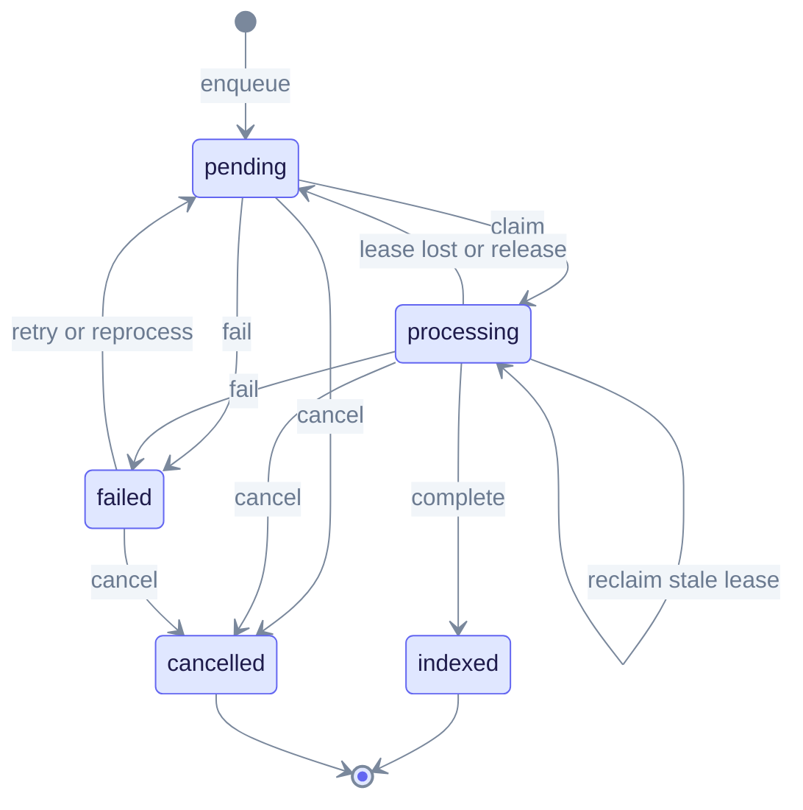
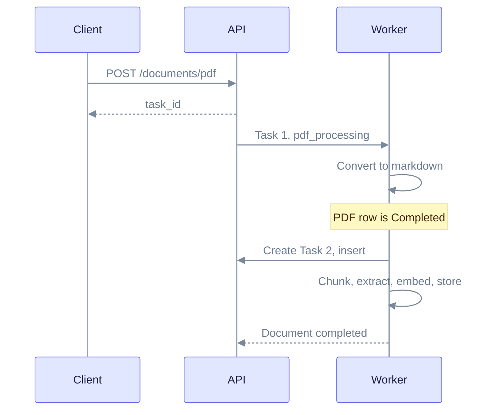
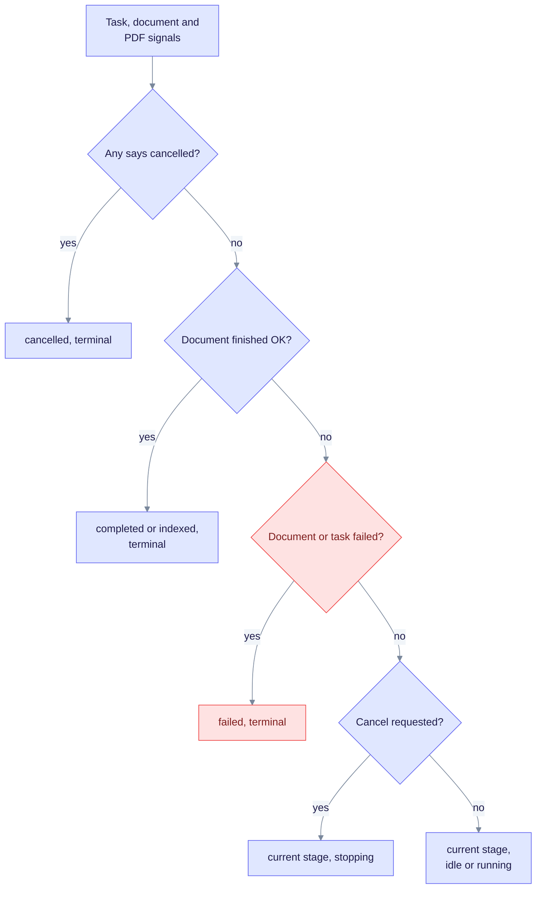
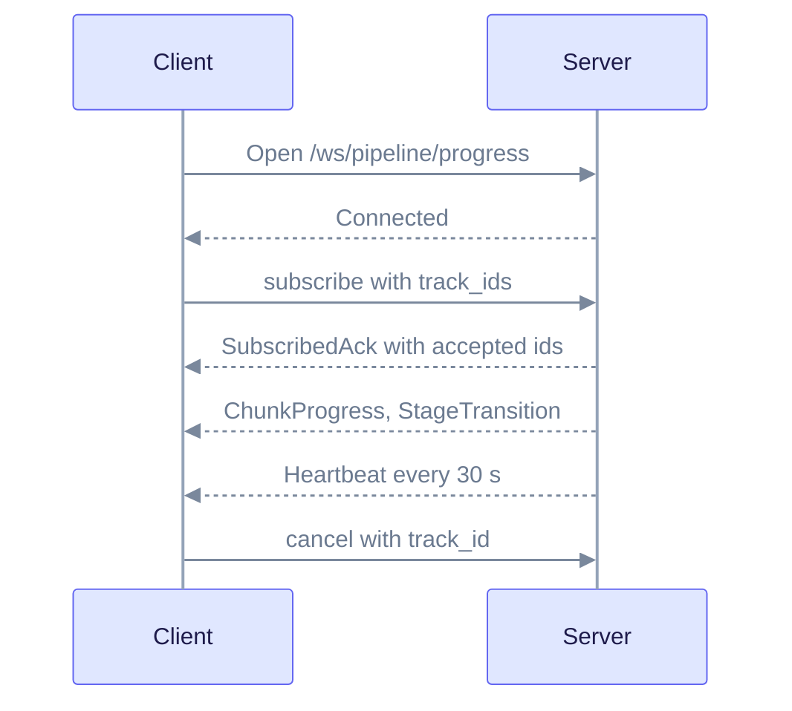
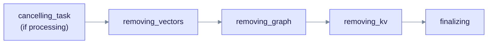

> **Product: v0.32.2** · Contract: OpenAPI · Spec ops: [Ingestion cancel & fairness](../ingestion-cancel-and-fairness.md)

# Deep Dive: Pipeline Progress Tracking

**What this page explains:** the ways to watch ingestion, PDF conversion and deletion, and what the status values mean.
**Who it is for:** client developers and operators building progress bars or dashboards.
**What you should know first:** uploads are asynchronous. The server accepts a file, returns an id, and works in the background. See [Cost Tracking](cost-tracking.md) for the `cost_usd` field.

The examples use `http://localhost:8080`. The full schema is in the OpenAPI snapshot at `edgequake_webui/openapi/openapi.snapshot.json`.

## 1. The id you follow

Every upload, PDF job or reprocess returns a **`task_id`**. Use it as `{track_id}` in every path below. A `track_id` that the client sends with an upload is only a label. Progress is always keyed by the server-generated id.

| Upload | Endpoint | Returns |
| --- | --- | --- |
| Text or file | `POST /api/v1/documents/upload` | `task_id` when the work is async |
| PDF | `POST /api/v1/documents/pdf` | `task_id` shaped like `pdf-<uuid>` |

## 2. Task states

A task is one unit of queued work. Its state changes only through one table of legal moves (`edgequake-tasks/src/state_machine.rs`). Any other move is rejected and the task stays unchanged.



The diagram shows every legal move. Read it from `[*]` at the top: a task is queued, claimed by a worker, and ends as `indexed` (success), `failed` or `cancelled`.

| State | Meaning |
| --- | --- |
| `pending` | Waiting for a worker |
| `processing` | A worker holds a lease on it |
| `indexed` | Finished successfully (terminal) |
| `failed` | An attempt failed. It can retry or be reprocessed |
| `cancelled` | Stopped on request (terminal) |

Notes:

- **Lease.** A worker holds a time-limited lease. If it expires (a crash, for example), another worker reclaims the task. `lease lost` returns it to `pending`.
- **Release.** A worker can hand a task back on purpose, for example when the tenant fairness gate parks it. See [Ingestion cancel & fairness](../ingestion-cancel-and-fairness.md).
- **Failed is not final.** `failed` can go back to `pending` through an automatic retry or a manual reprocess. Only `indexed` and `cancelled` have no way out.
- **Task types.** `upload`, `insert`, `scan`, `reindex`, `pdf_processing`, `knowledge_injection`, `deletion`, `batch_deletion`, `workspace_wipe`.

Do not confuse the **task** state (`indexed`) with the **document** status (`completed`). The next sections explain the document view.

## 3. PDF: convert, then ingest

A PDF upload creates **two linked tasks**. The first converts the PDF to markdown. The second ingests the markdown into the knowledge graph.



The diagram shows why a PDF can read "Completed" while the document is still working. Read it top to bottom: only the second task finishes the document.

| Phase | Task type | Timeout source | PDF row when done |
| --- | --- | --- | --- |
| Convert | `pdf_processing` | `LargeDocumentProfile::convert_timeout_secs` | `Completed`, with markdown |
| Ingest | `insert` | `LargeDocumentProfile::ingest_timeout_secs` | unchanged |

**For UIs:** a `Completed` PDF row means *convert finished*, not *ingest finished*. Show the **document** stage instead (section 4). Cancelling the PDF with `DELETE /api/v1/documents/pdf/{pdf_id}/cancel` cancels both linked tasks while they are pending or processing. See [PDF Processing](pdf-processing.md).

## 4. Document status for badges

List and detail responses carry two fields built by `IngestionStatusMapper`. Use them instead of reading raw `status`.

| Field | Values |
| --- | --- |
| `display_status` | `pending`, `uploading`, `preprocessing`, `converting`, `chunking`, `extracting`, `embedding`, `storing`, `projecting`, `completed`, `indexed`, `partial_success`, `partial_failure`, `failed`, `cancelled` |
| `ui_phase` | `idle`, `running`, `stopping`, `terminal` |

How the mapper decides, in order:



The diagram shows the priority order. Read it top to bottom; the first matching question wins.

Two details matter:

- A finished convert task does not paint the badge `completed` while the document row is still in flight. The document row is the source of truth.
- `ui_phase=stopping` shows only while cancel is pending and the document is not yet terminal. The UI should read "Stopping...". Cancel is cooperative: the current LLM or vision call finishes first.

## 5. Ways to watch

| Channel | Path | Best for |
| --- | --- | --- |
| WebSocket, global | `ws://localhost:8080/ws/pipeline/progress` | Dashboards, many uploads |
| WebSocket, one track | `ws://localhost:8080/ws/progress/{track_id}` | One upload page |
| REST, one track | `GET /api/v1/ingestion/{track_id}/progress` | Polling a document |
| REST, batch | `POST /api/v1/ingestion/progress` | Polling many tracks |
| REST, PDF phases | `GET /api/v1/documents/pdf/progress/{track_id}` | PDF phase bars |
| SSE, PDF phases | `GET /api/v1/documents/pdf/progress/stream/{track_id}` | PDF push updates |
| REST, task row | `GET /api/v1/tasks/{track_id}`, `GET /api/v1/tasks` | Raw task state |
| Cancel | `POST /api/v1/tasks/{track_id}/cancel` | Cancel button |
| Retry | `POST /api/v1/tasks/{track_id}/retry` | Retry a failed task |
| Queue health | `GET /api/v1/pipeline/queue-metrics` | Operators |

The old `/api/v1/rag/progress/*` paths are gone.

### 5.1 WebSocket authentication

- Send credentials in the normal `Authorization: Bearer` header, or offer the subprotocol `edgequake.bearer` (browsers cannot set headers on a WebSocket).
- A `?token=` query parameter is **rejected** with 401.
- The server also checks the `Origin` header against the CORS allow-list.
- Every track you touch must belong to your workspace. A foreign id gives 404 on the per-track socket and is silently skipped when subscribing on the global socket.

### 5.2 Global socket: you must subscribe

The global socket sends **no track events until you subscribe**. This is the most common mistake.



The diagram shows the handshake. Read it top to bottom: events for a track start only after the acknowledgement.

Client commands (JSON text frames):

| Command | Fields | Effect |
| --- | --- | --- |
| `subscribe` | `track_ids` | Receive events for these tracks. Up to 256 per socket |
| `unsubscribe` | `track_ids` | Stop receiving them |
| `cancel` | `track_id` | Same as `POST /tasks/{track_id}/cancel` |
| `ping` | optional `client_time` | Server replies with a `Heartbeat` |
| the plain text `status` | none | Server replies with `StatusSnapshot` (auth off only) |

```javascript
const ws = new WebSocket('ws://localhost:8080/ws/pipeline/progress');
ws.onopen = () => ws.send(JSON.stringify({ type: 'subscribe', track_ids: [taskId] }));
ws.onmessage = (event) => {
  const { type, data } = JSON.parse(event.data);
  if (type === 'ChunkProgress') {
    console.log(`Chunk ${data.chunk_index + 1}/${data.total_chunks}, $${data.cost_usd}`);
  }
};
```

Events, grouped by when the global socket delivers them:

| Group | Events | Delivered to |
| --- | --- | --- |
| Always | `Connected`, `Heartbeat`, `Message`, `SubscribedAck`, `CancellationRequested` | Everyone |
| Job-wide | `JobStarted`, `DocumentProgress`, `DocumentFailed`, `BatchCompleted`, `JobFinished`, `StatusSnapshot` | Only unscoped sessions (auth off) |
| Per track | `ChunkProgress`, `ChunkFailure`, `StageTransition`, `PdfPageProgress`, `GraphStorageProgress`, `DeletionStarted`, `DeletionPhase`, `DeletionCompleted`, `DeletionFailed` | Subscribed tracks only |
| Bulk delete | `BulkDeletionStarted`, `BulkDeletionItemProgress`, `BulkDeletionCompleted`, `BulkDeletionFailed` | Subscribed wipe track, or the same workspace |

If a client reads too slowly, the server drops events and sends a `Message` with level `warn`. Reconnect if progress looks stuck.

`ChunkProgress` carries `document_id`, `task_id`, `chunk_index`, `total_chunks`, `chunk_preview`, `time_ms`, `eta_seconds`, `tokens_in`, `tokens_out` and `cost_usd`.

### 5.3 Per-track socket

`ws://localhost:8080/ws/progress/{track_id}` needs no subscribe step. It first sends `Connected`, then a `ProgressSnapshot` with the current PDF phases (if any), then **every** event for that track from the table above, plus `Heartbeat` every 30 s. Send the text `status` to get a fresh snapshot, or `{"type":"cancel"}` to cancel.

```javascript
const ws = new WebSocket(`ws://localhost:8080/ws/progress/${taskId}`);
ws.onmessage = (event) => {
  const { type, data } = JSON.parse(event.data);
  if (type === 'PdfPageProgress') {
    console.log(`Page ${data.page_num}/${data.total_pages}: ${data.phase}`);
  }
};
```

### 5.4 REST: ingestion progress

```bash
curl -H "X-Workspace-ID: {workspace_id}" \
     -H "Authorization: Bearer {token}" \
     "http://localhost:8080/api/v1/ingestion/{track_id}/progress"
```

The response (`IngestionProgressResponse`) includes `track_id`, `document_id`, `filename`, `stage`, `stage_status`, `message`, `status`, `updated_at`, a `progress` object (`current_stage`, `completion_percentage`, `latest_message`, `stages[]`, `eta_seconds`), optional `counts` (`current`, `total`, `unit` of `pages`, `chunks`, `entities` or `relationships`), optional `cost_usd`, and `started_at` and `completed_at`.

Batch form:

```bash
curl -X POST "http://localhost:8080/api/v1/ingestion/progress" \
  -H "Content-Type: application/json" -H "X-Workspace-ID: {workspace_id}" \
  -d '{"track_ids": ["pdf-abc", "insert-def"]}'
```

### 5.5 PDF phases (REST and SSE)

The PDF progress object has six phases, always in this order: `upload`, `pdf_conversion`, `chunking`, `embedding`, `extraction`, `graph_storage`. The response gives `phases[]`, `overall_percentage`, `is_complete` and `is_failed`.

```bash
curl "http://localhost:8080/api/v1/documents/pdf/progress/{track_id}" -H "X-Workspace-ID: {workspace_id}"
curl -N "http://localhost:8080/api/v1/documents/pdf/progress/stream/{track_id}" -H "X-Workspace-ID: {workspace_id}"
```

The SSE stream checks every 500 ms and sends a message only when the percentage changes by more than 0.01 or the job ends. The events have **names**: `progress`, `complete`, `error` and `timeout`. The stream closes on `complete` or `error`. It sends `timeout` and closes if no progress record exists for about 60 seconds.

Named events do not reach `onmessage`. Listen for them by name:

```javascript
const es = new EventSource(`/api/v1/documents/pdf/progress/stream/${taskId}`, { withCredentials: true });
es.addEventListener('progress', (e) => console.log(`${JSON.parse(e.data).overall_percentage}%`));
for (const name of ['complete', 'error', 'timeout']) {
  es.addEventListener(name, () => es.close());
}
```

## 6. Cancel

`POST /api/v1/tasks/{track_id}/cancel` records a cancel intent. The worker stops at the next safe point, so there is a short delay. Until the task, document and PDF all show cancelled, `ui_phase` is `stopping`. After that the badge is `cancelled` and `ui_phase` is `terminal`. Cancelling a `failed` task also moves it to `cancelled`. Details and fairness rules are in [Ingestion cancel & fairness](../ingestion-cancel-and-fairness.md).

## 7. Delete progress

Deleting a document broadcasts these phases to subscribed clients:



The diagram shows the order of delete phases. Read it left to right; the first step runs only if ingestion is still in flight.

| Phase | What it removes |
| --- | --- |
| `cancelling_task` | Stops in-flight ingestion |
| `removing_vectors` | pgvector embeddings |
| `removing_graph` | Entities and edges that belong only to this document |
| `removing_kv` | Chunks, content and metadata |
| `finalizing` | Content-hash key and relational rows |

The event order is `DeletionStarted`, then repeated `DeletionPhase`, then `DeletionCompleted` (or `DeletionFailed`). Preview the impact first with `GET /api/v1/documents/{document_id}/deletion-impact`. The delete endpoint returns a `202 Accepted` with a `track_id` when the cascade runs in the background. It returns `200` with the final counts when it finishes inline. Both use the same body, `DeleteDocumentResponse`, which holds `chunks_deleted`, `entities_affected`, `relationships_affected`, `embeddings_deleted` and `partial_failure`. Bulk delete emits `BulkDeletionStarted`, `BulkDeletionItemProgress` and `BulkDeletionCompleted`.

## 8. Which channel to pick

| Scenario | Use |
| --- | --- |
| Document list badges | Poll list or detail and read `display_status` and `ui_phase` |
| One PDF upload page | Per-track WebSocket or PDF SSE |
| Pipeline dashboard | Global WebSocket with `subscribe` |
| Background script | `GET /ingestion/{track_id}/progress` or `GET /tasks/{track_id}` |
| Cancel button | `POST /tasks/{track_id}/cancel`, then wait for `ui_phase=terminal` |

## Related pages

- [Ingestion cancel & fairness](../ingestion-cancel-and-fairness.md): cancel rules, fairness, restarts.
- [Cost Tracking](cost-tracking.md): token and cost fields.
- [PDF Processing](pdf-processing.md): what the convert step does.
- [REST API reference](../api-reference/rest-api.md): all endpoints.
