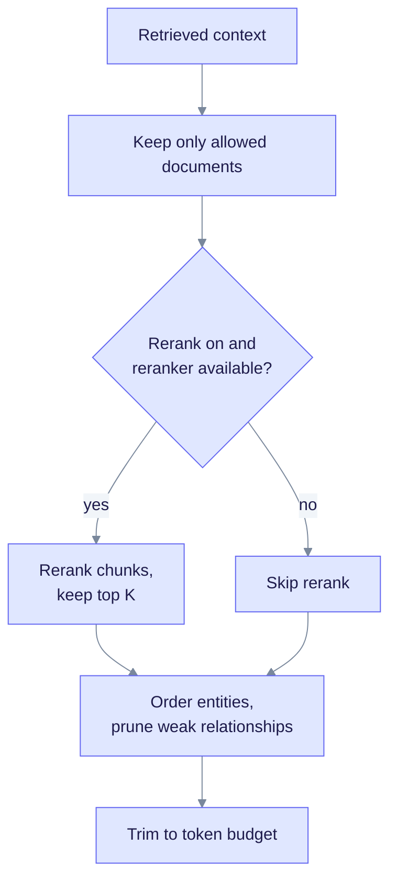
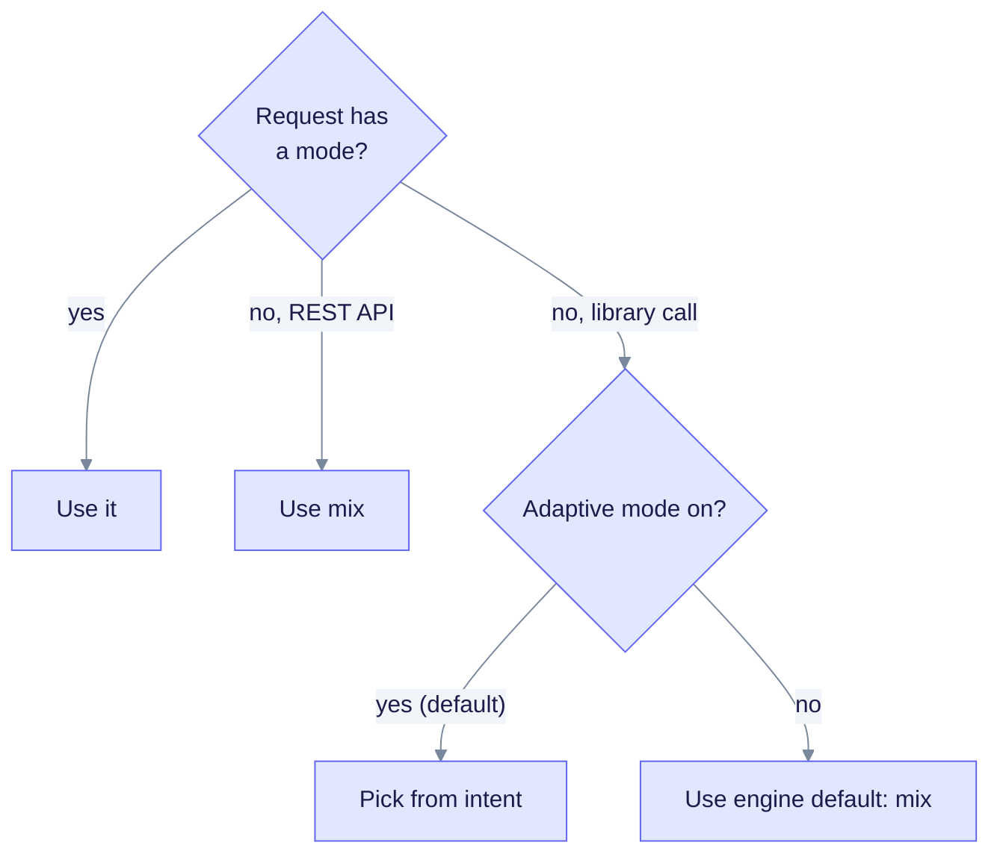
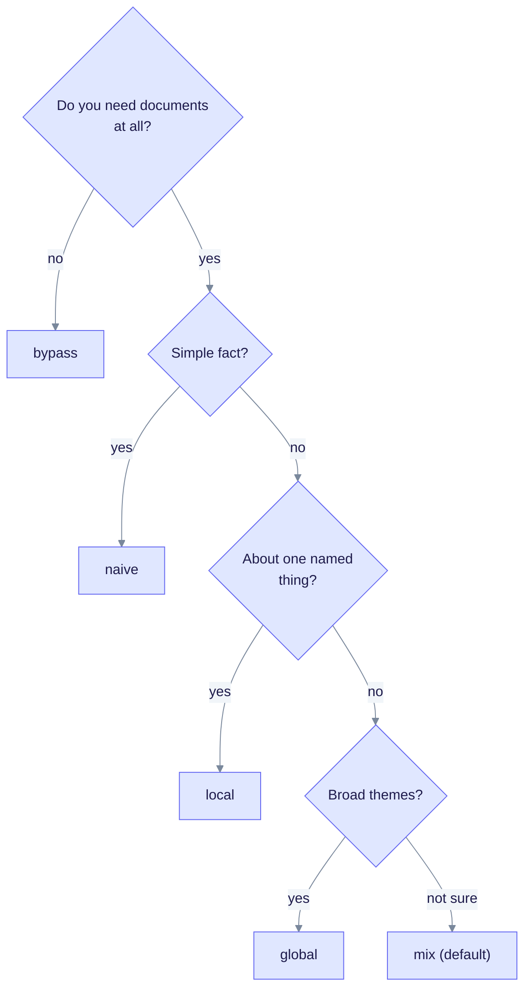
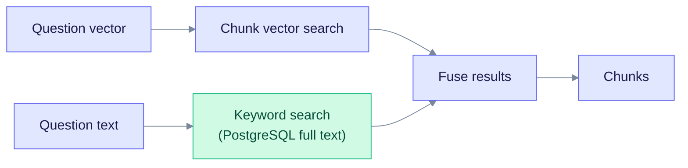
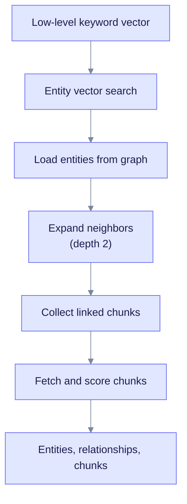
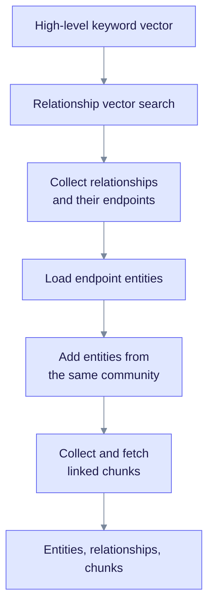
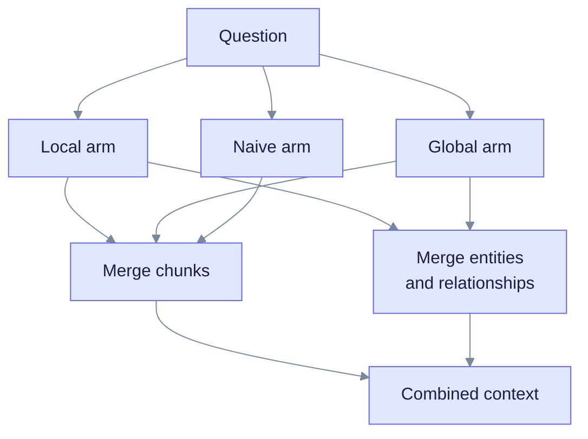
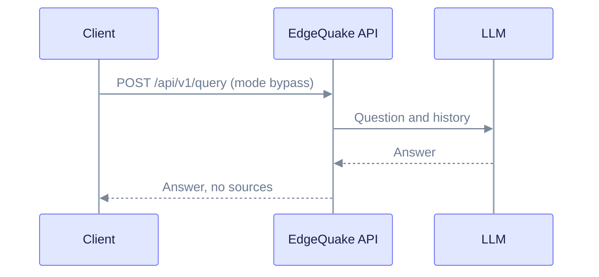
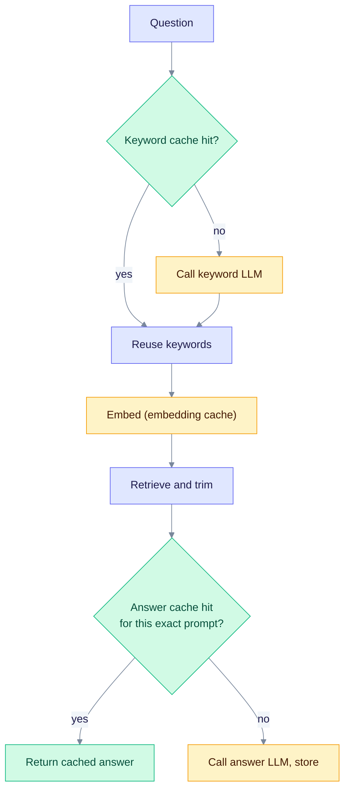

> **Product: v0.32.2** · Contract: OpenAPI · Spec ops: [Ingestion cancel & fairness](../ingestion-cancel-and-fairness.md)

# Query Modes Deep-Dive

EdgeQuake answers a question in two steps: it retrieves evidence from the knowledge graph and the vector store, then asks the LLM to write an answer from that evidence. The **query mode** decides where the evidence comes from. This page covers the six modes, the steps every query shares, and the settings that change the behavior.

**Who it is for:** developers and operators who call `POST /api/v1/query` and want to pick a mode or debug an answer.

**What you should know first:** the ideas of a knowledge graph (entities and relationships) and vector search. See [Graph RAG](../concepts/graph-rag.md) and [LightRAG Algorithm](lightrag-algorithm.md) if these are new.

Defaults below come from the `edgequake-query` crate and the API handlers. Where an environment variable changes a default, its name is given. The full list is in the [environment reference](../operations/env-reference.md) and the [configuration guide](../operations/configuration.md).

## 1. The six modes at a glance

A **mode** decides *where* EdgeQuake looks for evidence before the LLM writes an answer.

| Mode | Looks at | Best for |
| --- | --- | --- |
| `naive` | Text chunks only (vector search plus keyword search) | Simple fact questions |
| `local` | Entities close to the question, their neighbors, and linked chunks | Questions about a named thing |
| `global` | Relationships that match the question, plus related entities and linked chunks | Themes and overviews |
| `hybrid` | `local`, `global` and `naive` run together, chunks interleaved | Multi-part questions |
| `mix` | The same three searches as `hybrid`, with per-search weights | General use (**API default**) |
| `bypass` | Nothing. The LLM answers directly | Chat, testing, "no documents" |

Mode names are case-insensitive. `chat` is an alias for `bypass`.

**Default mode.** The REST API uses `mix` when a request has no `mode` or an unknown one. Library callers who build a `QueryRequest` without a mode get a different rule: with adaptive mode on (the default), the engine picks a mode from the question's intent. See [section 3](#3-picking-a-mode).

## 2. What every query does

All modes share the same outer steps. Only the retrieve step differs.

```mermaid
%%{init: {"theme":"base","themeVariables":{"primaryColor":"#E0E7FF","primaryBorderColor":"#6366F1","primaryTextColor":"#1E1B4B","secondaryColor":"#D1FAE5","secondaryBorderColor":"#10B981","secondaryTextColor":"#064E3B","tertiaryColor":"#FEF3C7","tertiaryBorderColor":"#F59E0B","tertiaryTextColor":"#6B7A90","lineColor":"#7A889C","clusterBkg":"rgba(99,102,241,0.07)","clusterBorder":"#A5B4FC","noteBkgColor":"#FEF9C3","noteTextColor":"#422006","textColor":"#6B7A90","titleColor":"#6B7A90","signalColor":"#7A889C","signalTextColor":"#6B7A90","loopTextColor":"#6B7A90","edgeLabelBackground":"#F1F5F9","actorLineColor":"#94A3B8"}}}%%
%% eq-theme:v1
flowchart LR
  A["Question"] --> B["Prepare:<br>keywords and embeddings"]
  B --> C["Retrieve:<br>depends on mode"]
  C --> D["Filter and rerank"]
  D --> E["Trim to token budget"]
  E --> F["Build prompt"]
  F --> G["LLM answer"]
%% eq-classes
classDef eqLlm fill:#FEF3C7,stroke:#F59E0B,color:#451A03
class B,G eqLlm
```



Read left to right: the question yields search hints, the hints fetch evidence, the evidence is tidied and fitted into the budget, and only then does the LLM answer.

### 2.1 Prepare

1. **Keywords.** One LLM call returns two keyword lists and an intent label as JSON. Set `EDGEQUAKE_KEYWORD_MODE=heuristic` to use rules instead.
   - *high-level* keywords: themes and concepts (used by `global`);
   - *low-level* keywords: names and specifics (used by `local`);
   - *intent*: `factual`, `relational`, `exploratory`, `comparative` or `procedural`.
2. **Embeddings.** The question and each keyword group are embedded. On a cold cache, embedding and keyword extraction run at the same time.

Shortcuts:

| Situation | What happens |
| --- | --- |
| `EDGEQUAKE_KEYWORD_MODE=heuristic` | Skips the keyword LLM; uses rule-based keywords and a rule-based intent |
| Request sets `hl_keywords` or `ll_keywords` | Skips the keyword LLM |
| Keyword cache hit | Skips the keyword LLM and the speculative query embedding |
| Conversation history present | History is added to the keyword prompt only. The question vector is embedded from the question alone |

### 2.2 Filter, rerank, trim

After retrieval, the same post-processing runs for every mode except `bypass`:



Read top to bottom. The rerank step is optional, and the other steps always run.

- **Document filter.** Chunks and entities from documents outside the allowed set are removed.
- **Rerank.** On by default (`enable_rerank`, default `true`). The default reranker is **BM25** (keyword scoring). Set `EDGEQUAKE_RERANKER=cross_encoder` for a neural reranker. With `EDGEQUAKE_FACT_RERANKER=bm25` (off by default), factual questions always use BM25. Chunks scoring below `min_rerank_score` (default 0.1, `EDGEQUAKE_MIN_RERANK_SCORE`) are dropped. If that would drop every chunk, the original top K is kept. `rerank_top_k` defaults to 20.
- **Entity order.** Entities keep their retrieval order by default (`EDGEQUAKE_ENTITY_RANK=retrieval`). Other values: `degree`, `query_score`.
- **Relationship pruning.** When a question has at least 5 relationships, about 40% of the lowest-scoring ones are dropped. At least 3 are always kept. `EDGEQUAKE_PATH_PRUNE=off` disables it.
- **Token budget.** See [section 9](#9-the-token-budget).

### 2.3 Answer

- `context_only: true` returns the evidence without calling the LLM.
- `prompt_only: true` returns the finished prompt without calling the LLM.
- Otherwise the LLM answers. If the answer cache is on and the exact same prompt was answered before, the cached answer is returned. See [section 10](#10-caching).

## 3. Picking a mode

An explicit mode always wins. The diagram shows the fallback order when none is given.



Read from the top: the first matching rule decides the mode.

When the library picks by intent, the mapping is:

| Intent | Example question | Mode picked |
| --- | --- | --- |
| Factual | "What is the greenhouse effect?" | `naive` |
| Relational | "How does X relate to Y?" | `hybrid` |
| Exploratory | "Tell me about climate research" | `global` |
| Comparative | "Compare X and Y" | `mix` |
| Procedural | "How do I set this up?" | `mix` |

For a manual choice, use this decision aid:



This is a decision aid, not code. Stop at the first answer that fits.

## 4. Naive mode

Naive mode searches text chunks directly. It does not touch the knowledge graph.



Two searches run over the same chunks. The fused list is the result.

- It builds a keyword candidate pool of `max_chunks` x 5 (default 20 x 5 = 100). The multiplier is `EDGEQUAKE_BM25_CANDIDATE_MULTIPLIER`, range 2 to 20.
- Results scoring below `min_score` (default 0.1, `EDGEQUAKE_MIN_ENTITY_SCORE`) are dropped.
- The keyword search is on by default. `EDGEQUAKE_BM25_RETRIEVAL=false` turns it off. On PostgreSQL it uses full-text ranking (`ts_rank_cd`), which is close to but not the same as BM25. The in-memory adapter uses real BM25.
- By default the fused order follows the keyword hits (`EDGEQUAKE_SPARSE_FUSION=sparse_first`). Set it to `rrf` to blend ranks instead.
- If the question mentions charts or figures, chart chunks may be preferred.

## 5. Local mode

Local mode starts from entities that match the question's specifics, then walks outward in the graph.



Read top to bottom. Each step feeds the next.

Steps:

1. Search entity vectors with the low-level keyword embedding. It fetches `max_entities` x 3 candidates and keeps up to `max_entities` (60) that score at least `min_score`.
2. Load those entities (name, type, description, degree) from the graph.
3. Expand to neighboring relationships up to `graph_depth` (2) hops, capped at `max_relationships` (60). The walk is breadth-first by default. `EDGEQUAKE_GRAPH_WALK=ppr` switches to Personalized PageRank.
4. Collect the chunk ids that entities and relationships point to. Each source contributes at most `related_chunk_number` (5, `EDGEQUAKE_RELATED_CHUNK_NUMBER`). Pick the best chunks by vector score (`EDGEQUAKE_KG_CHUNK_PICK=vector`, the default) or by edge weight (`weight`).
5. Run the same keyword fusion as naive mode on those chunks.

Fallbacks when no entity matches, in order:

1. Entities whose label exactly matches the question text or keywords.
2. The most connected entities in the graph ("popular nodes"). Skipped when an exact label match exists. Set `EDGEQUAKE_POPULAR_NODE_FALLBACK=0` to disable.

## 6. Global mode

Global mode starts from *relationships* instead of entities.



Read top to bottom. Community membership widens the entity set before the chunks are fetched.

Steps:

1. Search relationship vectors with the high-level keyword embedding. It fetches `max_relationships` x 3 candidates and keeps up to `max_relationships` (60) that score at least `min_score`.
2. Each hit becomes a relationship. Both endpoints become entities.
3. **Community expansion** is on by default. `EDGEQUAKE_COMMUNITY_GLOBAL=false` disables it. Entities that share a `community_id` with the seed entities are added, up to `max_entities` x 2 candidates. The `community_id` labels are written at index time. See [Community Detection](community-detection.md).
4. If `EDGEQUAKE_COMMUNITY_REPORTS=true`, matching community report summaries are added as extra context (at most 8). This is off by default.
5. Linked chunks are fetched and fused the same way as in local mode, using the high-level embedding.

If no relationship matches, the same exact-label and popular-node fallbacks as local mode apply.

Global mode does **not** build or query LLM-written community summaries by default. It relies on relationship vectors plus community membership.

## 7. Hybrid and Mix modes

Both modes run the local, global and naive searches at the same time, then merge the three chunk lists.



Read it as: the three arms fan out in parallel, then chunk lists and graph facts are merged separately.

Shared rules:

- An arm that returns **no chunks** has its entities and relationships discarded. This avoids prompt text that has no page evidence.
- Entities and relationships come from the local and global arms only. Naive adds chunks only.
- The merged chunk list is capped at `max_chunks` (20).

### 7.1 How chunks are merged

By default both modes use **round-robin**: take one chunk from local, then global, then naive, and repeat, skipping duplicates. This follows LightRAG.

| Setting | Values | Default |
| --- | --- | --- |
| `EDGEQUAKE_HYBRID_FUSION` (hybrid) | `round_robin`, `rrf` | `round_robin` |
| `EDGEQUAKE_MIX_FUSION` (mix) | `round_robin`, `rrf`, `max_after_minmax` (also `weighted`, `max`) | `round_robin` |

- `rrf` is Reciprocal Rank Fusion. Each list adds `weight / (60 + rank + 1)` to a chunk's score.
- `max_after_minmax` rescales each arm's scores to 0..1, multiplies by the arm weight, then keeps the **highest** value across arms. It is not a weighted sum.

### 7.2 What differs between hybrid and mix

| | Hybrid | Mix |
| --- | --- | --- |
| Arms | All three, except when gated (below) | All three, always |
| Arm weights | None | `local`, `global`, `naive`, each 1.0 by default |
| Per-request weights | No | Yes, `mix_weights` |
| Skip an arm | Only through the intent gate | Set its weight to 0 |

**Mix weights.** Set defaults with `EDGEQUAKE_MIX_LOCAL_WEIGHT`, `EDGEQUAKE_MIX_GLOBAL_WEIGHT` and `EDGEQUAKE_MIX_NAIVE_WEIGHT`, or override them per request:

```json
{ "query": "...", "mode": "mix", "mix_weights": { "local": 0, "global": 0, "naive": 1 } }
```

A weight of 0 skips that arm. Weights change the order only under `rrf` or `max_after_minmax`. Under the default round-robin they only decide whether an arm runs. Set `EDGEQUAKE_MIX_INTENT_WEIGHTS=1` to tilt the weights by intent: factual questions favor naive, and relational ones favor local and global.

**Hybrid intent gate.** Only when `EDGEQUAKE_MIX_ARM_GATE` is set to a true value (off by default) does hybrid skip arms by intent:

| Intent | Arms run |
| --- | --- |
| Factual | local, naive |
| Relational, comparative, procedural | local, global, naive |
| Exploratory | global, naive |

Mix ignores this gate and always runs all three arms.

## 8. Bypass mode

Bypass sends the question to the LLM with no retrieval and no RAG prompt. Conversation history is included. Use it for plain chat, or to see what the LLM says without your documents. On the streaming endpoint (`POST /api/v1/query/stream`), the answer streams token by token when the provider supports it.



The sequence shows that bypass has no retrieval step: the API calls the LLM directly.

## 9. The token budget

After retrieval, the engine fits the evidence into `max_context_tokens` (default 30,000).

| Part | Default cap | Env override |
| --- | --- | --- |
| Entities | 6,000 tokens | `EDGEQUAKE_MAX_ENTITY_TOKENS` |
| Relationships | 8,000 tokens | `EDGEQUAKE_MAX_RELATION_TOKENS` |
| Safety buffer | 200 tokens | none |
| Chunks | Whatever remains | none |

Chunks get the leftover budget: `30,000 - entities used - relationships used - 200`. They are guaranteed at least **40%** of the usable budget (`EDGEQUAKE_MIN_CHUNK_BUDGET_RATIO`, range 0 to 0.9). If graph text would break that floor, the graph part shrinks first.

The caps and floor tighten by question intent:

| Intent | Entity cap | Relationship cap | Chunk floor |
| --- | --- | --- | --- |
| Factual | 2,000 | 2,000 | at least 55% |
| Procedural | 4,000 | 4,000 | at least 50% |
| Relational, exploratory, comparative | 4,000 | 4,000 | at least 60% |

If anything was cut, the response sets `stats.context_truncated` to `true`.

## 10. Caching

Four caches can skip work. All of them are in the `edgequake-query` crate.



Read top to bottom. Every "yes" saves one LLM call.

| Cache | Key | Size and lifetime | Switch |
| --- | --- | --- | --- |
| Keywords | Query, mode, model, language | Memory plus database; 24 h TTL in the memory layer | `EDGEQUAKE_KEYWORD_CACHE=0` |
| Embeddings | Input text | 10,000 entries, 1 h | none |
| Answer | Full built prompt (plus reasoning effort when set) | Memory (1,000 entries, 1 h) plus database | `EDGEQUAKE_QUERY_ANSWER_CACHE=0` |
| Context-only results | Workspace, query, mode, allowed documents, mix weights | 1,000 entries, 5 min; cleared when documents change | none |

`EDGEQUAKE_LLM_CACHE=0` turns off the keyword and answer caches together. It is on by default. The answer key is the whole prompt, which includes the retrieved text, so a changed document produces a different key and a fresh answer.

`EDGEQUAKE_PROMPT_CACHE` is a different feature. It controls provider-side prompt caching and is not part of this list.

## 11. API reference for queries

Endpoints (all under `/api/v1`):

| Endpoint | Purpose |
| --- | --- |
| `POST /query` | Answer a question |
| `POST /query/stream` | Same, streamed (server-sent events) |
| `POST /query/context` | Retrieve context without generating an answer (see the [REST API reference](../api-reference/rest-api.md)) |

Main request fields:

| Field | Default | Meaning |
| --- | --- | --- |
| `query` | required | The question |
| `mode` | `mix` | One of the six modes |
| `max_results` | unset (uses `max_chunks`, 20) | Chunk cap for this call |
| `context_only` / `prompt_only` | false | Return evidence or prompt, no LLM answer |
| `enable_rerank` / `rerank_top_k` | true / 20 | Rerank controls |
| `mix_weights` | none | Per-arm weights for `mix` |
| `document_filter` | none | Restrict documents (below) |
| `conversation_history` | none | Earlier turns |
| `hl_keywords` / `ll_keywords` | none | Pre-supplied keywords; skips the keyword LLM |
| `include_references` | false | Add document ids and file paths to sources |
| `include_subgraph` | true | Return matched entities and relationships |
| `llm_provider`, `llm_model` | workspace default | Choose the answer model |
| `reasoning_effort` | auto | Reasoning level for the answer |
| `system_prompt` | none | Extra instructions added to the base prompt |

**Document filter.** Fields: `date_from`, `date_to` (ISO 8601), `document_pattern` (comma-separated, case-insensitive title match, OR), and `document_ids`. Dates are AND-ed with the others. `document_ids` and `document_pattern` are combined as a union. An empty `document_ids` list means no filtering. Unknown ids are ignored. The filter is pushed into the vector query, so out-of-scope documents are never retrieved.

**Response.** Includes `answer`, `mode`, `sources`, `subgraph`, `stats`, and an `explain` block with `mode`, `arms_run`, `sparse_outcome` and `query_intent`.

Examples:

```bash
# Default mode (mix)
curl -X POST http://localhost:8080/api/v1/query \
  -H "Content-Type: application/json" \
  -d '{"query": "How does Sarah Chen relate to atmospheric modeling?"}'

# Naive, evidence only
curl -X POST http://localhost:8080/api/v1/query \
  -H "Content-Type: application/json" \
  -d '{"query": "What is the greenhouse effect?", "mode": "naive", "context_only": true}'

# Restrict to two documents
curl -X POST http://localhost:8080/api/v1/query \
  -H "Content-Type: application/json" \
  -d '{"query": "Summarize the findings", "mode": "global",
       "document_filter": {"document_ids": ["doc-1", "doc-2"]}}'
```

Add the workspace and tenant headers described in the [REST API reference](../api-reference/rest-api.md) when authentication or multiple workspaces are in use.

## 12. Settings summary

| Setting | Default | Meaning |
| --- | --- | --- |
| `max_entities` | 60 | Entity candidates kept |
| `max_relationships` | 60 | Relationship candidates kept |
| `max_chunks` | 20 | Chunks kept after merging |
| `max_context_tokens` | 30,000 | Total prompt context budget |
| `graph_depth` | 2 | Hops in local expansion |
| `min_score` | 0.1 | Minimum vector score (`EDGEQUAKE_MIN_ENTITY_SCORE`) |
| `related_chunk_number` | 5 | Chunks per entity or relationship source |
| `enable_rerank` | true | Rerank chunks |
| `min_rerank_score` | 0.1 | Rerank score floor |
| `rerank_top_k` | 20 | Chunks kept after rerank |
| `use_keyword_extraction` | true | Use the keyword step |
| `use_adaptive_mode` | true | Library callers only: pick mode from intent |

These are fleet-wide engine settings. The REST API lets a caller override only the fields listed in [section 11](#11-api-reference-for-queries).

## 13. Reading the debug trail

- Set `RUST_LOG=edgequake_query=debug` to log arm timings, merged counts and the fusion mode.
- The response `explain.arms_run` lists the arms that ran, for example `local,global,naive`.
- `explain.sparse_outcome` shows how the keyword search ran:
  - `postgres_fts`: PostgreSQL full text;
  - `in_memory_bm25`: the in-memory fallback;
  - `vector_only`: no keyword search;
  - `fts_error_fallback` and `fts_empty_fallback`: full text was tried and fell back to vector ordering.
- If a local or global answer looks unrelated, check the popular-node fallback. When it fires, the context carries a marker, and the entities are the most connected nodes rather than question matches.

## Related pages

- [LightRAG Algorithm](lightrag-algorithm.md): the overall design.
- [Vector Storage](vector-storage.md): how entity, relationship and chunk vectors are stored and filtered.
- [Graph Storage](graph-storage.md): the graph that local and global walk.
- [Embedding Models](embedding-models.md): which model produces the vectors.
- [Community Detection](community-detection.md): where `community_id` comes from.
- [Hybrid retrieval concept](../concepts/hybrid-retrieval.md): short overview.
