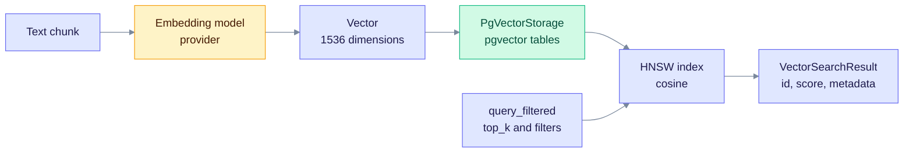
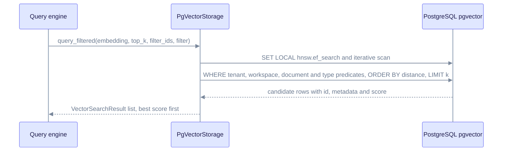

> **Product: v0.32.2** · Contract: OpenAPI · Spec ops: [Ingestion cancel & fairness](../ingestion-cancel-and-fairness.md)

# Deep Dive: Vector Storage

> **How EdgeQuake stores and searches vector embeddings**

This page explains how embeddings are stored, indexed and searched for similarity. It is for engineers who tune retrieval or debug vector errors. Production runs on PostgreSQL with pgvector only.

**See also:** [Data Layer](data-layer.md) for the physical tables, the typed backend and the query-by-store matrix.

---

## Overview

The chunk text goes to an embedding model. The resulting vector is written to a pgvector table with an HNSW index. A query embeds the question and searches the same index.



*Notice that writes and reads meet at the same HNSW index. Filters apply in the same SQL statement as the ranking.*

Vectors are stored in PostgreSQL next to the graph and the KV store. That keeps one operations surface. The in-memory adapter (`MemoryVectorStorage` in `edgequake-storage/src/adapters/memory/`) is used by unit tests, not by the server.

---

## Dimension and column policy

pgvector limits HNSW to 2000 dimensions for the `vector` type and 4000 for `halfvec`. `AnnIndexPolicy` in [`capabilities.rs`](../../edgequake/crates/edgequake-storage/src/adapters/postgres/capabilities.rs) applies these limits:

| Embedding dimension | Column type | HNSW index |
| ------------------- | ------------ | ---------- |
| ≤ 2000 | `vector` or `halfvec`, per `EDGEQUAKE_VECTOR_STORAGE` | Yes |
| 2001–4000 | `halfvec` (promoted from `vector` in `full` mode) | Yes |
| > 4000 | Configured type | No (sequential scan) |

`EDGEQUAKE_VECTOR_STORAGE` selects the column mode:

| Value | Column | Opclass |
| ----- | ------ | ------- |
| unset, `halfvec` or `half` | `halfvec` (**default**) | `halfvec_cosine_ops` |
| `full` (or any other value) | `vector` | `vector_cosine_ops` |

Any value other than `halfvec` or `half` selects `full`, so check the spelling. Changing the mode on an existing database needs a migration. The data-layer page covers the rules: [halfvec and the migrations](data-layer.md#6-pgvector).

The supported distance metric is cosine. `SUPPORTED_VECTOR_METRIC` is `"cosine"`.

---

## Core data structures

### VectorSearchResult

```rust
/// Vector similarity search result.
pub struct VectorSearchResult {
    /// Record identifier (chunk id, entity name, …)
    pub id: String,
    /// Similarity score. Higher is more similar.
    pub score: f32,
    /// Metadata stored with the vector
    pub metadata: serde_json::Value,
}
```

### Metadata keys used by filters

| Key in `metadata` | Filter field | Meaning |
| ----------------- | ------------ | ------- |
| `document_id`, `source_document_id` | `document_ids` | Document that produced the vector |
| `tenant_id` | `tenant_id` | Tenant isolation |
| `workspace_id` | `workspace_id` | Workspace isolation |
| `type` | `vector_type` | `chunk`, `entity` or `relationship` |
| `modality` | `modalities` | `chart`, `figure`, `table` or `equation` |

`embedding_model` is also a filter field. It names the embedding model that produced the query vector, so that typed search uses the same vector space.

### MetadataFilter

```rust
let filter = MetadataFilter::from_tenant_workspace_type(
    Some(tenant_id),
    Some(workspace_id),
    "chunk",
);
```

Every field is optional. Only the fields that are set take part in the `AND`. The filter lives in [`traits/vector.rs`](../../edgequake/crates/edgequake-storage/src/traits/vector.rs).

---

## The VectorStorage trait

All vector backends implement this trait in [`traits/vector.rs`](../../edgequake/crates/edgequake-storage/src/traits/vector.rs). The main methods are:

```rust
#[async_trait]
pub trait VectorStorage: Send + Sync {
    fn namespace(&self) -> &str;
    fn dimension(&self) -> usize;
    async fn initialize(&self) -> Result<()>;
    async fn finalize(&self) -> Result<()>;

    // Search
    async fn query(&self, query_embedding: &[f32], top_k: usize,
                   filter_ids: Option<&[String]>) -> Result<Vec<VectorSearchResult>>;
    async fn query_filtered(&self, query_embedding: &[f32], top_k: usize,
                            filter_ids: Option<&[String]>,
                            metadata_filter: Option<&MetadataFilter>)
                            -> Result<Vec<VectorSearchResult>>;
    async fn text_search_filtered(&self, query_text: &str, top_k: usize,
                                  filter_ids: Option<&[String]>,
                                  metadata_filter: Option<&MetadataFilter>)
                                  -> Result<Vec<VectorSearchResult>>;

    // Writes
    async fn upsert(&self, data: &[(String, Vec<f32>, serde_json::Value)]) -> Result<()>;
    async fn upsert_report_created(&self, data: &[(String, Vec<f32>, serde_json::Value)])
                                   -> Result<Vec<String>>;   // ids newly inserted
    async fn delete(&self, ids: &[String]) -> Result<()>;
    async fn delete_entity(&self, entity_name: &str) -> Result<()>;
    async fn delete_entity_relations(&self, entity_name: &str) -> Result<()>;
    async fn delete_by_document(&self, document_id: &str) -> Result<usize>;

    // Reads and maintenance
    async fn get_by_id(&self, id: &str) -> Result<Option<Vec<f32>>>;
    async fn get_by_ids(&self, ids: &[String]) -> Result<Vec<(String, Vec<f32>)>>;
    async fn is_empty(&self) -> Result<bool>;
    async fn count(&self) -> Result<usize>;
    async fn ping(&self) -> Result<()>;           // cheap connectivity check
    async fn clear(&self) -> Result<()>;
    async fn clear_workspace(&self, workspace_id: &Uuid) -> Result<usize>;
    async fn warmup_workspace_ann(&self, workspace_id: &str) -> Result<bool>;
}
```

The trait also has `delete_entities_batch` and `supports_native_text_search`. Their defaults are fine for most callers. The code has more methods than this list; the trait file is the reference.

---

## Filtered search (SPEC-007)

Filters run in SQL, before the top-k cut. Without that, the top-k could be filled with vectors the caller will discard.



*Notice that the ANN search and the filter run together in PostgreSQL. The application never sees rows that the filter removes.*

### The predicates

For `workspace_id`, the SQL uses the materialized column **or** the JSONB key. Legacy rows may store the value only in JSONB:

```sql
SELECT id, metadata, 1 - (embedding <=> $1::vector) AS score
FROM public.eq_eq_default_vectors
WHERE (workspace_id = $2 OR metadata->>'workspace_id' = $2)
  AND (document_id = ANY($3) OR metadata->>'document_id' = ANY($3)
       OR metadata->>'source_document_id' = ANY($3))
ORDER BY embedding <=> $1::vector
LIMIT $4;
```

*This is a simplified sketch of the legacy query. The exact SQL is generated in [`metadata_filter_sql.rs`](../../edgequake/crates/edgequake-storage/src/metadata_filter_sql.rs).*

Set `EDGEQUAKE_METADATA_FILTER_COLUMNS_ONLY=1` to use the column predicate alone. The OR with JSONB stops PostgreSQL from using a workspace partial index (SPEC-064).

### Indexes that support filters

- **Btree on `document_id`** (partial, `WHERE document_id IS NOT NULL`).
- **Btree on `(tenant_id, workspace_id)`**.
- **No GIN on `metadata`.** Migration 027 added one. Migration 073 dropped it because no query used it.

### Migration history

| Migration | Change |
| --------- | ------ |
| 027 | Added a GIN index on JSONB `metadata` (dropped by 073) |
| 028 | Added materialized `document_id`, `tenant_id` and `workspace_id` columns and backfilled them |
| 029 | Added btree indexes on the materialized columns |

---

## Dual-write on upsert

`upsert` writes the vector and its `metadata` in one `UNNEST` statement. It also writes the materialized columns `document_id`, `tenant_id` and `workspace_id`, which it reads from `metadata`. `ON CONFLICT` updates all of them.

- The `metadata` column keeps older readers working.
- The columns serve the indexed predicates above.
- `upsert_report_created` uses `RETURNING (xmax = 0)` to report which ids were inserted. The compensation path uses this list to delete only what it created.

Batches are split by `EDGEQUAKE_VECTOR_UPSERT_CHUNK` (default 1000, clamped to 100–10000).

---

## Index types

`VectorIndexType` in [`config.rs`](../../edgequake/crates/edgequake-storage/src/adapters/postgres/config.rs) has three values. HNSW is the default.

| Type | When to use | Notes |
| ---- | ----------- | ----- |
| `HNSW` (default) | Production search | Cosine opclass, `m` and `ef_construction` |
| `IVFFlat` | Legacy or special cases | Uses `lists` (default 100). Not the default for any backend |
| `None` | Bulk loads | Exact scan until `ensure_ann_index()` builds the index |

### HNSW settings

| Setting | Default | Source |
| ------- | ------- | ------ |
| `m` | 16 | `PostgresConfig` |
| `ef_construction` | 128 | `EDGEQUAKE_HNSW_EF_CONSTRUCTION` (clamped to 4–1000) |
| `hnsw.ef_search` | pgvector default (40) | `EDGEQUAKE_HNSW_EF_SEARCH` (1–1000) |

The generated DDL looks like this (for the legacy table, with `prefix` set to `eq_default`):

```sql
CREATE INDEX IF NOT EXISTS eq_eq_default_vectors_embedding_idx
ON public.eq_eq_default_vectors
USING hnsw (embedding halfvec_cosine_ops)
WITH (m = 16, ef_construction = 128);
```

Changing `ef_construction` affects only new indexes. An existing index needs an operator `REINDEX INDEX CONCURRENTLY`. See the [REINDEX note](data-layer.md#6-pgvector) in the data-layer page.

---

## Storage backend: PgVectorStorage

`PgVectorStorage` in [`adapters/postgres/vector/`](../../edgequake/crates/edgequake-storage/src/adapters/postgres/vector/) is the production backend. It is created from a `PostgresConfig`.

```rust
pub struct PgVectorStorage {
    pool: PostgresPool,
    table_name: String,
    stats_table_name: String,   // O(1) row counts
    namespace: String,
    dimension: usize,
    index_type: VectorIndexType,
    ivfflat_lists: u32,
    hnsw_m: u32,
    hnsw_ef_construction: u32,
    // … prefix, storage mode, chunk KV table, lazy flags
}
```

| Attribute | Value |
| --------- | ----- |
| Persistence | Full PostgreSQL durability (WAL) |
| Index types | HNSW (default), IVFFlat, none |
| Distance metric | Cosine only |
| Required | `DATABASE_URL`. The server does not start without it |

### Tables

| Table | Scope |
| ----- | ----- |
| `public.eq_{prefix}_vectors` | Legacy shared table for the namespace |
| `eq_{namespace}_ws_{slug}_vectors` | Legacy per-workspace table. The slug is the workspace UUID with `_` for `-` |
| `chunk_embeddings`, `*_embeddings` | Typed tables used by the default backend |

Under the default typed backend, the legacy tables are not written. The data-layer page has the typed schema.

---

## Embedding dimensions

These models are defined in [`models.toml`](../../edgequake/models.toml):

| Model | Dimensions | Provider |
| ----- | ---------- | -------- |
| `text-embedding-3-small` (default) | 1536 | OpenAI |
| `text-embedding-3-large` | 3072 | OpenAI |
| `nomic-embed-text` | 768 | Ollama |
| `mxbai-embed-large` | 1024 | Ollama |
| `embeddinggemma` | 768 | Ollama |

Vectors from different models are not comparable. A dimension change needs a workspace reconcile or a rebuild. See [Embedding Models](embedding-models.md).

### Dimension mismatch

Postgres storage checks the dimension on every write. Two messages are common:

- On upsert: `Embedding dimension mismatch for id '…': expected N, got M`.
- On the table write path: `Vector dimension mismatch on <table>: stored=…, required=…`. This fails closed and points to the options below.

Fixes, in order of safety:

1. Switch the embedding provider or model to match the stored dimension.
2. Re-embed into a new workspace.
3. Set `EDGEQUAKE_ALLOW_VECTOR_TABLE_REBUILD=1`. This wipes and recreates the table. Use it only when the data can be re-ingested.

---

## Performance tuning

Set these on the server, not in code:

| Knob | Effect | Setting |
| ---- | ------ | ------- |
| HNSW `ef_search` | Recall versus latency at query time | `EDGEQUAKE_HNSW_EF_SEARCH` |
| Scan budget | Caps tuples scanned by one query | `EDGEQUAKE_HNSW_MAX_SCAN_TUPLES` (default 20000) |
| Workspace partial HNSW | Smaller graph for hot workspaces | `EDGEQUAKE_HNSW_PARTIAL_BY_WORKSPACE=1` (opt-in) |
| Upsert batch size | Round trips versus progress updates | `EDGEQUAKE_VECTOR_UPSERT_CHUNK` |

For a one-off session, `SET hnsw.ef_search = 100;` raises recall at the cost of latency.

### Connection pool defaults

`PostgresConfig` sets these defaults:

| Field | Default |
| ----- | ------- |
| `max_connections` | 32 |
| `min_connections` | 1 |
| `connect_timeout` | 30 s |
| `idle_timeout` | 600 s |

The pool must be big enough for the concurrent work. Watch for acquire timeouts under load.

### Memory

A 1536-dimension `vector` stores 1536 × 4 bytes = 6 KB of raw data per row. A `halfvec` stores half that. Index size is in addition to this. Use [product limits](../product-limits.md) for capacity planning, not these estimates.

---

## Best practices

1. **Match the model.** Use the same embedding model for indexing and querying.
2. **Batch writes.** Use `upsert` with a full batch rather than one row per call.
3. **Use filters in SQL.** Pass a `MetadataFilter` so the top-k is taken after filtering.
4. **Tune with env vars.** Change `ef_search` and the scan budget per deployment.
5. **Health checks use `ping()`.** `count()` is an exact count and can be slow on large tables.
6. **Cosine needs no pre-normalization.** The cosine opclass divides by the vector norms.

---

## Common issues

### Slow queries

Check these in order:

1. Run `EXPLAIN (ANALYZE, BUFFERS)`. A sequential scan on a large table means the index is missing or the filter shape blocks it.
2. If the filter contains the JSONB `OR`, try `EDGEQUAKE_METADATA_FILTER_COLUMNS_ONLY=1` for workspace-scoped data.
3. Raise `EDGEQUAKE_HNSW_EF_SEARCH` if recall is low. Lowering it speeds queries up.
4. Check pool exhaustion. Acquire timeouts show up in the logs.

### Index build is slow

For a large legacy table, the runtime already builds indexes with `CREATE INDEX CONCURRENTLY` when the table is not empty. Schedule the build outside peak hours. Lowering `m` or `ef_construction` shortens the build but lowers recall, so measure both before you change them.

### Dropping a vector table

`PgVectorStorage::drop_table()` removes the table and all its rows. It is not a recovery tool. Use the [dimension rules](#dimension-mismatch) first.

---

## See also

- [Graph Storage](graph-storage.md): knowledge graph storage
- [Entity Extraction](entity-extraction.md): how entities get embeddings
- [Query Modes](query-modes.md): how vector search is used
- [Embedding Models](embedding-models.md): model choice and dimensions
- [Performance Tuning](../operations/performance-tuning.md): optimization guide
