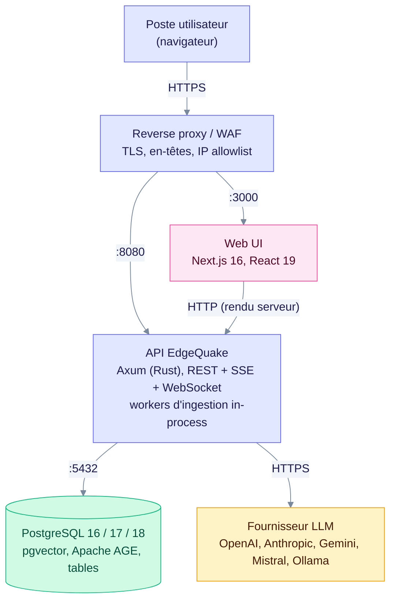
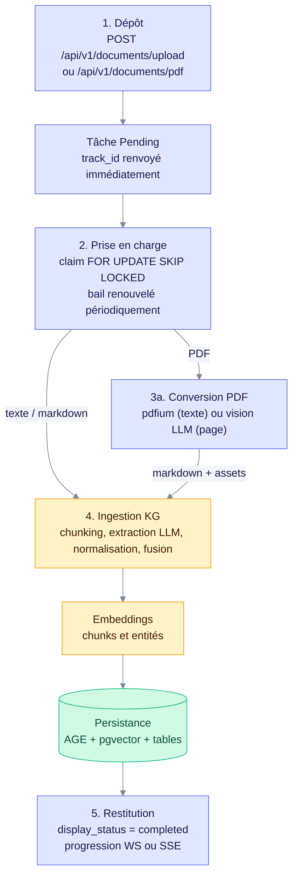
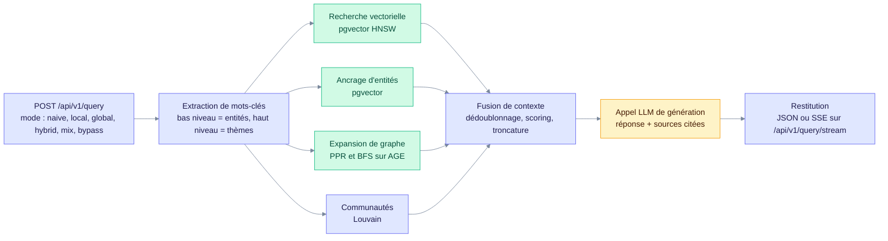
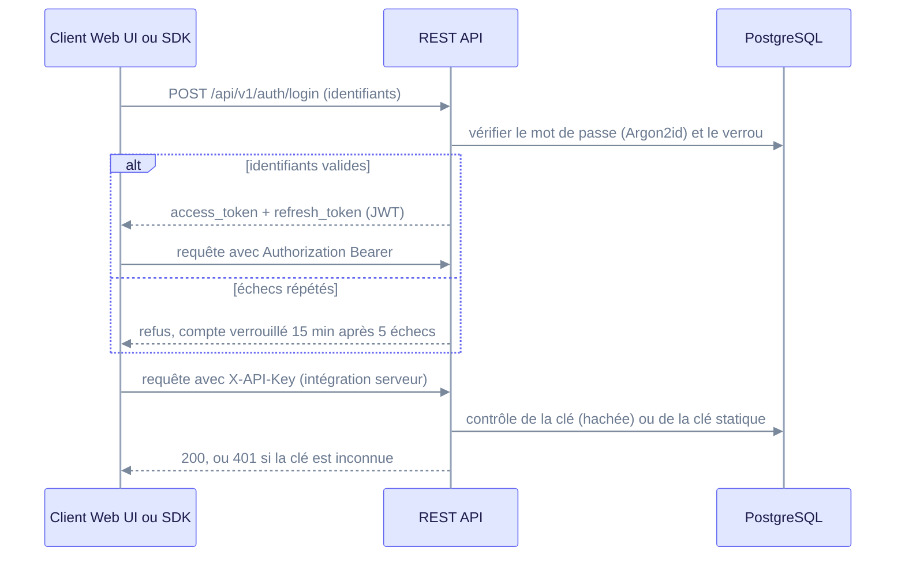
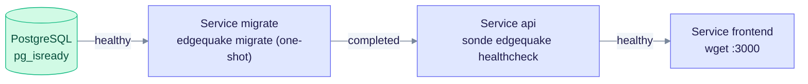

> Historical note, 2026-08-30 (produit v0.26.4); may not match current code.
> Prefer: [Deployment](../operations/deployment.md) · [Security](../security/index.md) · [Providers](../providers/index.md)
>
> État courant (v0.32.2, fichier `VERSION`) : les valeurs de ce document décrivent la v0.26.4. Les écarts constatés avec le code courant sont signalés dans le texte (tags d'images, schéma, valeurs par défaut).

---

## 1. Objet et périmètre

Ce document décrit **ce qui est installé, où, avec quoi, et comment les composants communiquent** pour un déploiement EdgeQuake en environnement maîtrisé. Il s'adresse aux architectes, à l'infrastructure et au RSSI.

Il couvre :

| Section | Contenu                                                                 |
| ------- | ----------------------------------------------------------------------- |
| §2      | Architecture déployée (topologie physique et logique)                   |
| §3      | Composants installés (images, binaires, extensions, schéma)             |
| §4      | Prérequis (matériel, logiciel, comptes, secrets)                        |
| §5      | Flux de données (ingestion et interrogation)                            |
| §6      | Configuration réseau (ports, matrice de flux, reverse proxy)            |
| §7      | Configuration sécurité (authentification, RBAC, cloisonnement, secrets) |
| §8      | Procédure d'installation                                                |
| §9      | Recette post-déploiement                                                |

**Hors périmètre** : exploitation courante, sauvegarde, mise à jour et rollback, traités dans [02-integration-it.md](02-integration-it.md).

---

## 2. Architecture déployée

### 2.1 Vue d'ensemble

EdgeQuake est un système Graph-RAG : il transforme des documents en un **graphe de connaissances** (entités + relations) doublé d'un **index vectoriel**. Il répond ensuite aux questions en combinant parcours de graphe et recherche sémantique.

La solution combine deux composants applicatifs (UI et API), une base PostgreSQL et un fournisseur LLM externe, derrière un reverse proxy :



La base PostgreSQL porte à elle seule les données, les vecteurs et le graphe : c'est elle qu'il faut sauvegarder en priorité.

### 2.2 Rôle de chaque composant déployé

| Composant            | Technologie                 | Rôle                                                                                                            | Avec état ?        |
| -------------------- | --------------------------- | --------------------------------------------------------------------------------------------------------------- | ------------------ |
| **Web UI**           | Next.js 16 / React 19       | Interface : dépôt de documents, interrogation, visualisation du graphe (Sigma.js), administration               | Non — sans état    |
| **API**              | Rust / Axum, binaire unique | REST (OpenAPI), streaming SSE, WebSocket de progression, orchestration RAG, **workers d'ingestion embarqués**  | Non — état en base |
| **PostgreSQL**       | PG 16, 17 ou 18             | Unique magasin persistant : documents, chunks, vecteurs, graphe, file de tâches, identités, audit               | **Oui**            |
| **LLM / Embeddings** | Externe ou on-premise       | Extraction d'entités, génération de réponses, vectorisation, vision PDF                                         | N/A                |

> **Point d'architecture majeur** : il n'y a **pas** de Redis, pas de broker de messages, pas de base vectorielle dédiée, pas de base graphe séparée. PostgreSQL est le point unique de vérité (_single source of truth_). Un déploiement complet comprend les trois conteneurs (PostgreSQL, API, UI) et un service `migrate` ponctuel.

### 2.3 Topologies supportées

| Topologie            | Description                                                               | Usage                          |
| -------------------- | ------------------------------------------------------------------------- | ------------------------------ |
| **Mono-nœud**        | 3 conteneurs sur un hôte, volume local                                    | Pilote, POC, équipe unique     |
| **API externalisée** | API + UI conteneurisées, PostgreSQL sur infrastructure d'entreprise gérée | **Recommandé en production**   |
| **Multi-réplique**   | N réplicas d'API derrière un répartiteur de charge, PostgreSQL partagé    | Charge d'ingestion élevée / HA |

**Multi-réplique — condition impérative** : positionner `EDGEQUAKE_TASK_DELIVERY=notify_only` et `EDGEQUAKE_REPLICAS=<N>`. Le démarrage **refuse** une configuration multi-réplique incohérente (`validate_delivery_for_replicas`).

**Attention** : toute valeur non reconnue de `EDGEQUAKE_TASK_DELIVERY` retombe sur le mode `local` (mono-processus), sans erreur. La prise en charge des tâches repose sur un mécanisme _claim/lease_ PostgreSQL (`SELECT … FOR UPDATE SKIP LOCKED`).

### 2.4 Modèle d'exécution de l'API

Le binaire `edgequake` héberge dans le même processus :

1. le serveur HTTP Axum (routes REST, SSE, WebSocket) ;
2. le pool de **workers d'ingestion** (défaut : 4, `EDGEQUAKE_TASK_MAX_WORKERS`) ;
3. les sondes d'observabilité (métriques Prometheus, traces OTLP).

Conséquence d'exploitation : une charge d'ingestion massive et une charge d'interrogation partagent le même processus. Dimensionner les réplicas en conséquence, et ajuster `EDGEQUAKE_TASK_MAX_WORKERS` (défaut 4, minimum 1).

---

## 3. Composants installés

### 3.1 Images conteneur

| Service    | Image                                      | Tag de référence                                              | Architectures                |
| ---------- | ------------------------------------------ | ------------------------------------------------------------- | ---------------------------- |
| API        | `ghcr.io/raphaelmansuy/edgequake`          | `0.26.4`                                                      | `linux/amd64`, `linux/arm64` |
| Web UI     | `ghcr.io/raphaelmansuy/edgequake-frontend` | `0.26.4`                                                      | `linux/amd64`, `linux/arm64` |
| PostgreSQL | `ghcr.io/raphaelmansuy/edgequake-postgres` | `0.26.4` (défaut PG18)<br>`0.26.4-pg17`, `0.26.4-pg16`        | `linux/amd64`, `linux/arm64` |

Les tags suivent la version produit (workflow `release-docker.yml`) : le suffixe `-pg16` ou `-pg17` désigne une image PostgreSQL non défaut.

> En environnement fermé, ces trois images doivent être **répliquées dans le registre interne** et les tags **figés** (jamais `latest`). Voir §8.1.

### 3.2 Contenu de l'image API

Le binaire est autonome, à l'exception de :

- **pdfium** — extraction PDF texte, **embarqué dans le binaire à la compilation** (mécanisme _pdfium-auto_, SPEC-095). À l'exécution, la bibliothèque est extraite localement, sans téléchargement, vers un répertoire de cache. Ce répertoire vaut `~/.cache/pdf2md/` sous Linux par défaut ; la variable `PDFIUM_AUTO_CACHE_DIR` le remplace. Déploiements durcis : `PDFIUM_LIB_PATH` pointe vers une bibliothèque pré-placée en lecture seule, et l'extraction est alors ignorée ;
- **certificats TLS système** — pour joindre les fournisseurs LLM.

Le conteneur API n'embarque pas d'interpréteur Python ni de runtime Node.

### 3.3 Extensions PostgreSQL — versions épinglées

Les versions sont **contractuelles** : le démarrage vérifie la présence des deux extensions et contrôle une version minimale de pgvector (fonction `pgvector_meets_cve_floor`, seuil _CVE-safe_ du code). La matrice complète des pins est définie dans `edgequake/docker/extension-pins.sh` et vérifiée par `verify-postgres-extensions.sh`.

| Majeure PG           | Image de base          | pgvector  | Apache AGE    |
| -------------------- | ---------------------- | --------- | ------------- |
| **PG 18** _(défaut)_ | `postgres:18-bookworm` | **0.8.5** | **1.8.0-rc0** |
| PG 17                | `postgres:17-bookworm` | **0.8.5** | **1.7.0-rc0** |
| PG 16                | `postgres:16-bookworm` | **0.8.5** | **1.6.0-rc0** |

Une variante PG18 avec `pgvectorscale 0.9.0` existe pour les très grands volumes vectoriels (`Dockerfile.postgres.pg18-vectorscale`).

**Si vous fournissez votre propre PostgreSQL** (topologie recommandée), ces deux extensions doivent être installées aux versions ci-dessus, et l'utilisateur applicatif doit pouvoir exécuter `CREATE EXTENSION`. Vérification :

```bash
psql "$DATABASE_URL" -c "SELECT extname, extversion FROM pg_extension
                         WHERE extname IN ('vector','age');"
```

### 3.4 Schéma de base

- **Dans la v0.26.4** : **147 fichiers de migration SQL**, numérotés **001 → 149** (numérotation non contiguë).
- **Dans le code courant (v0.32.2)** : **167 fichiers SQL**, numérotés **001 → 169** (non contigus).
- Verrouillage par empreintes : `edgequake/migrations/checksums.lock`. Toute modification d'une migration déjà publiée est détectée par `scripts/check_migration_checksums.sh`.
- Familles d'objets : documents et chunks, embeddings (pgvector, index HNSW), graphe AGE, file de tâches, identités et clés d'API, journal d'audit, conversations, lignage (_lineage_), assets multimodaux, layout de pages PDF.

> **Règle structurante : l'API ne migre jamais la base.** L'application du schéma est un acte d'exploitation explicite (`edgequake migrate`). Si le schéma est en retard ou en avance sur le binaire, le processus s'arrête avec le **code de sortie 78** (`EX_CONFIG`). Un orchestrateur peut ainsi distinguer « migration requise » d'un « plantage ». Le mode d'attente `EDGEQUAKE_SCHEMA_GATE=wait` change ce comportement : l'API attend la migration au lieu de s'arrêter. Détail en [02-integration-it.md §5](02-integration-it.md#5-mise-à-jour).

---

## 4. Prérequis

### 4.1 Matériel

| Profil                   | vCPU    | RAM       | Disque     | Commentaire                                           |
| ------------------------ | ------- | --------- | ---------- | ----------------------------------------------------- |
| Minimum (démonstration)  | 2       | 4 Go      | 10 Go      | Ingestion lente                                       |
| **Production — nominal** | **4–8** | **16 Go** | **50 Go+** | Corpus jusqu'à quelques dizaines de milliers de pages |
| Corpus volumineux        | 8–16    | 32 Go     | 200 Go+    | Prévoir un stockage rapide (SSD/NVMe) pour PostgreSQL |

Dimensionnement disque : compter le volume brut des documents **× 3 à 4** (original conservé + markdown + chunks + embeddings + graphe). C'est un ordre de grandeur indicatif, à confirmer sur un corpus pilote représentatif.

L'API elle-même reste sobre (quelques centaines de Mo résidents, ordre de grandeur) ; la mémoire est consommée surtout par PostgreSQL (`shared_buffers`, construction des index HNSW).

### 4.2 Logiciel

| Élément        | Version                      | Nécessaire pour                                         |
| -------------- | ---------------------------- | ------------------------------------------------------- |
| Docker Engine  | version récente (minimum non fixé par le dépôt, à valider) | Déploiement conteneurisé                  |
| Docker Compose | v2                           | Orchestration mono-nœud                                 |
| PostgreSQL     | 16, 17 ou **18**             | Base de données                                         |
| pgvector       | 0.8.5                        | Index vectoriels                                        |
| Apache AGE     | 1.6/1.7/1.8 selon la majeure | Graphe de connaissances                                 |
| Rust toolchain | 1.95 (`rust-toolchain.toml`) | **Uniquement** en cas de compilation depuis les sources |

Le `shm_size` du conteneur PostgreSQL vaut **256 Mo minimum** (déjà positionné dans les fichiers compose fournis). La valeur Docker par défaut (64 Mo) expose aux erreurs `could not resize shared memory segment` lors des opérations parallèles et des constructions d'index HNSW.

### 4.3 Fournisseur LLM

EdgeQuake est agnostique du fournisseur. Trois postures :

| Posture            | Fournisseurs (`EDGEQUAKE_LLM_PROVIDER`)                 | Implication données                                  |
| ------------------ | ------------------------------------------------------- | ---------------------------------------------------- |
| **Cloud public**   | `openai`, `anthropic`, `gemini`, `mistral`              | Le contenu des chunks **sort** du SI                 |
| **Cloud maîtrisé** | Point d'accès compatible OpenAI hébergé chez un tiers contractualisé (`OPENAI_BASE_URL`) | Sortie vers un tenant choisi |
| **On-premise**     | `ollama`, `lmstudio`, tout point d'accès compatible OpenAI | **Aucune sortie de données** vers un tiers        |

> **Point d'attention sécurité** : l'extraction d'entités envoie le **texte intégral de chaque chunk** au LLM, et la vision PDF y envoie les **images de page**. Le choix du fournisseur est donc une décision de classification de données, pas un réglage technique. Pour des documents sensibles, la posture à privilégier est l'on-premise (`ollama`, `lmstudio`, ou un point d'accès compatible OpenAI interne via `OPENAI_BASE_URL`).

Rôles de modèles distincts, configurables séparément :

| Rôle          | Variable                                  | Usage                                        |
| ------------- | ----------------------------------------- | -------------------------------------------- |
| LLM principal | `EDGEQUAKE_LLM_PROVIDER` / `_MODEL`       | Extraction d'entités, génération de réponses |
| Embeddings    | `EDGEQUAKE_EMBEDDING_PROVIDER` / `_MODEL` | Vectorisation chunks et entités              |
| Vision        | `EDGEQUAKE_VISION_PROVIDER` / `_MODEL`    | Conversion PDF → markdown                    |

Deux coupe-circuits pilotent le remplissage des chunks PDF au budget de tokens (activés par défaut) : `EDGEQUAKE_PDF_PACK` et `EDGEQUAKE_PDF_CROSS_PAGE_PACK`. Les positionner à `0` restaure le découpage page-à-page — voir [03 §3.2](03-deep-dive-architecture-algorithme.md#32-étape-1--découpage-chunking).

Panachage possible : LLM on-premise + embeddings sur un nœud GPU dédié (`OLLAMA_EMBEDDING_HOST`).

### 4.4 Secrets à provisionner

| Secret                               | Obligatoire                                    | Contrainte                                                                  |
| ------------------------------------ | ---------------------------------------------- | --------------------------------------------------------------------------- |
| `POSTGRES_PASSWORD` / `DATABASE_URL` | Oui                                            | —                                                                           |
| `JWT_SECRET`                         | Oui en production                              | **≥ 32 octets**, aléatoire — sinon refus de démarrage                      |
| `EDGEQUAKE_BOOTSTRAP_ADMIN_PASSWORD` | Oui au premier démarrage avec authentification | ≥ 8 caractères, 3 classes sur 4 (majuscule, minuscule, chiffre, spécial), 128 max |
| `EDGEQUAKE_MASTER_API_KEY`           | Optionnel                                      | Amorçage de la création d'utilisateurs sans JWT                             |
| Clé du fournisseur LLM               | Selon fournisseur                              | `OPENAI_API_KEY`, `MISTRAL_API_KEY`, …                                      |

Ces valeurs doivent provenir du coffre d'entreprise (Vault, Secrets Manager, secrets Kubernetes) et **jamais** d'un fichier `.env` versionné.

---

## 5. Flux de données

### 5.1 Flux d'ingestion



Chaque étape est une tâche distincte avec son propre bail : une conversion PDF réussie ne suffit pas à lancer l'extraction du graphe sans nouvelle prise en charge.

Les contrôles d'entrée (type MIME, taille) s'appliquent à l'étape 1 (`EDGEQUAKE_MAX_UPLOAD_BYTES`). Paramètres par défaut : chunks de 1200 tokens avec recouvrement de 100 (`EDGEQUAKE_CHUNK_SIZE`, `EDGEQUAKE_CHUNK_OVERLAP`). Le gleaning (2ᵉ passe d'extraction) est désactivé par défaut.

**Données envoyées au LLM pendant l'ingestion** : les images de page PDF (étape 3a, si la conversion passe par la vision), le texte des chunks pour l'extraction d'entités, et les textes à vectoriser auprès du fournisseur d'embeddings. Pendant une requête, la question et le contexte récupéré partent vers le LLM de génération (§5.2).

### 5.2 Flux d'interrogation



Les branches de récupération exécutées dépendent du mode choisi ; la fusion, la génération et la restitution sont communes. Traçabilité : `GET /api/v1/query/context/{retrieval_id}`.

Six modes de récupération : `naive`, `local`, `global`, `hybrid`, `mix` et `bypass`. Si le champ `mode` est absent ou invalide sur `POST /api/v1/query`, le mode **`mix`** est utilisé (défaut de production). Algorithmique détaillée en [03-deep-dive-architecture-algorithme.md §5](03-deep-dive-architecture-algorithme.md#5-algorithme-dinterrogation).

### 5.3 Persistance — où atterrit la donnée

| Donnée                | Emplacement PostgreSQL                                 | Remarque                                                                      |
| --------------------- | ------------------------------------------------------ | ----------------------------------------------------------------------------- |
| Fichier original      | table `document_originals`                             | Restitution `/documents/{id}/download/original`                               |
| Markdown converti     | table `document_pages`                                 | Restitution `/documents/{id}/download/markdown`                               |
| Chunks + texte        | table `chunks` (colonne `content_tsv`, tsvector)       | Recherche plein texte                                                         |
| Embeddings            | table `chunk_embeddings` (`halfvec(1536)`)             | Index HNSW `halfvec_cosine_ops`                                               |
| Entités et relations  | graphe **Apache AGE** (migrations `entities` / `relationships`) | Requêtes Cypher                                                  |
| Assets multimodaux    | table `document_mm_assets`                             | Figures, recadrages de graphiques                                             |
| File de tâches        | tables `tasks` (partitionnée par mois) et `task_events` | Claim, bail, annulation                                                       |
| Identités, clés d'API | tables d'authentification                              | Mots de passe et clés d'API hachés                                            |
| Journal d'audit       | table `audit_logs`                                     | Voir §7.6                                                                     |
| Lignage               | tables `chunk_entity_links` et `chunk_relation_links`  | Chunk → entité → document                                                     |

**Aucune donnée métier hors PostgreSQL.** Sauvegarder la base, c'est sauvegarder le système (cf. [02-integration-it.md §4](02-integration-it.md#4-sauvegarde-et-restauration)).

---

## 6. Configuration réseau

### 6.1 Ports exposés

| Service    | Port conteneur | Port hôte par défaut    | Protocole       | Exposition recommandée     |
| ---------- | -------------- | ----------------------- | --------------- | -------------------------- |
| Web UI     | 3000           | 3000 (`FRONTEND_PORT`)  | HTTP            | Derrière reverse proxy TLS |
| API        | 8080           | 8080 (`EDGEQUAKE_PORT`) | HTTP + WS + SSE | Derrière reverse proxy TLS |
| PostgreSQL | 5432           | **non publié**          | TCP             | Réseau interne uniquement  |

En développement local (`make dev`), les ports par défaut sont 3010 (UI) et 8090 (API) pour éviter les collisions.

### 6.2 Matrice de flux

| #   | Source            | Destination       | Port       | Protocole            | Objet                                                    |
| --- | ----------------- | ----------------- | ---------- | -------------------- | -------------------------------------------------------- |
| F1  | Poste utilisateur | Reverse proxy     | 443        | HTTPS                | Interface et API                                         |
| F2  | Reverse proxy     | Web UI            | 3000       | HTTP                 | Rendu Next.js                                            |
| F3  | Reverse proxy     | API               | 8080       | HTTP / WS            | REST, SSE, WebSocket                                     |
| F4  | Web UI (SSR)      | API               | 8080       | HTTP                 | Rendu côté serveur                                       |
| F5  | Navigateur        | API               | 443 → 8080 | HTTPS / WSS          | Appels directs + progression temps réel                  |
| F6  | API               | PostgreSQL        | 5432       | TCP (TLS recommandé) | Toutes les opérations de données                         |
| F7  | API               | Fournisseur LLM   | 443        | HTTPS                | Extraction, embeddings, génération, vision               |
| F8  | API               | Ollama on-premise | 11434      | HTTP                 | Alternative on-premise à F7                              |
| F9  | Supervision       | API `/metrics`    | 8080       | HTTP                 | Collecte Prometheus                                      |
| F10 | API               | Collecteur OTLP   | selon l'endpoint | HTTP             | Traces (optionnel — variable `OTEL_EXPORTER_OTLP_ENDPOINT`, Langfuse ou Jaeger) |

**Flux F5 — attention** : la Web UI n'est pas un proxy inverse universel. Le navigateur appelle l'API **directement** pour le streaming et les WebSockets. L'URL publiée est portée par `EDGEQUAKE_API_URL`, lue à l'exécution (pas au build), et doit être **résolvable depuis le poste client**, pas seulement depuis le conteneur.

### 6.3 Reverse proxy — exigences

Le proxy en amont doit :

1. **terminer TLS** (l'API sert en clair) ;
2. **relayer les WebSockets** — en-têtes `Upgrade` / `Connection` sur `/ws/*` ;
3. **désactiver la mise en tampon** sur `/api/v1/query/stream` et `/api/v1/documents/pdf/progress/stream/*` (SSE) — sinon la réponse n'arrive qu'à la fin ;
4. **relever les délais d'attente** : une ingestion ou une requête RAG longue peut dépasser 60 s (`proxy_read_timeout 600s`) ;
5. **autoriser la taille des dépôts** — aligner `client_max_body_size` sur `EDGEQUAKE_MAX_UPLOAD_BYTES` ;
6. **restreindre par IP** l'accès à `/metrics`, `/health`, `/ready`, `/live` et à `/api/v1/admin/*` (cf. §7.5).

### 6.4 Accès sortant

En environnement filtré, ouvrir explicitement :

- le point d'accès du fournisseur LLM (ex. `api.openai.com:443`, ou l'URL du point d'accès configuré via `OPENAI_BASE_URL`) ;
- le registre d'images au moment du déploiement uniquement (ou pré-charger les images).

Aucun autre accès sortant n'est requis en fonctionnement nominal.

---

## 7. Configuration sécurité

### 7.1 Contrôles bloquants au démarrage

L'API valide sa configuration **avant** de servir le moindre trafic (`startup_security.rs`). Comportements :

| Condition                                                                 | Verdict       | Effet                                                                                 |
| ------------------------------------------------------------------------- | ------------- | ------------------------------------------------------------------------------------- |
| `JWT_SECRET` = valeur par défaut, ou < 32 octets, hors mode dev           | **FATAL**     | Arrêt du processus (code 1)                                                           |
| `EDGEQUAKE_CORS_ORIGINS` vide avec une `DATABASE_URL` non locale, hors mode dev | **FATAL** | Arrêt — le CORS ouvert est refusé en production                                       |
| Authentification désactivée avec une base non locale, hors mode dev      | **FATAL**     | Arrêt (code 1) ; le mode dev est le seul contournement                                |
| Authentification activée sans aucune clé d'API ni clé maître             | Avertissement | Journalisé ; **devient fatal** si `EDGEQUAKE_STRICT_STARTUP=1`                        |
| `ALLOW_REGISTRATION=true` avec authentification active                   | Avertissement | Journalisé ; devient fatal si `EDGEQUAKE_STRICT_STARTUP=1`                            |
| Rate limiting désactivé (`EDGEQUAKE_RATE_LIMIT_ENABLED`), hors mode dev | Avertissement | Idem                                                                                  |
| `EDGEQUAKE_SECRETS_KEY` absent, hors mode dev                            | Avertissement | Idem ; les clés de connexion ne peuvent pas être stockées                             |
| Schéma de base en décalage avec le binaire                               | **FATAL**     | Arrêt avec **code 78** (`EDGEQUAKE_SCHEMA_GATE=fail`) ; `wait` attend la migration    |

> **Recommandation {client}** : positionner `EDGEQUAKE_STRICT_STARTUP=1` en production. Tout avertissement devient alors bloquant, ce qui interdit une mise en service partiellement durcie.

Le mode `EDGEQUAKE_DEV_MODE=true` désactive ces garde-fous. Sans `EDGEQUAKE_AUTH_ENABLED`, il ouvre aussi l'API **sans authentification**. Une valeur explicite `EDGEQUAKE_AUTH_ENABLED=true` reste prioritaire (SPEC-163). Le mode dev sert au quickstart de démonstration et doit être **explicitement à `false`** en production.

### 7.2 Authentification — mécanismes et activation

#### 7.2.1 Mécanismes disponibles

Trois mécanismes, cumulables sur une même instance :

| Mécanisme                  | Usage                                                | Présentation                                        |
| -------------------------- | ---------------------------------------------------- | --------------------------------------------------- |
| **JWT** (access + refresh) | Utilisateurs interactifs (Web UI)                    | `Authorization: Bearer <jwt>`                       |
| **Clé d'API**              | Intégrations serveur à serveur, SDK, automatisations | `X-API-Key: <clé>` ou `Authorization: Bearer <clé>` |
| **OIDC**                   | Fédération avec l'annuaire d'entreprise (SSO)        | `/api/v1/auth/oidc/login` → `/api/v1/auth/oidc/callback` |

Les identités résident **en PostgreSQL**. Les mots de passe sont hachés en **Argon2id** (mémoire 64 Mio, 3 itérations, parallélisme 4). Les clés d'API statiques (`EDGEQUAKE_API_KEYS`) sont comparées en **temps constant** ; les clés gérées en base sont stockées hachées. Un verrouillage de compte s'applique après échecs répétés (§7.2.7).



Le JWT est accordé après authentification par mot de passe. Une clé d'API suffit pour les intégrations serveur à serveur, sans passer par la session.

#### 7.2.2 Matrice des modes de fonctionnement

Le comportement effectif résulte de deux variables. Une seule combinaison est admissible en production :

| `EDGEQUAKE_DEV_MODE` | `EDGEQUAKE_AUTH_ENABLED`    | Comportement                                                                                  | Usage admis                     |
| -------------------- | --------------------------- | --------------------------------------------------------------------------------------------- | ------------------------------- |
| `true`               | non défini                  | **API ouverte**, garde-fous de démarrage désactivés                                           | Démonstration locale uniquement |
| `true`               | `true`                      | **Authentification exigée** (la valeur explicite l'emporte sur le mode dev)                   | Tests d'authentification        |
| `false`              | `false`                     | API ouverte ; **FATAL** si base non locale, avertissement sinon (fatal si `EDGEQUAKE_STRICT_STARTUP=1`) | Aucun                           |
| `false`              | `true` ou non défini        | **Authentification exigée** sur toutes les routes protégées (défaut sécurisé)                 | **Production**                  |

Restent servies sans authentification, par conception :

- hors chaîne d'authentification : `/health`, `/ready`, `/live`, `/metrics` ;
- sous `/api/v1` : `/auth/login`, `/auth/refresh`, `/auth/oidc/login`, `/auth/oidc/callback`, `/auth/handoff`, `/auth/sso/providers`, `/setup/status`, `/setup/initialize`, ainsi que la documentation Swagger.

Ces routes sont à filtrer au réseau (§7.5). `POST /api/v1/users` est aussi public tant que `ALLOW_REGISTRATION=true`, valeur par défaut.

#### 7.2.3 Procédure d'activation — installation neuve

**Étape 1 — Générer les secrets** (à stocker dans le coffre d'entreprise) :

```bash
openssl rand -base64 48        # JWT_SECRET  (≥ 32 octets requis, sinon refus de démarrage)
openssl rand -hex 32           # EDGEQUAKE_MASTER_API_KEY (optionnel, cf. 7.2.5)
```

**Étape 2 — Positionner l'environnement de l'API** (avant le premier démarrage) :

```bash
EDGEQUAKE_DEV_MODE=false
EDGEQUAKE_AUTH_ENABLED=true
EDGEQUAKE_STRICT_STARTUP=1                          # tout avertissement devient bloquant
JWT_SECRET=<secret ≥ 32 octets, depuis le coffre>
EDGEQUAKE_CORS_ORIGINS=https://edgequake.intra.{client}   # obligatoire hors base locale
ALLOW_REGISTRATION=false                            # ferme POST /api/v1/users sans jeton

# Amorçage du premier administrateur — lu à chaque démarrage (voir ci-dessous)
EDGEQUAKE_BOOTSTRAP_ADMIN_USERNAME=admin
EDGEQUAKE_BOOTSTRAP_ADMIN_PASSWORD=<≥ 8 caractères, complexité mixte, depuis le coffre>
EDGEQUAKE_BOOTSTRAP_ADMIN_EMAIL=admin@{client}.example    # optionnel
```

**Étape 3 — Positionner l'environnement de la Web UI** :

```bash
NEXT_PUBLIC_AUTH_ENABLED=true          # active l'écran de connexion et la gestion de session
NEXT_PUBLIC_DISABLE_DEMO_LOGIN=true    # masque « Continuer sans connexion »
```

Le fichier quickstart dérive `NEXT_PUBLIC_AUTH_ENABLED` de `EDGEQUAKE_AUTH_ENABLED` : dans le fichier de production, positionnez les deux variables explicitement.

**Étape 4 — Démarrer, puis vérifier la création de l'administrateur** :

```bash
docker compose up -d
docker compose logs api | grep -i bootstrap    # trace de création ou de mise à jour du compte
```

Comportement de l'amorçage, à chaque démarrage :

- si l'utilisateur `EDGEQUAKE_BOOTSTRAP_ADMIN_USERNAME` (défaut `admin`) n'existe pas, il est créé avec le rôle Admin ;
- s'il existe déjà avec un mot de passe utilisable, la variable n'a aucun effet ;
- **s'il existe sans mot de passe de connexion utilisable, l'API remplace son mot de passe, le promeut Admin, le réactive et le déverrouille.** Vérifier ce point avant toute bascule sur une base existante.

**Étape 5 — Première connexion et vérification** :

```bash
# Connexion : doit renvoyer access_token + refresh_token
curl -s -X POST https://edgequake.intra.{client}/api/v1/auth/login \
  -H "Content-Type: application/json" \
  -d '{"username":"admin","password":"<mot de passe>"}' | jq

# Contre-épreuve : sans jeton, une route protégée doit répondre 401
curl -s -o /dev/null -w '%{http_code}\n' https://edgequake.intra.{client}/api/v1/documents
```

Connexion via l'interface Web UI. **Changer le mot de passe d'amorçage dès la première session**, puis retirer `EDGEQUAKE_BOOTSTRAP_ADMIN_PASSWORD` de l'environnement.

#### 7.2.4 Activation sur une instance existante en mode ouvert

Pour une instance déployée en mode démonstration (`EDGEQUAKE_DEV_MODE=true`) à basculer en mode authentifié :

1. Annoncer l'interruption : la bascule ferme l'API aux appels non authentifiés.
2. Positionner les variables des étapes 2 et 3 ci-dessus (API **et** Web UI).
3. Redémarrer les deux services : `docker compose up -d api frontend`.
4. Dérouler les vérifications de l'étape 5.
5. Mettre à jour les intégrations consommatrices : chaque client d'API doit désormais présenter un jeton ou une clé (7.2.5).

La bascule ne modifie que le contrôle d'accès. Vérifier après bascule que les comptes attendus existent et qu'ils se connectent.

#### 7.2.5 Clés d'API pour les intégrations

Deux familles, à usages distincts :

**Clés gérées en base** (recommandé) — créées par un administrateur authentifié, révocables individuellement, préfixe `eq_` :

```bash
# Création (JWT administrateur requis)
curl -s -X POST https://…/api/v1/api-keys \
  -H "Authorization: Bearer <jwt-admin>" \
  -H "Content-Type: application/json" \
  -d '{"name":"integration-ged","expires_in_days":365}' | jq
# Champs (tous optionnels) : name, scopes, expires_in_days
# → la clé est hachée en base (Argon2) et n'est affichée qu'à la création ;
#   la stocker immédiatement dans le coffre

# Inventaire et révocation
curl -s https://…/api/v1/api-keys -H "Authorization: Bearer <jwt-admin>" | jq
curl -s -X DELETE https://…/api/v1/api-keys/{key_id} -H "Authorization: Bearer <jwt-admin>"
```

Le préfixe `eq_` est fixé dans le code de création. La variable `API_KEY_PREFIX` est lue au démarrage mais n'intervient pas dans la génération : ne pas s'appuyer sur elle.

**Clé maître** (`EDGEQUAKE_MASTER_API_KEY`) — clé d'amorçage définie dans l'environnement, permettant notamment `POST /api/v1/users` sans JWT. À réserver à la phase d'installation et aux procédures de secours ; ne pas l'utiliser comme clé d'intégration courante. Des clés statiques supplémentaires peuvent être déclarées via `EDGEQUAKE_API_KEYS` (liste séparée par des virgules) — préférer les clés en base, révocables unitairement.

#### 7.2.6 Fédération OIDC (SSO d'entreprise)

```bash
EDGEQUAKE_OIDC_ENABLED=true            # désactivé par défaut
EDGEQUAKE_OIDC_ISSUER_URL=https://idp.intra.{client}/realms/edgequake
EDGEQUAKE_OIDC_CLIENT_ID=edgequake
EDGEQUAKE_OIDC_CLIENT_SECRET=<depuis le coffre>
EDGEQUAKE_OIDC_REDIRECT_URI=https://edgequake.intra.{client}/api/v1/auth/oidc/callback
EDGEQUAKE_OIDC_SUCCESS_REDIRECT_URL=https://edgequake.intra.{client}/
```

Parcours : l'utilisateur est dirigé vers `/api/v1/auth/oidc/login`, s'authentifie auprès du fournisseur d'identité, puis revient sur le `callback`. EdgeQuake renvoie alors à l'interface un code opaque à usage unique (`?code=`). L'interface l'échange contre la session via `POST /api/v1/auth/handoff`. Aucun jeton n'apparaît dans l'URL.

Déclarer l'URI de redirection à l'identique côté fournisseur d'identité. L'OIDC s'ajoute à l'authentification locale ; il ne la remplace pas.

#### 7.2.7 Paramètres de session et de verrouillage

| Variable                      | Défaut                                  | Rôle                                                                | Recommandation                                                                                                                                                                                                         |
| ----------------------------- | --------------------------------------- | ------------------------------------------------------------------- | ---------------------------------------------------------------------------------------------------------------------------------------------------------------------------------------------------------------------- |
| `JWT_EXPIRY_SECONDS` / `JWT_EXPIRY_HOURS` | `900` s (15 min) si aucune n'est définie | Durée de vie du jeton d'accès (`JWT_EXPIRY_SECONDS` prioritaire) | Garder **≤ 1 h**. La révocation repose sur une denylist `jti` en mémoire, non partagée entre réplicas et vidée au redémarrage : l'expiration reste la vraie borne d'une session volée |
| `REFRESH_TOKEN_EXPIRY_DAYS`   | `30`                                    | Durée de vie du jeton de rafraîchissement                           | 7 jours en environnement sensible                                                                                                                                                                                      |
| `MAX_LOGIN_ATTEMPTS`          | `5`                                     | Échecs avant verrouillage du compte                                 | Conserver                                                                                                                                                                                                              |
| `LOCKOUT_DURATION_MINUTES`    | `15`                                    | Durée du verrouillage                                               | Conserver                                                                                                                                                                                                              |
| `JWT_ISSUER` / `JWT_AUDIENCE` | _(non définis)_                         | Valeurs attendues pour les claims `iss` / `aud` des jetons          | Définir en production                                                                                                                                                                                                  |

La clé d'API générée porte le préfixe `eq_` (§7.2.5) ; la variable `API_KEY_PREFIX` (défaut `sk_`) n'intervient pas dans la génération.

#### 7.2.8 Dépannage de l'activation

| Symptôme                                          | Cause                                                                                               | Action                                                                    |
| ------------------------------------------------- | --------------------------------------------------------------------------------------------------- | ------------------------------------------------------------------------- |
| L'API s'arrête immédiatement, code 1              | `JWT_SECRET` absent, < 32 octets, ou égal à la valeur de démonstration                              | Fournir un secret conforme (étape 1)                                      |
| Arrêt avec « EDGEQUAKE_CORS_ORIGINS is required in production » | `EDGEQUAKE_CORS_ORIGINS` vide avec base non locale                                    | Renseigner les origines exactes de l'UI                                   |
| `401` sur `/api/v1/auth/login` avec le compte d'amorçage | Variables `EDGEQUAKE_BOOTSTRAP_ADMIN_*` modifiées sans redémarrage de l'API (l'amorçage s'exécute au démarrage) | Redémarrer l'API, puis vérifier les logs (`grep -i bootstrap`) |
| Compte verrouillé après essais                    | Verrouillage anti-force-brute (5 échecs / 15 min)                                                   | Attendre l'expiration ou ajuster §7.2.7                                   |
| L'UI n'affiche pas d'écran de connexion           | `NEXT_PUBLIC_AUTH_ENABLED` non positionné côté frontend                                             | Étape 3, puis redémarrage du conteneur UI                                 |
| Sessions invalidées en masse                      | Rotation de `JWT_SECRET`                                                                            | Comportement attendu — planifier les rotations hors heures ouvrées        |

Référence complémentaire : [Durcissement de l'authentification](../operations/runtime-auth-hardening.md) (clé maître, OIDC, cas particuliers).

### 7.3 Autorisation (RBAC)

Hiérarchie `Admin > User > Readonly` :

| Rôle         | Portée                                                                                     |
| ------------ | ------------------------------------------------------------------------------------------ |
| **Admin**    | Toutes les permissions, y compris `system:admin` (endpoints `/admin/*`, gestion des rôles) |
| **User**     | Lecture/écriture documentaire et interrogation dans ses espaces de travail                 |
| **Readonly** | Consultation et interrogation seulement                                                    |

Un Admin peut gérer tous les rôles. Un User ne peut gérer que les comptes Readonly, et un Readonly ne gère personne (`can_manage_role`).

### 7.4 Cloisonnement multi-tenant

Deux niveaux imbriqués : **tenant** → **workspace**. L'isolation est portée par les identifiants `tenant_id` / `workspace_id` dans la couche de stockage, et non uniquement dans le code applicatif.

La **RLS PostgreSQL** est active par défaut (`EDGEQUAKE_PG_RLS_ENABLED=true`) et constitue la troisième couche de défense (voir [../security/best-practices.md](../security/best-practices.md#tenant-isolation)). Ne jamais connecter l'application avec un rôle superutilisateur : il contourne la RLS.

### 7.5 Endpoints non authentifiés — à filtrer au réseau

Les routes suivantes sont servies **hors chaîne d'authentification**, par conception (sondes d'orchestrateur et de supervision) :

| Route      | Contenu                                                                    | Risque si exposée                     |
| ---------- | -------------------------------------------------------------------------- | ------------------------------------- |
| `/health`  | État détaillé : composants de stockage, file de tâches, état de migration  | Divulgation d'architecture interne    |
| `/ready`   | Aptitude à servir (200 / 503)                                              | Faible                                |
| `/live`    | Vivacité du processus                                                      | Faible                                |
| `/metrics` | **Toutes les métriques Prometheus** : volumétrie, taux d'erreur, coûts LLM | Divulgation de télémétrie exploitable |

> **Action requise** : restreindre ces quatre routes au sous-réseau de supervision et à l'orchestrateur au niveau du reverse proxy. Elles ne doivent jamais être joignables depuis un poste utilisateur.

Autre point : `POST /api/v1/users` reste accessible sans jeton tant que `ALLOW_REGISTRATION=true` (valeur par défaut). Le mettre à `false` en production.

### 7.6 Journal d'audit

Le crate `edgequake-audit` enregistre les événements de conformité :

| Type d'événement                                    | Résultats possibles                        | Sévérités                           |
| --------------------------------------------------- | ------------------------------------------ | ----------------------------------- |
| `Authentication`, `Authorization`                   | `Success`, `Failure`, `Blocked`, `Warning` | `Low`, `Medium`, `High`, `Critical` |
| `DocumentUpload`, `DocumentQuery`, `GraphTraversal` | idem                                       | idem                                |
| `TenantAccess`, `WorkspaceAccess`                   | idem                                       | idem                                |
| `RateLimitExceeded`, `SecurityViolation`            | idem                                       | idem                                |
| `DataExport`, `ConfigChange`                        | idem                                       | idem                                |

Ces événements sont persistés dans la table `audit_logs` et émis dans les journaux structurés. Collecter ces journaux vers le SIEM ([02-integration-it.md §3.4](02-integration-it.md#34-journaux)).

### 7.7 Limitation de débit

Le crate `edgequake-rate-limiter` applique un seau à jetons (_token bucket_). Il est désactivé par défaut et s'active avec `EDGEQUAKE_RATE_LIMIT_ENABLED=true`.

Les paramètres (`requests_per_window`, `window_seconds`, `burst_size`, `refill_rate`) sont **globaux** : le code n'applique pas de quota par plan tarifaire. Un dépassement est journalisé et compté dans la métrique `edgequake_rate_limit_exceeded_total`.

### 7.8 Chiffrement

| Couche                        | Dispositif                                                                     |
| ----------------------------- | ------------------------------------------------------------------------------ |
| En transit — client → proxy   | TLS terminé au reverse proxy (obligatoire)                                     |
| En transit — API → PostgreSQL | `sslmode=require` (`verify-full` recommandé) dans `DATABASE_URL`               |
| En transit — API → LLM        | HTTPS                                                                          |
| Au repos                      | Chiffrement du volume / du stockage PostgreSQL (responsabilité infrastructure) |

### 7.9 Traitement des fichiers déposés

- Validation du type MIME et de l'extension (`edgequake/crates/edgequake-api/src/file_validation.rs`) ;
- Plafond de taille (`EDGEQUAKE_MAX_UPLOAD_BYTES`, défaut 50 Mio) et de lot (`EDGEQUAKE_MAX_BATCH_UPLOAD_FILES`, défaut 20) ;
- Contrôle des chemins contre la traversée de répertoire (`edgequake/crates/edgequake-api/src/path_validation.rs`).

> **Complément recommandé** : EdgeQuake n'embarque pas d'antivirus. Interposer une analyse antimalware en amont (au niveau du proxy ou d'un ICAP) si le dépôt est ouvert à des utilisateurs non maîtrisés.

---

## 8. Procédure d'installation

### 8.1 Préparation (environnement fermé)

```bash
# 1. Réplication des images vers le registre interne
for img in edgequake:0.26.4 edgequake-frontend:0.26.4 edgequake-postgres:0.26.4-pg18; do
  docker pull  ghcr.io/raphaelmansuy/$img
  docker tag   ghcr.io/raphaelmansuy/$img registry.intra.{client}/edgequake/$img
  docker push  registry.intra.{client}/edgequake/$img
done
```

Figer ensuite les références d'images dans le fichier compose interne (jamais `latest`).

### 8.2 Base de données

```bash
# Extensions (si PostgreSQL fourni par l'entreprise)
psql "$ADMIN_DATABASE_URL" -c "CREATE EXTENSION IF NOT EXISTS vector;"
psql "$ADMIN_DATABASE_URL" -c "CREATE EXTENSION IF NOT EXISTS age;"

# Vérification des versions attendues
psql "$DATABASE_URL" -c "SELECT extname, extversion FROM pg_extension
                         WHERE extname IN ('vector','age');"
```

### 8.3 Application du schéma — **avant** tout démarrage de l'API

```bash
# Simulation : liste les migrations qui seraient appliquées
docker run --rm -e DATABASE_URL="$DATABASE_URL" \
  registry.intra.{client}/edgequake/edgequake:0.26.4 migrate dry-run

# Application
docker run --rm -e DATABASE_URL="$DATABASE_URL" \
  registry.intra.{client}/edgequake/edgequake:0.26.4 migrate
```

Sur une installation neuve, une seule exécution de `migrate` suffit. Avec la stack quickstart, le service `migrate` exécute cette commande avant le service `api`.

### 8.4 Démarrage des services

```bash
docker compose -f docker-compose.prod.yml up -d
docker compose -f docker-compose.prod.yml ps
```

> `docker-compose.prod.yml` désigne le fichier de production de l'exploitant, **dérivé** du modèle `docker-compose.quickstart.yml` fourni à la racine du dépôt, avec les durcissements du §7 appliqués (le dépôt ne livre pas ce fichier tel quel).

L'ordre de démarrage est porté par les `depends_on` avec conditions :



L'API ne démarre qu'après la fin réussie de `migrate` : un schéma non migré ne peut donc pas être servi.

### 8.5 Sondes de santé configurées

| Service    | Sonde                                              | Intervalle | Délai de grâce (`start_period`) |
| ---------- | -------------------------------------------------- | ---------- | ------------------------------- |
| PostgreSQL | `pg_isready -U edgequake -d edgequake`             | 10 s       | 10 s                            |
| API        | `edgequake healthcheck` (interroge `GET /live`)    | 20 s       | 15 s                            |
| Web UI     | `wget --spider http://localhost:3000`              | 20 s       | 20 s                            |

Sous Kubernetes, câbler `/live` en _liveness_ et `/ready` en _readiness_ — voir [../operations/deployment.md](../operations/deployment.md).

---

## 9. Recette post-déploiement

À exécuter et à consigner après chaque mise en service.

| #   | Vérification                             | Commande                                                             | Attendu                                              |
| --- | ---------------------------------------- | -------------------------------------------------------------------- | ---------------------------------------------------- |
| R1  | Version déployée                         | `curl -s http://API/health \| jq -r .version`                        | `0.26.4`                                             |
| R2  | Vivacité                                 | `curl -s http://API/live`                                            | 200                                                  |
| R3  | Aptitude au trafic                       | `curl -sf http://API/ready`                                          | **200** (503 = migration, stockage ou file en cause) |
| R4  | Santé détaillée                          | `curl -s http://API/health \| jq .status`                            | `healthy` (non `degraded`)                           |
| R5  | Extensions PG                            | requête `pg_extension` (§8.2)                                        | `vector 0.8.5`, `age 1.x` attendu                    |
| R6  | Schéma à jour                            | `docker compose exec api edgequake migrate status`                   | Aucune migration en attente                          |
| R7  | Refus sans authentification              | `curl -s -o /dev/null -w '%{http_code}' http://API/api/v1/documents` | **401** (pas 200)                                    |
| R8  | CORS restreint                           | requête `OPTIONS` avec `Origin` étranger                             | Origine refusée                                      |
| R9  | Métriques exposées                       | `curl -s http://API/metrics \| head`                                 | Format Prometheus                                    |
| R10 | Métriques non joignables du poste client | depuis un poste utilisateur                                          | **Connexion refusée**                                |
| R11 | Fournisseur LLM joignable                | `curl -s http://API/api/v1/models/health`                            | Fournisseur `healthy`                                |
| R12 | Ingestion de bout en bout                | dépôt d'un PDF de test, suivi du `track_id`                          | `display_status = completed`                         |
| R13 | Interrogation de bout en bout            | `POST /api/v1/query` mode `hybrid`                                   | Réponse avec sources citées                          |
| R14 | Isolation multi-tenant                   | requête du tenant A sur un document du tenant B                      | **Refus**                                            |
| R15 | Journal d'audit alimenté                 | consultation des événements d'authentification                       | Événements présents                                  |

---

## 10. Références

| Sujet                                               | Document                                                                           |
| --------------------------------------------------- | ---------------------------------------------------------------------------------- |
| Exploitation, monitoring, sauvegarde, MAJ, rollback | [02-integration-it.md](02-integration-it.md)                                       |
| Architecture interne et algorithmique               | [03-deep-dive-architecture-algorithme.md](03-deep-dive-architecture-algorithme.md) |
| Catalogue exhaustif des variables                   | [../operations/configuration.md](../operations/configuration.md)                   |
| Durcissement sécurité détaillé                      | [../security/best-practices.md](../security/best-practices.md)                     |
| Déploiement Kubernetes                              | [../operations/deployment.md](../operations/deployment.md)                         |
| Référence API REST                                  | [../api-reference/rest-api.md](../api-reference/rest-api.md)                       |
| Couche de données PostgreSQL                        | [../data-layer/postgres.md](../data-layer/postgres.md)                             |
| Compatibilité Langfuse et déploiement Kubernetes    | [04-langfuse-kubernetes.md](04-langfuse-kubernetes.md)                             |
