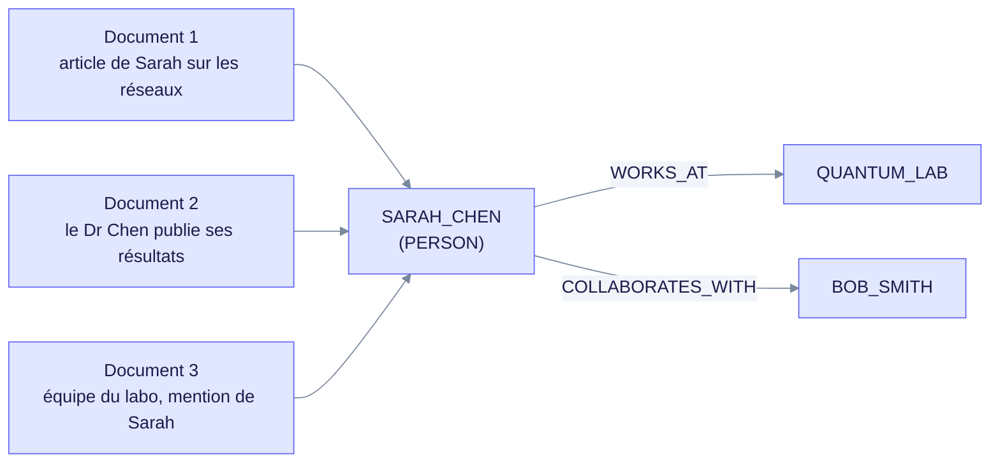
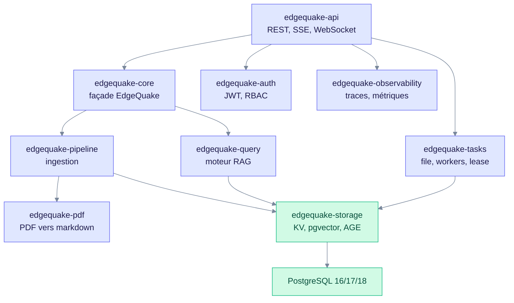
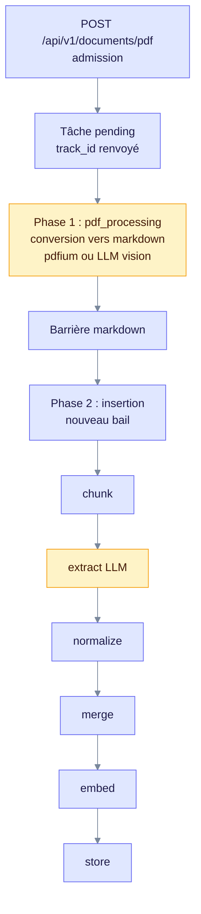
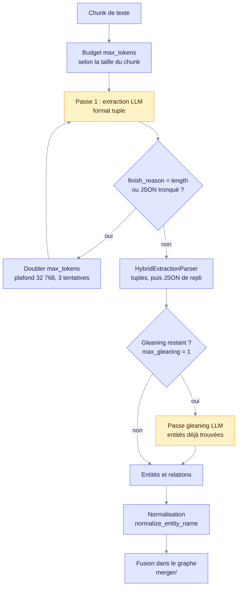
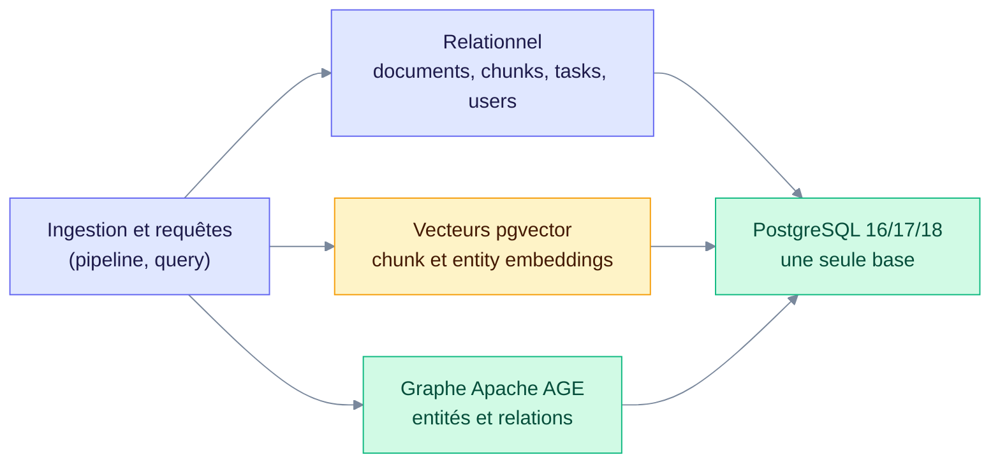
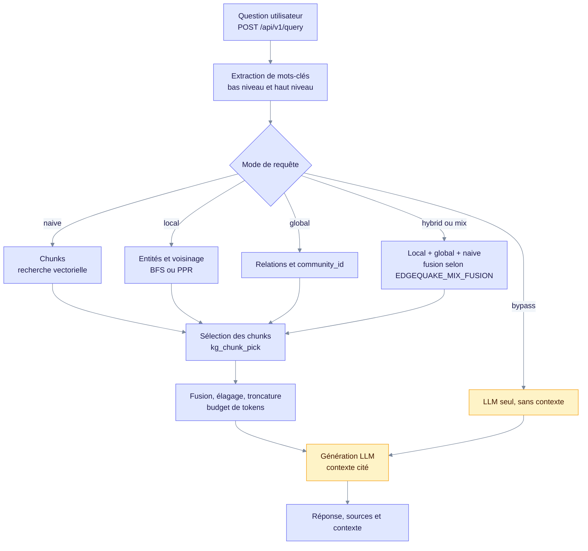
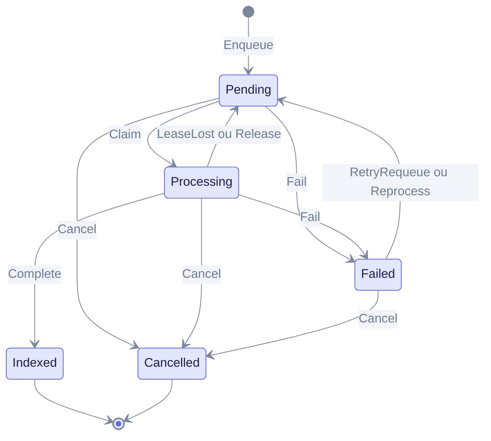

> **Note d'état** : ce dossier a été rédigé pour la v0.26.4. Les modules, routes, variables d'environnement et statuts ont été recontrôlés contre le code de la v0.32.2 (`edgequake/Cargo.toml`). Les chiffres de performance de la version d'origine ne sont plus repris.
> Pour l'exploitation courante : [Architecture](../architecture/index.md) · [Roles](../providers/roles.md) · [Troubleshooting](../troubleshooting/index.md)

Ce document explique **comment EdgeQuake fonctionne à l'intérieur** : le découpage du code, l'algorithme d'ingestion, le modèle de données, l'algorithme d'interrogation et les décisions d'architecture qui les sous-tendent.
Il s'adresse aux architectes, développeurs et data scientists qui doivent comprendre ou modifier le moteur. Les noms de modules, fonctions et variables sont ceux du code.

---

## Sommaire

1. [Le problème résolu](#1-le-problème-résolu)
2. [Architecture du code](#2-architecture-du-code)
3. [Algorithme d'ingestion](#3-algorithme-dingestion)
4. [Modèle de données](#4-modèle-de-données)
5. [Algorithme d'interrogation](#5-algorithme-dinterrogation)
6. [Ordonnancement des tâches](#6-ordonnancement-des-tâches)
7. [Décisions d'architecture](#7-décisions-darchitecture)
8. [Pour aller plus loin](#8-pour-aller-plus-loin)

---

## 1. Le problème résolu

### 1.1 La limite du RAG classique

Le RAG traditionnel découpe les documents en fragments, les vectorise et récupère les *k* fragments les plus proches sémantiquement de la question.

```text
Documents → Chunks → Embeddings → Base vectorielle
Question  → Embedding → Top-K chunks similaires → LLM → Réponse
```

Ce schéma fonctionne pour une question factuelle localisée. Il échoue dès que la réponse suppose de **relier** des informations dispersées.

Question type : *« Comment les travaux de Sarah Chen sur les réseaux de neurones ont-ils influencé ceux de ses collègues du laboratoire Quantum Dynamics ? »*

Le RAG classique remonte trois fragments : un mentionnant Sarah Chen, un sur les réseaux de neurones, un sur le laboratoire. **Ces fragments sont déconnectés.** Le système ne sait pas que Sarah Chen travaille à Quantum Dynamics, ni qui sont ses collègues, ni comment l'influence se propage.

> **Le fond du problème** : un vecteur encode la *similarité*, pas la *relation*.
> Deux textes proches dans l'espace d'embedding ne sont pas nécessairement liés factuellement, et deux textes factuellement liés peuvent être éloignés dans cet espace.

### 1.2 L'apport du graphe

Une entité qui apparaît dans plusieurs documents devient un **nœud unique** qui les relie.



*Ce qu'il faut voir : trois documents distincts convergent vers une seule entité `SARAH_CHEN`. C'est ce nœud partagé qui permet le raisonnement multi-sauts.*

Les entités sont le **pont entre les documents**. Le parcours de graphe rend possible un raisonnement multi-sauts que la similarité vectorielle seule ne produit pas.

### 1.3 Pourquoi LightRAG plutôt que GraphRAG

| Critère | LightRAG (EdgeQuake) | GraphRAG (Microsoft) |
|---|---|---|
| Coût de récupération | Faible : voisinage ciblé | Élevé : résumés de communautés |
| Appels LLM par requête | Quelques appels (mots-clés, réponse) | Nombreux |
| Mise à jour | **Incrémentale** | Reconstruction des résumés |
| Détection de communautés | Optionnelle (`EDGEQUAKE_COMMUNITY_GLOBAL`) | Obligatoire |

Le point décisif en exploitation est la **mise à jour incrémentale** : un nouveau document fusionne dans le graphe existant sans réindexation globale. Avec GraphRAG, chaque ajout impose de reconstruire les résumés de communautés, ce qui devient coûteux sur un corpus vivant.

### 1.4 Ce qu'EdgeQuake ajoute à LightRAG

| Apport | Nature |
|---|---|
| Implémentation Rust asynchrone | Concurrence réelle et binaire unique (voir §7.1) |
| 6 modes de requête | `naive`, `local`, `global`, `hybrid`, `mix`, `bypass` |
| Reprise adaptative sur troncature | Escalade du budget de tokens sur `finish_reason = "length"` |
| Analyseur hybride tuple + JSON | Robustesse aux sorties LLM malformées |
| Multi-tenant *fail-closed* | Cloisonnement au niveau du stockage |
| Marche de graphe BFS par défaut, PPR en option | `EDGEQUAKE_GRAPH_WALK=ppr` active le Personalized PageRank |
| Pipeline PDF vision | Conversion multimodale avec repli texte |
| Lignage complet | Traçabilité chunk → entité → document |
| Remplissage PDF au budget | Chunks pleins traversant les pages, citations `p.N–M` (SPEC-135, v0.26) |

---

## 2. Architecture du code

### 2.1 Découpage en crates

Le workspace Cargo compte **15 crates** sous `edgequake/crates/`. Le tableau détaille les 11 crates du moteur. `edgequake-fake-llm`, `edgequake-migrate-manifest`, `edgequake-secrets` et `edgequake-storage-contracts` ne sont pas détaillés ici.



*Schéma simplifié des rôles : une flèche indique « appelle ». Ce n'est pas le graphe de dépendances Cargo exact.*

| Crate | Responsabilité | Modules notables |
|---|---|---|
| `edgequake-api` | REST, SSE, WebSocket, OpenAPI, middlewares | `routes.rs`, `handlers/`, `startup_security.rs`, `workspace_scope.rs` |
| `edgequake-core` | Façade `EdgeQuake`, câblage des fournisseurs LLM, budgets | `orchestrator/`, `resource/`, `token_budget.rs`, `model_resolution.rs` |
| `edgequake-pipeline` | Chaîne d'ingestion | `chunker/`, `extractor/`, `merger/`, `prompts/`, `text_embedder.rs`, `ingestion_pipeline.rs` |
| `edgequake-query` | Moteur RAG, 6 modes | `engine_impl/`, `modes.rs`, `keywords/`, `graph_ppr.rs`, `fusion.rs`, `hybrid_merge.rs` |
| `edgequake-storage` | Persistance et invariants de données | `traits/`, `adapters/`, `entity_id.rs`, `migration_engine/` |
| `edgequake-pdf` | PDF vers markdown, vision, assets | `backend/`, `vision_extract.rs`, `page_layout.rs` |
| `edgequake-tasks` | File, workers, claim/lease, annulation, équité | `claim_eligibility.rs`, `lease.rs`, `fairness.rs`, `worker.rs` |
| `edgequake-auth` | JWT, clés d'API, OIDC, RBAC | `jwt.rs`, `rbac.rs`, `oidc_config.rs` |
| `edgequake-audit` | Événements de conformité | `event.rs`, `logger.rs` |
| `edgequake-rate-limiter` | Quotas par tenant | `limiter.rs`, `middleware.rs` |
| `edgequake-observability` | Traces, métriques, corrélation | `metrics.rs`, `rag_span.rs`, `langfuse.rs` |

> Il n'existe **pas** de crate `edgequake-graph`. La logique de graphe est répartie entre `storage` (persistance AGE), `pipeline` (construction) et `query` (parcours).
> Les fournisseurs LLM proviennent du crate externe `edgequake-llm`, publié sur crates.io.

### 2.2 Motifs d'architecture

- **Façade** : `EdgeQuake` (crate `core`, `orchestrator/`) masque le pipeline et le moteur de requête derrière deux opérations, `insert()` et `query()`.
- **Adaptateur** : trois traits, `KVStorage`, `VectorStorage` et `GraphStorage` (`edgequake-storage/src/traits/`), abstraient le stockage. Le serveur exige PostgreSQL (`DATABASE_URL`) ; les tests unitaires utilisent des adaptateurs mémoire.
- **Stratégie** : les modes de requête sont des stratégies interchangeables, sélectionnées à l'exécution (`engine_impl/modes/`).
- **Pipeline en deux phases** : l'ingestion PDF est scindée en une tâche de conversion puis une tâche d'insertion, séparées par une barrière (§3.1).

### 2.3 Le choix de Rust

| Facteur | Python (LightRAG de référence) | Rust (EdgeQuake) |
|---|---|---|
| Concurrence | Limitée par le GIL | Asynchrone réelle (Tokio) |
| Erreurs de typage | À l'exécution | À la compilation |
| Empreinte mémoire | Plus élevée en général | Plus faible en général |
| Déploiement | Environnement virtuel et dépendances | **Binaire unique** |

Le dernier point est le plus structurant en exploitation : pas de gestion d'environnement virtuel, pas de résolution de dépendances au déploiement, image conteneur minimale.

---

## 3. Algorithme d'ingestion

### 3.1 Vue d'ensemble — deux phases



*Pour un document texte (`POST /api/v1/documents`), la phase 1 est absente et l'insertion démarre directement.*

**Pourquoi deux phases ?** La conversion PDF est coûteuse, longue et parfois confiée à un fournisseur vision distinct. La scinder permet de conserver le markdown même si l'ingestion KG échoue, de reprendre l'insertion sans reconvertir, et de poser un bail indépendant sur chaque phase. Une conversion longue ne bloque pas un worker sur toute la chaîne.

### 3.2 Étape 1 — Découpage (chunking)

Modules : `chunker/` (`registry.rs`, `types.rs`, `recursive.rs`, `markdown_pack.rs`, `cross_page_pack.rs`), `adaptive_chunking.rs`, `contextual_chunk.rs`, `structure_induce.rs`, `token_estimator.rs`.

Le type `ChunkerConfig` (`chunker/types.rs`) porte les paramètres de découpage. Sa valeur par défaut de structure est `chunk_size = 800`, mais le pipeline choisit la taille réelle via la politique adaptative décrite ci-dessous.

```rust
pub struct ChunkerConfig {
    pub chunk_size: usize,            // tokens cibles
    pub chunk_overlap: usize,         // recouvrement en tokens (défaut : 100)
    pub min_chunk_size: usize,        // défaut : 100
    pub preserve_sentences: bool,     // défaut : true
    // separators, split_by_character, split_by_character_only
}

pub enum ChunkStrategy {
    Fixed,      // fenêtre glissante de tokens (LightRAG F)
    Recursive,  // cascade de séparateurs, défaut de l'enum (SPEC-026)
    Markdown,   // découpe par titres, avec fil d'Ariane
    Pdf,        // page-aware, pour les sources PDF
    Semantic,   // ruptures sémantiques, nécessite un embedder
}
```

**Découpage adaptatif** : la taille varie selon la taille du document en octets.

| Taille du document | Taille de chunk |
|---|---|
| ≤ 50 000 octets | 1 200 tokens |
| 50 000 à 100 000 octets | 800 tokens |
| > 100 000 octets | 600 tokens |

- `EDGEQUAKE_ADAPTIVE_CHUNKING` est activé par défaut. Désactivé, le pipeline applique une taille fixe : `EDGEQUAKE_CHUNK_SIZE` (défaut 1 200) et `EDGEQUAKE_CHUNK_OVERLAP` (défaut 100).
- Une politique de workspace (`inherit`, `adaptive` ou `fixed`) prime sur les variables d'environnement.

Le **recouvrement** évite qu'une relation exprimée à cheval sur deux chunks soit perdue par les deux. En mode fixe, il vaut 100 tokens ; en mode adaptatif, environ 8,3 % de la taille du chunk (`adaptive_chunk_overlap`).

Deux raffinements optionnels existent :

- **Préambule de contexte** : chaque chunk peut porter un préambule (colonne `chunk_context_preamble`, migration 135). Il n'entre dans le texte vectorisé que si `EDGEQUAKE_CONTEXTUAL_CHUNK=1`.
- **Induction de structure** : pour une prose sans titres (questions FAQ inline), `EDGEQUAKE_STRUCTURE_INDUCE=faq` transforme ces questions en titres `##` (`structure_induce.rs`), afin que le découpage Markdown attache un fil d'Ariane.

#### Remplissage au budget pour les PDF (SPEC-135, v0.26.0)

Depuis la v0.26.0, l'ingestion PDF ne découpe plus strictement page par page. Le markdown converti est **rempli jusqu'au budget de tokens**, y compris **à cheval sur plusieurs pages** (*cross-page packing*).

**Le problème traité** : une page de PDF fait rarement 1 200 tokens. Un découpage page par page produit des chunks très inégaux, trop courts, qui diluent le signal, multiplient les appels d'extraction et dégradent le rappel.

| Réglage | Défaut | Effet |
|---|---|---|
| `EDGEQUAKE_PDF_PACK` | activé | Remplissage au budget de l'espace de travail |
| `EDGEQUAKE_PDF_CROSS_PAGE_PACK` | activé | Autorise un chunk à enjamber deux pages |

Ces deux variables sont des **coupe-circuits** : `0` restaure le découpage page par page antérieur.

**Conséquence sur la traçabilité** : chaque chunk porte un intervalle de pages (`page_start` / `page_end`), restitué dans les citations sous la forme `p.N–M`. Le SDK expose ce champ dans `ChunkDetail` depuis la version **0.4.0**.

Télémétrie associée dans le span `ingest.chunking` : `fill_p50` (médiane de remplissage du budget) et `mm_sidecar_appended`.

### 3.3 Étape 2 — Extraction d'entités par LLM

Modules : `extractor/` (`llm.rs`, `sota.rs`, `gleaning.rs`), `prompts/entity_extraction.rs`, `prompts/parser/`.

Le diagramme ci-dessous résume les étapes 2 à 4 (extraction, gleaning, normalisation) et leurs boucles de reprise.



*Ce qu'il faut voir : la boucle d'escalade relance la même passe avec plus de tokens, et le gleaning ajoute au plus une passe de rattrapage avant la normalisation.*

Le prompt demande au LLM de jouer le rôle d'un spécialiste des graphes de connaissances. La sortie attendue est un **format tuple délimité** :

```text
entity<|#|>SARAH_CHEN<|#|>PERSON<|#|>Chercheuse principale au Quantum Lab
entity<|#|>NEURAL_NETWORK<|#|>CONCEPT<|#|>Architecture d'apprentissage automatique
relation<|#|>SARAH_CHEN<|#|>NEURAL_NETWORK<|#|>recherche<|#|>Sarah travaille sur les réseaux de neurones
<|COMPLETE|>
```

Le délimiteur de tuple est `<|#|>` et la fin de sortie est signalée par `<|COMPLETE|>` (`prompts/mod.rs`).

**Pourquoi des tuples et non du JSON ?**

| Critère | Tuples | JSON |
|---|---|---|
| Traitement en flux | Ligne par ligne | Structure complète requise |
| Récupération partielle | Les lignes valides sont conservées | Tout ou rien |
| Échappement | Aucun caractère spécial | Guillemets, antislashs |
| Fiabilité LLM | Éprouvé | Sorties malformées fréquentes |

Une réponse tronquée en JSON est **entièrement perdue**, alors qu'une réponse tronquée en tuples conserve toutes les lignes complètes.

`HybridExtractionParser` (`prompts/parser/mod.rs`) détecte les marqueurs de tuples. S'il en trouve, il parse les tuples. Si le résultat est vide ou en erreur, il bascule sur le parseur JSON (`JsonExtractionParser`).

### 3.4 Gestion adaptative du budget de tokens

La densité d'entités varie fortement d'un chunk à l'autre. Un budget fixe tronque les chunks denses et gaspille sur les chunks pauvres. Le budget de base dépend donc de la taille du chunk (`extractor/sota.rs`) :

```rust
let base_max_tokens = if chunk_size_bytes < 25_000 {
    4096
} else if chunk_size_bytes < 75_000 {
    8192
} else if chunk_size_bytes < 125_000 {
    12288
} else {
    16384
};
```

**Escalade sur troncature** (`finish_reason` contenant `length`, ou JSON tronqué) :

| Tentative | Budget `max_tokens` |
|---|---|
| 1 | `base_max_tokens` |
| 2 | × 2 |
| 3 | × 4, plafonné à 32 768 |

Au plus trois tentatives sont effectuées. La métrique `edgequake_extract_retry_total` suit ces reprises. Une hausse durable signale un corpus plus dense que prévu ou un modèle sous-dimensionné.

### 3.5 Gleaning : extraction en plusieurs passes

Module : `extractor/gleaning.rs`. Configuration : `GleaningConfig { max_gleaning: 1 }`, valeur par défaut.

Un LLM manque systématiquement des entités en une seule passe :

- limites d'attention sur les textes longs ;
- **références implicites**, comme « l'entreprise » désignant une organisation nommée plus haut ;
- saturation quand le chunk contient beaucoup d'entités.

Le gleaning relance l'extraction en fournissant au modèle la liste de ce qu'il a déjà trouvé, et lui demande explicitement de chercher les mentions implicites.

*Exemple illustratif (la consigne réelle est dans `prompts/entity_extraction.rs`) :*

```text
Passe 1  →  SARAH_CHEN, QUANTUM_LAB
            (manqué : « l'entreprise » = QUANTUM_LAB)

Passe 2  →  consigne : « Des entités ont peut-être été manquées.
             Déjà trouvées : SARAH_CHEN, QUANTUM_LAB.
             Cherche les mentions implicites. »
         →  TEAM, EXPANSION_EVENT
```

**Rendement** : le commentaire de `gleaning.rs` annonce +15 à 25 % de rappel pour une à deux itérations, avec des rendements décroissants. Ce chiffre n'est pas reproduit ici. Chaque itération coûte un appel LLM supplémentaire, d'où le défaut à **1**.

### 3.6 Normalisation des entités

Fonction canonique : `normalize_entity_name` (`edgequake-storage/src/entity_id.rs`). Le module `prompts/normalizer.rs` fournit les helpers de comparaison (`entities_match`).

Étapes principales : trim, normalisation Unicode NFC, casefold, suppression des articles initiaux, suppression des possessifs (`'s`), puis mise en casse titre, jointure par `_` et passage en majuscules.

```text
normalize_entity_name("John Doe")                       → "JOHN_DOE"
normalize_entity_name("the company")                    → "COMPANY"
normalize_entity_name("John's")                         → "JOHN"
normalize_entity_name("550e8400-e29b-41d4-a716-446655440000") → ""   (UUID rejeté)
```

Les noms vides, les nombres purs trop courts et les identifiants opaques (UUID, ULID, ObjectId, hashes longs, ARN) sont **rejetés** et donnent une chaîne vide.

Sans normalisation, `"John Doe"`, `"john doe"` et `"JOHN DOE"` produiraient **trois nœuds distincts**. Le graphe perdrait alors la propriété qui justifie son existence : l'unification des mentions à travers les documents.

Voir [../deep-dives/entity-normalization.md](../deep-dives/entity-normalization.md).

### 3.7 Fusion (merge)

Modules : `merger/` (`entity_resolution.rs`, `description_merge.rs`, `weight_policy.rs`, `relationship.rs`), `entity_fuzzy.rs`, `entity_reconcile.rs`, `graph_batch_dedupe.rs`, `summarizer.rs`.

C'est l'étape qui rend la mise à jour **incrémentale**. Pour chaque entité extraite :

1. **Résolution d'identité** : l'identifiant normalisé existe-t-il déjà dans l'espace de travail ? Un rapprochement approximatif (`entity_fuzzy.rs`) traite ensuite les variantes.
2. **Fusion des descriptions** : la règle suit LightRAG. Un seul fragment est conservé tel quel. Peu de fragments, sous le budget de tokens, sont concaténés avec le séparateur de champ. Sinon, un résumé LLM est produit (`summarizer.rs`).
3. **Fusion des poids de relation** : politique `max` par défaut (associative). `mean` est disponible via `EDGEQUAKE_WEIGHT_POLICY=mean`.
4. **Dédoublonnage par lot** : les arêtes en double d'un même lot sont fusionnées avant écriture.

> **Pourquoi `max` par défaut ?** La fusion doit être **associative** : le résultat ne doit pas dépendre de l'ordre d'ingestion. `max` l'est. Une moyenne incrémentale ne l'est pas sans conserver le compte. L'objectif est que deux ingestions des mêmes documents, dans un ordre différent, produisent le même graphe.

### 3.8 Vectorisation

Modules : `text_embedder.rs`, `storage/dimension_policy.rs`, `embedding_family.rs`.

Sont vectorisés : les **chunks** (recherche de passages) et les **entités** (ancrage d'entités au moment de la requête).

Deux invariants :

- **Cohérence de dimension** : un espace de travail est lié à une famille de modèle d'embedding. Un vecteur de dimension incompatible est **rejeté** et compté dans `edgequake_vector_dim_mismatch_rejected_total`. Changer de modèle impose une reconstruction (`POST /api/v1/workspaces/{workspace_id}/rebuild-embeddings`).
- **Taille de lot** : `EDGEQUAKE_EMBEDDING_BATCH_SIZE` est un plafond optionnel (`safety_limits.rs`). Certains fournisseurs imposent une taille de lot plus petite.

### 3.9 Persistance et cohérence

Modules : `outbox.rs`, `outbox_drain.rs`, `compensation.rs`, `serving_fence.rs` (crate `edgequake-storage`).

Une ingestion écrit dans plusieurs familles de données (relationnel, vecteurs, graphe). Une panne en cours d'écriture laisserait un état incohérent : un chunk sans son vecteur, une entité sans son arête.

Le dispositif retenu :

- **Outbox** : les effets à propager sont journalisés (`outbox_events`) puis drainés. La propagation est donc rejouable.
- **Compensation** : les écritures partielles détectées sont compensées ou mises en quarantaine (table `compensation_quarantine`, métrique `edgequake_compensation_quarantine_total`).
- **Serving fence** : une barrière empêche de servir des données dans un état intermédiaire.

### 3.10 Détection de communautés

Modules : `storage/community.rs`, `community_persist.rs`, `community_reports.rs`, `community_index_service.rs`, et `query/community_global.rs` côté requête.

- Le calcul **Louvain** regroupe les entités densément connectées et écrit un `community_id` sur les nœuds.
- Le flag `EDGEQUAKE_COMMUNITY_GLOBAL` (activé par défaut) active ces fonctions. Le calcul automatique est borné par `EDGEQUAKE_COMMUNITY_BACKFILL_MAX_NODES` (défaut 50 000 nœuds).
- Le mode `global` ne lance pas Louvain à la requête : il lit les labels `community_id` calculés à l'indexation.
- Les rapports de communauté (résumés) ne sont injectés dans le contexte que si `EDGEQUAKE_COMMUNITY_REPORTS=true`.

La métrique `edgequake_community_detection_sampled_total` suit les calculs échantillonnés.

Voir [../deep-dives/community-detection.md](../deep-dives/community-detection.md).

### 3.11 Pipeline PDF

Crate `edgequake-pdf`. Les backends sont choisis par `PdfParserBackend` (`backend/mod.rs`).

| Backend | Principe | Remarque |
|---|---|---|
| **`vision`** (défaut du workspace) | LLM multimodal : chaque page est convertie en image | Un appel LLM par page |
| **`edgeparse`** | Extraction texte, pdfium via `edgequake-pdf2md` | Adapté aux PDF textuels |
| **`edgeparse-ocr`** | Extraction texte avec OCR | Pour les PDF scannés |
| **`auto`** | Démarre en intention vision, avec fast-path texte si la densité de texte le permet | Choix de configuration, résolu à l'exécution |

Le backend se choisit par workspace ou par la variable `EDGEQUAKE_PDF_PARSER_BACKEND` (`vision`, `edgeparse`, `edgeparse-ocr`, `auto`). Le mode vision existe parce que les analyseurs textuels **détruisent** les tableaux complexes et se trompent sur l'ordre de lecture en multi-colonnes.

**Repli automatique** : un échec vision retombe sur `edgeparse` (`fallback.rs`) plutôt que de faire échouer le document.

Traitements complémentaires : extraction des images intégrées, recadrage de graphiques (`chart_crop.rs`), filtre de figures (`figure_filter.rs`), persistance du layout de page (`page_layout.rs`, migration 148). Pour les manuscrits, le chemin *page-as-unit* (SPEC-134, `manuscript_profile.rs`) traite chaque page comme une unité, puis le markdown passe au remplissage du §3.2.

Voir [../deep-dives/pdf-processing.md](../deep-dives/pdf-processing.md).

---

## 4. Modèle de données

### 4.1 Une base, trois usages



*Ce qu'il faut voir : les trois usages partagent une seule base. Les écritures cohérentes sont plus simples, et les effets restants passent par l'outbox (§3.9).*

Tables principales (noms réels des migrations) :

- **Relationnel** : `documents`, `document_pages`, `chunks`, `tasks`, `users`, `api_keys`, `conversations`, `messages`, `audit_logs`, `document_mm_assets`, `pdf_documents`.
- **Vecteurs** : `chunk_embeddings`, `entity_embeddings`, `relationship_embeddings` (pgvector).
- **Liens de lignage** : `chunk_entity_links`, `chunk_relation_links` (migration 066).
- **Graphe** : nœuds d'entité et arêtes de relation dans le graphe AGE.

**Pourquoi tout dans PostgreSQL ?** Trois magasins distincts (relationnel, base vectorielle, base graphe) imposent des écritures distribuées sans transaction commune. Une panne laisse les trois désynchronisés, et la réconciliation devient un projet à elle seule. Dans une base unique, la cohérence est nettement plus simple à garantir. Une seule base à sauvegarder, superviser et mettre à jour réduit aussi le coût d'exploitation.

L'image `edgequake-postgres` embarque pgvector 0.8.5 et Apache AGE 1.6.0 (`Makefile`, cible `postgres-image-build`).

### 4.2 Index vectoriels

- Index **HNSW** (pgvector 0.8.5), avec convergence du paramètre `ef` (migration 129).
- Type `halfvec` sans contrainte de dimension pour réduire l'empreinte des embeddings (migration 132).
- **Posture *fail-closed*** : si l'index ANN est absent sur une table vectorielle existante, `/ready` renvoie **503** (blocker `missing_hnsw_index`). Servir sans index reviendrait à faire un balayage séquentiel et à dégrader silencieusement la qualité des réponses. Une base vide est considérée prête.

### 4.3 Graphe AGE

Nœuds d'entité (nom normalisé, type, description agrégée) et arêtes de relation (description, mots-clés, poids). Les requêtes utilisent Cypher via AGE. Des index de citation (migrations 137 et 145) permettent de remonter rapidement les chunks sources d'une entité ou d'une relation.

### 4.4 Recherche plein texte

Une colonne `tsvector` sur le contenu des chunks (migration 136, `chunk_content_tsv`) alimente la récupération lexicale (`sparse_retrieval.rs`, `l2_bm25_union.rs`). Ce n'est pas un BM25 complet : le module le précise, et un reranker BM25 en mémoire sert de repli. La recherche lexicale reste utile sur les identifiants, références et codes exacts, là où l'embedding est faible.

### 4.5 Lignage

Modules : `edgequake-pipeline/src/lineage.rs`, `edgequake-storage/src/lineage_canon.rs`, handlers `handlers/lineage/`.

La chaîne est traçable dans les deux sens : **document → pages → chunks → entités → relations**. Elle répond à « d'où vient cette affirmation ? » et permet d'évaluer l'impact d'une suppression.

| Endpoint | Usage |
|---|---|
| `GET /api/v1/documents/{document_id}/lineage` | Lignage complet d'un document |
| `GET /api/v1/documents/{document_id}/lineage/export` | Export du lignage |
| `GET /api/v1/lineage/entities/{entity_name}` | Origine d'une entité |
| `GET /api/v1/chunks/{chunk_id}/lineage` | Chunk et ses parents |
| `GET /api/v1/documents/{document_id}/deletion-impact` | Impact d'une suppression |

### 4.6 Gouvernance du schéma

- **167 fichiers** de migration SQL, numérotés de 001 à 169 (numérotation non contiguë).
- Les empreintes sont verrouillées dans `migrations/checksums.lock`.
- Le moteur (`storage/migration_engine/`) distingue les migrations **extensibles** des **suppressions irréversibles**. Ces dernières exigent `--confirm-drop`. Par exemple, `125_spec091_kv_drop`, `126_spec091_vector_drop` et `131_spec091_fleet_vector_drop` sont des suppressions.
- Les migrations extensibles portent la mention `SAFE SCHEMA` et ne demandent pas `--confirm-drop` (par exemple 132, 143, 144).
- L'API ne migre jamais le schéma. Si le schéma est en retard, le démarrage s'arrête avec le **code de sortie 78** (`EDGEQUAKE_SCHEMA_GATE=fail`, défaut). Le mode `wait` expose `/live` et laisse `/ready` à 503 jusqu'à la migration.

---

## 5. Algorithme d'interrogation

### 5.1 Chaîne de traitement



*Ce qu'il faut voir : un seul mode est choisi par la requête. Seul le mode `bypass` court-circuite la récupération.*

Détail des étapes :

- **Mots-clés** : `keywords/extractor.rs` produit des mots-clés de bas niveau (entités concrètes) et de haut niveau (thèmes).
- **Branches** : vecteurs de chunks (`vector_filter.rs`), vecteurs d'entités (`entity_rank.rs`), expansion de graphe (`graph_ppr.rs`, `graph_expand.rs`), vecteurs de relations et `community_id` (`community_global.rs`), récupération lexicale (`sparse_retrieval.rs`).
- **Génération** : `context_format.rs` met en forme le contexte cité.
- **Restitution** : `grounding.rs` et `retrieval_telemetry.rs`.

### 5.2 Récupération à deux niveaux

C'est le cœur de LightRAG. Une même question est traitée à deux granularités :

| Niveau | Mots-clés | Cible | Question type | Ce qui est remonté |
|---|---|---|---|---|
| **Bas** | Bas niveau | Entités et voisinage direct | « Qui est Sarah Chen ? » | Description d'entité et voisins à 1 saut |
| **Haut** | Haut niveau | Relations et thèmes | « Quelles sont les grandes tendances ? » | Relations pertinentes et contexte de communauté |

Le mode `global` interroge les relations à partir des mots-clés de haut niveau. Le mode `hybrid` combine les branches locales, globales et naïves. Sa couverture est supérieure et son coût aussi.

### 5.3 Les six modes

| Mode | Vecteurs | Graphe | Usage | Coût relatif |
|---|---|---|---|---|
| **`naive`** | Chunks | Non | Recherche factuelle simple | Faible |
| **`local`** | Entités et chunks | Voisinage d'entités | « Qui ou qu'est-ce que X ? » | Modéré |
| **`global`** | Relations | Oui, via `community_id` | « Quels sont les thèmes ? » | Modéré |
| **`hybrid`** | Local, global et naïf, en round-robin | Oui | Questions larges | Élevé |
| **`mix`** *(défaut)* | Local, global et naïf, fusion configurable | Oui | Usage général | Élevé |
| **`bypass`** | Aucun | Non | LLM seul, sans RAG (test, comparaison) | Le plus faible |

Le mode par défaut de la requête est **`mix`** (`QueryMode` par défaut). La fusion de `mix` se règle par `EDGEQUAKE_MIX_FUSION` (`round_robin`, `rrf` ou `max_after_minmax`). Sa valeur par défaut est `round_robin` (`fusion.rs`).

Arbre de décision :

```text
Test ou comparaison sans RAG ?              → bypass
Question sur une entité précise ?           → local
Question thématique, vue d'ensemble ?       → global
Questions larges, à plusieurs facettes ?    → hybrid
Usage général, sans réglage particulier ?   → mix (défaut)
Recherche factuelle sans relation ?         → naive
```

Voir [../deep-dives/query-modes.md](../deep-dives/query-modes.md).

### 5.4 Marche de graphe : BFS par défaut, PPR en option

Module : `graph_ppr.rs`. Variable : `EDGEQUAKE_GRAPH_WALK=bfs|ppr`. **Le défaut est `bfs`.**

- **BFS** parcourt le voisinage en largeur, par distance. Un nœud hub très connecté peut inonder le contexte de voisins peu pertinents.
- **PPR** (Personalized PageRank), activé par `EDGEQUAKE_GRAPH_WALK=ppr`, pondère les nœuds par leur proximité aux nœuds d'ancrage de la question. Il favorise les entités proches *de la question*, pas seulement celles proches dans le graphe.

Le défaut reste BFS selon le choix documenté dans `graph_ppr.rs` (SPEC-086). Pour comparer les deux sur votre corpus, basculez la variable et mesurez.

Compression et élagage, tous optionnels ou intégrés : `graph_walk_compress.rs` (activable par `EDGEQUAKE_GRAPH_WALK_COMPRESS=1`), `path_prune.rs`, `graph_hops.rs`.

### 5.5 Sélection bipartite de chunks

Module : `kg_chunk_pick.rs`, fonction `pick_chunks_by_bipartite_ppr`.

La sélection ne repose pas sur la seule similarité vectorielle. Elle s'appuie sur un **graphe bipartite entité–chunk** : un PPR y classe les chunks. Un chunk devient candidat soit par proximité sémantique, soit parce qu'il est la source d'une entité retenue par la marche de graphe. Cela remonte des passages factuellement pertinents que l'embedding seul aurait manqués.

### 5.6 Fusion, réordonnancement, élagage

| Étape | Module | Rôle |
|---|---|---|
| Normalisation des scores | `score_scale.rs` | Rendre comparables des scores d'origines hétérogènes |
| Fusion | `fusion.rs`, `hybrid_merge.rs` | Combiner les branches et dédoublonner |
| Choix du reranker | `intent_rerank.rs` | Selon l'intention : `EDGEQUAKE_FACT_RERANKER=bm25` route les questions factuelles vers BM25 |
| Élagage de pertinence | `relevancy_prune.rs` | Écarter le contexte faiblement lié |
| Protection au réordonnancement | `rerank_protect.rs` | Empêcher qu'un réordonnancement évince les sources fortes |
| Troncature | `truncation.rs` | Respecter le budget de tokens du modèle |
| Hydratation | `chunk_hydration.rs` | Récupérer le texte complet des chunks retenus |

Chaque branche est mesurée par la métrique `edgequake_query_arm_duration_seconds`, ventilée par branche. Elle sert à repérer une branche qui pèse sur la latence.

### 5.7 Fidélité et ancrage

Modules : `grounding.rs`, `eval/faithfulness.rs`.

L'échantillonnage de fidélité (*faithfulness*) vérifie si la réponse est soutenue par le contexte récupéré. Par défaut, une heuristique est utilisée. Un juge LLM est activé par `EDGEQUAKE_FAITHFULNESS_JUDGE=1`, `true` ou `llm`. Les métriques sont `edgequake_faithfulness_score` et `edgequake_faithfulness_samples_total`.

### 5.8 Traçabilité de la récupération

Le contexte récupéré est identifiable par un `retrieval_id`, relisible *a posteriori* :

```text
GET  /api/v1/query/context/{retrieval_id}
GET  /api/v1/query/context/artifacts/{artifact_type}/{artifact_id}
POST /api/v1/query/context         (récupération seule, sans génération)
```

Indispensable pour auditer une réponse contestée : on reconstitue exactement ce que le LLM avait sous les yeux.

### 5.9 Caches

Module : `query/cache/` (réponses, embeddings, réponses LLM, résultats de requête). Les caches fournisseur et de prompt suivent SPEC-126. Ils réduisent le coût et la latence des requêtes répétées. Portée : [../data-layer/llm-cache-scope.md](../data-layer/llm-cache-scope.md).

---

## 6. Ordonnancement des tâches

Crate `edgequake-tasks`.

### 6.1 Distribution par claim et lease

Un worker prend une tâche `pending` avec un verrou de ligne qui saute les lignes déjà verrouillées. Forme simplifiée de `claim_next` (le code ajoute tri par workspace et équité) :

```sql
SELECT ... FROM tasks
 WHERE status = 'pending'
   AND fairness_parked_at IS NULL
   AND (fairness_hold_until IS NULL OR fairness_hold_until < now())
 ORDER BY ...
 FOR UPDATE SKIP LOCKED
 LIMIT 1;
```

`FOR UPDATE SKIP LOCKED` garantit que deux workers, y compris sur deux réplicas, ne prennent jamais la même tâche, sans verrou global ni broker externe.

**Bail (*lease*)** : le worker qui prend une tâche pose un bail (`lease_owner`, `lease_token`, `lease_expires_at`) qu'il renouvelle pendant le traitement. Si le processus meurt, le bail expire et la tâche redevient reprenable (`status = 'processing'` et bail expiré). C'est ce qui rend l'ingestion **durable au redémarrage** : une tâche admise n'est jamais perdue, au pire elle est reprise.

### 6.2 Machine à états

Statuts persistés : `pending`, `processing`, `indexed`, `failed`, `cancelled`. L'interface affiche `Stopping…` pendant une annulation en cours, un état d'affichage qui n'est pas persisté.



*Ce qu'il faut voir : `Indexed` et `Cancelled` sont terminaux. Une tâche `failed` peut être relancée (`RetryRequeue`) ou retraitée (`Reprocess`).*

Source : la table de transitions de `edgequake-tasks/src/state_machine.rs`. Les routes de contrôle sont `POST /api/v1/tasks/{track_id}/cancel` et `POST /api/v1/tasks/{track_id}/retry`.

### 6.3 Annulation durable

Modules : `cancel_decision.rs`, `cancellation.rs`.

L'annulation est un état persistant, pas un signal en mémoire. L'interface affiche **Stopping…** jusqu'à l'état terminal `cancelled`. Ce statut est distinct de `failed` : une annulation demandée par un utilisateur n'est pas un incident et ne doit pas peser sur les indicateurs d'échec.

Une rétractation des effets partiels est déclenchée et comptée dans `edgequake_retract_on_cancel_total`.

### 6.4 Équité inter-tenant

Modules : `fairness.rs`, `fairness_hold.rs` (migration 138), `tenant_limiter.rs`.

Sans mécanisme d'équité, un tenant qui dépose 10 000 documents monopoliserait les workers et ferait attendre tous les autres. La colonne `fairness_hold_until` retire temporairement une tâche de la file de claim, et `fairness_parked_at` marque une tâche mise de côté. Cela force l'alternance entre tenants et garantit une progression à chacun.

### 6.5 Capacité fournisseur

Modules : `provider_budget.rs`, `provider_capacity.rs`, `provider_class.rs`, `capacity_block.rs`.

Les créneaux d'appel LLM sont comptabilisés par classe de fournisseur (`edgequake_provider_slots_inflight`, `edgequake_provider_slot_hold_duration_seconds`). L'objectif est de ne pas dépasser les quotas et de ne pas déclencher de limitation côté fournisseur.

Détail opérationnel : [../ingestion-cancel-and-fairness.md](../ingestion-cancel-and-fairness.md).

---

## 7. Décisions d'architecture

Chaque décision est présentée avec son alternative écartée et le motif.

### 7.1 Rust plutôt que Python

**Alternative** : réimplémenter LightRAG en Python (écosystème IA natif).
**Motif** : débit et empreinte mémoire meilleurs, concurrence réelle sans GIL, erreurs de typage capturées à la compilation, **binaire unique** à déployer.
**Concession** : écosystème IA moins fourni. Les appels LLM sont délégués au crate dédié `edgequake-llm` plutôt que réimplémentés.

### 7.2 PostgreSQL comme magasin unique

**Alternative** : Qdrant ou Weaviate pour les vecteurs, plus Neo4j pour le graphe.
**Motif** : transactions communes entre les familles de données, un seul système à sauvegarder, superviser et mettre à jour. pgvector et AGE sont matures.
**Concession** : moins de fonctionnalités spécialisées qu'une base vectorielle ou graphe dédiée. Le gain d'exploitation et de cohérence compense ce coût.

### 7.3 Format tuple plutôt que JSON pour l'extraction

**Alternative** : sortie structurée JSON, éventuellement contrainte par schéma.
**Motif** : robustesse à la troncature. Une sortie tuple tronquée conserve ses lignes complètes, une sortie JSON tronquée est intégralement perdue. Le traitement en flux est possible.

### 7.4 L'API ne migre jamais la base

**Alternative** : migration automatique au démarrage.
**Motif** : une migration déclenchée par un redémarrage est ingérable en production, a fortiori en multi-réplique, où plusieurs instances migreraient en même temps. Le décalage produit un **code de sortie 78**, distinct d'un plantage, sur lequel un orchestrateur peut réagir.
**Concession** : une étape d'exploitation supplémentaire à chaque mise à jour.

### 7.5 Posture *fail-closed*

**Alternative** : dégrader silencieusement (servir sans index ANN, ignorer un contexte tenant manquant).
**Motif** : une réponse RAG est du texte en langue naturelle. L'utilisateur ne peut pas deviner qu'elle a été produite à partir d'un contexte incomplet. Une dégradation silencieuse produit des réponses fausses d'apparence normale. Refuser le trafic est le seul comportement honnête.
**Application** : index ANN manquant (`/ready` → 503), isolation tenant ambiguë (refus), CORS non configuré hors mode dev (refus de démarrage en production).

### 7.6 Deux phases pour l'ingestion PDF

**Alternative** : une seule tâche monolithique.
**Motif** : la conversion est longue et coûteuse. La scinder préserve le markdown en cas d'échec de la phase KG, permet la reprise sans reconversion, et évite qu'un bail unique couvre une opération de plusieurs dizaines de minutes.

### 7.7 Claim et lease PostgreSQL plutôt qu'un broker

**Alternative** : Redis, RabbitMQ, Kafka.
**Motif** : `FOR UPDATE SKIP LOCKED` fournit une distribution correcte sans composant supplémentaire à déployer, sauvegarder et superviser. La durabilité vient de la base. Le canal en mémoire (`Notify`) ne sert qu'au réveil des workers.
**Concession** : débit inférieur à un broker dédié, sans objet tant que le facteur limitant est le LLM.

### 7.8 Communautés indexées et bornées

**Alternative** : détection de communautés obligatoire à chaque requête ou à chaque ingestion (approche GraphRAG).
**Motif** : calculer les communautés à l'indexation, les borner par `EDGEQUAKE_COMMUNITY_BACKFILL_MAX_NODES` et les désactiver par flag limite le coût sur un corpus vivant. Le mode `global` lit les labels `community_id` sans calcul à la requête.

---

## 8. Pour aller plus loin

### 8.1 Deep dives du dépôt

| Sujet | Document |
|---|---|
| Algorithme LightRAG (référence complète) | [../deep-dives/lightrag-algorithm.md](../deep-dives/lightrag-algorithm.md) |
| Stratégies de découpage | [../deep-dives/chunking-strategies.md](../deep-dives/chunking-strategies.md) |
| Extraction d'entités | [../deep-dives/entity-extraction.md](../deep-dives/entity-extraction.md) |
| Normalisation d'entités | [../deep-dives/entity-normalization.md](../deep-dives/entity-normalization.md) |
| Gleaning | [../deep-dives/gleaning.md](../deep-dives/gleaning.md) |
| Détection de communautés | [../deep-dives/community-detection.md](../deep-dives/community-detection.md) |
| Modes de requête | [../deep-dives/query-modes.md](../deep-dives/query-modes.md) |
| Stockage de graphe | [../deep-dives/graph-storage.md](../deep-dives/graph-storage.md) |
| Stockage vectoriel | [../deep-dives/vector-storage.md](../deep-dives/vector-storage.md) |
| Modèles d'embedding | [../deep-dives/embedding-models.md](../deep-dives/embedding-models.md) |
| Traitement PDF | [../deep-dives/pdf-processing.md](../deep-dives/pdf-processing.md) |
| Couche de données | [../deep-dives/data-layer.md](../deep-dives/data-layer.md) · [../data-layer/postgres.md](../data-layer/postgres.md) |
| Suivi du lignage | [../architecture/lineage-tracking.md](../architecture/lineage-tracking.md) |
| Flux de données | [../architecture/data-flow.md](../architecture/data-flow.md) |
| Suivi des coûts | [../deep-dives/cost-tracking.md](../deep-dives/cost-tracking.md) |

### 8.2 Publications de référence

1. Guo, Xia, Yu, Ao, Huang : *LightRAG: Simple and Fast Retrieval-Augmented Generation*, [arXiv:2410.05779](https://arxiv.org/abs/2410.05779), 2024.
2. Edge et al. : *From Local to Global: A Graph RAG Approach to Query-Focused Summarization*, [arXiv:2404.16130](https://arxiv.org/abs/2404.16130), 2024.

### 8.3 Points d'entrée dans le code

| Élément | Chemin |
|---|---|
| Façade d'orchestration | `edgequake/crates/edgequake-core/src/orchestrator/` |
| Pipeline d'ingestion | `edgequake/crates/edgequake-pipeline/src/ingestion_pipeline.rs` |
| Extraction et prompts | `edgequake/crates/edgequake-pipeline/src/extractor/`, `prompts/` |
| Moteur de requête et modes | `edgequake/crates/edgequake-query/src/engine_impl/` |
| Marche de graphe PPR | `edgequake/crates/edgequake-query/src/graph_ppr.rs` |
| Traits de stockage | `edgequake/crates/edgequake-storage/src/traits/` |
| File et workers | `edgequake/crates/edgequake-tasks/src/worker.rs`, `claim_eligibility.rs` |
| Routes API | `edgequake/crates/edgequake-api/src/routes.rs` |
| Contrôles de sécurité au démarrage | `edgequake/crates/edgequake-api/src/startup_security.rs` |
| Migrations | `edgequake/migrations/` |
