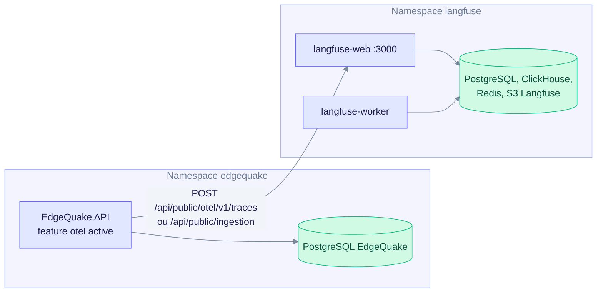
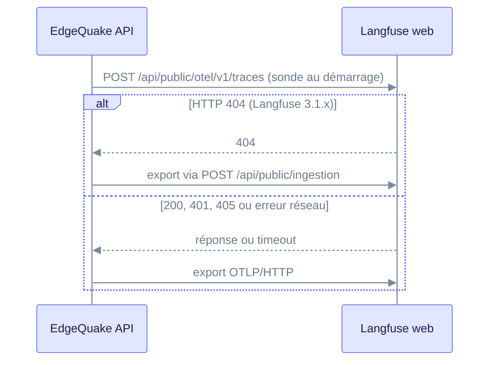
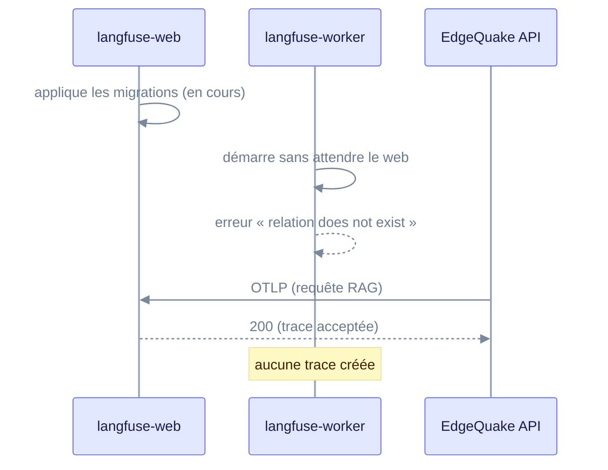
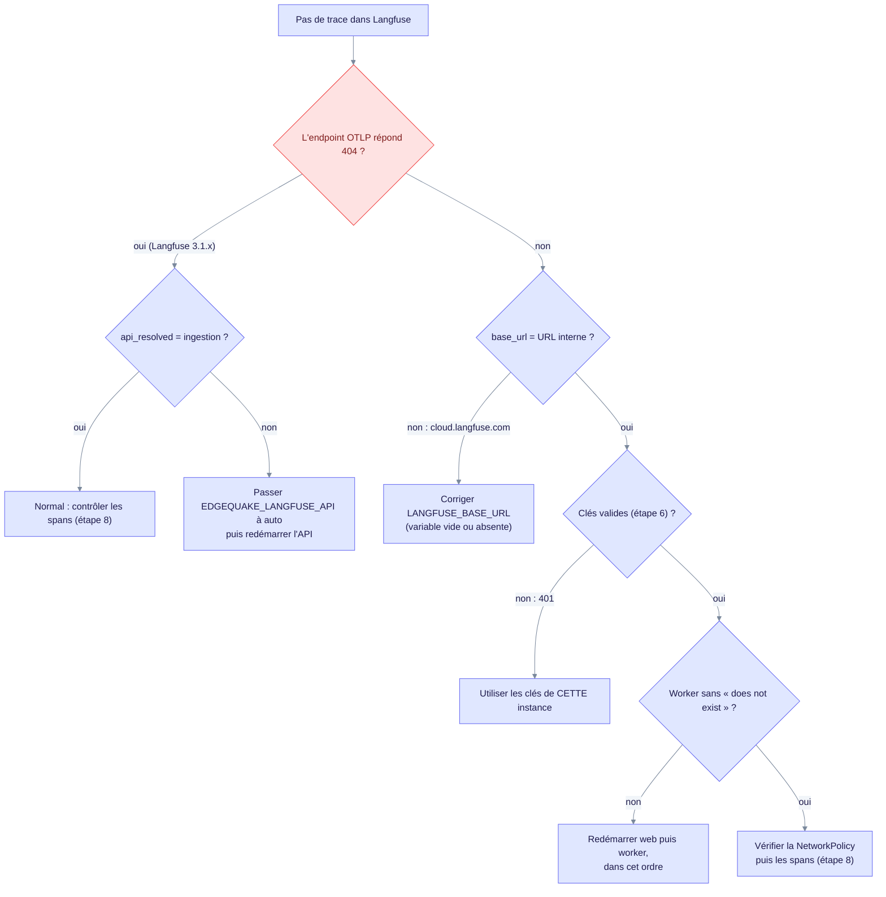

> Historical note, 2026-08-26; may not match current code.
> Prefer: [Deployment](../operations/deployment.md) · [Local Langfuse runbook](RUNBOOK-LOCAL-LANGFUSE.md)

> **État actuel (v0.32.2)** : EdgeQuake choisit le transport d'export avec
> `EDGEQUAKE_LANGFUSE_API` (défaut `auto`). Sur Langfuse 3.1.x, le 404 de la sonde
> OTLP bascule sur l'API d'ingestion native : la montée de version n'est plus
> bloquante, mais reste recommandée car l'ingestion est dépréciée. Sources :
> `edgequake/crates/edgequake-observability/src/langfuse.rs` et
> [../operations/langfuse-3.1.md](../operations/langfuse-3.1.md).

Cette note explique pourquoi l'export Langfuse échouait sans erreur visible chez le
client, puis donne la remédiation et la configuration Kubernetes de référence. Elle
s'adresse aux équipes d'exploitation et aux administrateurs du cluster.

---

## 1. Constat : pourquoi ça marche en local et pas chez le client

| Environnement | Version Langfuse | `POST /api/public/otel/v1/traces` | Traces reçues |
|---|---|---|---|
| Poste de développement | **4** | 200 (avec auth) | ✅ oui |
| **Client (Kubernetes)** | **3.1** | **404 — endpoint absent** | ❌ **non** |
| Cible recommandée | **3.225.5** | 200 (avec auth) | ✅ **oui — validé de bout en bout** (§4.2) |

Le problème n'est **ni** le découpage en pods, **ni** le DNS, **ni** une NetworkPolicy :
EdgeQuake pousse vers une URL qui n'est pas servie par Langfuse 3.1.



*Les traces passent par `langfuse-web` ; le worker doit être prêt, sinon elles ne sont jamais créées.*

### Preuve

Langfuse 3.1.1 déployé et interrogé :
```
POST http://<langfuse>/api/public/otel/v1/traces
  sans authentification → HTTP 404 (page HTML Next.js)
  avec authentification → HTTP 404 (page HTML Next.js)
```

Langfuse 3.225.5, même requête :
```
  sans authentification → HTTP 401   (endpoint présent, auth exigée)
  avec authentification → HTTP 200   {}
```

### Le code concerné

`edgequake/crates/edgequake-observability/src/langfuse.rs:106-111`
```rust
pub fn otlp_endpoint(&self) -> String {
    format!("{}/api/public/otel/v1/traces", self.base_url.trim_end_matches('/'))
}
```
Chemin **en dur**, sans mécanisme de repli. Aucune variable d'environnement ne permet
de le contourner.

---

## 2. Pourquoi le diagnostic est trompeur

Trois signaux donnent l'illusion d'un fonctionnement normal :

| Signal observé | Réalité |
|---|---|
| `GET /api/v1/settings/langfuse` → `export_active: true` | L'activation dépend des **clés** et de `EDGEQUAKE_LANGFUSE_ENABLED=0` (`enabled = clés présentes && !force_off`) — jamais de la joignabilité ni de la validité de l'URL |
| `GET /api/public/health` → 200 | Langfuse **est** joignable — mais l'endpoint OTLP, lui, n'existe pas |
| Aucune erreur dans les journaux | Lors des tests, le 404 n'est pas remonté dans les journaux au niveau `info` (défaut production) : l'échec est **peu visible** |

> **À retenir pour l'exploitation** : `export_active: true` signifie « des clés sont
> configurées », **pas** « les traces arrivent ». Le seul contrôle probant est de
> compter les spans côté Langfuse (§6).

### Choix du transport au démarrage (état actuel)

L'API sonde une seule fois l'endpoint OTLP au démarrage, puis choisit le transport.
Seul un 404 bascule sur l'ingestion : un 401 ou un timeout gardent OTLP.



*Un 401 ne bascule jamais vers l'ingestion : une erreur d'authentification ne doit pas changer de transport en silence.*

---

## 3. Piège complémentaire : le repli silencieux vers Langfuse Cloud

`langfuse.rs:10`
```rust
pub const DEFAULT_LANGFUSE_BASE_URL: &str = "https://cloud.langfuse.com";
```

Ordre de résolution : `LANGFUSE_BASE_URL` → `LANGFUSE_HOST` → **Langfuse Cloud**.
Chaque variable passe par `.filter(|v| !v.is_empty())` : **une valeur vide équivaut à
une valeur absente**.

En Kubernetes, une variable définie à une valeur vide (`value: ""`, ou une clé de
Secret/ConfigMap présente mais vide) est lue comme absente. Une clé inexistante fait
échouer le pod, sauf avec `optional: true`, auquel cas la variable est simplement
absente. Dans les deux cas, EdgeQuake retombe sur `cloud.langfuse.com` **sans erreur
visible**.

> ⚠️ **Implication sécurité** : les requêtes d'export partent alors vers un service
> **externe**. Avec des clés d'une autre instance, elles échouent en 401, mais le corps
> (prompts, extraits de documents, réponses) a quand même quitté le SI. À vérifier
> impérativement avant toute mise en production sur données sensibles.

**Contrôle obligatoire :**
```bash
kubectl exec -n <ns> deploy/edgequake -- \
  curl -s localhost:8080/api/v1/settings/langfuse | jq .base_url
```
Toute valeur autre que l'URL interne attendue est une anomalie bloquante.

---

## 4. Options de remédiation

| # | Option | Effort | Risque | Recommandation |
|---|---|---|---|---|
| **A** | **Monter Langfuse 3.1 → 3.225+** (même majeure) | Faible | Faible | ✅ **Retenue** |
| B | Monter vers Langfuse 4 | Moyen | Moyen (rupture de schéma) | Si le client le planifiait déjà |
| C | Export natif via l'API d'ingestion (`EDGEQUAKE_LANGFUSE_API=ingestion`, ou `auto`) — déjà intégré | Nul | Moyen (API dépréciée) | Transitoire pour 3.1.x ; **pas** de collecteur intermédiaire à développer |
| D | Désactiver l'export Langfuse | Nul | — | Repli temporaire (§4.4) |

### 4.1 Option A — montée de version mineure *(recommandée)*

Reste dans la majeure **3** : pas de migration de schéma majeure, pas de changement
d'architecture (web + worker + PostgreSQL + ClickHouse + Redis + S3 déjà en place
depuis la 3.0).

```yaml
# Deployment langfuse-web ET langfuse-worker
image: langfuse/langfuse:3.225.5          # web
image: langfuse/langfuse-worker:3.225.5   # worker
```
> Épingler une version exacte, jamais `:3` ni `:latest`.

**Séquence :**
1. Sauvegarde PostgreSQL et ClickHouse de Langfuse
2. Mise à l'échelle à 0 du **worker**
3. Montée du **web** (il applique les migrations au démarrage)
4. Attente de `GET /api/public/health` → 200
5. Remontée du worker
6. Validation §6

### 4.2 Validation de bout en bout sur Langfuse 3.225.5

EdgeQuake v0.26.1 a été branché sur une instance Langfuse **3.225.5** réelle, puis
soumis à une ingestion et une requête RAG. Résultat côté Langfuse :

```
┌─name────────────────┬─type───────┬──n─┐
│ HTTP                │ SPAN       │ 32 │
│ retrieval edgequake │ RETRIEVER  │  3 │
│ query.rerank        │ SPAN       │  1 │
│ query.fuse          │ SPAN       │  1 │
│ generate-answer     │ GENERATION │  1 │
│ query_pipeline      │ SPAN       │  1 │
│ extract-keywords    │ GENERATION │  1 │
│ query.embed         │ EMBEDDING  │  1 │
│ query_execute       │ SPAN       │  1 │
└─────────────────────┴────────────┴────┘
```

42 observations au total, avec **typage sémantique correct** : `RETRIEVER` pour la
récupération RAG, `GENERATION` pour les appels LLM, `EMBEDDING` pour la vectorisation.

> **La montée en 3.x suffit** : aucune adaptation d'EdgeQuake n'est nécessaire.

### 4.3 Version minimale — à faire confirmer

Testé : **3.1.1 = absent** · **3.225.5 = présent**. La documentation du dépôt
(`docs/operations/langfuse-3.1.md`) cite **3.22.0** comme première version avec OTLP.
Ce n'est pas un test de bissection : la version exacte n'a pas été vérifiée.

**Recommandation opérationnelle** : viser la dernière **3.x** stable plutôt que la
version minimale théorique — même effort de déploiement, davantage de correctifs.

### 4.4 Option D — repli propre si la montée est impossible à court terme

Pour éviter des exports qui échouent en boucle **et** tout risque de fuite vers le
cloud :
```yaml
- name: EDGEQUAKE_LANGFUSE_ENABLED
  value: "0"          # force_off : coupe l'export quelles que soient les clés
```
Le reste de l'observabilité (métriques Prometheus `/metrics`, journaux structurés,
`retrieval_id` rejouable via `/api/v1/query/context/{id}`) demeure **pleinement
opérationnel** — seul l'export Langfuse est suspendu.

---

## 5. Configuration Kubernetes de référence

### 5.1 Secret et variables EdgeQuake

```yaml
apiVersion: v1
kind: Secret
metadata:
  name: edgequake-langfuse
  namespace: <ns>
type: Opaque
stringData:
  LANGFUSE_PUBLIC_KEY: "pk-lf-..."   # clés DU projet de CE Langfuse
  LANGFUSE_SECRET_KEY: "sk-lf-..."
---
# Deployment EdgeQuake — conteneur api
env:
  # URL interne — surtout PAS localhost, surtout PAS de valeur vide
  - name: LANGFUSE_BASE_URL
    value: "http://langfuse-web.<ns>.svc.cluster.local:3000"
  - name: LANGFUSE_PROJECT_ID
    value: "<project-id>"            # deep-links UI
  - name: EDGEQUAKE_LANGFUSE_ENABLED
    value: "1"
  - name: EDGEQUAKE_LANGFUSE_API     # auto (défaut) : OTLP sauf 404 → ingestion
    value: "auto"
  - name: LANGFUSE_PUBLIC_KEY
    valueFrom: {secretKeyRef: {name: edgequake-langfuse, key: LANGFUSE_PUBLIC_KEY}}
  - name: LANGFUSE_SECRET_KEY
    valueFrom: {secretKeyRef: {name: edgequake-langfuse, key: LANGFUSE_SECRET_KEY}}
```

**Cinq règles impératives :**

1. **Jamais `localhost`** — dans un pod, `localhost` désigne le pod lui-même.
2. **Port du Service** (typiquement 3000), pas le port d'un mapping hôte local.
3. **Pas de chemin** — le code ajoute `/api/public/otel/v1/traces` (un `/` final est toléré).
4. **Jamais de valeur vide** — équivaut à « non défini » → repli vers Langfuse Cloud (§3).
5. **Clés du projet de CETTE instance** — les clés d'une autre instance donnent un 401 : l'export échoue, sans erreur visible au niveau `info`.

### 5.2 Les clés ne sont pas transposables

Une paire `pk-lf-…` / `sk-lf-…` n'est valide que dans l'instance Langfuse qui l'a
émise. Créer le projet dans le Langfuse du client, récupérer **ses** clés, les injecter
via Secret.

Vérification :
```bash
kubectl exec -n <ns> deploy/edgequake -- \
  curl -s -u "$LANGFUSE_PUBLIC_KEY:$LANGFUSE_SECRET_KEY" \
  http://langfuse-web.<ns>.svc.cluster.local:3000/api/public/projects
```
Doit renvoyer le projet attendu.

### 5.3 Course aux migrations — reproduite sur 3.1 **et** 4

Sur les deux versions, le **worker démarre avant la fin des migrations** appliquées par
le web. Symptômes :
```
relation "monitors" does not exist
public.batch_actions does not exist
```
Les requêtes OTLP renvoient alors **200** mais **aucune trace n'est jamais créée** —
le plus trompeur des modes de défaillance.



*Le worker doit démarrer après la fin des migrations du web, sinon les 200 masquent l'échec.*

En Kubernetes le risque est **supérieur** au compose : les pods démarrent en parallèle.

**Prévention :**
```yaml
# Deployment langfuse-worker
initContainers:
  - name: wait-for-web-migrations
    image: curlimages/curl:8.10.1
    command: ['sh','-c','until curl -sf http://langfuse-web.<ns>.svc.cluster.local:3000/api/public/health; do sleep 5; done']
```
**Détection :**
```bash
kubectl logs -n <ns> deploy/langfuse-worker | grep -ci "does not exist"   # attendu : 0
```
**Correction :** `kubectl rollout restart deploy/langfuse-web deploy/langfuse-worker -n <ns>`

### 5.4 Piège YAML — `ENCRYPTION_KEY`

Rencontré lors de nos tests : une clé composée uniquement de chiffres, **non quotée**,
est interprétée par YAML comme un **nombre**.
```yaml
ENCRYPTION_KEY: 0000000000000000000000000000000000000000000000000000000000000000   # ❌ → "0"
ENCRYPTION_KEY: "0000000000000000000000000000000000000000000000000000000000000000" # ✅
```
Langfuse refuse alors de démarrer :
`ENCRYPTION_KEY must be 256 bits, 64 string characters in hex format`.
Toujours **quoter** les valeurs numériques ou hexadécimales dans ConfigMaps et
manifests.

### 5.5 NetworkPolicy

Autoriser explicitement l'egress EdgeQuake → langfuse-web sur le port du Service :
```bash
kubectl exec -n <ns> deploy/edgequake -- \
  curl -s -o /dev/null -w '%{http_code}\n' \
  http://langfuse-web.<ns>.svc.cluster.local:3000/api/public/health   # attendu : 200
```

---

## 6. Procédure de validation — dans l'ordre

Ne pas passer à l'étape suivante tant que la précédente échoue.

| # | Contrôle | Commande | Attendu |
|---|---|---|---|
| 1 | **Version Langfuse** | `curl <svc>/api/public/health` | `version` ≥ 3.225 (sur 3.1.x, voir l'arbre ci-dessous) |
| 2 | **Endpoint OTLP présent** | `curl -o /dev/null -w '%{http_code}' -X POST <svc>/api/public/otel/v1/traces -d '{}'` | **401** (pas 404 ; un 404 sur 3.1.x est attendu et compensé par l'ingestion) |
| 3 | Variables injectées | `kubectl exec deploy/edgequake -- env \| grep LANGFUSE` | 3 variables **non vides** |
| 4 | **Cible réelle** | `curl .../api/v1/settings/langfuse \| jq .base_url` | URL interne (**pas** cloud.langfuse.com) |
| 5 | Joignabilité | `curl <svc>/api/public/health` depuis le pod EdgeQuake | 200 |
| 6 | Validité des clés | `curl -u pk:sk <svc>/api/public/projects` | le projet attendu |
| 7 | Migrations worker | `kubectl logs deploy/langfuse-worker \| grep -c "does not exist"` | **0** |
| 8 | **Traces réellement ingérées** | requête ClickHouse ci-dessous | spans EdgeQuake présents |

Arbre de décision quand aucune trace n'apparaît :



*Suivre l'arbre dans l'ordre : la plupart des pannes apparentes viennent de la cible, des clés ou de l'ordre de démarrage.*

**Étape 8 — le seul contrôle probant.** Générer une requête RAG, puis :
```bash
kubectl exec -n <ns> <clickhouse-pod> -- clickhouse-client \
  --user <u> --password <p> \
  -q "SELECT name, count() FROM default.events_core GROUP BY name ORDER BY 2 DESC LIMIT 20"
```

Spans attendus après une ingestion et une requête :
```
ingest.document · ingest.chunking · pipeline_chunk_extraction
extract-entities-glean · embed-chunks · ingest.persist
query_pipeline · query.embed · retrieval edgequake
query.fuse · query.rerank · extract-keywords · generate-answer
```
Les spans LLM portent `type=GENERATION`, le modèle et le décompte de tokens.

**Selon la majeure, la table et l'API diffèrent :**

| Majeure | Table ClickHouse | `GET /api/public/traces` |
|---|---|---|
| **3.x** | `observations` | ✅ **exploitable** — renvoie les traces |
| **4.x** | `events_core` / `events_full` | ❌ renvoie **0** même quand tout fonctionne |

En **3.x** (cas du client), le contrôle le plus simple est donc :
```bash
kubectl exec -n <ns> deploy/edgequake -- \
  curl -s -u "$LANGFUSE_PUBLIC_KEY:$LANGFUSE_SECRET_KEY" \
  "http://langfuse-web.<ns>.svc.cluster.local:3000/api/public/traces?limit=5"
```
Une liste non vide après une requête RAG prouve la chaîne complète.

> ⚠️ Après une éventuelle montée en v4, ce contrôle cesse d'être valable : basculer
> sur la requête ClickHouse `events_core`.

---

## 7. Faux positifs à ne pas traiter comme des pannes

| Observation | Explication | Action |
|---|---|---|
| `HttpTraceClient.ResponseParseError: invalid wire type value: 6` | Langfuse répond en **JSON**, le client Rust attend du **protobuf**. Erreur de lecture de la réponse — la **livraison a réussi** (HTTP 200) | Aucune |
| `GET /api/public/traces` renvoie 0 **en v4** | API legacy — en v4 les données sont dans `events_core` (en **v3 elle fonctionne**) | Utiliser ClickHouse ou l'UI |
| `export_active: true` sans trace | N'atteste que de la présence des clés | Dérouler §6 |

---

## 8. Synthèse pour le client

1. **Cause** : Langfuse 3.1 ne sert pas l'endpoint OTLP utilisé par EdgeQuake
   (404 vérifié). Aucun réglage Kubernetes n'y remédie.
2. **Correctif recommandé** : montée de Langfuse en **3.225+** — même majeure,
   migration standard, sans changement d'architecture.
3. **Solution intermédiaire** : avec `EDGEQUAKE_LANGFUSE_API=auto` (défaut), EdgeQuake
   bascule sur l'API d'ingestion quand la sonde reçoit un 404. Vérifier `api_resolved`.
   Ne pas forcer `otlp` sur 3.1.x.
4. **Contrôle préalable indispensable** : vérifier que `base_url` ne pointe pas vers
   `cloud.langfuse.com` (repli silencieux avec risque d'émission de données hors du SI).
5. **Point de vigilance déploiement** : ordonner web → worker (course aux migrations),
   quoter les valeurs hexadécimales en YAML.
6. **Repli** : `EDGEQUAKE_LANGFUSE_ENABLED=0` si l'export Langfuse doit être coupé — le
   reste de l'observabilité demeure opérationnel.

---

*Document établi le 2026-08-26 à partir de tests exécutés sur Langfuse 3.1.1, 3.225.5
et 4, avec EdgeQuake v0.26.1. Documents liés :
[Déploiement technique](01-deploiement-technique.md) ·
[Intégration IT](02-integration-it.md).*
