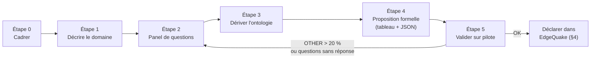

# EdgeQuake — Guide de construction d'une ontologie

> **Produit** : EdgeQuake v0.26.9
> **Documents liés** : [Algorithme d'extraction et modèle relationnel](06-algorithme-extraction-ontologie.md) · [Maintenance du graphe et correction du parsing](07-maintenance-graphe-correction-parsing.md) · [Deep dive architecture](03-deep-dive-architecture-algorithme.md)

Ce guide répond à une question précise : **comment, à partir d'un domaine métier et
d'un panel de questions, définir une ontologie exploitable par EdgeQuake, puis la lui
déclarer** — depuis l'interface, par l'API, ou à partir d'un fichier externe.

Le protocole décrit en §2 a été **appliqué de bout en bout** sur un domaine réel
(maintenance aéronautique, §3) contre une instance EdgeQuake v0.26.5 : l'ontologie
déclarée a été respectée à 100 % sur les entités et les relations extraites. Les
résultats sont reproduits tels quels.

---

## Sommaire

1. [Ce qu'est une ontologie pour EdgeQuake](#1-ce-quest-une-ontologie-pour-edgequake)
2. [Protocole de construction en cinq étapes](#2-protocole-de-construction-en-cinq-étapes)
3. [Application du protocole — exemple complet vérifié](#3-application-du-protocole--exemple-complet-vérifié)
4. [Déclarer l'ontologie dans EdgeQuake](#4-déclarer-lontologie-dans-edgequake)
5. [Limites actuelles à connaître](#5-limites-actuelles-à-connaître)
6. [Liste de contrôle](#6-liste-de-contrôle)

---

## 1. Ce qu'est une ontologie pour EdgeQuake

Dans EdgeQuake, une ontologie est un **vocabulaire contrôlé** attaché à un espace de
travail (*workspace*). Elle se compose de trois listes, et de rien d'autre :

| Composant | Rôle | Plafond | Défaut si absent |
|---|---|---|---|
| **Types d'entités** (`entity_types`) | Les catégories de « choses » que l'extracteur a le droit de produire | **50** | 12 types génériques (`PERSON`, `ORGANIZATION`, `LOCATION`, `EVENT`, `CONCEPT`, `METHOD`, `CONTENT`, `DATA`, `ARTIFACT`, `NATURALOBJECT`, `CREATURE`, `OTHER`) |
| **Types de relations** (`relation_types`) | Les étiquettes autorisées sur les arêtes | **50** | Liste vide ⇒ relations **libres** (le LLM choisit l'étiquette) |
| **Arêtes typées** (`relation_edges`) | Des motifs `Source —RELATION→ Cible` que l'extracteur doit privilégier | **100** | Liste vide ⇒ extrémités non contraintes |

Deux drapeaux complètent le vocabulaire :

| Drapeau | Effet à `true` (défaut) | Effet à `false` |
|---|---|---|
| `entity_types_strict` | Un type hors liste est **remappé** vers `OTHER` (ou `CONCEPT`, ou le premier type de la liste) | Le type inconnu est conservé tel quel |
| `relation_types_strict` | Une relation hors liste est remappée vers `RELATED_TO` (ou le premier type) | La relation inconnue est conservée |

Sources : plafonds dans [`edgequake-core/src/type_list.rs`](../../edgequake/crates/edgequake-core/src/type_list.rs)
(`MAX_TYPE_LIST = 50`, `MAX_RELATION_EDGES = 100`) ; types par défaut dans
[`edgequake-pipeline/src/prompts/mod.rs`](../../edgequake/crates/edgequake-pipeline/src/prompts/mod.rs)
(`default_entity_types`) ; sémantique des drapeaux dans
[`prompts/entity_type_policy.rs`](../../edgequake/crates/edgequake-pipeline/src/prompts/entity_type_policy.rs).

### 1.1 Ce que l'ontologie n'est pas

Il est important de cadrer les attentes avant de commencer :

- **Pas de hiérarchie** : il n'existe ni héritage (`TURBINE` *est un* `COMPONENT`)
  ni sous-typage. Chaque type est plat.
- **Pas d'attributs par type** : on ne déclare pas que `DEFECT` possède une
  `taille_mm`. Les attributs vivent dans la description textuelle de l'entité.
- **Pas d'import OWL / RDF / SHACL** : l'ontologie se déclare en JSON, par l'API ou
  l'interface (SPEC-114 exclut explicitement ces formats du périmètre).
- **Portée = espace de travail** : une ontologie par workspace, pas par document ni
  par utilisateur. Deux verticales métier ⇒ deux workspaces.
- **Pas de versionnage** : modifier l'ontologie remplace la précédente ; l'historique
  est à tenir dans le fichier JSON versionné côté client (§4.3).

### 1.2 Le regard « domaine × questions »

Une ontologie EdgeQuake n'est pas une modélisation exhaustive du domaine. C'est **un
regard sur le domaine, orienté par les questions qu'on va lui poser**. La même
documentation de maintenance produira deux ontologies différentes selon que l'on
cherche à répondre à « quelles pièces ont présenté ce défaut ? » ou à « quels
techniciens sont habilités sur ce moteur ? ». C'est pourquoi le protocole part des
questions, pas des documents.

---

## 2. Protocole de construction en cinq étapes



### Étape 0 — Comment je commence

Réunir, avant toute réflexion sur les types :

| Entrée | Pourquoi | Forme attendue |
|---|---|---|
| **Un échantillon du corpus** | L'ontologie doit être *extractible* du texte réel, pas seulement juste sur le papier | 5 à 10 documents représentatifs (formats, longueurs, auteurs variés) |
| **Les utilisateurs cibles** | Ils formulent les questions ; leurs mots deviennent les types | 2 à 3 profils (ex. ingénieur qualité, responsable navigabilité, technicien) |
| **Le périmètre exclu** | Éviter de modéliser ce qu'on n'interrogera jamais | Une phrase : « hors périmètre : … » |
| **La langue d'extraction** | Les noms d'entités et descriptions sont produits dans cette langue | `extraction_language` (ex. `French`) |

Décision à prendre dès ce stade : **un seul workspace ou plusieurs ?** Si deux
populations d'utilisateurs posent des questions disjointes sur les mêmes documents,
prévoir deux workspaces avec deux ontologies plutôt qu'une ontologie fourre-tout.

### Étape 1 — Décrire le domaine

Remplir le canevas suivant en langage naturel, en une page. Il ne s'agit pas encore
de types, mais de nommer ce qui existe.

| Rubrique | Question guide | Exemple (maintenance aéronautique) |
|---|---|---|
| **Objets physiques** | De quoi parle-t-on concrètement ? | aéronefs, moteurs, aubes, trains d'atterrissage |
| **Acteurs** | Qui agit, qui est responsable ? | techniciens, organismes de maintenance, exploitants, fournisseurs |
| **Événements** | Qu'est-ce qui se produit, quand ? | inspections, remplacements, retours en service |
| **Observations** | Que constate-t-on ? | fissures, corrosions, anomalies |
| **Règles** | Qu'est-ce qui encadre ? | règlements, consignes de navigabilité, licences |
| **Lieux** | Où ? | hangars, aéroports, positions sur l'appareil |
| **Documents** | Quels supports ? | rapports d'inspection, ordres de travail |

Règle : une rubrique qui reste vide **n'a pas besoin d'un type**. Une rubrique qui se
subdivise naturellement en plusieurs familles (« objets physiques » → aéronef / moteur
/ composant) donnera probablement plusieurs types.

### Étape 2 — Constituer le panel de questions

C'est l'étape déterminante. Collecter **20 à 50 questions réelles**, formulées par les
utilisateurs, telles qu'ils les poseraient à un collègue. Les consigner dans un tableau
avec, pour chacune, les noms et les verbes qu'elle mobilise :

| # | Question (verbatim) | Noms (→ candidats *types d'entités*) | Verbes / liens (→ candidats *relations*) |
|---|---|---|---|
| Q1 | Quels composants du moteur n°2 ont présenté un défaut ? | composant, moteur, défaut | présenter un défaut, faire partie de |
| Q2 | Qui a réalisé la dernière inspection du F-GKXA ? | technicien, inspection, aéronef | réaliser, inspecter |
| … | | | |

Quatre familles de questions à couvrir, car elles sollicitent le graphe différemment :

| Famille | Exemple | Ce qu'elle exige de l'ontologie |
|---|---|---|
| **Fait** | « Quelle est l'immatriculation de l'appareil inspecté le 12 mars ? » | Le type de l'entité porteuse du fait |
| **Relation** | « Quel technicien a inspecté quel appareil ? » | Une relation nommée entre deux types |
| **Traversée** | « Quels défauts sur des composants de moteurs exploités par Air Nova ? » | Une **chaîne** de relations typées |
| **Agrégation** | « Combien de fissures ont été relevées ce trimestre ? » | Un type d'entité stable pour compter |

Critère d'arrêt : lorsque trois questions consécutives n'introduisent plus aucun nom
ni verbe nouveau, le panel est saturé.

### Étape 3 — Dériver l'ontologie candidate

Passer du tableau de questions aux trois listes, en appliquant ces règles :

**Types d'entités**

1. Regrouper les noms par famille sémantique ; chaque famille devient un type
   `UPPER_SNAKE_CASE` (EdgeQuake normalise de toute façon : `Aircraft` → `AIRCRAFT`,
   `part-of` → `PART_OF`).
2. Viser **8 à 20 types**. En dessous, le graphe ne discrimine pas ; au-delà, le LLM
   hésite et le taux de `OTHER` monte. Le plafond technique est 50.
3. Conserver **toujours** `OTHER` dans la liste : c'est la cible de repli en mode
   strict. Sans lui, EdgeQuake se rabat sur `CONCEPT`, puis sur le premier type — ce
   qui pollue silencieusement ce type.
4. Un type doit être **reconnaissable dans le texte** par un lecteur non expert. Si
   deux experts hésitent entre `COMPONENT` et `PART`, fusionner.
5. Ne pas créer de type pour ce qui n'apparaît dans aucune question.

**Types de relations**

1. Un verbe par relation, orienté : `INSPECTED_BY`, `PART_OF`, `HAS_DEFECT`.
2. Viser **5 à 12 relations**. Conserver **toujours** `RELATED_TO` : c'est le repli
   strict quand aucune étiquette ne convient.
3. Si aucune question de la famille « Relation » ou « Traversée » n'existe, laisser la
   liste **vide** : les relations seront libres, ce qui est acceptable pour un usage
   purement « Fait ».

**Arêtes typées**

1. Une arête par motif de phrase récurrent : `COMPONENT —HAS_DEFECT→ DEFECT`.
2. Ne déclarer que les motifs **attendus dans les questions**, pas tous les motifs
   possibles. Ils servent de guide au LLM, pas de contrainte absolue (§5).
3. Les deux extrémités doivent figurer dans `entity_types` et la relation dans
   `relation_types`, sinon l'arête est ignorée à l'enregistrement.

**Mode strict ou guidé ?**

| Situation | Recommandation |
|---|---|
| Corpus homogène, questions connues, on veut un graphe **prévisible** | `strict = true` (défaut) |
| Phase d'exploration, on veut **découvrir** quels types émergent | `strict = false`, puis analyser la distribution des types et revenir en strict |

### Étape 4 — Proposition formelle

Le livrable de cette étape est double : un tableau lisible par le métier, et le fichier
JSON qui sera déclaré à EdgeQuake (format exact en §4.3).

| Type d'entité | Définition (une phrase) | Exemples tirés du corpus | Questions couvertes |
|---|---|---|---|
| `AIRCRAFT` | Aéronef identifié par son immatriculation | *Airbus A320 F-GKXA* | Q2, Q5 |
| … | | | |

| Relation | Source → Cible | Définition | Questions couvertes |
|---|---|---|---|
| `HAS_DEFECT` | `COMPONENT` → `DEFECT` | Un composant présente un défaut constaté | Q1, Q7 |
| … | | | |

La colonne « Questions couvertes » est le contrôle de cohérence : **un type ou une
relation qu'aucune question ne référence est à supprimer**.

### Étape 5 — Valider sur un pilote

1. Créer un workspace **pilote** avec l'ontologie (§4).
2. Ingérer les 5 à 10 documents de l'échantillon.
3. Lire la distribution des types produits (`GET /api/v1/graph/entities`) et des
   relations (`GET /api/v1/graph/relationships`).
4. Poser les questions du panel et noter celles qui échouent.

| Indicateur | Seuil d'alerte | Action |
|---|---|---|
| Part des entités en `OTHER` | > 20 % | Un type manque : lire les entités `OTHER` et nommer la famille |
| Part des relations en `RELATED_TO` | > 40 % | Les verbes du corpus ne sont pas couverts ; ajouter des relations |
| Type déclaré jamais produit | 0 occurrence après 10 documents | Le type n'est pas extractible tel quel : le supprimer ou le reformuler |
| Question sans réponse | > 1 sur 10 | Vérifier si l'entité attendue existe avec un autre type, ou si la relation n'a pas été instanciée |

Itérer sur les étapes 2–3 jusqu'à passer les seuils. **Chaque modification de
l'ontologie ne s'applique qu'aux ingestions futures** : reconstruire le graphe du
pilote après chaque itération (§4.4).

---

## 3. Application du protocole — exemple complet vérifié

Le protocole a été déroulé sur le domaine **maintenance aéronautique**, puis exécuté
contre EdgeQuake v0.26.5. Tout ce qui suit est le résultat réel de cette exécution.

### 3.1 Description du domaine (étape 1)

Rapports d'inspection d'aéronefs : un appareil identifié, exploité par une compagnie,
est inspecté par un technicien licencié pour le compte d'un organisme de maintenance.
L'inspection porte sur des moteurs et leurs composants ; elle relève des défauts,
localisés sur l'appareil, et s'exécute dans un cadre réglementaire (règlements,
consignes de navigabilité). Elle a lieu dans un lieu identifié.

### 3.2 Panel de questions (étape 2, extrait)

| # | Question | Noms | Verbes |
|---|---|---|---|
| Q1 | Quels composants du moteur n°2 présentent un défaut ? | composant, moteur, défaut | faire partie de, présenter un défaut |
| Q2 | Qui a réalisé l'inspection du F-GKXA ? | technicien, inspection, aéronef | réaliser, inspecter |
| Q3 | Quelle compagnie exploite l'appareil inspecté ? | organisation, aéronef | exploiter |
| Q4 | Sous quel règlement l'inspection a-t-elle été menée ? | règlement, inspection | encadrer |
| Q5 | Où s'est déroulée l'inspection ? | lieu, inspection | se dérouler à |
| Q6 | Quels défauts ont été relevés sur des composants du moteur CFM56 ? | défaut, composant, moteur | traversée Q1 |

### 3.3 Ontologie dérivée (étapes 3–4)

| Types d'entités (10) | Types de relations (7) | Arêtes typées (6) |
|---|---|---|
| `AIRCRAFT`, `ENGINE`, `COMPONENT`, `DEFECT`, `INSPECTION`, `TECHNICIAN`, `ORGANIZATION`, `REGULATION`, `LOCATION`, `OTHER` | `PART_OF`, `HAS_DEFECT`, `INSPECTED_BY`, `OPERATED_BY`, `GOVERNED_BY`, `LOCATED_IN`, `RELATED_TO` | `ENGINE —PART_OF→ AIRCRAFT` · `COMPONENT —PART_OF→ ENGINE` · `COMPONENT —HAS_DEFECT→ DEFECT` · `AIRCRAFT —INSPECTED_BY→ TECHNICIAN` · `AIRCRAFT —OPERATED_BY→ ORGANIZATION` · `INSPECTION —GOVERNED_BY→ REGULATION` |

Mode strict sur les deux listes ; langue d'extraction : français.

### 3.4 Déclaration et ingestion (étape 5)

L'ontologie a été envoyée **volontairement non normalisée** (`"Aircraft"`,
`"part-of"`, `"governed by"`) pour vérifier la normalisation. Réponse de l'API à la
création du workspace :

```
entity_types   : AIRCRAFT, ENGINE, COMPONENT, DEFECT, INSPECTION, TECHNICIAN,
                 ORGANIZATION, REGULATION, LOCATION, OTHER
relation_types : PART_OF, HAS_DEFECT, INSPECTED_BY, OPERATED_BY, GOVERNED_BY,
                 LOCATED_IN, RELATED_TO
relation_edges : 6 arêtes, extrémités et relations normalisées
kg_schema_preset : custom · extraction_language : French
```

Un rapport d'inspection fictif de 14 lignes a ensuite été ingéré (statut `completed`
en moins de 20 secondes).

### 3.5 Résultat mesuré

**20 entités**, toutes dans l'ontologie ; **0 type hors liste** :

| Type | Entités extraites |
|---|---|
| `AIRCRAFT` | `AIRBUS_A320_F-GKXA` |
| `ENGINE` | `MOTEUR_CFM56-5B_NUMÉRO_2` |
| `COMPONENT` | `AUBE_DE_TURBINE_HAUTE_PRESSION_NUMÉRO_14`, `COMPRESSEUR_HAUTE_PRESSION`, `TRAIN_D'ATTERRISSAGE_PRINCIPAL_GAUCHE`, `PIÈCE_NEUVE` |
| `DEFECT` | `FISSURE_DE_3_MM`, `CORROSION_SUPERFICIELLE_MINEURE` |
| `INSPECTION` | `INSPECTION_PROGRAMMÉE_DU_12_MARS_2026` |
| `TECHNICIAN` | `MARC_DUBOIS` |
| `ORGANIZATION` | `AIR_NOVA`, `NOVA_MAINTENANCE`, `SAFRAN_AIRCRAFT_ENGINES` |
| `REGULATION` | `RÈGLEMENT_EASA_PART-145`, `CONSIGNE_DE_NAVIGABILITÉ_AD_2024-0187`, `LICENCE_PART-66_B1` |
| `LOCATION` | `HANGAR_DE_TOULOUSE-BLAGNAC`, `AILE_DROITE` |
| `OTHER` | `CONTRÔLE_BOROSCOPIQUE`, `RETOUR_EN_SERVICE` |

**15 relations**, toutes dans la liste autorisée :

| Motif déclaré | Instances produites |
|---|---|
| `ENGINE —PART_OF→ AIRCRAFT` | `MOTEUR_CFM56-5B_NUMÉRO_2 → AIRBUS_A320_F-GKXA` |
| `COMPONENT —PART_OF→ ENGINE` | `AUBE_… → MOTEUR_…`, `COMPRESSEUR_… → MOTEUR_…` |
| `COMPONENT —HAS_DEFECT→ DEFECT` | `AUBE_… → FISSURE_DE_3_MM`, `TRAIN_… → CORROSION_…` |
| `AIRCRAFT —OPERATED_BY→ ORGANIZATION` | `AIRBUS_A320_F-GKXA → AIR_NOVA` |
| `INSPECTION —GOVERNED_BY→ REGULATION` | `INSPECTION_… → RÈGLEMENT_EASA_PART-145`, `INSPECTION_… → CONSIGNE_…` |
| *(repli)* `RELATED_TO` | 7 relations, dont `INSPECTION_… → MARC_DUBOIS` et `INSPECTION_… → HANGAR_…` |

Lecture selon les seuils de l'étape 5 : `OTHER` = 10 % (sous le seuil), `RELATED_TO`
= 47 % (**au-dessus** du seuil de 40 %). Le diagnostic est immédiat : le motif
`AIRCRAFT —INSPECTED_BY→ TECHNICIAN` n'a pas été instancié — le texte dit « l'inspection
a été réalisée par le technicien », et le LLM a relié l'*inspection* au technicien, non
l'*aéronef*. Deux corrections possibles à l'itération suivante : ajouter l'arête
`INSPECTION —INSPECTED_BY→ TECHNICIAN` (plus fidèle au texte), et ajouter `LOCATED_IN`
comme arête `INSPECTION —LOCATED_IN→ LOCATION`. C'est exactement le type d'ajustement
que le protocole est conçu pour révéler.

---

## 4. Déclarer l'ontologie dans EdgeQuake

Trois voies, strictement équivalentes : elles écrivent les mêmes clés dans les
métadonnées du workspace.

### 4.1 Interface web

*Créer un workspace* (ou *Reconfigure workspace* sur un workspace existant) → étape
**Extraction**. L'écran propose :

- un choix de **préréglages de domaine** (`general`, `manufacturing`, `healthcare`,
  `legal`, `research`, `finance`, `blank`) qui pré-remplissent les trois listes ;
- un sélecteur de types d'entités et un sélecteur de types de relations ;
- un éditeur d'arêtes typées.

Le préréglage `manufacturing`, par exemple, fournit `MACHINE`, `COMPONENT`, `DEFECT`,
`MEASUREMENT`, `PROCESS`, `MATERIAL`, `PRODUCT` et les relations `PART_OF`,
`PRODUCED_BY`, `HAS_DEFECT`, `MEASURED_BY`, `LOCATED_IN`, `RELATED_TO`. Toute
modification d'un préréglage bascule automatiquement en `custom`.

L'interface affiche l'avertissement suivant, qu'il faut prendre au pied de la lettre :
*« Applies to future extractions. Rebuild the knowledge graph to refresh existing nodes
and edges. »*

Sources : [`workspace-extraction-step.tsx`](../../edgequake_webui/src/components/onboarding/steps/workspace-extraction-step.tsx),
préréglages dans [`kg-schema-presets.ts`](../../edgequake_webui/src/constants/kg-schema-presets.ts)
et [`entity-presets.ts`](../../edgequake_webui/src/constants/entity-presets.ts).

### 4.2 API

À la création (`POST /api/v1/tenants/{tenant_id}/workspaces`) ou à la mise à jour
(`PUT /api/v1/workspaces/{workspace_id}`) — les champs sont identiques :

```bash
curl -X PUT "$API/api/v1/workspaces/$WORKSPACE_ID" \
  -H "Content-Type: application/json" \
  -H "Authorization: Bearer $TOKEN" \
  -d @ontologie-maintenance-aero.json
```

Comportements vérifiés à l'enregistrement :

| Comportement | Détail |
|---|---|
| Normalisation | `trim` → majuscules → espaces et tirets remplacés par `_`. `"governed by"` → `GOVERNED_BY` |
| Dédoublonnage | Premier vu conservé, ordre préservé |
| **Plafond silencieux** | 60 types envoyés ⇒ **50 stockés**, réponse HTTP 200, **aucune erreur**. Vérifier la réponse |
| Liste vide | `"relation_types": []` supprime la clé ⇒ retour aux relations libres |
| Champ omis | Clé inchangée (mise à jour partielle) |
| Arête invalide | Une arête dont une extrémité n'est pas dans `entity_types` ou dont la relation n'est pas dans `relation_types` est écartée |

Source : [`edgequake-core/src/type_list.rs`](../../edgequake/crates/edgequake-core/src/type_list.rs)
(`normalize_type_list`, `apply_type_list_metadata`).

### 4.3 Fichier externe — format de référence

C'est la réponse à « déclarer l'ontologie dans un document externe et la donner à
EdgeQuake ». Le fichier ci-dessous est celui qui a servi au test du §3. Il est
autosuffisant, versionnable dans un dépôt Git, et s'envoie tel quel à l'API.

```json
{
  "kg_schema_preset": "custom",
  "extraction_language": "French",

  "entity_types": [
    "AIRCRAFT", "ENGINE", "COMPONENT", "DEFECT", "INSPECTION",
    "TECHNICIAN", "ORGANIZATION", "REGULATION", "LOCATION", "OTHER"
  ],
  "entity_types_strict": true,

  "relation_types": [
    "PART_OF", "HAS_DEFECT", "INSPECTED_BY", "OPERATED_BY",
    "GOVERNED_BY", "LOCATED_IN", "RELATED_TO"
  ],
  "relation_types_strict": true,

  "relation_edges": [
    { "source": "ENGINE",     "relation": "PART_OF",      "target": "AIRCRAFT" },
    { "source": "COMPONENT",  "relation": "PART_OF",      "target": "ENGINE" },
    { "source": "COMPONENT",  "relation": "HAS_DEFECT",   "target": "DEFECT" },
    { "source": "AIRCRAFT",   "relation": "INSPECTED_BY", "target": "TECHNICIAN" },
    { "source": "AIRCRAFT",   "relation": "OPERATED_BY",  "target": "ORGANIZATION" },
    { "source": "INSPECTION", "relation": "GOVERNED_BY",  "target": "REGULATION" }
  ]
}
```

Convention recommandée pour le dépôt client :

```
ontologies/
  maintenance-aero/
    v1.0.json          ← fichier ci-dessus
    v1.1.json          ← itération après pilote (arête INSPECTION —INSPECTED_BY→ TECHNICIAN)
    questions.md       ← panel de questions (étape 2)
    CHANGELOG.md       ← pourquoi chaque version
```

Script d'application (Python standard, sans dépendance EdgeQuake) :

```python
import json, sys, urllib.request

api, token, workspace, path = sys.argv[1:5]
body = json.dumps(json.load(open(path))).encode()
req = urllib.request.Request(
    f"{api}/api/v1/workspaces/{workspace}", data=body, method="PUT",
    headers={"Content-Type": "application/json", "Authorization": f"Bearer {token}"},
)
with urllib.request.urlopen(req) as r:
    ws = json.load(r)

sent = json.load(open(path))
for key in ("entity_types", "relation_types"):
    if len(ws.get(key) or []) != len(sent.get(key) or []):
        sys.exit(f"{key}: {len(sent[key])} envoyés, {len(ws[key])} stockés (plafond 50 ?)")
print("ontologie appliquée :", ws["kg_schema_preset"], len(ws["entity_types"]), "types")
```

La vérification finale n'est pas optionnelle : c'est elle qui détecte le plafond
silencieux.

### 4.4 Appliquer l'ontologie à un graphe existant

L'ontologie ne s'applique **qu'aux extractions futures**. Pour un workspace déjà
peuplé, deux options :

| Option | Endpoint | Effet | Coût |
|---|---|---|---|
| Reconstruire tout le graphe | `POST /api/v1/workspaces/{id}/rebuild-knowledge-graph` avec `{"force": true}` | Vide le graphe et ré-extrait tous les documents avec la nouvelle ontologie | Un appel LLM par chunk, pour tout le corpus |
| Retraiter certains documents | `POST /api/v1/documents/reprocess` avec `{"document_id": "…", "force": true, "mode": "entities"}` | Retire les entités/relations de ce document puis les ré-extrait | Proportionnel au document |

Sans `force`, `rebuild-knowledge-graph` refuse (HTTP 400 *« LLM configuration
unchanged »*) si le modèle n'a pas changé — c'est une protection, pas une erreur.
Détail des mécanismes de reconstruction : [document 07](07-maintenance-graphe-correction-parsing.md).

---

## 5. Limites actuelles à connaître

| Limite | Conséquence pratique | Source |
|---|---|---|
| **Les arêtes typées sont un guide, pas une contrainte dure** | Le LLM peut ne pas instancier un motif attendu (cas `INSPECTED_BY` en §3.5) et se rabattre sur `RELATED_TO`. Le protocole de validation le détecte | Prompt « *Prefer relationships whose endpoints match* » dans `entity_type_policy.rs` |
| **40 arêtes maximum dans le prompt** | 100 arêtes stockables, mais seules les 40 premières sont montrées au LLM. Ordonner le fichier JSON par importance | `json_relation_edges_prompt_section` (`.take(40)`) |
| **Remappage par inclusion de chaîne** | En mode strict, un type inconnu contenant ou contenu dans un type autorisé est remappé vers celui-ci (`TELEPHONE_NUMBER` → `PHONE`). Éviter les types dont l'un est préfixe d'un autre (`PART` et `PARTNER`) | `enforce_entity_type`, boucle d'alias |
| **Pas d'inférence d'ontologie depuis les documents** | EdgeQuake ne propose pas de types à partir du corpus ; l'étape 3 est manuelle | SPEC-114, hors périmètre déclaré |
| **Une ontologie par workspace** | Pas de superposition de deux vocabulaires sur un même corpus | `workspaces.metadata` |
| **Plafond silencieux à 50** | Aucun refus HTTP ; contrôler la réponse (§4.3) | `MAX_TYPE_LIST` |
| **Relations manuelles libres** | Une relation créée à la main (`POST /graph/relationships`) n'est pas contrôlée par l'ontologie ; le premier mot-clé devient l'étiquette | `relationships/helpers.rs`, `extract_relation_type` |

---

## 6. Liste de contrôle

Avant de déclarer une ontologie en production :

- [ ] Le panel compte au moins 20 questions, réparties sur les quatre familles (§2, étape 2)
- [ ] Chaque type et chaque relation est référencé par au moins une question
- [ ] `OTHER` figure dans `entity_types` ; `RELATED_TO` dans `relation_types` (si non vide)
- [ ] 8 à 20 types d'entités, 5 à 12 relations, arêtes ordonnées par importance
- [ ] Aucun type n'est préfixe d'un autre
- [ ] Le fichier JSON est versionné avec son panel de questions
- [ ] Le pilote passe les seuils : `OTHER` < 20 %, `RELATED_TO` < 40 %, ≥ 9 questions sur 10 répondues
- [ ] Le graphe existant a été reconstruit après la dernière modification
