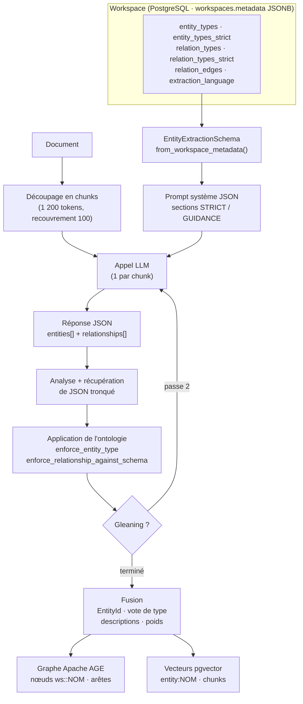
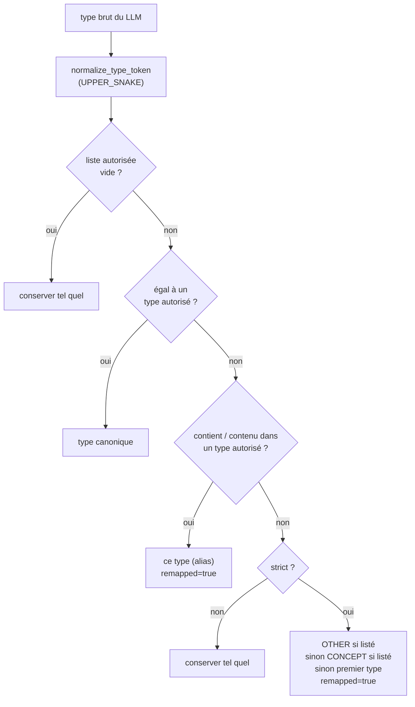
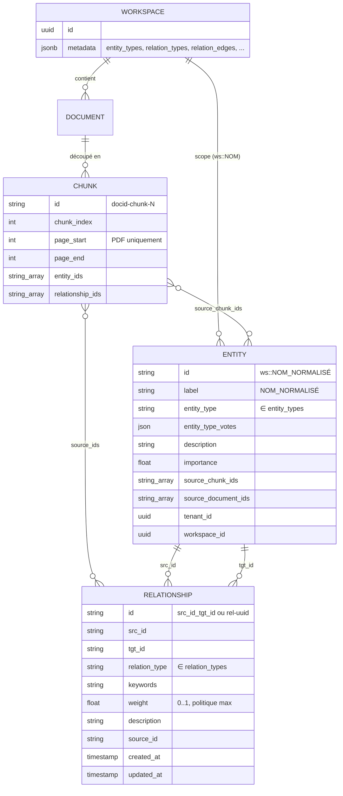

# EdgeQuake — Algorithme d'extraction et modèle relationnel

> **Produit** : EdgeQuake v0.26.9
> **Documents liés** : [Guide de construction d'une ontologie](05-ontologie-guide-construction.md) · [Maintenance du graphe et correction du parsing](07-maintenance-graphe-correction-parsing.md) · [Deep dive architecture](03-deep-dive-architecture-algorithme.md) (§3 pour le pipeline complet)

Ce document répond à la question **« comment l'algorithme d'EdgeQuake construit-il
l'ontologie ? »** — et donne le **modèle relationnel** qui en résulte : quelles
entités, quelles relations, avec quelles propriétés, sous quels identifiants.

Formulation exacte de la réponse, avant le détail : **EdgeQuake ne construit pas
l'ontologie ; il l'applique.** L'ontologie (types d'entités, types de relations,
arêtes typées) est déclarée par l'utilisateur au niveau du workspace. L'algorithme
l'injecte dans le prompt d'extraction, **impose** ses règles sur la sortie du LLM,
puis fusionne les entités extraites dans un graphe où l'identité d'une entité est
déterministe. Il n'existe pas, en v0.26.5, d'inférence automatique de types à partir
des documents.

---

## Sommaire

1. [Vue d'ensemble](#1-vue-densemble)
2. [Où vit l'ontologie](#2-où-vit-lontologie)
3. [Construction du prompt d'extraction](#3-construction-du-prompt-dextraction)
4. [Format de sortie et analyse](#4-format-de-sortie-et-analyse)
5. [Application de l'ontologie sur la sortie du LLM](#5-application-de-lontologie-sur-la-sortie-du-llm)
6. [Gleaning — seconde passe](#6-gleaning--seconde-passe)
7. [Identité des entités et fusion](#7-identité-des-entités-et-fusion)
8. [Modèle relationnel résultant](#8-modèle-relationnel-résultant)
9. [Ce que l'algorithme ne fait pas](#9-ce-que-lalgorithme-ne-fait-pas)
10. [Références dans le code](#10-références-dans-le-code)

---

## 1. Vue d'ensemble



Chaque chunk fait l'objet d'un appel LLM indépendant, avec le **même prompt système**
(ce qui permet la mise en cache du préfixe chez les fournisseurs qui le supportent) et
un prompt utilisateur contenant le texte du chunk.

---

## 2. Où vit l'ontologie

L'ontologie est stockée dans la colonne `metadata` (JSONB) de la table `workspaces`.
Aucune table dédiée, aucune colonne SQL supplémentaire (décision SPEC-114).

| Clé JSONB | Type | Lecture par le pipeline |
|---|---|---|
| `entity_types` | `string[]` | Liste vide ou absente ⇒ `default_entity_types()` (12 types) |
| `entity_types_strict` | `bool` | Absent ⇒ `true` |
| `relation_types` | `string[]` | Absent ou vide ⇒ relations libres |
| `relation_types_strict` | `bool` | Absent ⇒ `true` |
| `relation_edges` | `{source, relation, target}[]` | Absent ou vide ⇒ extrémités non contraintes ; les arêtes à champ vide sont écartées |
| `kg_schema_preset` | `string` | Purement informatif (affichage) — n'influence pas l'extraction |
| `extraction_language` | `string` | Langue de sortie ; sinon `EDGEQUAKE_EXTRACTION_LANGUAGE`, sinon anglais |
| `entity_type_colors` | `{TYPE: "#hex"}` | Affichage du graphe uniquement |

Au démarrage de chaque ingestion, la fabrique de pipeline lit ces clés et construit un
`EntityExtractionSchema` :

```rust
// edgequake-api/src/workspace_pipeline_factory.rs
let entity_schema = EntityExtractionSchema::from_workspace_metadata(&ws.metadata);
```

```rust
// edgequake-pipeline/src/prompts/entity_type_policy.rs
pub struct EntityExtractionSchema {
    pub types: Vec<String>,            // UPPER_SNAKE, normalisés
    pub strict: bool,
    pub relation_types: Vec<String>,
    pub relation_strict: bool,
    pub relation_edges: Vec<RelationEdge>,
}
```

Ce schéma est ensuite transmis à l'extracteur (`LLMExtractor`) et, si le gleaning est
actif, à l'extracteur de seconde passe (`GleaningExtractor`) — les deux voient la même
ontologie.

---

## 3. Construction du prompt d'extraction

Le prompt système est assemblé par `json_extraction_system_prompt_with_caps` dans
[`prompts/json_prompts.rs`](../../edgequake/crates/edgequake-pipeline/src/prompts/json_prompts.rs).
Il se compose, dans l'ordre, de six sections.

### 3.1 Section « Entity Types »

Générée par `json_entity_types_prompt_section`. Deux variantes exactes :

**Mode strict** (défaut) :
```
## Entity Types (STRICT)
Use ONLY these types exactly as written — never invent new types: AIRCRAFT, ENGINE, …
If nothing fits, use OTHER when listed, otherwise CONCEPT.
```

**Mode guidé** :
```
## Entity Types (GUIDANCE)
Prefer these types when they clearly apply: AIRCRAFT, ENGINE, …
You may use additional specific type labels when they describe the entity better.
Do not use OTHER as a catch-all for unrelated entities.
```

### 3.2 Section « Relationship Types »

Générée par `json_relation_types_prompt_section`. **Absente** si `relation_types`
est vide (relations libres).

**Mode strict** :
```
## Relationship Types (STRICT)
Use ONLY these relationship `type` values exactly as written: PART_OF, HAS_DEFECT, …
If nothing fits, use RELATED_TO when listed, otherwise the first listed type.
```

### 3.3 Section « Typed Edges »

Générée par `json_relation_edges_prompt_section`. **Absente** si `relation_edges`
est vide. **Au plus 40 arêtes** sont montrées (`.take(40)`), dans l'ordre du fichier.

**Mode strict** :
```
## Typed Edges (STRICT)
Prefer relationships whose endpoints match these patterns: ENGINE —PART_OF→ AIRCRAFT; COMPONENT —HAS_DEFECT→ DEFECT; …
If a link is needed but no pattern fits, use RELATED_TO between allowed entity types when listed.
```

Le verbe est *prefer* : les arêtes typées orientent le modèle, elles ne l'empêchent
pas de produire un autre couple d'extrémités. C'est l'étape d'application (§5) qui
tranche ensuite.

### 3.4 Section « Quantity Limits »

Budget par réponse (SPEC-117), par défaut **40 entités** et **100 lignes** (entités +
relations) par chunk. Surchargeable par workspace (`extract_max_entities`,
`extract_max_records`) ou par envoi. Le prompt demande de privilégier les entités
porteuses de relations et de ne pas « remplir » le quota.

### 3.5 Section « Language »

Impose la langue de sortie pour toutes les valeurs en langage naturel (noms
d'entités, descriptions, étiquettes de relations libres) ; les clés JSON restent en
anglais ; les noms propres peuvent rester dans leur forme d'origine lorsque la
traduction créerait une ambiguïté. Source : `json_language_instruction`,
[`prompts/language.rs`](../../edgequake/crates/edgequake-pipeline/src/prompts/language.rs).

### 3.6 Règles de nommage et format de sortie

Interdiction explicite d'utiliser un identifiant opaque (UUID, hash, ARN…) comme nom
d'entité, puis le format JSON attendu (§4).

---

## 4. Format de sortie et analyse

Le LLM doit répondre par un objet JSON :

```json
{
  "entities": [
    {"name": "Entity Name", "type": "ENTITY_TYPE", "description": "Brief description"}
  ],
  "relationships": [
    {"source": "Source Entity", "target": "Target Entity", "type": "RELATIONSHIP_TYPE", "description": "Brief description"}
  ]
}
```

L'analyseur (`JsonExtractionParser`, [`prompts/parser/json_parser.rs`](../../edgequake/crates/edgequake-pipeline/src/prompts/parser/json_parser.rs))
est tolérant, dans cet ordre :

1. **Extraction** du JSON depuis une réponse enveloppée (fences ```` ```json ````,
   préambule textuel) — `extract_json_from_response`.
2. **Assainissement** : caractères de contrôle, commentaires `//` et `/* */`,
   virgules terminales, clés et valeurs entre guillemets simples.
3. **Récupération de troncature** (`recover_truncated: true`) : si la réponse s'arrête
   au milieu d'un tableau — cas d'un LLM à court de budget de sortie — l'analyseur
   tente les suffixes `}`, `]}`, `}]}`, `]}]}`… jusqu'à obtenir un JSON valide. Les
   entités complètes sont conservées, la ligne coupée est perdue.
4. **Échec fermé** (`empty_on_missing_json: false`) : une réponse sans JSON est une
   erreur d'extraction, pas un chunk « vide » — le chunk est marqué en échec et
   devient rejouable (document 07, §3.4).

> **Correction par rapport au document 03 (§3.3 et §7.3)** : le format de production
> est **JSON**, pas le format tuple `entity<|#|>…`. Le format tuple existe dans le code
> (`SotaExtractor`, `HybridExtractionParser`) mais n'est instancié par aucun chemin de
> production ; il n'est utilisé que par des tests. Le document 03 a été corrigé en
> conséquence.

---

## 5. Application de l'ontologie sur la sortie du LLM

C'est l'étape qui rend le graphe conforme à l'ontologie **quoi que le LLM ait
produit**. Elle s'exécute dans l'analyseur, pour chaque entité puis chaque relation.

### 5.1 Types d'entités — `enforce_entity_type`



Deux conséquences pratiques :

- **L'alias par inclusion de chaîne** est bidirectionnel : `TELEPHONE_NUMBER` est
  remappé vers `PHONE` si `PHONE` est autorisé, mais `PART` serait aussi remappé vers
  `PARTNER` — d'où la règle du guide 05 : aucun type ne doit être préfixe d'un autre.
- **Le repli n'est pas un rejet** : en strict, une entité de type inconnu n'est jamais
  perdue, elle devient `OTHER`. C'est ce qui rend la mesure « part de `OTHER` »
  pertinente pour valider une ontologie.

### 5.2 Types de relations — `enforce_relation_type`

Même algorithme, avec `RELATED_TO` (puis le premier type) comme repli strict. Si
`relation_types` est vide, l'étiquette produite par le LLM est simplement normalisée.

### 5.3 Arêtes typées — `enforce_relation_edge`

Appliqué **après** l'étiquette, à partir des types des deux extrémités (résolus via la
liste d'entités de la même réponse) :

| Cas | Résultat |
|---|---|
| Le triplet `(source, relation, cible)` figure dans `relation_edges` | Conservé |
| Mode guidé | Conservé tel quel |
| Strict, une arête existe pour ce couple d'extrémités (autre relation) | Relation remplacée par celle de l'arête |
| Strict, une arête `RELATED_TO` existe pour ce couple | `RELATED_TO` |
| Strict, aucune arête pour ce couple | Repli du vocabulaire (`RELATED_TO` ou premier type de `relation_types`), sinon la relation de la première arête |

Si l'une des deux extrémités n'est pas dans la liste d'entités de la réponse (le LLM a
cité un nom qu'il n'a pas déclaré), l'application d'arête est sautée et seule
l'étiquette est contrôlée.

### 5.4 Trace

Chaque remappage est journalisé en `debug` (`"Remapped … to workspace schema"`), ce
qui permet, en diagnostic, de mesurer à quel point le LLM « sort » de l'ontologie.

---

## 6. Gleaning — seconde passe

Lorsque le gleaning est actif (`max_gleaning ≥ 1`, défaut 1 ; désactivé d'office pour
les fournisseurs locaux type Ollama sauf `EDGEQUAKE_LOCAL_ENABLE_GLEANING=1`), le chunk est soumis une
seconde fois au LLM avec la liste des entités déjà trouvées et la consigne de chercher
les mentions implicites. Le prompt de gleaning (`json_gleaning_system_prompt_with_caps`)
**réinjecte les mêmes sections** Entity Types / Relationship Types / Typed Edges : la
seconde passe est soumise à la même ontologie et au même mécanisme d'application. Les
résultats des deux passes sont fusionnés avant l'étape 7.

---

## 7. Identité des entités et fusion

L'ontologie fixe le *type* d'une entité ; l'identité, elle, est fixée par le **nom
normalisé**. C'est ce qui permet à deux documents citant la même chose de produire un
seul nœud.

### 7.1 Identité déterministe — `EntityId`

```
normalize_entity_name("the High-Pressure Compressor")  →  HIGH-PRESSURE_COMPRESSOR
normalize_entity_name("John's team")                   →  JOHN_TEAM
normalize_entity_name("550e8400-e29b-…")               →  "" (identifiant opaque : rejeté)
```

Règles : normalisation Unicode NFC, casse repliée, articles anglais de tête retirés
(`the`, `a`, `an`), possessif `'s` retiré, mots joints par `_`, majuscules ; les
identifiants opaques (UUID, hash) et les noms purement numériques sont **rejetés**
(entité ignorée). Source : [`edgequake-storage/src/entity_id.rs`](../../edgequake/crates/edgequake-storage/src/entity_id.rs).

L'identifiant du nœud dans le graphe est **préfixé par le workspace** :

```
{workspace_id}::{NOM_NORMALISÉ}
79d6e213-032d-402c-9325-aee3483d3185::MARC_DUBOIS
```

Deux workspaces ne partagent donc jamais un nœud, même pour un nom identique.

Un rapprochement **approximatif** (Levenshtein normalisé + Jaccard sur les tokens,
seuil 0,88) existe mais est **désactivé par défaut** (`EDGEQUAKE_ENTITY_FUZZY=1` pour
l'activer, `EDGEQUAKE_ENTITY_FUZZY_THRESHOLD` pour le seuil). Sans lui, `MOTEUR_CFM56`
et `MOTEUR_CFM56-5B` sont deux nœuds : c'est le rôle de la fusion manuelle (document
07, §2).

### 7.2 Type d'entité — vote majoritaire

Une même entité peut être typée différemment d'un chunk à l'autre. EdgeQuake ne retient
pas « le premier vu » : chaque extraction dépose un **vote pondéré** dans la propriété
`entity_type_votes` du nœud, et le type affiché est celui de plus fort cumul parmi les
types autres que `OTHER` (règle D-32, [`merger/entity_type_vote.rs`](../../edgequake/crates/edgequake-pipeline/src/merger/entity_type_vote.rs)).

```json
"entity_type_votes": { "OTHER": 0.5, "INSPECTION": 100.0 }
```

Depuis la correction livrée avec ce dossier (document 07, §7), une modification
manuelle du type dépose un vote de poids 100 : elle l'emporte sur toute ré-extraction
ultérieure du même texte.

### 7.3 Descriptions, poids, provenance

| Élément | Politique |
|---|---|
| Description d'entité | Fragments agrégés par source ; résumé LLM optionnel si le budget est dépassé |
| Poids d'une relation | `max` par défaut (associatif : indépendant de l'ordre d'ingestion) ; `mean` via `EDGEQUAKE_WEIGHT_POLICY` |
| Provenance | `source_chunk_ids`, `source_document_ids`, `source_ids` maintenus sur chaque nœud et arête (plafonnés, voir doc 03 §3.7) |
| Doublons intra-lot | Arêtes identiques d'un même lot fusionnées avant écriture |

---

## 8. Modèle relationnel résultant

### 8.1 Diagramme



### 8.2 Entité (nœud AGE)

Propriétés observées sur un nœud produit par l'ingestion (v0.26.5) :

| Propriété | Contenu | Origine |
|---|---|---|
| `id` | `{workspace_id}::{NOM}` | `EntityId::scoped_graph_node_id` |
| `label` | `NOM` (affichage) | nom normalisé |
| `entity_type` | Type retenu par vote | §7.2 |
| `entity_type_votes` | `{TYPE: poids}` | §7.2 |
| `description` | Texte agrégé | §7.3 |
| `importance` | Score numérique | merger |
| `source_chunk_ids`, `source_document_id`, `source_document_ids`, `source_ids`, `sources` | Provenance | §7.3 |
| `tenant_id`, `workspace_id` | Isolation ; un nœud sans ces deux propriétés est **invisible** par l'API (mode strict) | `stamp_tenant_context_properties` |
| `is_manual` | `true` pour une entité créée par l'API | `create_entity` |
| `created_at`, `updated_at` | Horodatages — présents sur les nœuds créés ou modifiés par l'API, absents des nœuds issus de l'extraction | `create_entity` / `update_entity` |

### 8.3 Relation (arête AGE)

| Champ exposé par l'API | Contenu |
|---|---|
| `id` | `{src_id}_{tgt_id}` pour une arête extraite ; `rel-{uuid}` pour une arête créée manuellement |
| `src_id`, `tgt_id` | Identifiants scoped des deux nœuds |
| `relation_type` | Étiquette ∈ `relation_types` (ou libre) — **non modifiable** après création par `PUT` |
| `keywords` | Mots-clés ; pour une relation manuelle, le premier mot-clé devient `relation_type` |
| `weight` | 0 à 1 ; 0,5 par défaut à l'extraction |
| `description`, `source_id`, `created_at`, `updated_at`, `metadata` | |

Le prompt JSON n'impose aucune convention de direction : la direction stockée
(`src_id` → `tgt_id`) est celle produite par le LLM, guidée uniquement par les arêtes
typées déclarées (`ENGINE —PART_OF→ AIRCRAFT`).

### 8.4 Supports de stockage

| Objet | Où | Rôle |
|---|---|---|
| Nœuds et arêtes | Graphe Apache AGE — un graphe par *namespace* de stockage (`eq_{namespace}_graph`, namespace `default` en standard) ; l'isolation tenant/workspace se fait par les propriétés `tenant_id` / `workspace_id` et le préfixe d'identifiant | Traversées, voisinage, PPR |
| Vecteur d'entité | pgvector, identifiant `entity:{NOM}` | Ancrage des entités à la requête |
| Vecteur de chunk | pgvector | Recherche de passages |
| Lignage chunk ↔ entités | Tables relationnelles (`GET /api/v1/documents/{id}/lineage`) | Provenance, impact de suppression, ré-extraction ciblée |

Détail des index, dimensions et invariants : [document 03, §4](03-deep-dive-architecture-algorithme.md#4-modèle-de-données).

---

## 9. Ce que l'algorithme ne fait pas

| Absent en v0.26.5 | Ce que cela implique |
|---|---|
| Inférence de l'ontologie depuis le corpus | Les types se définissent à la main (guide 05) ; l'exploration se fait en mode guidé puis lecture de la distribution |
| Hiérarchie de types, attributs typés | Un type est une étiquette plate ; les attributs vivent dans `description` |
| Import OWL / RDF / SHACL | Déclaration en JSON uniquement |
| Rapprochement approximatif par défaut | Variantes orthographiques ⇒ nœuds distincts ; fusion manuelle ou `EDGEQUAKE_ENTITY_FUZZY=1` |
| Réapplication automatique d'une ontologie modifiée | Reconstruction explicite du graphe (document 07, §3) |
| Contrôle ontologique des relations créées manuellement | `POST /graph/relationships` accepte n'importe quel mot-clé |

---

## 10. Références dans le code

| Étape | Fichier |
|---|---|
| Contrat de métadonnées, plafonds | [`edgequake-core/src/type_list.rs`](../../edgequake/crates/edgequake-core/src/type_list.rs) |
| Lecture du schéma, application des règles | [`edgequake-pipeline/src/prompts/entity_type_policy.rs`](../../edgequake/crates/edgequake-pipeline/src/prompts/entity_type_policy.rs) |
| Prompt système / utilisateur / gleaning | [`edgequake-pipeline/src/prompts/json_prompts.rs`](../../edgequake/crates/edgequake-pipeline/src/prompts/json_prompts.rs) |
| Analyseur JSON, récupération de troncature | [`edgequake-pipeline/src/prompts/parser/json_parser.rs`](../../edgequake/crates/edgequake-pipeline/src/prompts/parser/json_parser.rs) |
| Extracteur de production | [`edgequake-pipeline/src/extractor/llm.rs`](../../edgequake/crates/edgequake-pipeline/src/extractor/llm.rs) |
| Assemblage du pipeline par workspace | [`edgequake-api/src/workspace_pipeline_factory.rs`](../../edgequake/crates/edgequake-api/src/workspace_pipeline_factory.rs), [`edgequake-pipeline/src/ingestion_pipeline.rs`](../../edgequake/crates/edgequake-pipeline/src/ingestion_pipeline.rs) |
| Identité d'entité | [`edgequake-storage/src/entity_id.rs`](../../edgequake/crates/edgequake-storage/src/entity_id.rs) |
| Vote de type | [`edgequake-pipeline/src/merger/entity_type_vote.rs`](../../edgequake/crates/edgequake-pipeline/src/merger/entity_type_vote.rs) |
| Rapprochement approximatif (optionnel) | [`edgequake-storage/src/entity_fuzzy.rs`](../../edgequake/crates/edgequake-storage/src/entity_fuzzy.rs) |
| Spécification d'origine | [`specs/114-config-entity-type/`](../../specs/114-config-entity-type/README.md) |
