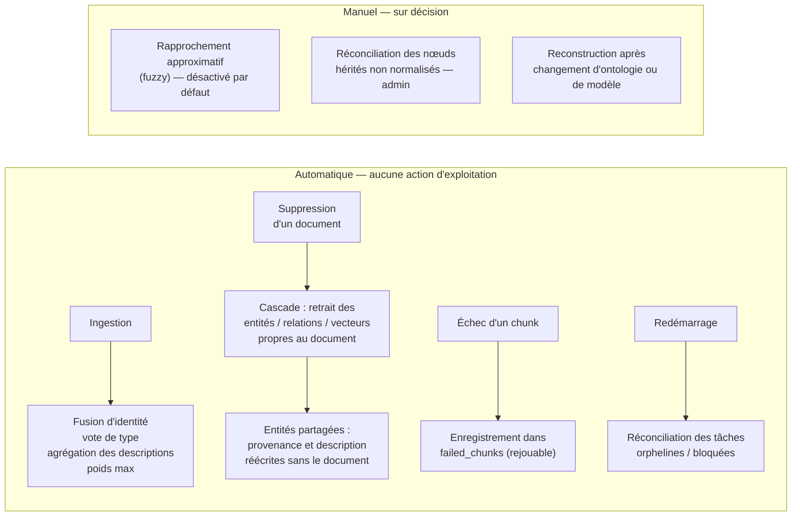
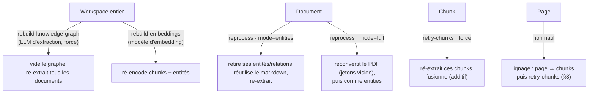
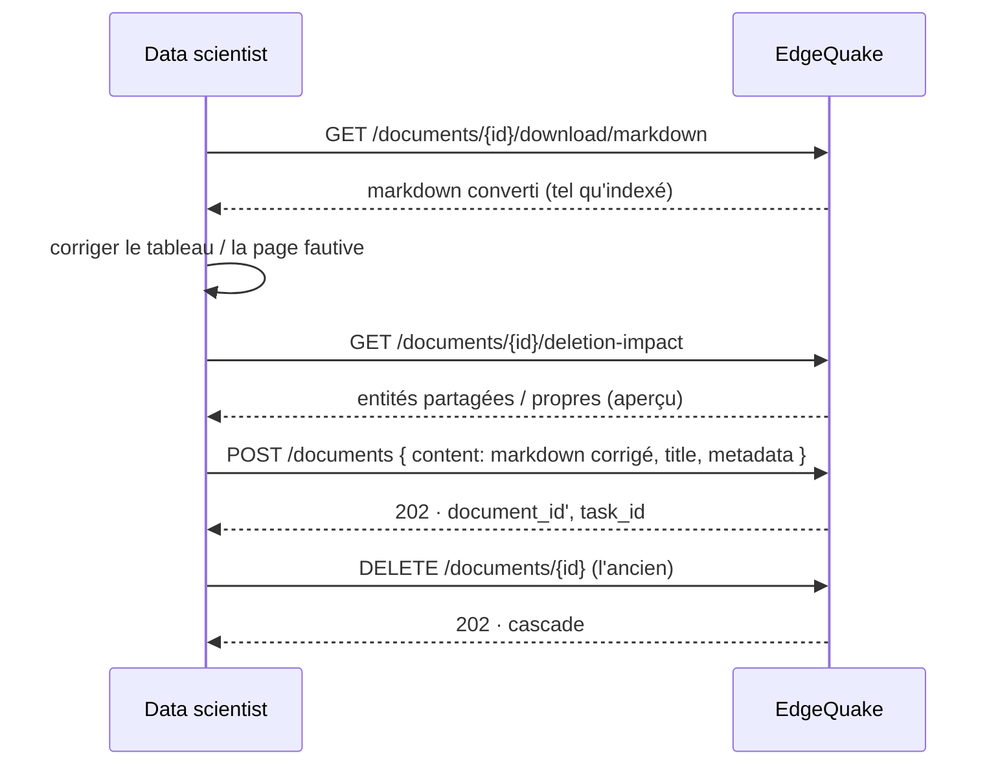
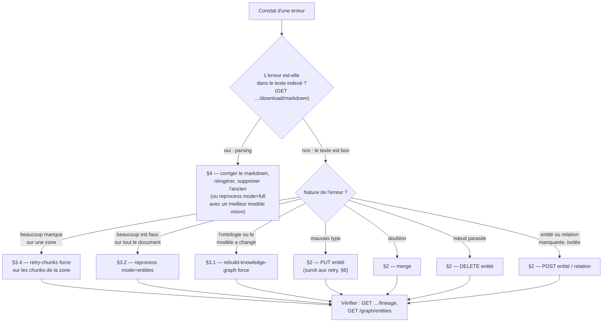

# EdgeQuake — Maintenance du graphe et correction du parsing

> **Produit** : EdgeQuake v0.26.9 (+ correctifs livrés avec ce dossier, §7)
> **Documents liés** : [Guide de construction d'une ontologie](05-ontologie-guide-construction.md) · [Algorithme d'extraction](06-algorithme-extraction-ontologie.md) · [Intégration IT](02-integration-it.md)

Ce document répond à deux questions posées lors de la revue:

1. **La maintenance du graphe est-elle entièrement automatique ?** — Oui pour tout ce
   qui découle du cycle de vie des documents (§1). Trois opérations restent
   volontairement manuelles, et sont listées.
2. **Jusqu'où un data scientist peut-il corriger une information, et selon quel
   protocole ?** — Réponse en trois niveaux : corriger le graphe (§2), relancer une
   extraction à la bonne granularité (§3), corriger le texte source (§4). Le protocole
   de décision est en §5, et la persistance des corrections face aux retraitements en §6.

Chaque capacité décrite a été **exécutée contre une instance v0.26.5** sur un workspace
de test — par l'API, et pour l'édition et la suppression d'entités **depuis l'interface
web réelle** (navigateur Chromium piloté par Playwright, appels observés côté API). Cette
vérification a révélé cinq défauts dans les chemins de correction, tous corrigés dans le
code livré avec ce dossier (§7). **Sans ces correctifs, la modification et la suppression
d'entités depuis l'interface graphique ne fonctionnent pas en v0.26.5.**

---

## Sommaire

1. [Ce qui est automatique](#1-ce-qui-est-automatique)
2. [Corriger le graphe — interface et API](#2-corriger-le-graphe--interface-et-api)
3. [Relancer une extraction — les quatre granularités](#3-relancer-une-extraction--les-quatre-granularités)
4. [Corriger le texte source](#4-corriger-le-texte-source)
5. [Protocole de correction recommandé](#5-protocole-de-correction-recommandé)
6. [Persistance des corrections manuelles](#6-persistance-des-corrections-manuelles)
7. [Défauts trouvés et corrigés](#7-défauts-trouvés-et-corrigés)
8. [Réponse à la demande « ré-extraction à la page »](#8-réponse-à-la-demande--ré-extraction-à-la-page-)

---

## 1. Ce qui est automatique

Le graphe est un **index dérivé** des documents. Il n'a pas de cycle de vie propre :
tout ce qui lui arrive découle d'une opération sur un document.



| Événement                         | Ce qu'EdgeQuake fait seul                                                                                                                                                                                                                                                         | Source                                                                                                       |
| --------------------------------- | --------------------------------------------------------------------------------------------------------------------------------------------------------------------------------------------------------------------------------------------------------------------------------- | ------------------------------------------------------------------------------------------------------------ |
| **Ingestion**                     | Résolution d'identité (`ws::NOM`), vote majoritaire du type, fusion des descriptions, poids de relation `max`, dédoublonnage intra-lot                                                                                                                                            | doc 06 §7                                                                                                    |
| **Suppression d'un document**     | Tâche `Deletion` (HTTP 202) ; cascade sur les entités, relations et vecteurs dont ce document est la seule source ; les entités **partagées** avec d'autres documents sont conservées, leur provenance et leur description sont réécrites sans les fragments du document supprimé | `services/document_deletion.rs`, `services/knowledge_rebuild.rs`                                             |
| **Aperçu avant suppression**      | `GET /api/v1/documents/{id}/deletion-impact` — lecture seule : `chunks_to_delete`, `entities_to_remove`, `entities_to_update`, `relationships_to_remove`                                                                                                                          | mesuré : `{"entities_to_remove":17,"entities_to_update":0,"relationships_to_remove":13,"preview_only":true}` |
| **Échec d'extraction d'un chunk** | Enregistré dans `failed_chunks` avec cause et compteur ; listable et rejouable (§3.4)                                                                                                                                                                                             | `handlers/documents/recovery/chunks.rs`                                                                      |
| **Document bloqué**               | Détection au-delà d'un seuil (`stuck_threshold_minutes`, 10 par défaut) ; nettoyage des données de graphe partielles puis remise en file ; `POST /api/v1/documents/recover-stuck`                                                                                                 | `handlers/documents/recovery/stuck.rs`                                                                       |
| **Redémarrage de l'API**          | Réconciliation des tâches en attente / à mi-chemin (`pending_doc_task_reconcile`), drain des effets journalisés (outbox), compensation des écritures partielles                                                                                                                   | `services/pending_doc_task_reconcile.rs`, doc 03 §3.9                                                        |
| **Réordonnancement, communautés** | Détection de communautés (Louvain) optionnelle, non déclenchée automatiquement                                                                                                                                                                                                    | doc 03 §3.10                                                                                                 |

**Ce qui n'est pas automatique, et pourquoi :**

| Opération                                                                | État                                                                                    | Raison                                                                                                        |
| ------------------------------------------------------------------------ | --------------------------------------------------------------------------------------- | ------------------------------------------------------------------------------------------------------------- |
| Rapprochement approximatif des noms (`MOTEUR_CFM56` ≈ `MOTEUR_CFM56-5B`) | Désactivé par défaut (`EDGEQUAKE_ENTITY_FUZZY=1`, seuil 0,88)                           | Un faux rapprochement fusionne deux entités réelles ; la décision est laissée au métier (fusion manuelle, §2) |
| Réconciliation des nœuds hérités non normalisés                          | `POST /api/v1/admin/entities/reconcile`, en deux temps (plan puis exécution avec jeton) | Opération destructive, réservée à l'administration                                                            |
| Réapplication d'une ontologie ou d'un modèle modifié                     | Reconstruction explicite (§3.1)                                                         | Coût LLM proportionnel au corpus ; jamais déclenché à l'insu de l'exploitant                                  |

---

## 2. Corriger le graphe — interface et API

Le graphe est **un réseau posé au-dessus des chunks** : corriger un nœud ou une arête
ne modifie ni le texte source ni les vecteurs de chunks. C'est l'outil adapté aux
erreurs de _classification_ et de _liaison_, pas aux erreurs de _parsing_ (§4).

### 2.1 Matrice des capacités (vérifiée)

| Opération                                                 | Interface web                                                                                                            | API                                                | Vérifié                                                                                                                       |
| --------------------------------------------------------- | ------------------------------------------------------------------------------------------------------------------------ | -------------------------------------------------- | ----------------------------------------------------------------------------------------------------------------------------- |
| **Modifier** le type ou la description d'une entité       | Oui — sélectionner le nœud, panneau de détails → bouton **Edit** (`node-details.tsx` → `entity-edit-dialog`)             | `PUT /api/v1/graph/entities/{nom}`                 | ✔ `OTHER` → `INSPECTION`, HTTP 200 ; vérifié depuis le navigateur : `PUT …::MARC_DUBOIS`, description relue par l'API         |
| **Supprimer** une entité (et ses arêtes)                  | Oui — clic droit → _Delete Entity_, ou panneau de détails → **Delete** ; confirmation dans les deux cas (correctif §7.5) | `DELETE /api/v1/graph/entities/{nom}?confirm=true` | ✔ HTTP 200 ; sans `confirm` → HTTP 400 ; vérifié depuis le navigateur : `DELETE …::MARC_DUBOIS?confirm=true` puis `GET` → 404 |
| **Fusionner** deux entités                                | Oui — panneau de détails → bouton **Merge** (ouvre le dialogue d'édition avec choix de la cible)                         | `POST /api/v1/graph/entities/merge`                | ✔ arêtes réécrites, source supprimée                                                                                          |
| **Créer** une entité                                      | **Non**                                                                                                                  | `POST /api/v1/graph/entities`                      | ✔ nœud `is_manual: true`, identifiant `ws::NOM`                                                                               |
| **Modifier** une relation (mots-clés, poids, description) | Oui — panneau de détails du nœud, liste des relations → clic sur la relation (`relationship-edit-dialog`)                | `PUT /api/v1/graph/relationships/{id}`             | ✔ HTTP 200                                                                                                                    |
| **Supprimer** une relation                                | **Non** (fonction cliente présente, non câblée dans l'interface)                                                         | `DELETE /api/v1/graph/relationships/{id}`          | ✔ HTTP 200                                                                                                                    |
| **Créer** une relation                                    | **Non**                                                                                                                  | `POST /api/v1/graph/relationships`                 | ✔ `AIRBUS_A320_F-GKXA —INSPECTED_BY→ MARC_DUBOIS`                                                                             |

La règle énoncée en réunion — _« tout ce qui se fait dans l'interface existe dans
l'API »_ — est exacte ; la réciproque ne l'est pas : la **création** d'entités et de
relations, et la **suppression** de relations, sont API uniquement.

> Les lignes marquées ✔ ont été exécutées **après** application des correctifs du §7.
> En v0.26.5 telle que livrée, `GET`/`PUT`/`DELETE /graph/entities/{nom}` et
> `POST /graph/relationships` répondent **404** pour tout nœud extrait par le pipeline,
> et le bouton _Delete_ de l'interface n'envoie pas la confirmation exigée par l'API.

### 2.2 Détails utiles

**Identifiant d'entité accepté** par `{nom}` : le nom normalisé (`MARC_DUBOIS`), le
nom brut (`Marc Dubois`), ou l'identifiant complet (`{workspace}::MARC_DUBOIS`) tel que
l'interface l'envoie. Toujours dans le workspace du contexte (`x-workspace-id` ou
session).

**Ce qu'une mise à jour de relation ne peut pas faire** : changer `relation_type`.
`PUT /graph/relationships/{id}` accepte `keywords`, `weight`, `description`,
`metadata` — pas `relation_type`. Vérifié : après `{"keywords": "INSPECTED_BY"}`, la
relation garde `relation_type: RELATED_TO` et affiche `keywords: INSPECTED_BY`. Pour
changer réellement le type : supprimer la relation, la recréer (`POST`, le premier
mot-clé devient `relation_type`).

**Fusion** — `merge_strategy` : `merge` (descriptions concaténées, métadonnées
fusionnées), `prefer_source`, `prefer_target`. Les arêtes de la source sont réécrites
vers la cible, les doublons éliminés ; la réponse détaille `relationships_merged` et
`duplicate_relationships_removed`.

**Suppression** — `delete_relationships=true` par défaut ; la réponse liste
`affected_entities` (les voisins qui perdent une arête).

**Contrôle ontologique** : l'API de correction **n'applique pas** l'ontologie du
workspace. `PUT` accepte n'importe quel `entity_type` ; `POST /graph/relationships`
accepte n'importe quel mot-clé. La cohérence est à la charge de l'opérateur.

### 2.3 Exemple de session de correction

```bash
API=https://edgequake.interne ; H=(-H "Authorization: Bearer $TOKEN" -H "x-workspace-id: $WS" -H "Content-Type: application/json")

# 1. Un nœud mal classé : « CONTRÔLE_BOROSCOPIQUE » est OTHER, c'est une INSPECTION
curl -X PUT "${H[@]}" "$API/api/v1/graph/entities/CONTRÔLE_BOROSCOPIQUE" \
  -d '{"entity_type":"INSPECTION"}'

# 2. Deux nœuds pour la même pièce : fusionner le court dans le long
curl -X POST "${H[@]}" "$API/api/v1/graph/entities/merge" \
  -d '{"source_entity":"AUBE_TURBINE_HP_14","target_entity":"AUBE_DE_TURBINE_HAUTE_PRESSION_NUMÉRO_14","merge_strategy":"merge","metadata":{}}'

# 3. Une relation attendue manque : la créer
curl -X POST "${H[@]}" "$API/api/v1/graph/relationships" \
  -d '{"src_id":"AIRBUS_A320_F-GKXA","tgt_id":"MARC_DUBOIS","keywords":"INSPECTED_BY","weight":0.9,"description":"Inspection du 12 mars 2026","source_id":"manual_entry","metadata":{}}'

# 4. Un nœud parasite : le supprimer (aperçu des voisins dans la réponse)
curl -X DELETE "${H[@]}" "$API/api/v1/graph/entities/RETOUR_EN_SERVICE?confirm=true"
```

---

## 3. Relancer une extraction — les quatre granularités

La chaîne d'ingestion a **trois phases** : conversion (PDF → markdown), découpage +
extraction (chunks → entités/relations), vectorisation (embeddings). Chaque relance
choisit quelle phase rejouer, sur quel périmètre, avec quel modèle.



### 3.1 Workspace — changer de modèle

| Objectif                                                                            | Endpoint                                               | Corps                                                                                          | Comportement vérifié                                                                                                                                             |
| ----------------------------------------------------------------------------------- | ------------------------------------------------------ | ---------------------------------------------------------------------------------------------- | ---------------------------------------------------------------------------------------------------------------------------------------------------------------- |
| Ré-extraire tout le graphe avec un autre LLM (ou après modification de l'ontologie) | `POST /api/v1/workspaces/{id}/rebuild-knowledge-graph` | `{"llm_model": "…", "llm_provider": "…", "force": true}`                                       | Sans changement de modèle **et** sans `force` : HTTP 400 _« LLM configuration unchanged. Use 'force: true' »_. C'est une protection contre un rebuild accidentel |
| Ré-encoder avec un autre modèle d'embedding                                         | `POST /api/v1/workspaces/{id}/rebuild-embeddings`      | `{"embedding_model": "…", "embedding_provider": "…", "embedding_dimension": N, "force": bool}` | Obligatoire après tout changement de modèle d'embedding (dimension liée au workspace)                                                                            |
| Retraiter tous les documents (ou seulement les échoués)                             | `POST /api/v1/workspaces/{id}/reprocess-documents`     | —                                                                                              | Équivalent v2 : `POST /api/v2/workspaces/{id}/jobs` avec `job_type: reprocess_all` / `reprocess_failed`                                                          |

C'est exactement la demande _« on pourrait dire : on ré-indexe avec tel modèle »_ :
deux phases indépendantes, deux endpoints, chacun acceptant le modèle cible.

### 3.2 Document — remplacement propre

`POST /api/v1/documents/reprocess`

```json
{ "document_id": "01a0af45-…", "force": true, "mode": "entities" }
```

| Champ   | Valeurs                                  | Effet                                                                                                                                                                     |
| ------- | ---------------------------------------- | ------------------------------------------------------------------------------------------------------------------------------------------------------------------------- |
| `mode`  | `entities` (défaut)                      | Réutilise le markdown en cache ; **retire** toutes les entités, relations et vecteurs issus de ce document ; ré-extrait                                                   |
|         | `full`                                   | Reconvertit d'abord le PDF depuis les octets stockés (dépense des jetons vision) — à utiliser quand la conversion elle-même est en cause (tableau mal lu, page manquante) |
| `force` | `true` pour un document déjà `completed` | Sans `force`, seuls les documents en échec sont repris                                                                                                                    |

Réponse mesurée : `{"requeued":1,"skipped":0,"document_ids":[…],"task_id":"insert-…"}`,
puis statut `processing` → `completed` en une vingtaine de secondes sur le document de
test. Le journal confirme le retrait préalable (`entities_removed`,
`relationships_removed`, `embeddings_deleted`) avant la nouvelle extraction.

**C'est un remplacement, pas une addition** : le graphe du document après reprocess ne
contient que ce que la nouvelle extraction a produit (conséquences en §6).

### 3.3 Document — VLM uniquement

`POST /api/v1/documents/{id}/reanalyze` relance uniquement l'enrichissement multimodal
(images, graphiques, figures) sans toucher aux entités textuelles. Équivalent v2 :
`job_type: reanalyze_multimodal`.

### 3.4 Chunk — ré-extraction ciblée

`POST /api/v1/documents/{id}/retry-chunks`

```json
{ "chunk_indices": [3, 4], "force": true }
```

| Champ                           | Effet                                                                                                               |
| ------------------------------- | ------------------------------------------------------------------------------------------------------------------- |
| `chunk_indices` vide            | Rejoue uniquement les chunks enregistrés en échec (`GET /documents/{id}/failed-chunks`)                             |
| `chunk_indices` + `force: true` | Rejoue les chunks désignés **même s'ils avaient réussi** — c'est le mode « je ré-extrais là où il y a un problème » |
| `max_retries`                   | Plafond de tentatives par chunk (défaut **3**) — au-delà, le chunk passe en `abandoned` sauf `force`                |

Comportement : le texte du chunk est relu depuis le stockage, ré-extrait avec le
pipeline **du workspace** (ontologie, langue, budget — voir correctif §7.3), puis
**fusionné** dans le graphe. La réponse indique `chunks_queued` (chunks fusionnés sans
erreur) et `implemented: true`.

**C'est une addition, pas un remplacement.** Ce qui avait été extrait de ce chunk n'est
pas retiré avant la nouvelle extraction :

- une entité supprimée à la main réapparaît si le chunk la contient toujours
  (vérifié : `RETOUR_EN_SERVICE` supprimée, puis restaurée par le retry) ;
- une entité fusionnée à la main réapparaît sous son nom d'origine ;
- les nouvelles mentions s'ajoutent aux anciennes (descriptions agrégées, votes de
  type cumulés).

À réserver donc aux cas « il manque quelque chose », pas aux cas « il y a quelque chose
en trop » (pour ceux-là : §2 ou §3.2).

Le résumé-LLM des descriptions est désactivé sur ce chemin (latence bornée) : les
descriptions sont concaténées, pas résumées.

### 3.5 Trouver les chunks concernés

Le lignage donne, par document, la liste des chunks avec leurs bornes et ce qui en a
été extrait :

```bash
curl "${H[@]}" "$API/api/v1/documents/$DOC/lineage"        # chunks[] : chunk_index, start_line, end_line, entity_ids, relationship_ids
curl "${H[@]}" "$API/api/v1/chunks/$CHUNK_ID"             # contenu intégral + page_start / page_end (PDF)
curl "${H[@]}" "$API/api/v1/lineage/entities/MARC_DUBOIS"  # dans quels chunks cette entité apparaît
```

Les identifiants de chunk sont de la forme `{document_id}-chunk-{index}` ; l'index est
celui attendu par `retry-chunks`.

---

## 4. Corriger le texte source

Quand l'erreur est dans le **parsing** — un tableau aplati, une colonne fusionnée, une
page manuscrite mal transcrite — corriger le graphe ne suffit pas : la prochaine
ré-extraction reproduira l'erreur. Il faut corriger le markdown.

**Il n'existe pas d'endpoint de modification en place du contenu d'un document.** Le
protocole est :



| Étape                 | Endpoint                                                                   | Remarque                                                                                                                                                                |
| --------------------- | -------------------------------------------------------------------------- | ----------------------------------------------------------------------------------------------------------------------------------------------------------------------- |
| Récupérer le markdown | `GET /api/v1/documents/{id}/download/markdown`                             | Le markdown converti, pas le PDF d'origine (`…/download/original` pour celui-ci)                                                                                        |
| Réingérer             | `POST /api/v1/documents` `{"content": "…", "title": "…", "metadata": {…}}` | Le nouveau document passe par le pipeline complet du workspace (ontologie, gleaning) ; conserver `title` et `metadata` pour la traçabilité                              |
| Supprimer l'ancien    | `DELETE /api/v1/documents/{id}`                                            | Vérifier `deletion-impact` avant : les entités **partagées** avec d'autres documents sont conservées et leurs descriptions réécrites, les entités propres disparaissent |

Alternative quand la conversion PDF est en cause et qu'un meilleur modèle de vision
est disponible : `reprocess` avec `mode: full` après avoir changé
`vision_llm_model` sur le workspace — cela rejoue la conversion sans intervention
manuelle sur le texte. C'est la seule voie pour « ré-extraire une page » au sens de la
conversion, et elle porte sur le document entier (§8).

---

## 5. Protocole de correction recommandé



Règle de granularité : **le plus petit périmètre qui contient l'erreur**, parce que
chaque niveau au-dessus coûte des appels LLM sur du contenu correct et, pour
`reprocess` / `rebuild`, efface les corrections manuelles du périmètre (§6).

---

## 6. Persistance des corrections manuelles

Le point le plus important pour un data scientist qui corrige à la main :
**que deviennent ses corrections quand quelqu'un relance une extraction ?** Mesuré sur
le workspace de test :

| Correction manuelle                                            | après `retry-chunks` (chunk)                                    | après `reprocess` (document)                                                     | après `rebuild-knowledge-graph` |
| -------------------------------------------------------------- | --------------------------------------------------------------- | -------------------------------------------------------------------------------- | ------------------------------- |
| Type d'entité modifié (`PUT`)                                  | **Conservé** (verrou `entity_type_locked` — correctif §7.4)     | **Perdu** (le nœud est retiré puis recréé)                                       | **Perdu**                       |
| Description modifiée (`PUT`)                                   | Conservée, mais la nouvelle description extraite s'y **ajoute** | Perdue                                                                           | Perdue                          |
| Entité supprimée                                               | **Réapparaît** si le chunk la mentionne                         | Réapparaît                                                                       | Réapparaît                      |
| Entités fusionnées                                             | La source **réapparaît**                                        | Réapparaît                                                                       | Réapparaît                      |
| Entité créée à la main (`is_manual`, sans source documentaire) | Conservée                                                       | **Conservée** (vérifié)                                                          | Conservée                       |
| Relation créée à la main                                       | Conservée                                                       | **Perdue** si l'une des extrémités est une entité du document retraité (vérifié) | Perdue                          |
| Relation modifiée (`PUT`)                                      | Conservée (fusion additive)                                     | Perdue                                                                           | Perdue                          |

Conséquence pratique : **les corrections manuelles se font en dernier**, après la
dernière ré-extraction du périmètre concerné. Si des corrections doivent survivre à un
retraitement, elles doivent être **rejouables** — d'où l'intérêt de les scripter
(§2.3) plutôt que de les faire dans l'interface.

---

## 7. Défauts trouvés et corrigés

La vérification a mis en évidence cinq défauts dans les chemins de correction de la
v0.26.5. Les correctifs sont inclus dans le code livré avec ce dossier ; ils
**nécessitent une nouvelle image** (pas de migration de schéma). Chaque correctif a été
validé par l'exécution décrite.

### 7.1 Modification et suppression d'entités impossibles (interface et API)

**Symptôme** : `GET`, `PUT` et `DELETE /api/v1/graph/entities/{nom}` répondent
**404** pour tout nœud extrait par le pipeline — donc _Edit_ et _Delete Entity_ dans
l'interface échouent aussi.

**Cause** : les identifiants de nœuds sont préfixés par le workspace
(`79d6e213-…::MARC_DUBOIS`). Le gestionnaire normalisait le segment d'URL en majuscules
avant la recherche : le préfixe UUID était transformé (`79D6E213-…`) et ne
correspondait plus ; et un nom nu (`MARC_DUBOIS`) ne recevait jamais son préfixe. Les
opérations de fusion et de voisinage, elles, disposaient d'une résolution correcte.

**Correctif** : résolveur exact partagé `resolve_entity_node_exact`, dont la liste de
candidats est produite par `EntityId::exact_lookup_candidates` (couche stockage, donc
une seule définition de l'identité pour l'API et pour le pipeline). Les candidats sont
essayés dans cet ordre :

1. le **segment brut** tel qu'envoyé (identifiant complet `{workspace}::NOM` de l'interface) ;
2. `{workspace}::{nom normalisé}` (nom nu saisi par un opérateur ou un script) ;
3. le **nom normalisé nu** (nœuds hérités, écrits avant le préfixage par workspace).

Aucune recherche approximative n'intervient : une mutation ne doit jamais atteindre un
nœud « proche ». Le nom n'est plus normalisé **en entier** — c'est ce qui abîmait le
préfixe UUID.
Fichiers : `edgequake-storage/src/entity_id.rs` (`exact_lookup_candidates`),
`handlers/entities/mod.rs`, `handlers/entities/entity_crud.rs`.

**Validation** : `GET /graph/entities/RETOUR_EN_SERVICE` → 200 ; même requête avec
l'identifiant complet → 200 ; `PUT` → type modifié ; `DELETE` → 200.

### 7.2 Entités et relations manuelles hors du workspace

**Symptôme** : `POST /graph/entities` créait un nœud **sans** préfixe de workspace ;
une extraction ultérieure du même nom créait un second nœud au lieu de fusionner.
`POST /graph/relationships` répondait 404 sur des noms d'entités valides (même cause
qu'en 7.1).

**Correctif** : l'entité manuelle reçoit l'identifiant que le pipeline aurait produit
(`EntityId::graph_node_id_for_workspace`) ; la création de relation résout ses deux
extrémités par le résolveur exact.
Fichiers : `handlers/entities/entity_crud.rs`, `handlers/relationships/create.rs`.

Côté interface, les identifiants sont désormais encodés (`encodeURIComponent`) par un
constructeur de chemin unique (`entityPath`), ce qui couvre les noms accentués ou
porteurs de caractères réservés (`CONTRÔLE_BOROSCOPIQUE`, `TRAIN_D'ATTERRISSAGE…`).
Fichier : `edgequake_webui/src/lib/api/edgequake/graph.ts`.

**Validation** : entité créée sous `79d6e213-…::AUBE_TURBINE_HP_14`, fusion vers le nœud
extrait réussie ; relation `AIRBUS_A320_F-GKXA —INSPECTED_BY→ MARC_DUBOIS` créée.

### 7.3 Ré-extraction d'un chunk sans l'ontologie du workspace

**Symptôme** : `retry-chunks` utilisait l'extracteur **global par défaut** (12 types
génériques, anglais, sans gleaning) au lieu du pipeline du workspace. Sur le workspace
de test (ontologie aéronautique, français), un retry a produit 7 doublons anglais
typés `ARTIFACT` / `CONCEPT` : `CFM56-5B_ENGINE`, `HIGH-PRESSURE_COMPRESSOR`,
`MAIN_LANDING_GEAR_LEFT`, `TURBINE_BLADE_14`, `TOULOUSE-BLAGNAC`, `EASA_PART-145`,
`AD_2024-0187`. De plus, les **relations** du retry étaient toutes rejetées par le
contrôle de citation (`SPEC-091 RM2: source_chunk_ids required`) faute de lignage —
seules les entités étaient fusionnées.

**Correctif** : le retry résout le pipeline du workspace avec la politique **`Strict`**
— la même que l'ingestion — et applique le même chaînage de lignage
(`link_extractions_to_chunks`, rendu public).

Le choix de `Strict` est délibéré : en `LenientGlobal`, un document dont le
`workspace_id` est absent ou irrésolvable retomberait **silencieusement** sur
l'ontologie globale et recréerait exactement les doublons anglais décrits ci-dessus.
Le retry préfère donc **échouer bruyamment** :

| Situation | Réponse |
|---|---|
| `workspace_id` absent du document | **503** `Document has no workspace_id; cannot retry with workspace pipeline` |
| Pipeline du workspace irrésolvable | **503** `Workspace pipeline unavailable for chunk retry: …` |

Un 503 sur `retry-chunks` est donc un signal de configuration, pas une panne
transitoire : vérifier le `workspace_id` du document avant de relancer.
Fichiers : `handlers/documents/recovery/chunks.rs`, `edgequake-pipeline/src/pipeline/{mod.rs,helpers/mod.rs,helpers/stats.rs}`.

**Validation** : retry après suppression des doublons → 20 entités, toutes dans
l'ontologie, en français ; deux relations supprimées puis restaurées par le retry
(13 → 15), `chunks_queued: 1`, zéro rejet RM2.

### 7.4 Correction manuelle de type écrasée à la ré-extraction suivante

**Symptôme** : `CONTRÔLE_BOROSCOPIQUE` reclassé `OTHER` → `INSPECTION` par `PUT`, puis
un `retry-chunks` du chunk source le ramenait à `OTHER`.

**Cause** : le type affiché est le résultat d'un vote majoritaire
(`entity_type_votes`) ; `PUT` changeait l'étiquette sans toucher aux votes, et le vote
`OTHER` accumulé l'emportait à la fusion suivante.

**Correctif** : `PUT` avec `entity_type` ne se contente plus de réécrire l'étiquette,
il **verrouille** le type (`apply_manual_type_override`) :

- `entity_type` prend la valeur corrigée (normalisée en majuscules) ;
- la propriété `entity_type_locked` passe à `true` ;
- le scrutin `entity_type_votes` est réinitialisé sur ce seul type.

Tant que `entity_type_locked` vaut `true`, la fusion **ignore** les votes du LLM
(`apply_entity_type_vote` ne fait rien) : la correction humaine survit à un nombre
quelconque de ré-extractions, et pas seulement à un vote plus faible qu'un seuil.
Fichiers : `edgequake-pipeline/src/merger/entity_type_vote.rs`
(`ENTITY_TYPE_LOCKED_KEY`, `apply_manual_type_override`, `is_entity_type_locked`),
`handlers/entities/entity_crud.rs`.

**Validation** : après retry, `entity_type: INSPECTION`, `entity_type_locked: true` ;
test unitaire amont `manual_lock_survives_many_llm_votes` (20 votes `ORGANIZATION`
consécutifs, tous refusés).

> **Levée du verrou** : il n'existe **aucun endpoint** pour déverrouiller. Le champ
> `metadata` de `PUT /graph/entities/{nom}` n'y donne pas accès : il écrit une
> propriété `metadata` **imbriquée**, alors que `entity_type_locked` est une propriété
> de premier niveau du nœud. La seule voie prise en charge est de **supprimer
> l'entité** et de la laisser se recréer à la ré-extraction suivante (§3.4) — la
> nouvelle entité repart sans verrou. À prendre en compte avant de corriger un type en
> masse : le verrou est délibérément difficile à défaire.

### 7.5 Suppression depuis l'interface refusée par l'API

**Symptôme** : une fois 7.1 corrigé, _Delete Entity_ / _Delete_ dans l'interface affiche
« Failed to delete entity » : l'API exige `?confirm=true` (HTTP 400 _« Confirmation
required »_ sinon) et le client web n'envoyait jamais ce paramètre — alors qu'il affiche
déjà sa propre boîte de confirmation.

**Correctif** : le client web ajoute `?confirm=true` à l'appel de suppression
(`edgequake_webui/src/lib/api/edgequake/graph.ts`, `deleteEntity`) ; la confirmation
utilisateur reste celle de l'interface.

**Validation** : navigateur Chromium piloté — sélection du nœud `MARC_DUBOIS`, _Delete_,
confirmation ; appel observé `DELETE /api/v1/graph/entities/{ws}::MARC_DUBOIS?confirm=true` ;
`GET` API → 404.

### 7.6 Gates

`cargo clippy -- -D warnings` (cible `make backend-clippy`) : sans avertissement.
`cargo fmt --check` : conforme. Tests unitaires des modules touchés
(`handlers::entities`, `handlers::relationships`, `handlers::documents`) : passés.

---

## 8. Réponse à la demande « ré-extraction à la page »

La demande formulée en réunion : _« l'extraction se fait à la page ; pouvoir relancer
le chunking et la correction du graphe uniquement sur 1 page ou n pages »_.

**État en v0.26.5** : il n'existe **pas** d'opération native « page ». Les
granularités natives sont le workspace, le document et le chunk (§3). Mais la page est
**traçable** :

- pour un PDF ingéré avec découpage sensible aux pages, chaque chunk porte
  `page_start` / `page_end` (`GET /api/v1/chunks/{id}`) ;
- `GET /api/v1/documents/{id}/pages` liste les pages et `…/pages/{n}/layout` leurs
  régions (SPEC-128).

**Procédure réalisable aujourd'hui** (ré-extraction du graphe pour les pages 12 à 14) :

```bash
# 1. chunks dont l'intervalle de pages recouvre 12–14
curl "${H[@]}" "$API/api/v1/documents/$DOC/lineage" \
 | jq '[.lineage.chunks[] | .chunk_id]' \
 | xargs -I{} sh -c 'curl -s "${H[@]}" "$API/api/v1/chunks/{}" | jq -c "select(.page_start<=14 and .page_end>=12) | .index"'
# → ex. [7, 8, 9]

# 2. ré-extraction de ces chunks avec l'ontologie du workspace
curl -X POST "${H[@]}" "$API/api/v1/documents/$DOC/retry-chunks" \
  -d '{"chunk_indices":[7,8,9],"force":true}'
```

**Limites de cette procédure, à énoncer au client :**

| Limite                                                             | Raison                                                                                                                          | Contournement                                                                                  |
| ------------------------------------------------------------------ | ------------------------------------------------------------------------------------------------------------------------------- | ---------------------------------------------------------------------------------------------- |
| Additif, pas remplacement                                          | `retry-chunks` fusionne sans retirer l'extraction précédente du chunk (§3.4)                                                    | Supprimer d'abord à la main les nœuds fautifs propres à ces pages (§2), ou accepter l'addition |
| Pas de re-conversion de la page                                    | Le texte du chunk est relu tel qu'indexé ; si la **conversion** PDF de la page est fautive, la ré-extraction reproduit l'erreur | `reprocess` `mode: full` (document entier) ou correction du markdown (§4)                      |
| Un chunk peut chevaucher deux pages                                | Le recouvrement de 100 tokens et le remplissage au budget (SPEC-135) font qu'un chunk peut commencer page 11 et finir page 12   | Inclure les chunks limitrophes                                                                 |
| `page_start` absent pour les documents non PDF ou ingérés en texte | Le lignage de page n'existe que pour le chemin PDF page-aware                                                                   | Utiliser `start_line` / `end_line`                                                             |

**Ce qu'il faudrait pour une vraie opération « page »** (non livré, à chiffrer) :

1. un endpoint `POST /documents/{id}/pages/{n}/reprocess` qui (a) retire les
   entités/relations dont **toutes** les sources sont des chunks de la page,
   (b) ré-extrait ces chunks avec le pipeline du workspace, (c) préserve les votes
   manuels ;
2. en option, `mode: full` restreint à la page : reconvertir la page `n` seule
   (SPEC-134 traite déjà la page comme unité de conversion côté vision), remplacer le
   segment de markdown correspondant, puis (1).

Les briques (lignage de page, retry par chunk, retrait par document, vote manuel)
existent toutes ; il manque l'orchestration et la sémantique de retrait « à la page ».
