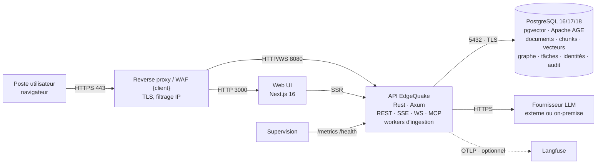

# B2 — Description de la plateforme EdgeQuake

> **Fiche descriptive conforme aux standards de référencement IT {client}** : fiche
> d'identité applicative, cotation DICT, classification des données.
> **Produit** : EdgeQuake v0.26.9 · **Documents liés** : [01 Déploiement technique](01-deploiement-technique.md) · [02 Intégration IT](02-integration-it.md) · [03 Deep dive](03-deep-dive-architecture-algorithme.md) · [07 Maintenance du graphe](07-maintenance-graphe-correction-parsing.md)

Les champs entre `{…}` sont à renseigner par {client} (identifiants internes,
propriétaires, URL). Tout le reste est établi à partir du code source v0.26.5 et
des vérifications d'exécution consignées dans les documents 01 à 07.

---

## Sommaire

1. [Fiche d'identité applicative](#1-fiche-didentité-applicative)
2. [Architecture technique synthétique](#2-architecture-technique-synthétique)
3. [Cotation DICT](#3-cotation-dict)
4. [Classification des données](#4-classification-des-données)
5. [Données à caractère personnel](#5-données-à-caractère-personnel)
6. [Flux sortants et souveraineté](#6-flux-sortants-et-souveraineté)
7. [Points d'attention pour le référencement](#7-points-dattention-pour-le-référencement)
8. [Annexe — secrets et paramètres de sécurité](#8-annexe--secrets-et-paramètres-de-sécurité)

---

## 1. Fiche d'identité applicative

### 1.1 Identité

| Champ | Valeur |
|---|---|
| **Nom de l'application** | EdgeQuake |
| **Acronyme / code applicatif {client}** | `{CODE_APPLI}` |
| **Version référencée** | **0.26.5** (schéma de base : migrations 001 → 149) |
| **Nature** | Plateforme **Graph-RAG** : indexation de documents en graphe de connaissances + index vectoriel, interrogation en langage naturel avec citations |
| **Origine** | Logiciel libre — dépôt public `github.com/raphaelmansuy/edgequake` |
| **Licence** | **Apache License 2.0** (fichier `LICENSE` à la racine du dépôt) |
| **Éditeur** | Communauté open source (mainteneur principal : R. Mansuy). **Pas de contrat éditeur** ; support assuré par l'intégrateur `{INTÉGRATEUR}` |
| **Intégrateur / responsable technique** | `{INTÉGRATEUR}` — `{contact}` |
| **Propriétaire métier {client}** | `{NOM — direction}` |
| **Propriétaire technique {client}** | `{NOM — équipe}` |
| **Statut du cycle de vie** | `{Pilote / Production}` |
| **Criticité métier (échelle {client})** | `{à qualifier}` — proposition de cotation DICT en §3 |
| **Domaine fonctionnel** | Gestion documentaire / recherche d'information augmentée par IA |
| **Périmètre utilisateurs** | `{populations}` — typiquement data scientists, experts métier, ingénieurs qualité |
| **Environnements** | `{DEV / PPD / PROD}` — un déploiement = 3 conteneurs + 1 volume PostgreSQL |
| **Hébergement** | Kubernetes on-premise {client} (charts Helm fournis : `deploy/kubernetes/helm/edgequake`, `edgequake-stack`) |
| **URL(s)** | `{https://edgequake.<domaine-interne>}` |

### 1.2 Fonctions principales

| Fonction | Description | Référence |
|---|---|---|
| Ingestion documentaire | Dépôt de fichiers (texte, Markdown, PDF avec conversion vision), découpage, extraction d'entités/relations par LLM, vectorisation | doc 03 §3 |
| Ontologie par espace de travail | Vocabulaire contrôlé (≤ 50 types d'entités, ≤ 50 types de relations, ≤ 100 arêtes typées) déclaré par interface, API ou fichier JSON | doc 05, doc 06 |
| Interrogation | 6 modes de recherche (graphe, vecteurs, hybride…), réponses en streaming, citations de passages sources, conversations persistées | doc 03 §5 |
| Visualisation et correction du graphe | Exploration du graphe, édition/fusion/suppression d'entités, ré-extraction ciblée | doc 07 |
| Administration | Tenants, espaces de travail, utilisateurs, rôles, clés d'API, quotas | doc 01 §7 |
| Interfaces programmatiques | API REST (OpenAPI 3.0), SSE, WebSocket, serveur **MCP** intégré (`/api/v1/mcp`), SDK (Python, TypeScript, Rust, Java, Go, C#…) | `edgequake/sdks/` |
| Observabilité | Sondes de santé, métriques Prometheus, traces OTLP (Langfuse) | doc 02 §3, doc 04 |

### 1.3 Composants techniques

| Composant | Technologie | Version | Licence | Image |
|---|---|---|---|---|
| API | Rust (édition stable, `rust-version = 1.95`), Axum | 0.26.5 | Apache 2.0 | `ghcr.io/raphaelmansuy/edgequake` — base **distroless** `gcr.io/distroless/cc-debian12:nonroot` |
| Web UI | Next.js **16.3.3**, React 19 | 0.26.5 | Apache 2.0 | `ghcr.io/raphaelmansuy/edgequake-frontend` (base `node:20-alpine`) |
| Base de données | PostgreSQL **16 / 17 / 18** | — | PostgreSQL License | `ghcr.io/raphaelmansuy/edgequake-postgres` ou PostgreSQL d'entreprise |
| Extension vectorielle | pgvector | **0.8.5** (version minimale contrôlée au démarrage) | PostgreSQL License | incluse |
| Extension graphe | Apache AGE | **1.8.0-rc0** (PG18) · 1.7.0-rc0 (PG17) · 1.6.0-rc0 (PG16) | Apache 2.0 | incluse |
| Extraction PDF | pdfium, embarqué à la compilation | — | BSD-3 | dans l'image API |
| Fournisseur LLM | Externe ou on-premise (OpenAI, Azure OpenAI, Mistral, Anthropic, Gemini, Bedrock, Ollama, LM Studio, vLLM/llama.cpp…) | — | selon fournisseur | hors périmètre |
| Observabilité LLM (optionnel) | Langfuse ≥ 3.22 (OTLP) ou 3.1.x (API native) | — | MIT | hors périmètre |

Aucun autre middleware : **pas de Redis, pas de broker, pas de base vectorielle ou
graphe séparée**. PostgreSQL est l'unique magasin persistant.

### 1.4 Dépendances et interfaces

| Sens | Interface | Protocole / port | Obligatoire |
|---|---|---|---|
| Entrant | Interface web et API | HTTPS 443 → UI 3000 / API 8080 (TLS terminé au reverse proxy) | oui |
| Entrant | Supervision | `/metrics`, `/health`, `/ready`, `/live` sur 8080 — **à restreindre au réseau de supervision** | oui |
| Sortant | PostgreSQL | TCP 5432, `sslmode=require` recommandé | oui |
| Sortant | Fournisseur LLM | HTTPS 443 (ou HTTP 11434 vers Ollama on-premise) | oui |
| Sortant | Langfuse | HTTPS/HTTP vers `LANGFUSE_BASE_URL` | non |
| Sortant | Registre d'images | uniquement au déploiement | non (images pré-chargées) |

Matrice de flux complète : [doc 01 §6.2](01-deploiement-technique.md#62-matrice-de-flux).

### 1.5 Exploitation

| Rubrique | Valeur |
|---|---|
| Sauvegarde | PostgreSQL uniquement (aucune donnée métier hors base) ; objectifs proposés **RPO ≤ 15 min** (archivage WAL), **RTO ≤ 2 h** — à arbitrer ([doc 02 §4](02-integration-it.md#4-sauvegarde-et-restauration)) |
| Haute disponibilité | API et UI sans état, multi-réplique supporté (`EDGEQUAKE_TASK_DELIVERY=notify_only`) ; la disponibilité dépend de celle de PostgreSQL |
| Mise à jour | Migration de schéma **explicite** (`edgequake migrate`) avant démarrage ; l'API refuse de démarrer sur schéma désynchronisé (code 78) |
| Supervision | Sondes `/live` `/ready` `/health`, métriques Prometheus, journaux structurés JSON (`EDGEQUAKE_LOG_FORMAT`), traces OTLP |
| Rétention technique | Tâches terminales 30 jours (`EDGEQUAKE_TASK_RETENTION_DAYS`) ; documents, graphe, conversations, audit : **illimitée** jusqu'à suppression métier |

---

## 2. Architecture technique synthétique

Détail : [doc 01 §2](01-deploiement-technique.md#2-architecture-déployée).

---

## 3. Cotation DICT

**Échelle utilisée** : 4 niveaux (1 = faible, 4 = vital), à transposer sur l'échelle
de référence {client}. Les cotations ci-dessous sont des **propositions argumentées**,
fondées sur les mécanismes réellement présents dans le produit ; la cotation
définitive relève du propriétaire métier et du RSSI, selon la sensibilité du corpus
effectivement indexé.

| Critère | Cotation proposée | Justification | Mécanismes du produit | Responsabilités {client} |
|---|---|---|---|---|
| **D — Disponibilité** | **2** (pilote) → **3** (si intégré à un processus métier) | Outil d'aide à la recherche : une indisponibilité dégrade la productivité sans bloquer un processus critique, sauf intégration dans un flux opérationnel | API/UI sans état, multi-réplique ; file de tâches durable en base (reprise après redémarrage, réconciliation des tâches orphelines) ; sondes d'orchestrateur | HA PostgreSQL, sauvegarde WAL, capacité du fournisseur LLM (dépendance externe non maîtrisée par le produit) |
| **I — Intégrité** | **3** | Les réponses citent des sources ; une altération silencieuse du graphe ou des chunks fausserait des décisions techniques | Migrations verrouillées par empreintes (`checksums.lock`) ; posture *fail-closed* ; lignage chunk → entité → document ; journal d'audit avec valeurs avant/après ; retrait propre à la suppression/reprocess ; identité d'entité déterministe | Contrôle des rôles (seuls `Admin`/`User` écrivent), revue des corrections manuelles (doc 07 §6) |
| **C — Confidentialité** | **3** (documentation technique interne) → **4** si corpus classifié | Le corpus indexé **et** les questions posées transitent vers le fournisseur LLM (§6) ; les traces Langfuse contiennent prompts et réponses complets | Cloisonnement tenant/workspace appliqué au stockage (*fail-closed*) ; RBAC `Admin > User > Readonly` ; mots de passe **Argon2id** ; clés d'API stockées **hachées** ; JWT signé (`JWT_SECRET` ≥ 32 octets exigé) ; verrouillage de compte après échecs répétés ; OIDC ; quotas par tenant | Choix du fournisseur LLM (on-premise pour un corpus sensible) ; chiffrement du volume PostgreSQL ; TLS ; restriction réseau de `/metrics` et `/health` ; gouvernance des accès Langfuse |
| **T — Traçabilité** | **3** | Exigence naturelle pour un outil qui produit des réponses engageantes | Crate `edgequake-audit` (authentification, autorisation, dépôt, requête, accès tenant/workspace, export, changement de configuration ; sévérités `Low`→`Critical`) persisté en base ; journaux structurés ; traces OTLP par requête (`request_id`, `trace_id`) ; provenance de chaque entité/relation | Collecte vers le SIEM, rétention des journaux, corrélation avec l'identité d'entreprise (OIDC) |

Références : [doc 01 §7](01-deploiement-technique.md#7-configuration-sécurité) (mécanismes détaillés), [doc 02 §3–4](02-integration-it.md) (supervision, sauvegarde).

---

## 4. Classification des données

Toutes les données persistantes résident dans **PostgreSQL** ([doc 01 §5.3](01-deploiement-technique.md#53-persistance--où-atterrit-la-donnée)).
Le niveau de sensibilité indiqué est celui **hérité du corpus** : EdgeQuake ne
déclasse jamais une donnée — un chunk, un vecteur ou une entité extraite d'un
document classifié porte la classification du document.

| Catégorie | Contenu | Emplacement | Sensibilité | Chiffrement | Rétention | Suppression |
|---|---|---|---|---|---|---|
| **Documents sources** | Fichier original déposé (PDF, texte…) | table `document_originals` | héritée du corpus | au repos : volume PostgreSQL ({client}) ; transit : TLS | illimitée | `DELETE /documents/{id}` (cascade, aperçu d'impact disponible) |
| **Markdown converti, pages** | Texte extrait, transcription vision des pages, régions de mise en page | tables documents / pages / layout | héritée | idem | illimitée | cascade document |
| **Chunks et index plein texte** | Fragments de texte (≈ 1 200 tokens) et leur index FTS | tables chunks, `chunk_fts` | héritée | idem | illimitée | cascade document |
| **Embeddings** | Vecteurs des chunks et des entités (non réversibles en texte, mais **dérivés** du contenu) | colonnes pgvector, index HNSW | héritée | idem | illimitée | cascade document ; `rebuild-embeddings` |
| **Graphe de connaissances** | Entités (nom, type, description agrégée), relations, provenance | graphe Apache AGE | héritée ; les descriptions **résument le contenu** | idem | illimitée | cascade document ; édition/suppression manuelle |
| **Assets multimodaux** | Images, figures et graphiques extraits des PDF | table `document_mm_assets` | héritée | idem | illimitée | cascade document |
| **Conversations** | Questions des utilisateurs, réponses générées, sources citées | tables conversations / messages | héritée + **personnelle** (liée à un utilisateur) | idem | illimitée | API conversations |
| **Comptes et identités** | Voir §5 | table `users` | personnelle | mots de passe Argon2id | durée de vie du compte | administration |
| **Clés d'API** | Empreinte de la clé, nom, portées, expiration | tables d'authentification | secret (empreinte seulement) | hachage | jusqu'à révocation/expiration | administration |
| **Journal d'audit** | Type d'action, entité, `user_id`, valeurs avant/après | tables `audit_logs` / `edgequake.audit_log` | personnelle + technique | volume | illimitée | politique {client} (hors produit) |
| **File de tâches** | État d'ingestion, charge utile (identifiants, chemins), erreurs | tables `tasks` | technique | volume | **30 jours** après terminaison | automatique |
| **Lignage** | Correspondance chunk ↔ entité ↔ document | tables lineage | technique | volume | illimitée | cascade document |
| **Métriques Prometheus** | Volumétrie, erreurs, latences, **coûts LLM** | en mémoire, exposées sur `/metrics` | technique — divulgation d'activité | — | collecteur {client} | — |
| **Traces Langfuse** (optionnel) | **Prompt complet et réponse complète** de chaque génération (depuis v0.26.5, sans troncature), `user.id`, `session.id`, jetons | instance Langfuse {client} | héritée + personnelle | selon Langfuse | politique Langfuse | politique Langfuse |
| **Journaux applicatifs** | Événements techniques structurés ; en niveau `debug`, requêtes SQL et extraits de contenu | stdout → collecteur | technique (héritée en `debug`) | collecteur | politique {client} | — |
| **Secrets de configuration** | `DATABASE_URL`, clés LLM, `JWT_SECRET`, clés Langfuse | variables d'environnement (Secret Kubernetes) | **secret** | coffre {client} | rotation {client} ([doc 02 §2.7](02-integration-it.md#27-rotation-des-secrets)) | — |

Chiffrement : le produit **ne chiffre pas au niveau applicatif**. En transit, TLS est
terminé au reverse proxy et `sslmode` vers PostgreSQL ; au repos, le chiffrement est
celui du volume PostgreSQL ([doc 01 §7.8](01-deploiement-technique.md#78-chiffrement)).

---

## 5. Données à caractère personnel

| Donnée | Où | Finalité | Base de suppression |
|---|---|---|---|
| Identifiant, nom d'utilisateur, e-mail, nom d'affichage, rôle, tenant | table `users` | Authentification, autorisation | Suppression du compte par un `Admin` |
| Empreinte de mot de passe (Argon2id), tentatives échouées, verrouillage, dernière connexion | table `users` | Sécurité des comptes | idem |
| Questions posées et réponses (conversations) | tables conversations | Historique utilisateur | Suppression des conversations |
| `user_id` dans le journal d'audit | tables d'audit | Traçabilité | Politique de rétention {client} |
| `user.id` / `session.id` dans les traces Langfuse | Langfuse | Observabilité LLM | Politique Langfuse {client} |
| Identités OIDC | fournies par l'IdP {client}, non stockées au-delà des champs ci-dessus | SSO | IdP |

En mode **anonyme** (authentification désactivée), tous les visiteurs partagent une
identité invitée unique : les conversations sont alors communes. En production,
l'authentification doit être activée ([doc 01 §7.2](01-deploiement-technique.md#72-authentification--mécanismes-et-activation)).

Aucune donnée personnelle n'est transmise au fournisseur LLM par le produit lui-même ;
en revanche, tout contenu personnel **présent dans les documents ou les questions** lui
est transmis (§6).

---

## 6. Flux sortants et souveraineté

C'est le point structurant de la classification : EdgeQuake est une plateforme
d'**exploitation par LLM**. Selon le fournisseur configuré, les données suivantes
quittent l'infrastructure {client} :

| Flux | Données transmises | Vers | Maîtrise |
|---|---|---|---|
| Extraction d'entités (ingestion) | **Texte intégral de chaque chunk** + vocabulaire de l'ontologie | Fournisseur LLM | Choix du fournisseur : externe (OpenAI, Azure OpenAI, Mistral…) ou **on-premise** (Ollama, vLLM, LM Studio) — aucune différence fonctionnelle |
| Conversion PDF (vision) | **Images des pages** | Fournisseur vision | idem |
| Vectorisation | Texte des chunks et noms d'entités | Fournisseur d'embeddings | idem |
| Interrogation | Question de l'utilisateur + **passages sources sélectionnés** + historique de conversation | Fournisseur LLM | idem |
| Observabilité | Prompts et réponses complets, identifiant utilisateur | Langfuse | Instance **auto-hébergée** {client} (jamais `cloud.langfuse.com` — une variable `LANGFUSE_BASE_URL` vide déclenche ce repli silencieux, cf. [doc 04](04-langfuse-kubernetes.md)) |

Conséquence pour la cotation : **la confidentialité effective est celle du fournisseur
LLM retenu**. Pour un corpus de niveau 4, seul un fournisseur hébergé dans le
périmètre {client} est compatible.

Aucun autre flux sortant n'existe en fonctionnement nominal ([doc 01 §6.6](01-deploiement-technique.md#66-accès-sortant)) :
pas de télémétrie éditeur, pas de mise à jour automatique, pas de téléchargement à
l'exécution (pdfium est embarqué).

---

## 7. Points d'attention pour le référencement

| # | Point | Nature | Traitement |
|---|---|---|---|
| 1 | **Logiciel libre sans contrat éditeur** | Support et correctifs portés par l'intégrateur ; cinq correctifs de la v0.26.5 sont livrés avec ce dossier (doc 07 §7) | Contrat de maintenance `{INTÉGRATEUR}` ; suivi des versions amont |
| 2 | **Dépendance à un fournisseur LLM** | Disponibilité, coût et confidentialité dépendent d'un tiers | Décision d'architecture : externe vs on-premise ; quotas ; suivi des coûts (`/metrics`, Langfuse) |
| 3 | **Endpoints techniques non authentifiés** (`/health`, `/ready`, `/live`, `/metrics`) | Divulgation d'architecture et de télémétrie si exposés | Restriction IP au reverse proxy ([doc 01 §7.5](01-deploiement-technique.md#75-endpoints-non-authentifiés--à-filtrer-au-réseau)) |
| 4 | **Pas d'antivirus intégré** sur les dépôts | Fichiers déposés analysés par pdfium/vision uniquement | Analyse antimalware en amont (ICAP / proxy) si dépôt ouvert |
| 5 | **Secrets en variables d'environnement** | Pas d'intégration coffre native | Secrets Kubernetes alimentés par le coffre {client} ; rotation documentée |
| 6 | **Rétention illimitée** des documents, conversations et audit | Aucune purge automatique | Politique de rétention à porter par {client} (suppression via API, scriptable) |
| 7 | **Traces Langfuse complètes** depuis v0.26.5 | Prompts et réponses intégraux hors de PostgreSQL | Langfuse dans le même périmètre de sécurité ; plafond `EDGEQUAKE_LANGFUSE_IO_MAX_BYTES` si nécessaire |
| 8 | **Migrations manuelles** | Un redémarrage sur schéma désynchronisé s'arrête (code 78) | Étape `edgequake migrate` dans la chaîne de déploiement |
| 9 | **Mode anonyme** = identité invitée partagée | Conversations communes à tous les visiteurs | Authentification activée en production |

---

## 8. Annexe — secrets et paramètres de sécurité

| Variable | Rôle | Classification |
|---|---|---|
| `DATABASE_URL` | Connexion PostgreSQL (identifiants inclus) | secret |
| `MISTRAL_API_KEY` / `OPENAI_API_KEY` / `ANTHROPIC_API_KEY` / `GEMINI_API_KEY` / … | Fournisseur LLM | secret |
| `JWT_SECRET` | Signature des jetons de session (≥ 32 octets, sinon refus de démarrage) | secret |
| `EDGEQUAKE_BOOTSTRAP_ADMIN_PASSWORD` | Amorçage du premier administrateur (premier démarrage) | secret |
| `LANGFUSE_PUBLIC_KEY` / `LANGFUSE_SECRET_KEY` | Export des traces | secret |
| `EDGEQUAKE_AUTH_ENABLED`, `EDGEQUAKE_DEV_MODE`, `EDGEQUAKE_STRICT_STARTUP` | Posture d'authentification et contrôles bloquants au démarrage | configuration |
| `EDGEQUAKE_CORS_ORIGINS` | Origines autorisées | configuration |
| `EDGEQUAKE_RATE_LIMIT_ENABLED` | Quotas par tenant | configuration |
| `EDGEQUAKE_MAX_UPLOAD_BYTES`, `EDGEQUAKE_MAX_BATCH_UPLOAD_FILES` | Plafonds de dépôt | configuration |
| `EDGEQUAKE_LOG_FORMAT`, `RUST_LOG` | Journalisation (JSON recommandé ; `debug` expose des extraits de contenu) | configuration |

Modèle d'environnement complet : [doc 01 §4.4](01-deploiement-technique.md#44-secrets-à-provisionner) et [doc 01 §7.2](01-deploiement-technique.md#72-authentification--mécanismes-et-activation).
