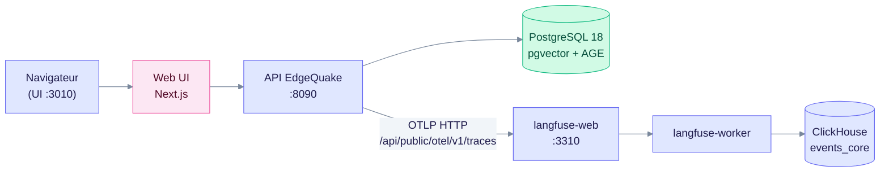
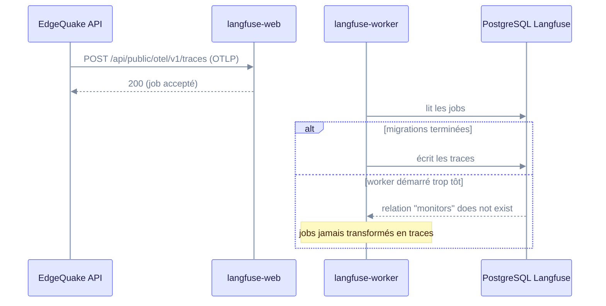
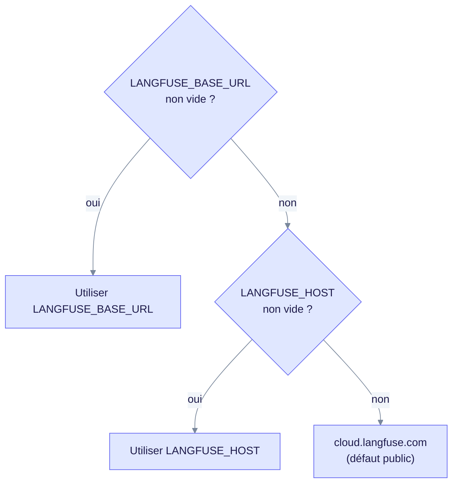

> Historical note, 2026-08-26 (produit v0.26.4); may not match current code.
> Prefer: [04-langfuse-kubernetes.md](04-langfuse-kubernetes.md) · [Deployment](../operations/deployment.md)
>
> État courant : le produit est en **v0.32.2** (fichier `VERSION`). Les commandes, cibles Make, ports et variables de ce runbook ont été revérifiés sur le code courant.

Ce runbook explique comment lancer EdgeQuake et Langfuse en local avec `make`, comment vérifier que les traces arrivent, et quels faux positifs ignorer. L'annexe couvre Langfuse sur Kubernetes, où les erreurs de configuration sont plus silencieuses. Il s'adresse aux développeurs et aux équipes d'exploitation.

## Démarrage

1. Lancer la stack complète avec Langfuse (clés locales injectées) :

```bash
make dev-bg-langfuse      # stack complète + Langfuse
make status               # état des services
make stop                 # arrêt
```

2. Ouvrir les services :

| Service | URL | Notes |
|---|---|---|
| Web UI | http://localhost:3010 | |
| API | http://localhost:8090 | Swagger : `/swagger-ui` |
| Langfuse | http://localhost:3310 | `dev@example.com` / `edgequake-local-dev` |
| PostgreSQL | conteneur `edgequake-postgres` | pg18 + pgvector + AGE |

Les ports par défaut (`DEFAULT_BACKEND_PORT ?= 8090`, `DEFAULT_FRONTEND_PORT ?= 3010`) viennent du `Makefile`. Si un port est occupé, `scripts/select_edgequake_port.py` choisit le premier port libre dans une fenêtre de 20 ports. La variable `EDGEQUAKE_PORT` du `.env` n'est pas utilisée par `make dev*`.



Les traces suivent le chemin OTLP vers `langfuse-web`, puis sont écrites par `langfuse-worker` dans ClickHouse.

## Points de vigilance découverts

### 1. Le Makefile lit le `.env` racine, pas `edgequake/.env`

Le `Makefile` inclut `-include $(ROOT_DIR)/.env`. Une configuration placée dans `edgequake/.env` est donc **ignorée** par `make dev*`. Mettez les variables attendues par `make dev*` dans le `.env` à la racine du dépôt.

### 2. `EDGEQUAKE_MODELS_CONFIG` doit être un chemin HÔTE

`/app/models.toml` est un chemin conteneur. En local, ce fichier n'existe pas : le binaire ne s'arrête pas et charge le catalogue embarqué à la compilation (`include_str!` dans `bundled_models.rs`). Vos modifications de `models.toml` restent alors sans effet.

Valeur correcte :

```bash
EDGEQUAKE_MODELS_CONFIG=/chemin/absolu/vers/edgequake/models.toml
```

### 3. Course au démarrage de Langfuse (migrations)

Au tout premier `langfuse-up`, le worker peut démarrer avant la fin des migrations PostgreSQL :

```
relation "monitors" does not exist · public.batch_actions does not exist
```

Les jobs OTLP sont alors acceptés (HTTP 200) mais jamais transformés en traces. Le 200 de l'API OTLP ne prouve donc pas l'écriture.



Le worker qui démarre trop tôt accepte les jobs sans rien écrire : seul le worker, une fois les migrations finies, produit les traces.

**Correctif :**

```bash
cd edgequake/docker && LANGFUSE_PORT=3310 NEXTAUTH_URL=http://localhost:3310 \
  docker compose -f docker-compose.langfuse.yml --project-name edgequake-langfuse \
  restart langfuse-web langfuse-worker
```

Vérifier ensuite (résultat attendu : `0`) :

```bash
docker logs edgequake-langfuse-langfuse-worker-1 2>&1 | grep -c "does not exist"
```

### 4. Deux faux positifs à ne PAS diagnostiquer comme des pannes

- **`HttpTraceClient.ResponseParseError: invalid wire type value: 6`** dans les logs du backend : cosmétique. Langfuse répond en JSON là où le client Rust attend du protobuf. La livraison réussit (HTTP 200).
- **`GET /api/public/traces` renvoie 0** : cette API est *legacy*. Langfuse v4 stocke les observations dans ClickHouse, table `events_core`. Utiliser l'UI ou cette requête :

```bash
docker exec edgequake-langfuse-clickhouse-1 clickhouse-client \
  --user clickhouse --password clickhouse \
  -q "SELECT name, count() FROM default.events_core GROUP BY name ORDER BY 2 DESC"
```

## Vérification du traçage

```bash
curl -s http://localhost:8090/api/v1/settings/langfuse | jq .export_active   # true
make langfuse-smoke                                                          # « ✓ Langfuse smoke passed »
```

`export_active` vaut `enabled && built` : il ne prouve **pas** que l'URL pointée est la bonne (voir l'annexe, piège n°1).

Spans attendus après une ingestion et une requête :

- Ingestion : `ingest.document`, `ingest.chunking`, `pipeline_chunk_extraction`, `extract-entities-glean`, `embed-chunks`
- Requête : `query_pipeline`, `query.embed`, `retrieval edgequake`, `query.fuse`, `query.rerank`, `generate-answer`

Les spans LLM portent `type=GENERATION`, le modèle et les tokens.

## Fournisseur LLM

État au 2026-08-26 (snapshot daté) : la clé **OpenAI du `.env` est invalide** (401 `invalid_api_key`, vérifié directement auprès d'OpenAI). Le `.env` racine est donc configuré sur **Mistral** (clé valide).

Sauvegardes : `.env.openai-original` et `.env.backup-<horodatage>`.

**Retour sur OpenAI** (après avoir généré une clé valide) :

```bash
cp .env.openai-original .env
# remplacer OPENAI_API_KEY par la nouvelle clé, puis corriger EDGEQUAKE_MODELS_CONFIG
make stop && make dev-bg-langfuse
```

⚠️ Changer de fournisseur d'embeddings change la **dimension** des vecteurs (mistral-embed 1024 ↔ text-embedding-3-small 1536). Sur un workspace contenant déjà des documents, prévoir `POST /api/v1/workspaces/{ws}/rebuild-embeddings`.

---

# Annexe — Langfuse en Kubernetes (pods séparés)

## Le piège n°1 : repli silencieux vers Langfuse Cloud

Fichier : `edgequake/crates/edgequake-observability/src/langfuse.rs` (constante `DEFAULT_LANGFUSE_BASE_URL`, ligne 10) :

```rust
pub const DEFAULT_LANGFUSE_BASE_URL: &str = "https://cloud.langfuse.com";
```

La résolution de l'URL suit cet ordre :



Une variable absente ou vide prend la branche suivante, sans erreur : c'est le premier point à vérifier.

Chaque variable est filtrée par `.filter(|v| !v.is_empty())` : une valeur **vide** équivaut à une valeur **absente**.

Conséquence en Kubernetes : si la variable est absente, vide, ou injectée depuis une clé de ConfigMap/Secret inexistante, EdgeQuake exporte vers **Langfuse Cloud** au lieu du pod interne, sans erreur visible.

L'activation ne dépend que des clés (`enabled = keys_ok`), sauf si `EDGEQUAKE_LANGFUSE_ENABLED` vaut `0`, `false` ou `off`. Donc `export_active: true` ne prouve **pas** que l'on pointe sur le bon Langfuse.

**Toujours vérifier `base_url`, pas seulement `export_active` :**

```bash
kubectl exec -n <ns> deploy/edgequake -- \
  curl -s localhost:8080/api/v1/settings/langfuse | jq '{base_url, export_active, public_key_configured, secret_key_configured}'
```

Si `base_url` vaut `https://cloud.langfuse.com`, la variable n'est pas injectée.

## Le piège n°2 : `localhost`

`LANGFUSE_BASE_URL=http://localhost:3310` fonctionne en local mais **jamais** entre pods : `localhost` désigne le pod EdgeQuake lui-même.

Valeur correcte (DNS de Service) :

```yaml
- name: LANGFUSE_BASE_URL
  value: "http://langfuse-web.<namespace>.svc.cluster.local:3000"
```

⚠️ Utiliser le port **du Service** (souvent 3000), pas 3310 (mapping hôte local uniquement). Pas de chemin ni de `/` final : le code ajoute `/api/public/otel/v1/traces`.

## Le piège n°3 : les clés ne sont pas transposables

Les clés locales (`pk-lf-edgequake-local` / `sk-lf-edgequake-local-dev`) proviennent du `LANGFUSE_INIT_*` headless du compose. Votre Langfuse Kubernetes a **ses propres** clés de projet : créez-les dans son UI, puis injectez-les via un Secret. Réutiliser les clés locales donne un **401 silencieux**.

## Le piège n°4 : les échecs d'export sont en DEBUG

Lors de nos observations, les erreurs d'export OTLP étaient journalisées au niveau **DEBUG**. Avec `RUST_LOG=info` (défaut production), un export qui échoue est **invisible**.

Pour diagnostiquer :

```bash
kubectl set env deploy/edgequake -n <ns> RUST_LOG=info,opentelemetry_otlp=debug,opentelemetry_sdk=debug
kubectl logs -n <ns> deploy/edgequake --tail=100 | grep -i otlp
```

Rappel : `ResponseParseError: invalid wire type value: 6` est **normal** (Langfuse répond en JSON, le client attend du protobuf), la livraison réussit malgré tout.

## Le piège n°5 : course aux migrations Langfuse

Observé sur ce poste : le pod worker démarre avant la fin des migrations PostgreSQL.

```
relation "monitors" does not exist · public.batch_actions does not exist
```

Les requêtes OTLP renvoient **200** mais aucune trace n'est créée. En Kubernetes, les pods démarrant en parallèle, le risque est plus élevé qu'en compose.

**Vérifier :**

```bash
kubectl logs -n <ns> deploy/langfuse-worker | grep -ci "does not exist"   # doit valoir 0
```

**Corriger :** `kubectl rollout restart deploy/langfuse-web deploy/langfuse-worker -n <ns>`

**Prévenir :** initContainer attendant la fin des migrations, ou `readinessProbe` sur le web avant démarrage du worker.

## Le piège n°6 : NetworkPolicy

Si des NetworkPolicies sont en place, autoriser explicitement l'egress EdgeQuake → langfuse-web sur le port du Service. Test :

```bash
kubectl exec -n <ns> deploy/edgequake -- \
  curl -s -o /dev/null -w '%{http_code}\n' http://langfuse-web.<ns>.svc.cluster.local:3000/api/public/health
```

Attendu : **200**.

## Procédure de diagnostic ordonnée

| # | Contrôle | Commande | Attendu |
|---|---|---|---|
| 1 | Variables injectées | `kubectl exec deploy/edgequake -- env \| grep LANGFUSE` | 3 variables non vides |
| 2 | Cible réelle | `curl .../api/v1/settings/langfuse \| jq .base_url` | l'URL **interne**, pas cloud.langfuse.com |
| 3 | Joignabilité | `curl <svc>/api/public/health` depuis le pod EdgeQuake | 200 |
| 4 | Auth des clés | `curl -u pk:sk <svc>/api/public/projects` | le projet attendu |
| 5 | Migrations worker | `kubectl logs deploy/langfuse-worker \| grep -c "does not exist"` | 0 |
| 6 | Ingestion réelle | requête ClickHouse `events_core` (cf. « Deux faux positifs », partie locale) | spans EdgeQuake présents |

Ne pas conclure sur `/api/public/traces` (API legacy, renvoie 0 en v4).
