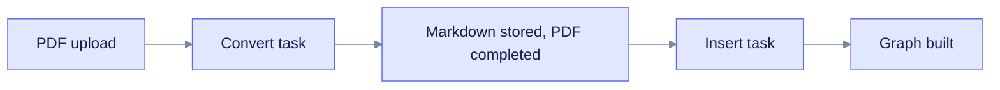
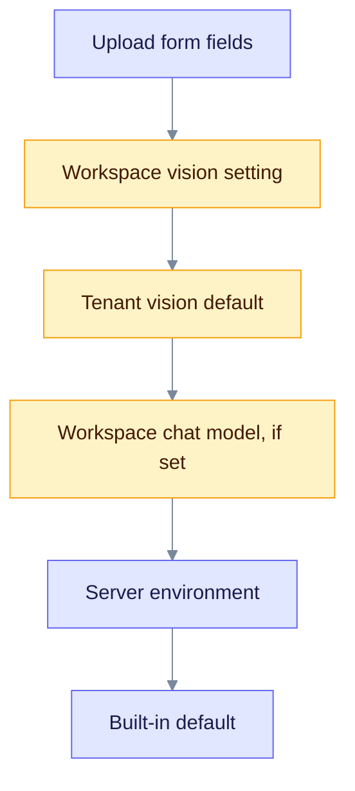

> **Released: v0.32.2** · Contract: [OpenAPI snapshot](../edgequake_webui/openapi/openapi.snapshot.json) · Ops: [Ingestion cancel and fairness](ingestion-cancel-and-fairness.md)

# Frequently Asked Questions

Short answers to the questions people ask most. Each answer links to a longer page when there is one. For a first install, start with [Getting Started](getting-started/index.md).

## General

### What is EdgeQuake?

EdgeQuake is a Graph-RAG framework written in Rust. It reads your documents, builds a knowledge graph of entities and relationships, and answers questions using that graph together with vector search and a language model. See [Graph-RAG](concepts/graph-rag.md).

### How is EdgeQuake different from vector-only RAG?

| Aspect | Vector-only RAG | EdgeQuake (Graph-RAG) |
|--------|-----------------|-----------------------|
| Retrieval | Semantic similarity | Similarity plus graph structure |
| Multi-hop questions | One retrieval step | Follows relationships between entities |
| Context | Separate chunks | Connected entities and relations |
| "What connects X to Y?" | Hard to answer | A native question type |

### What is the relationship to LightRAG?

EdgeQuake is a Rust implementation inspired by [LightRAG](https://github.com/HKUDS/LightRAG), a Python research project. It follows the same core algorithm. Differences:

- **Language:** Rust instead of Python. This page makes no speed multiplier claim; benchmark your own workload.
- **Production features:** multi-tenant isolation, auth, observability and deployment tooling.
- **Storage:** PostgreSQL with pgvector and Apache AGE.
- **API:** REST with asynchronous ingestion, streaming and WebSocket progress.
- **Modes:** EdgeQuake `hybrid` also includes the naive chunk arm, and `mix` blends arms by weight. See [Hybrid retrieval](concepts/hybrid-retrieval.md).

## Deployment

### What are the minimum requirements?

**Development:**

- 4 GB RAM and 2 CPU cores
- Rust 1.95 (pinned by the repository)
- PostgreSQL 16, 17 or 18 with pgvector and Apache AGE. The image is `ghcr.io/raphaelmansuy/edgequake-postgres:0.32.2`.

**Production (the minimum to boot):**

- 8 GB or more of RAM is enough to start the stack. It is not enough for the proven 50k or supported 100k filtered ANN shapes. See [Product limits: Pick your size](product-limits.md): at least 16 GB for up to 50k, 32 GB preferred for 100k Wave-2, and `shared_buffers` of at least 2 GB.
- 4 or more CPU cores
- A model provider (OpenAI, Ollama, or another; see [Providers](providers/index.md))
- A vision-capable model if you ingest PDFs with the default backend (see [Vision and PDF processing](#vision--pdf-processing))

**Ports:** Docker quickstart uses API 8080 and UI 3000. `make dev` uses API 8090 and UI 3010, and moves up if a port is taken.

### Can I run EdgeQuake without PostgreSQL?

No. `DATABASE_URL` is required in every server mode. In-memory storage has been removed, and the server exits at startup if it cannot reach a database.

### How do I start a stack?

```bash
make dev          # PostgreSQL, API and UI
make db-start     # PostgreSQL only, then run tests with cargo test
```

For a prebuilt stack, use the GHCR images:

```bash
EDGEQUAKE_VERSION=0.32.2 docker compose -f docker-compose.quickstart.yml up -d
```

The images are `ghcr.io/raphaelmansuy/edgequake:0.32.2`, `ghcr.io/raphaelmansuy/edgequake-frontend:0.32.2` and `ghcr.io/raphaelmansuy/edgequake-postgres:0.32.2` (PG18; use the `-pg16` or `-pg17` suffix for those versions).

### Who changes the database schema?

Only the `edgequake migrate` command. The API never migrates. `make dev`, `make migrate` and the Compose and Helm migrate steps all run it. If the schema is behind, the API exits (the default) or waits and answers `/ready` with 503 (`EDGEQUAKE_SCHEMA_GATE=wait`). See [Upgrading](operations/upgrading.md).

### Can I run EdgeQuake without a model provider?

Only for tests. The mock provider is used by `cargo test`. For real use you need a provider:

- OpenAI (`OPENAI_API_KEY`)
- Ollama or LM Studio (local, free)
- Anthropic, Mistral, Gemini, Vertex AI and others (see [Providers](providers/index.md))

### How do I add and test a provider?

Set the provider through environment variables, or in **Settings** in the UI. Provider connections stored in the database, `POST /api/v1/providers/test` and `edgequake doctor` are part of SPEC-163. They are on `main` and ship with v0.33.0; the v0.32.2 images do not have them. See [Providers](providers/index.md) and [Upgrade to v0.33.0](operations/upgrade-to-0.33.0.md).

## Cost

### How much does it cost to run EdgeQuake?

EdgeQuake is free and open source. Costs come from your infrastructure and your model provider.

| Component | Cost |
|-----------|------|
| EdgeQuake | Free |
| PostgreSQL | Free if self-hosted; managed services charge |
| Cloud model provider | Per token. Depends on the model, document size and settings |
| Ollama, LM Studio | Free to run on your own hardware |

This page gives no cost-per-document figure because it varies too much. Read `GET /api/v1/costs/summary` after you ingest a sample of your own data.

### How can I reduce model costs?

1. Use a cheaper model:

   ```bash
   EDGEQUAKE_DEFAULT_LLM_MODEL=gpt-5.4-mini
   ```

2. Use a local model:

   ```bash
   EDGEQUAKE_DEFAULT_LLM_PROVIDER=ollama
   EDGEQUAKE_DEFAULT_LLM_MODEL=gemma4:latest
   ```

3. Turn off gleaning (the second extraction pass) for an upload when recall matters less than cost.

### Is there a free tier for OpenAI?

OpenAI sometimes gives credits to new accounts. Check their site. See `.env.example` for the models the repository suggests.

## Performance

### How fast is EdgeQuake?

It depends mostly on your model and hardware, so there are no fixed timings on this page.

- **Upload:** the API accepts a document at once and returns HTTP 202 with a `track_id`. Indexing happens in the background. Poll `GET /api/v1/tasks/{track_id}`, or use WebSocket or SSE progress.
- **Extraction:** one model call per chunk (plus an optional second pass). This is usually the slowest step.
- **Query:** vector search and graph reads are quick next to the model call that writes the answer.

To measure your own setup, see the timing loop in the [Cookbook](cookbook.md#performance-recipe).

### How does it scale?

The source of truth is [Product limits](product-limits.md). Start with its TL;DR and **Pick your size**.

| Status | What you can promise | Recipe |
|--------|----------------------|--------|
| Proven | Up to 50k chunk vectors at 1536 dimensions under production stress; Louvain is gated at 50k nodes | Defaults, `shared_buffers` of at least 2 GB, host of at least 16 GB |
| Supported (default) | 100k filtered ANN at 1536 (Q1-d) | Wave-2: `halfvec` plus `EDGEQUAKE_HNSW_PARTIAL_BY_WORKSPACE=1` plus residency; host of 32 GB preferred |
| Supported, opt-in | 150k on dedicated DiskANN | `query_search_list_size` of at least 400 and `query_rescore` near list/2 (pg18-vectorscale); not a silent default |
| Not promoted | Wave-2 above 100k (250k and up) | Mid-scale wall; do not promise it |
| Aspirational | 100k+ documents or 1M+ entities per workspace | Not a latency-gated claim |

Hard caps: 50 MiB per upload (`EDGEQUAKE_MAX_UPLOAD_BYTES`), and HNSW dimension at most 2000 (`vector`) or 4000 (`halfvec`). For concurrent load at 100k Wave-2, a useful tip is `EDGEQUAKE_HNSW_EF_SEARCH=240`. Mix and hybrid seeds are far smaller than the ANN ladder.

There is no storage-GB quota per workspace. A workspace `max_documents`, when set, is enforced at upload and when a new PDF is created (SPEC-066). Size disk and RAM from [Product limits](product-limits.md). The ceiling ladder is `make ceiling-proof` ([SPEC-066](../specs/066-ceiling-proof/000-index.md)).

For several worker replicas, see [Ingestion, replicas and leases](#ingestion-cancel-fairness-replicas--convert--ingest).

### How can I speed up queries?

**Data plane (often the real cliff before the model):**

1. **Use Wave-2 for about 100k filtered ANN.** Set `EDGEQUAKE_HNSW_PARTIAL_BY_WORKSPACE=1` on a new database only. `halfvec` is already the default storage mode. See [Product limits](product-limits.md).
2. **Keep the data resident.** Keep `shared_buffers` at 2 GB or more (4 GB for large labs). Without it, a cold query at 100k on the default path takes about 1.5 s.
3. **Warm a filtered query after each deploy** so the partial HNSW index exists. Use `./scripts/wave2_warmup.sh` or `POST /api/v1/admin/ann/warmup`.
4. **Fix filtered recall underfill.** EdgeQuake sets `hnsw.iterative_scan=relaxed_order` and `max_scan_tuples` on filtered queries only. Tune `EDGEQUAKE_HNSW_MAX_SCAN_TUPLES` and `EDGEQUAKE_HNSW_SCAN_MEM_MULTIPLIER` if needed ([SPEC-075](../specs/075-filtered-recall-gates/000-index.md)). Judge changes by filtered recall@20 (`make filtered-recall-gate`), never by unfiltered results alone.

**Query and model:**

5. Use `naive` mode for simple lookups (vector only, no graph).
6. Lower `max_results` in the query request (try 5 to 10).
7. Use a faster model.
8. Use a GPU for local embeddings.

### How do I enable the supported 100k shape?

Use the turnkey greenfield recipe in [Product limits](product-limits.md):

```bash
eval "$(make -s wave2-greenfield-env)"
# or: WAVE2_GREENFIELD=1 make backend-bg
./scripts/wave2_warmup.sh <workspace_uuid>
```

That sets the workspace partial HNSW index (`halfvec` is the default storage mode), and optionally `EDGEQUAKE_HNSW_EF_SEARCH=240` (a concurrency tip, not a default). Do not silently flip an existing vector database. A dedicated `*_ws_*` table with HNSW only isolates dimensions; it is not the 100k concurrent path.

### Which vector-tuning options are opt-in, and which gate each one?

Each row below is a separate, opt-in path. Wave-2 stays the default. Judge changes by filtered recall@20, not by unfiltered results alone. Details and current floors are in [Product limits](product-limits.md).

| Need | Setting or command | Status |
|------|--------------------|--------|
| About 100k filtered ANN | Wave-2 recipe above | Supported (default) |
| 150k to 250k dense ANN | Dedicated DiskANN on `pg18-vectorscale`: `query_search_list_size` of at least 400 at 150k (800 at 250k), `query_rescore` near half of that. Gates: `make diskann-recall-pareto`, `make diskann-rescore-smoke` | Supported, opt-in; not a silent default |
| Filtered recall check | `make filtered-recall-gate` (SPEC-075) | Gate; does not raise the 100k floor |
| Ranking precision | `EDGEQUAKE_ANN_EXACT_REORDER=1` (with `EDGEQUAKE_ANN_REORDER_CANDIDATE_K`, default 50); `EDGEQUAKE_SPARSE_FUSION=rrf` for codes and names. Gate: `make precision-layers-gate` (SPEC-076) | Opt-in; does not raise floors |
| Small workspaces | Exact search at or below `EDGEQUAKE_ANN_EXACT_MAX_ROWS` (default 2000); gate `make tiny-slice-exact-gate` (SPEC-080) | Default behaviour |
| Binary quantization | `EDGEQUAKE_BINARY_QUANTIZE` (off); study `make binary-quantize-bakeoff` (SPEC-077) | Study only |
| Filtered-DiskANN labels | `EDGEQUAKE_FILTERED_DISKANN_LABELS` (off); study `make filtered-diskann-labels-bakeoff` (SPEC-078) | Study only; no product labels migration |
| Chunks that have vectors | `eq_serving_chunk_presence` and `eq_serving_vector_presence` views; gate `make serving-view-check` (SPEC-081) | Admin and debug only; not the RAG ANN path |
| Larger ladder | `make push-scale-ladder` (SPEC-082) | Archives 150k and 250k; floors rise only when the full gate is green |

A dedicated table with HNSW only isolates dimensions and does not give the 100k concurrent path. Mid-scale quantize and label archives (`make midscale-quantize-labels`, SPEC-079) stay Not promoted unless a full concurrent gate says otherwise.

## Multi-tenancy

### Is EdgeQuake multi-tenant?

Yes. A tenant holds workspaces, and each workspace is isolated:

- Separate document collections and knowledge graphs
- Per-workspace model configuration
- Row-level security in PostgreSQL enforces the scope (since v0.32.0)

Send `X-Tenant-ID` and `X-Workspace-ID` on protected routes, or use JWT claims when auth is on. See [Knowledge graph](concepts/knowledge-graph.md#tenants-and-workspaces) and the [multi-tenant tutorial](tutorials/multi-tenant.md).

### Can different tenants use different models?

Yes. The provider and model are set per workspace through the API, or fall back to the server defaults.

## Security

### Is my data encrypted?

| Level | Status |
|-------|--------|
| At rest | Depends on your PostgreSQL setup |
| In transit | Use HTTPS in front of the API |
| Stored provider API keys | Encrypted with AES-256-GCM using `EDGEQUAKE_SECRETS_KEY` (SPEC-163, v0.33.0); shown masked and write-only |

### Does EdgeQuake send data to outside services?

Only to the model providers you configure. Cloud providers receive document chunks for extraction and vision. Ollama and other local servers keep data on your network. OpenTelemetry export is off unless you set `OTEL_EXPORTER_OTLP_ENDPOINT` or `EDGEQUAKE_OTEL_ENABLED`.

### How do I secure the API?

Auth is on by default (SPEC-027). Protected routes need a JWT (`Authorization: Bearer ...`) or an API key (`X-API-Key`).

| Mode | When | Setup |
|------|------|-------|
| Production | Deployed stacks | Auth on (default). Set `JWT_SECRET`, bootstrap the admin, and set `NEXT_PUBLIC_DISABLE_DEMO_LOGIN=true` on the UI |
| Local dev | `make dev`, Docker quickstart | `EDGEQUAKE_DEV_MODE=true` |

Bootstrap the first admin before the first login:

```bash
export EDGEQUAKE_BOOTSTRAP_ADMIN_USERNAME=admin
export EDGEQUAKE_BOOTSTRAP_ADMIN_PASSWORD='choose-a-strong-password'
export EDGEQUAKE_BOOTSTRAP_ADMIN_EMAIL=admin@example.com
```

Or create a user with the master API key (`EDGEQUAKE_MASTER_API_KEY`). The full checklist is [Runtime auth hardening](operations/runtime-auth-hardening.md).

Extra layers for production:

1. A reverse proxy (nginx or Caddy) with TLS.
2. Network isolation, such as a private subnet.
3. Enterprise SSO through built-in OIDC with Keycloak. See [Authentication and SSO](security/authentication/index.md). An external proxy such as [oauth2-proxy](https://github.com/oauth2-proxy/oauth2-proxy) in front of the API is also supported.

Turning auth off (`EDGEQUAKE_AUTH_ENABLED=false` or `EDGEQUAKE_AUTH_DISABLED=true`) is for local development only. Run `edgequake doctor` to check the database, LLM provider, secrets key, JWT secret and bind address.

## Ingestion: cancel, fairness, replicas & convert → ingest

Details are in [Ingestion cancel and fairness](ingestion-cancel-and-fairness.md). A summary follows.

### How do I cancel an upload or ingestion?

```http
POST /api/v1/tasks/{track_id}/cancel
```

Other cancel routes: `DELETE /api/v2/workspaces/{id}/jobs/{job_id}`, the PDF cancel route (`DELETE /api/v1/documents/pdf/{pdf_id}/cancel`), a pipeline-wide cancel, and a WebSocket message `{ "type": "cancel", "track_id": "..." }`.

Cancel is cooperative. Expect a short delay while the current model call stops. The UI shows "Stopping" until the document reaches `display_status=cancelled`.

### What is tenant fairness? Why is my second upload waiting?

Workers limit concurrency per tenant and per lane:

- **Ingest lane** (`MAX_TASKS_PER_TENANT`): PDF convert and Insert tasks. Local providers (Ollama, LM Studio, oMLX and similar) clamp this to 1 task per tenant, with at most 4 workers, unless `EDGEQUAKE_ALLOW_LOCAL_HIGH_CONCURRENCY=1`.
- **Lifecycle lane** (`MAX_LIFECYCLE_TASKS_PER_TENANT`, local default 4): deletes and wipes. It is separate so deletes do not block new uploads.

Waiting tasks park on their lane's semaphore. They are not requeued in a loop. Check `GET /api/v1/pipeline/queue-metrics` for `tenant_park_waiters`, `tenant_park_waiters_ingest`, `tenant_park_waiters_lifecycle`, `max_tasks_per_tenant` and `max_lifecycle_tasks_per_tenant`.

### Why do bulk uploads feel excessively slow? (SPEC-122 / #361 / #365)

**Admit does not mean searchable.** HTTP 202 only means the file is queued. A document is searchable when its Insert task finishes. A PDF also pays a convert step first.

Throughput is the smallest of: workers, tasks per tenant, the provider budget, vision jobs, extraction fan-out, and embedding concurrency. It is not the number of files you picked. The UI sends up to 3 files in parallel, but under a local provider they do not finish ingest in parallel.

| Profile | Typical ingest lane | Notes |
|---------|---------------------|-------|
| Local Ollama (`make dev`, Docker quickstart default) | 1 task per tenant; extract, embed and vision 1 | Intentionally near-serial, to protect VRAM and `OLLAMA_NUM_PARALLEL` |
| Cloud provider with `make dev` | 12 tasks per tenant, extract up to 32 | Still bounded by chunks times round-trip time |
| Other setups | Workers default to 4 per CPU (minimum 4); tasks per tenant to three quarters of workers | Override with `WORKER_THREADS` and `MAX_TASKS_PER_TENANT` |

Historical measurement (v0.24.3, small text fixtures, N=5, not repeated since): local Ollama about 5 docs/min with one task per tenant; Mistral with 6 tasks per tenant about 6.7 docs/min. A one-page PDF took about 11.5 s to convert alone. Treat these as examples, not promises. The full pack is in [`specs/122-implementation/`](../specs/122-implementation/). Tuning: [Performance tuning](operations/performance-tuning.md).

### What are claim and lease semantics on restart?

Task rows in Postgres are the source of truth. A worker claims a task with `FOR UPDATE SKIP LOCKED` and holds a lease. The lease TTL is `EDGEQUAKE_TASK_LEASE_TTL_SECS` (default 120 s, minimum 30 s). The worker renews it every third of the TTL (about 40 s by default, with a 5 s floor).

| Status at boot | Default (`EDGEQUAKE_STARTUP_AUTO_RESUME` unset or on) | With `EDGEQUAKE_STARTUP_AUTO_RESUME=0` |
|----------------|-------|------|
| Pending | Claimable | Claimable |
| Processing (stale) | Back to Pending, reclaimable | Failed with `failure_code=server_restart_interrupted`; use Reprocess |
| Cancelled | Never claimed | Never claimed |

### Can I run several API or worker replicas?

Yes. Set `EDGEQUAKE_REPLICAS` to the process count. When it is above 1, `EDGEQUAKE_TASK_DELIVERY=local` fails at boot; use `bridged` or `notify_only`. Correctness always comes from `claim_next` plus the lease. Delivery modes only wake workers. Monitor `GET /api/v1/pipeline/queue-metrics` (`store_contention`, `cancel_intent_count`).

### Why does the Documents page say "Read path busy"?

The documents list, document search, tenant list and workspace list share a short deadline (`EDGEQUAKE_DOCUMENTS_READ_TIMEOUT_MS`, default 2500 ms) and a small database permit. HTTP 503 `read_path_busy` means the budget ran out (`work_deadline`, `permit_wait` or `permit_closed`). Retry after a short wait. Workspace list requests with `?include_stats=true` (`GET /api/v1/tenants/{tenant_id}/workspaces`) are cache-only: on a cache miss they return `stats: null` rather than computing stats inside the deadline. See [Common issues, section 10](troubleshooting/common-issues.md#10-documents-page-read-path-busy).

### Why does PDF processing have two phases?



Read the chart from the left. Admission queues only the convert task. After Markdown is stored and the PDF row is `Completed`, a separate Insert task builds the graph, with its own lease, timeout and fairness permit.

Cancelling the convert task, or an in-flight ingest, cancels both linked tasks for the same `pdf_id`. If you cancel ingest after convert has finished, the PDF stays `Completed` and its Markdown is kept.

## Features

### What is decision extraction?

A preview knowledge-graph mode (SPEC-160, since v0.31.0). A small local model answers closed questions, and accepted answers enter the same graph as normal extraction. The chat-model extractor stays the default. Set the mode on a workspace or one upload, with Ollama running and a Tev1 model pulled. See [Decision extraction](concepts/decision-extraction.md).

### What document formats are supported?

| Format | Support | Notes |
|--------|---------|-------|
| Plain text (`.txt`) | Full | UI and API |
| Markdown (`.md`) | Full | UI and API |
| JSON (`.json`) | Full | UI and API (text path) |
| PDF (`.pdf`) | Full | UI and `POST /api/v1/documents/pdf`. The default backend needs a vision model; `edgeparse` does not |
| Images (PNG, JPG, GIF, WEBP) | Full | UI and multipart upload; needs a vision model |
| CSV, HTML, XML, YAML | API only | Accepted by `POST /api/v1/documents/upload`; not in the UI dropzone |
| DOCX (Word) | Not supported | Export to PDF or Markdown. See the SPEC-121 study |
| Excel (XLSX, XLS) | Not supported | Export to CSV, PDF or Markdown. See SPEC-121 |

The product matrix is in [specs/121-pdf-docx](../specs/121-pdf-docx/README.md) (GitHub [#370](https://github.com/raphaelmansuy/edgequake/issues/370)).

### PDF uploads work for JSON but fail in Docker. What do I check?

JSON uses a small `POST /api/v1/documents` body. A PDF uses multipart `POST /api/v1/documents/pdf` plus pdfium and, by default, a vision model. When JSON works and PDF does not:

1. **Use the PDF endpoint.** `POST /documents/upload` with a `.pdf` returns 400, because it accepts text and images only.
2. **Match the proxy body size** to `EDGEQUAKE_MAX_UPLOAD_BYTES` (default 50 MiB). A proxy limit below that gives 413 on PDFs while small JSON still works.
3. **Make the pdfium cache writable.** Compose sets `PDFIUM_AUTO_CACHE_DIR=/tmp/edgequake-pdfium-cache`. Confirm the runtime user can write there.
4. **Reach the vision provider from the container.** For example `OLLAMA_HOST=http://host.docker.internal:11434`. If vision is down, admit succeeds and then the status stays on Converting or ends in `PDF_CONVERSION_FAILED`. That is a convert failure, not an unsupported format.
5. **Send a workspace ID.** Send `X-Workspace-ID` with PDF requests. If the header is absent, the default workspace is used.

See the [upload quick reference](api-reference/document-upload-quick-reference.md) and the SPEC-121 [system lens](../specs/121-pdf-docx/05-lenses/007-system-engineer.md).

### What model providers are supported?

| Provider | Notes |
|----------|-------|
| OpenAI | Chat and embeddings (`OPENAI_API_KEY`) |
| Anthropic | Claude models (`ANTHROPIC_API_KEY`) |
| Ollama | Local; default model `gemma4:latest` |
| LM Studio | OpenAI-compatible local server |
| oMLX, MLX-LM, vLLM-MLX, llama.cpp | Local servers; see [Providers](providers/index.md) |
| Any OpenAI-compatible server | Set a base URL |
| Mistral, Gemini, Vertex AI, OpenRouter, xAI and others | In the catalog `edgequake/models.toml`; each reads its key from the variable named in the catalog |

Azure is in the catalog but disabled. Vertex AI uses GCP identity, not an API key. Details: [Providers](providers/index.md).

### What query modes are available?

| Mode | Use case |
|------|----------|
| `naive` | Vector search on chunks |
| `local` | Questions about one entity |
| `global` | Relationship-centric, thematic search |
| `hybrid` | Local, global and naive, interleaved |
| `mix` (default) | Weighted blend of all three arms |
| `bypass` | Model only, no retrieval (debug) |

## Troubleshooting

### Why are my queries returning empty?

1. Check that documents exist and are indexed:

   ```bash
   curl -s http://localhost:8080/api/v1/documents | jq '{total, status_counts}'
   ```

2. Check that entities were extracted:

   ```bash
   curl -s http://localhost:8080/api/v1/graph/entities | jq '.total'
   ```

3. Try `naive` mode:

   ```json
   { "query": "test", "mode": "naive" }
   ```

When auth is on, add `-H "Authorization: Bearer $TOKEN"` or `-H "X-API-Key: $KEY"`. Use port 8090 with `make dev`. More help: [Troubleshooting guide](troubleshooting/common-issues.md).

### Why is document processing stuck?

1. Check that the model provider is running (`ollama list` for Ollama).
2. Check that the API key is valid.
3. Poll the task: `GET /api/v1/tasks/{track_id}`. Look at `status` and `error_message`.
4. Check the queue: `GET /api/v1/pipeline/queue-metrics`.
5. Read the logs. With `make dev-bg` they are in `/tmp/edgequake-backend.log`; with Docker use `docker compose logs api`.

### How do I check that EdgeQuake is healthy?

```bash
curl -s http://localhost:8080/health   # status, version, components, no auth
curl -s http://localhost:8080/ready    # 200 when it can serve traffic; 503 with a reason otherwise
curl -s http://localhost:8080/live     # plain liveness probe
```

`/health` returns `healthy` or `degraded`, plus component state (`kv_storage`, `vector_storage`, `graph_storage`, `llm_provider`). `/ready` also checks the schema, storage and queue pressure.

### The API exits or `/ready` returns 503 after an upgrade. Why?

The schema is behind the binary. Run `edgequake migrate` (or `make migrate`, or the Compose and Helm migrate step). See [Upgrading](operations/upgrading.md).

## Comparison

### EdgeQuake vs LightRAG (Python)

| Aspect | LightRAG | EdgeQuake |
|--------|----------|-----------|
| Language | Python | Rust |
| Multi-tenant | No | Yes |
| Focus | Research | Production features |
| Algorithm | Original | Same core idea, with `hybrid` including the naive arm and `mix` using weighted fusion |

No speed multiplier is claimed here. See [vs LightRAG](comparisons/vs-lightrag-python.md).

### EdgeQuake vs Microsoft GraphRAG

| Aspect | GraphRAG | EdgeQuake |
|--------|----------|-----------|
| Approach | Hierarchical community reports | Flat entity graph, optional extractive community text |
| Queries | Global summaries | Six modes |
| Use case | Large corpora | General purpose |

See [vs GraphRAG](comparisons/vs-graphrag.md).

### EdgeQuake vs Pinecone or Weaviate

| Aspect | Vector databases | EdgeQuake |
|--------|------------------|-----------|
| Type | Storage only | Full RAG stack |
| Retrieval | Vector similarity | Vector and graph |
| Extraction | Not included | Built in |
| Multi-hop | No | Yes |

## Contributing

### How can I contribute?

1. Fork the repository.
2. Create a feature branch.
3. Follow [AGENTS.md](https://github.com/raphaelmansuy/edgequake/blob/edgequake-main/AGENTS.md).
4. Run `cargo fmt`, `cargo clippy` and `cargo test`.
5. Open a pull request.

### What is the development workflow?

```bash
git clone https://github.com/your-fork/edgequake
cd edgequake
make dev
cd edgequake && cargo test && cargo clippy --workspace --all-targets && cargo fmt --check
```

## Vision & PDF Processing

### Why does my PDF fail with "Vision extraction timed out" or "Circuit breaker tripped"?

Almost always the vision model does not match the vision provider. For example, `EDGEQUAKE_VISION_MODEL=gpt-4.1-nano` with `EDGEQUAKE_VISION_PROVIDER=ollama` fails, because Ollama cannot serve OpenAI models.

Diagnose with the effective-config endpoint:

```bash
curl -s http://localhost:8080/api/v1/config/effective | jq '.vision'
```

If `has_mismatch` is `true`, `mismatch_description` says which setting is wrong. Then fix it in one of three ways:

| Option | Action |
|--------|--------|
| A | Unset the mismatched variable so the default applies: `unset EDGEQUAKE_VISION_MODEL` |
| B | Change the provider to match the model: `EDGEQUAKE_VISION_PROVIDER=openai` |
| C | Change the model to match the provider: `EDGEQUAKE_VISION_MODEL=gemma4:latest` |

Restart the backend afterwards.

### How does EdgeQuake choose the vision provider and model?

It uses the first level that has a value. Incompatible provider and model pairs are skipped with a warning.



Read the chart from the top. The first level that has a value wins.

1. `vision_provider` and `vision_model` on the upload.
2. The workspace vision provider and model (or its `vlm` role).
3. The tenant default vision provider and model.
4. The workspace chat provider and model, when you set them deliberately.
5. Server environment: `EDGEQUAKE_VISION_PROVIDER` and `EDGEQUAKE_VISION_MODEL`, then `EDGEQUAKE_VISION_LLM_*`, then `EDGEQUAKE_DEFAULT_LLM_*`, then `EDGEQUAKE_LLM_*`.
6. The built-in default. It uses the `ollama` provider when nothing else is set.

### Can I use a different model for vision than for text extraction?

Yes. Set the vision variables:

```bash
EDGEQUAKE_DEFAULT_LLM_PROVIDER=ollama
EDGEQUAKE_DEFAULT_LLM_MODEL=gemma4:latest

EDGEQUAKE_VISION_PROVIDER=openai
EDGEQUAKE_VISION_MODEL=gpt-4.1-mini
OPENAI_API_KEY=sk-...
```

### Where can I see the active configuration in the UI?

Open **Settings** and look for the configuration explainability panel. The same data is at `GET /api/v1/config/effective`.

## See also

- [Getting Started](getting-started/installation.md)
- [Runtime auth hardening](operations/runtime-auth-hardening.md)
- [Ingestion cancel and fairness](ingestion-cancel-and-fairness.md)
- [Architecture overview](architecture/overview.md)
- [API reference](api-reference/rest-api.md)
- [Troubleshooting](troubleshooting/common-issues.md)
