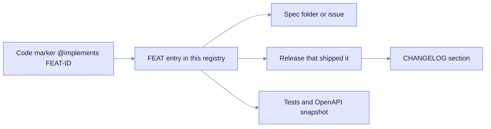

> **Product: v0.32.2** · Contract: [`openapi.snapshot.json`](../edgequake_webui/openapi/openapi.snapshot.json) · Spec ops: [Ingestion cancel & fairness](ingestion-cancel-and-fairness.md)

# EdgeQuake Feature Registry

This registry links each FEAT ID to its code marker, spec, and the release that shipped it. Entries range from v0.8.0 to the unreleased SPEC-160 preview, and the release map below covers v0.11 to v0.23. Newer releases are described in [What's new](whats-new.md) and [CHANGELOG](../CHANGELOG.md).

A FEAT ID is the stable key. Code carries an `@implements FEAT-…` marker, the spec explains the design, and the release table records when it shipped.

Read the chart from the left: the code marker and this registry share one FEAT ID, so searching for it finds both.

## Index

| Feature ID | Description                                        | Status    | Spec / Release                                                              |
| ------------| ----------------------------------------------------| -----------| -----------------------------------------------------------------------------|
| FEAT-0001  | Tenant Workspace Quota Management                  | Completed | SPEC-0001 / #133                                                            |
| FEAT-0002  | Knowledge Injection (Glossaries & Synonyms)        | Completed | [SPEC-0002](../specifications/0002_knowledge_injection_issue_131/) / v0.8.0 |
| FEAT-0003  | Explainability & Model Picker (config chain)       | Completed | [SPEC-043](../specs/043-update-edgequake-llm/000-index.md) / v0.17.0        |
| FEAT-0004  | Graph Edge Labels                                  | Planned   | SPEC-0004 / #91                                                             |
| FEAT-0005  | Custom Entity Configuration                        | Completed | [SPEC-0005](../specifications/0005_custom_entity_config_issue_85/) / v0.8.0 |
| FEAT-006   | Unified Streaming Response Protocol                | Completed | SPEC-006 / #56                                                              |
| FEAT-007   | Vector Storage SQL Pre-Filtering                   | Completed | SPEC-007                                                                    |
| FEAT-008   | Explicit Provider/Model Transparency in UI         | Completed | MISSION-01 / v0.9.19                                                        |
| FEAT-009   | Document Deletion Correctness                      | Completed | MISSION-02 / v0.9.19                                                        |
| FEAT-010   | Configurable PDF Parser Backend (Vision/EdgeParse) | Completed | MISSION-03 / v0.10.0                                                        |
| FEAT-011   | Vision PDF Ingest & Side-by-Side Viewer            | Completed | [SPEC-047](../specs/047-rag-evaluation/000-index.md) / v0.17.0              |
| FEAT-012   | Real-Time Pipeline Progress (WS bridge)            | Completed | [SPEC-048](../specs/048-improve-ux/000-index.md) / v0.17.0                  |
| FEAT-013   | Deletion & Reprocess Progress Parity               | Completed | [SPEC-050](../specs/050-pipeline-and-delete/README.md) / v0.17.0            |
| FEAT-014   | GraphRAG / Hybrid RAG Ops & ACC Science            | Completed | [SPEC-046](../specs/046-graphrag-study/00-INDEX.md) / v0.16.0               |
| FEAT-015   | OpenAPI-Native API Explorer                        | Completed | [SPEC-035](../specs/035-api-explorer/) / v0.15.x                            |
| FEAT-016   | Mistral First-Class Provider                       | Completed | v0.11.0                                                                     |
| FEAT-017   | Embedding Progress Reporting                       | Completed | #197 / v0.11.3                                                              |
| FEAT-018   | Runtime Auth Secure by Default                     | Completed | SPEC-027 / v0.13.x                                                          |
| FEAT-019   | Documents List & Mix-Scale Perf Gates              | Completed | [SPEC-054](../specs/054-fix-bugs-17/) / v0.18.0                             |
| FEAT-020   | Claim/Lease Delivery & Convert→Ingest SSOT         | Completed | [SPEC-057](../specs/057-pipeline-reliability/000-index.md) / v0.19.0        |
| FEAT-035   | OpenAPI Explorer (WebUI implementation)            | Completed | [SPEC-035](../specs/035-api-explorer/) — code marker                        |
| FEAT-094   | Standalone PDF→Markdown Parse API                  | Completed | [SPEC-094](../specs/94-api-markdown/00-spec.md) / v0.23.0                   |
| FEAT-096   | Multi-Language Extraction (workspace-scoped)       | Completed | [SPEC-096](../specs/096-multi-language-extraction/) / v0.23.0               |
| FEAT-101   | Wizard Onboarding & Setup API                      | Completed | [SPEC-101](../specs/101-wizard-mode-tenant-workspace/) / v0.23.0            |
| FEAT-102   | Custom Entity Type Colors (workspace graph)        | Completed | [SPEC-102](../specs/102-custom-entity-type-colors/) / v0.23.0               |
| FEAT-103   | LightRAG-Parity LLM Cache                          | Completed | [SPEC-103](../specs/103-llm-cache/) / v0.23.0                               |
| FEAT-126   | Provider KV / Prompt Cache                         | Completed | [SPEC-126](../specs/126-provider-kv-cache/)                                 |
| FEAT-160   | Decision extraction (closed questions, preview)    | Preview   | [SPEC-160](../specs/160-tev1/) / unreleased                                 |

---

## Feature Definitions

### FEAT-0002 — Knowledge Injection

**Issue**: [#131](https://github.com/raphaelmansuy/edgequake/issues/131)  
**Spec**: [specifications/0002_knowledge_injection_issue_131](../specifications/0002_knowledge_injection_issue_131/)  
**Released**: v0.8.0 (2026-04-03)  
**Status**: ✅ Completed

**Problem**: Domain-specific acronyms (OEE, NLP) and synonyms are unknown to the embedding model. Queries for "OEE" miss documents that say "Overall Equipment Effectiveness", degrading retrieval quality.

**Solution**: Workspace owners inject glossary definitions as named entries. These are processed through the standard entity-extraction pipeline, enriching the knowledge graph. At query time, injection entities expand the query terms. Injection entries are **never shown as source citations**.

**API Surface**:
- `PUT /api/v1/workspaces/:id/injection` — create/replace text injection
- `PUT /api/v1/workspaces/:id/injection/file` — upload file injection
- `GET /api/v1/workspaces/:id/injections` — list all entries
- `GET /api/v1/workspaces/:id/injections/:injection_id` — get detail (**plural** path)
- `PATCH /api/v1/workspaces/:id/injections/:injection_id` — update name/content
- `DELETE /api/v1/workspaces/:id/injections/:injection_id` — delete + cascade cleanup

**UI**: `/knowledge` page with list, add dialog (text/file tabs), detail page, inline edit, delete confirmation.

---

### FEAT-0003 — Explainability & Model Picker (SPEC-043)

**Spec**: [specs/043-update-edgequake-llm](../specs/043-update-edgequake-llm/000-index.md)  
**Released**: v0.17.0 (2026-07-14)  
**Status**: ✅ Completed (was Planned under legacy SPEC-0003)

**Capabilities**:
- Unified `ModelPickerPanel` across workspace, query, and settings
- Server-side model search: `GET /api/v1/models/search`
- Provider Status Hub with `auth_kind` and remediation hints
- Config explainability panel — effective provider/model resolution chain
- Application attribution API for downstream LLM request labeling
- Bundled `models.toml` with runtime override paths

**API Surface**: `/api/v1/models/search`, `/api/v1/settings/*`, `/api/v1/config/effective`

---

### FEAT-0005 — Custom Entity Configuration

**Issue**: [#85](https://github.com/raphaelmansuy/edgequake/issues/85)  
**Spec**: [specifications/0005_custom_entity_config_issue_85](../specifications/0005_custom_entity_config_issue_85/)  
**Released**: v0.8.0 (2026-04-03)  
**Status**: ✅ Completed

Workspace-scoped `entity_types` with preset-driven and custom configuration, normalized and injected into extraction prompts per workspace.

---

### FEAT-010 — Configurable PDF Parser Backend

**Released**: v0.10.0 (2026-04-11)  
**Status**: ✅ Completed

Runtime PDF extraction backends: `vision` (VLM), `edgeparse` (CPU), `edgeparse-ocr` (EdgeParse + Tesseract), and `auto`. Resolution: per-upload → workspace default → `EDGEQUAKE_PDF_PARSER_BACKEND` env → `vision`.

---

### FEAT-011 — Vision PDF Ingest (SPEC-047)

**Spec**: [specs/047-rag-evaluation](../specs/047-rag-evaluation/000-index.md)  
**Released**: v0.17.0  
**Status**: ✅ Completed

- PDF → Markdown via vision LLM (page-level rendering)
- Per-page progress via WebSocket `/ws/progress/{track_id}`
- Side-by-side PDF + Markdown viewer
- Visual asset extraction (`document_mm_assets`, migrations 084/085)

---

### FEAT-012 — Real-Time Pipeline Progress (SPEC-048)

**Spec**: [specs/048-improve-ux](../specs/048-improve-ux/000-index.md)  
**Released**: v0.17.0  
**Status**: ✅ Completed

- `spawn_pipeline_ws_bridge` forwards pipeline events to WS/SSE clients
- Pipeline status dialog with per-stage timing
- `track_id` correlation upload → pipeline → completion
- Progress endpoint: `/ws/progress/{track_id}` (**not** legacy `/rag/*`)

---

### FEAT-013 — Deletion & Reprocess Progress (SPEC-050)

**Spec**: [specs/050-pipeline-and-delete](../specs/050-pipeline-and-delete/README.md)  
**Released**: v0.17.0  
**Status**: ✅ Completed

- Delete document shows stage-by-stage progress (graph / vector / KV cleanup)
- Reprocess parity with structured progress feedback
- All pipeline stages surfaced with human-readable labels

---

### FEAT-014 — GraphRAG / Hybrid RAG Ops (SPEC-046)

**Spec**: [specs/046-graphrag-study](../specs/046-graphrag-study/00-INDEX.md)  
**Released**: v0.16.0  
**Status**: ✅ Completed

Fail-closed HNSW readiness, PPR-default graph walks, bipartite dual-node retrieval, ACC CI gate, ops runbooks.

---

### FEAT-018 — Runtime Auth Secure by Default

**Released**: v0.13.x (SPEC-027 hardening)  
**Status**: ✅ Completed

- `auth_enabled: true` by default when unset
- `EDGEQUAKE_DEV_MODE=true` opt-out for local `make dev`
- Fail-closed middleware on versioned API when auth enabled
- WebSocket auth rejects missing token when auth enabled

---

### FEAT-019 — Storage/Query Performance Gates (SPEC-054)

**Spec**: [specs/054-fix-bugs-17](../specs/054-fix-bugs-17/)  
**Released**: v0.18.0  
**Status**: ✅ Completed

Documents list perf gate, Mix-scale query budgets, batch lineage SQL, stable `track_id` across upload → WS progress.

---

### FEAT-020 — Claim/Lease Delivery & Convert→Ingest (SPEC-057)

**Spec**: [specs/057-pipeline-reliability](../specs/057-pipeline-reliability/000-index.md)  
**Released**: v0.19.0 (2026-07-17)  
**Status**: ✅ Completed

**Delivery SSOT**:
- Workers claim via `FOR UPDATE SKIP LOCKED` + leases; NOTIFY is wake-only
- `IngestionStatusMapper` → API `display_status` / `ui_phase` on `DocumentSummary`
- PDF `Cancelled` status (never maps cancel → Failed)
- Convert (`TaskType::PdfProcessing`) then ingest (`TaskType::Insert`) with markdown checkpoint
- Cancel facade: `POST /api/v1/tasks/{track_id}/cancel`
- Multi-replica: `EDGEQUAKE_REPLICAS` + queue-metrics observability

**Ops**: [Ingestion cancel & fairness](ingestion-cancel-and-fairness.md)

---

### FEAT-035 — OpenAPI-Native API Explorer

**Spec**: [specs/035-api-explorer](../specs/035-api-explorer/)  
**Status**: ✅ Completed

WebUI `/api-explorer` driven by OpenAPI snapshot with auth token and workspace base URL injection (`@implements FEAT-035` in code).

---

### FEAT-094 — Standalone PDF→Markdown Parse API (SPEC-094)

**Spec**: [specs/94-api-markdown](../specs/94-api-markdown/00-spec.md)  
**Released**: v0.23.0 (2026-08-02)  
**Status**: ✅ Completed

Stateless `POST /api/v1/parse` (multipart or raw `application/pdf`) converts PDF→Markdown **without** document residue:

- `GET /api/v1/parse/backends` — list available parse backends
- `GET /api/v1/parse/jobs/{id}` — poll async parse jobs (in-memory TTL)
- Sync ceiling 15 pages + 20 MiB; async up to 1000 pages (`Prefer: respond-async`)
- Returns Markdown + timing/cost metrics only

---

### FEAT-101 — Wizard Onboarding & Setup API (SPEC-101)

**Spec**: [specs/101-wizard-mode-tenant-workspace](../specs/101-wizard-mode-tenant-workspace/)  
**Released**: v0.23.0 (2026-08-02)  
**Status**: ✅ Completed

First-run wizard onboarding: setup API + context selector + provider/workspace bootstrap.

---

### FEAT-103 — LightRAG-Parity LLM Cache (SPEC-103)

**Spec**: [specs/103-llm-cache](../specs/103-llm-cache/)  
**Released**: v0.23.0 (2026-08-02)  
**Status**: ✅ Completed

Unified keyword + answer `LlmResponseCache` (L1 memory + L2 `public.llm_cache`):

- Master switch `EDGEQUAKE_LLM_CACHE` defaults **on**; overrides `EDGEQUAKE_KEYWORD_CACHE` / `EDGEQUAKE_QUERY_ANSWER_CACHE`
- Acc pins cache **off** (`EDGEQUAKE_LLM_CACHE=0`) for fair cold peers
- Proof: `make spec103-llm-cache-proof`

---

### FEAT-126 — Provider KV / Prompt Cache (SPEC-126)

**Spec**: [specs/126-provider-kv-cache](../specs/126-provider-kv-cache/)  
**Status**: ✅ Implemented

Per-provider prompt/KV cache policy (default **on**). Distinct from SPEC-103 response cache:

- Native OpenAI (`OpenAIProvider`, including official-OpenAI proxies) / Azure: `prompt_cache_key` plus GPT-5.6 explicit breakpoints (`prompt_cache_options` / `prompt_cache_breakpoint`). Support is learned from structured `error.param` 400s — not from model-name or hostname parsing. `OpenAIProvider::compatible` never sends GPT-5.6 fields.
- Mistral / NVIDIA / OpenAI-compatible: `prompt_cache_key` only (`eq:{role}:{provider}:{model}`)
- Anthropic: `cache_control` on stable system prefix; TTL `EDGEQUAKE_PROMPT_CACHE_TTL` (`5m`/`1h`)
- OpenRouter: `cache_control` + `prompt_cache_key` + `session_id` (sticky routing, Aug 2026)
- Bedrock Converse: `cachePoint` after system blocks (protocol, not model-id sniffing)
- Gemini / Ollama: layout-only (implicit prefix reuse; Gemini `cachedContents` when the flag is on)
- Mix/answer + extract/glean/keyword/summarize/judge: stable instructions first, dynamic content last
- Acc keeps this **on** (does not skip generation / does not change answers)
- Highest-volume win is extract/glean (many chunks × same system). Mix KV is small unless Mix instructions exceed vendor min tokens.
- E2E (CI): `e2e_spec126_prompt_cache` — Native explicit fields, Compatible omits them, structured `param` 400 retry. Live OpenAI `cached_tokens` proof is `#[ignore]` (`EDGEQUAKE_LIVE_PROMPT_CACHE=1`). Vendor APIs verified August 2026.

---

### FEAT-096 — Multi-Language Extraction (SPEC-096 / GH-352)

**Spec**: [specs/096-multi-language-extraction](../specs/096-multi-language-extraction/)  
**Issue**: [#352](https://github.com/raphaelmansuy/edgequake/issues/352)  
**Status**: ✅ Implemented (v0.23.0)

Workspace-scoped `extraction_language` for KG entity/relationship natural-language output:

- Allowlist aligned with LightRAG `SUMMARY_LANGUAGE` / `SUPPORTED_LANGUAGES`
- Resolve: workspace metadata → `EDGEQUAKE_EXTRACTION_LANGUAGE` → `English`
- Production JSON extractors inject a shared language instruction (JSON keys stay English)
- WebUI `WorkspaceExtractionLanguageCard` beside Entity Types; future ingestions / reprocess only
- Language-aware entity-type presets (LAW-L6): known presets remap to localized UPPERCASE tokens (e.g. French `PERSONNE`); custom lists stay as-is
- OpenAPI + Playwright e2e screenshots under `specs/096-multi-language-extraction/e2e/screenshots/`

**Ops note**: Multilingual corpora often need a multilingual embedding model for retrieval quality (TrustGraph guidance).

---

### FEAT-102 — Custom Entity Type Colors (SPEC-102)

**Spec**: [specs/102-custom-entity-type-colors](../specs/102-custom-entity-type-colors/)  
**Status**: ✅ Completed (v0.23.0)

Workspace-scoped `entity_type_colors` for knowledge-graph visualization:

- Persist `{ "PERSON": "#3b82f6", ... }` in workspace `metadata` via create/update APIs
- Single WebUI resolver (`resolveEntityTypeColor`) over expanded defaults
- EntityTypeSelector + graph legend color pickers; entity-type mode only
- Hex `#RGB` / `#RRGGBB` validation; max 50 entries
- Gates: `entity-type-colors.test.ts`, `spec102_entity_type_colors_persist`, `e2e/spec102-entity-type-colors.spec.ts`

---

### FEAT-160 — Decision extraction (SPEC-160)

**Spec**: [specs/160-tev1](../specs/160-tev1/README.md)  
**Guide**: [docs/concepts/decision-extraction.md](concepts/decision-extraction.md)  
**Status**: Preview (unreleased, schema **166**)

Workspace- and upload-scoped `extraction_mode` (`llm` or `decision`). Decision mode asks closed questions on Ollama System One. Accept rows enter the graph. Review rows stay in `decision_review`. The chat-LLM path stays the default. `openai_logprobs` is refused at boot. Gate presets show Uncalibrated.

---

## Release Map (v0.11 → v0.23)

The map stops at v0.23.0. For later releases, use [What's new](whats-new.md) or the [CHANGELOG](../CHANGELOG.md).

| Version | Date | Highlights |
| ------- | ---- | ---------- |
| 0.11.0 | 2026-04-27 | Mistral first-class provider |
| 0.11.3 | 2026-05-06 | Embedding progress; B2B header propagation; pipeline timeout env vars |
| 0.12.0 | 2026-05-06 | Vision image attachments; auth token expiry UX |
| 0.13.x | 2026-07 | Auth secure by default; OIDC paths |
| 0.14–0.15 | 2026-07 | OpenAPI explorer; migration tooling |
| 0.16.0 | 2026-07-10 | SPEC-046 GraphRAG ops + ACC science |
| 0.17.0 | 2026-07-14 | SPEC-043 model picker; SPEC-047 vision; SPEC-048/050 progress |
| 0.18.0 | 2026-07-16 | SPEC-054 perf gates; OpenAPI snapshot freshness |
| 0.19.0 | 2026-07-17 | SPEC-057 claim/lease; convert→ingest; cancel fairness |
| 0.20.0 | 2026-07-21 | LightRAG Mix arms; Drawing display names; vision ingestion reliability |
| 0.21.0 | 2026-07-23 | Query-API parity (074–085); D-30 multigraph arbiter; SPEC-083 closure |
| 0.22.0 | 2026-07-26 | SPEC-090 multi-pool + migrate CLI; M104/M105 cutovers; boot migrate split |
| 0.23.0 | 2026-08-02 | SPEC-091 relational data-layer cutover; SPEC-103 LLM cache; SPEC-094 parse API; wizard/onboarding |

---

**Last Updated**: 2026-10-10  
**Total Features (indexed)**: 28  
**OpenAPI SSOT**: [`edgequake_webui/openapi/openapi.snapshot.json`](../edgequake_webui/openapi/openapi.snapshot.json)
