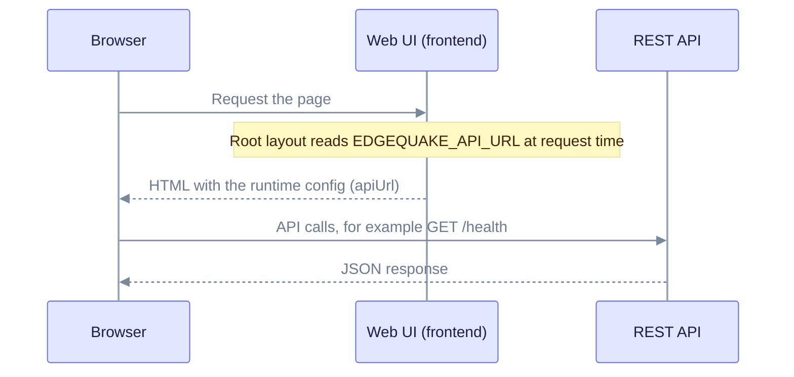

> Historical note, 2026-02-09; may not match current code. Prefer: [Docker quick reference](DOCKER_QUICK_START.md) · [Docker deployment options](../operations/docker-deployment-options.md) · [Troubleshooting](../troubleshooting/common-issues.md)

## Status today (v0.32.2)

- Both fixes are still in place. The compose file passes `NEXT_PUBLIC_API_URL` as a frontend build argument, and it passes `OPENAI_API_KEY=${OPENAI_API_KEY:-}` to the API container.
- The web UI now reads `EDGEQUAKE_API_URL` at request time. The root layout is `force-dynamic`. So changing the API URL no longer needs a rebuild, provided `EDGEQUAKE_API_URL` is set on the frontend container. The quick reference explains how.
- The verification scripts `verify_docker.sh` and `test_docker_e2e.py` are at the repo root. Check their endpoint paths against `edgequake/crates/edgequake-api/src/routes.rs` before you rely on them. The current setup check is `scripts/verify-docker-setup.sh`.
- The commit hashes recorded below (`1d53d35f`, `22bb4256`) are not in the current clone. A later change, `e1390a815`, publishes the frontend image to GHCR.

## Mission status

**Date**: February 9, 2026
**Scope**: Full Docker stack deployment with frontend-backend connectivity and OpenAI integration

## Problems solved

### 1. Frontend could not reach the backend

**Symptom**: the browser showed "API Status: Disconnected" (red), "LLM Provider: Unavailable" (red), and the UI loaded but had no API functionality.

**Root cause**: Next.js `NEXT_PUBLIC_` environment variables are compiled into the JavaScript bundle at build time. The image was built without the correct `NEXT_PUBLIC_API_URL`, so the frontend did not know where the backend was.

**Fix** (build-time value):

```dockerfile
# edgequake_webui/Dockerfile, builder stage
ARG NEXT_PUBLIC_API_URL=http://localhost:8080
ENV NEXT_PUBLIC_API_URL=${NEXT_PUBLIC_API_URL}
RUN npx next build
```

```yaml
# edgequake/docker/docker-compose.yml
frontend:
  build:
    context: ../../
    dockerfile: edgequake_webui/Dockerfile
    args:
      NEXT_PUBLIC_API_URL: http://localhost:8080
```

### 2. Backend did not inherit OPENAI_API_KEY

**Symptom**: the backend fell back to the mock LLM provider, so no real AI queries could run.

**Root cause**: Compose `${OPENAI_API_KEY}` is replaced with an empty string when the host variable is unset. The `:-` default makes the empty fallback explicit.

**Fix**:

```yaml
# edgequake/docker/docker-compose.yml
edgequake:
  environment:
    - OPENAI_API_KEY=${OPENAI_API_KEY:-}
```

The backend now picks up the key from the host environment when it is set.

## Diagram: how the browser gets the API URL today

Caption: the API URL reaches the browser through the page itself, which is why `EDGEQUAKE_API_URL` can change without a rebuild.



## Files modified

### 1. `edgequake_webui/Dockerfile`

```diff
+ ARG NEXT_PUBLIC_API_URL=http://localhost:8080
+ ENV NEXT_PUBLIC_API_URL=${NEXT_PUBLIC_API_URL}
```

### 2. `edgequake/docker/docker-compose.yml`

```diff
  frontend:
    build:
      context: ../../
      dockerfile: edgequake_webui/Dockerfile
+     args:
+       NEXT_PUBLIC_API_URL: http://localhost:8080

  edgequake:
    environment:
-     - OPENAI_API_KEY=${OPENAI_API_KEY}
+     - OPENAI_API_KEY=${OPENAI_API_KEY:-}
```

## Verification

The automated checks passed on 2026-02-09:

- Frontend returned HTTP 200 on port 3000.
- The backend `/health` returned `healthy`, with `llm_provider_name` set to `openai`.
- `OPENAI_API_KEY` was present in the backend environment.

The manual browser checks and the step-by-step test flow are in [Docker verification](DOCKER_VERIFICATION.md).

Sample health response from that day. The version and model are from 2026-02-09; the current version is 0.32.2.

```json
{
  "status": "healthy",
  "version": "0.1.0",
  "storage_mode": "postgresql",
  "workspace_id": "default",
  "components": {
    "kv_storage": true,
    "vector_storage": true,
    "graph_storage": true,
    "llm_provider": true
  },
  "llm_provider_name": "openai",
  "providers": {
    "llm": { "name": "openai", "model": "gpt-4.1-nano" },
    "embedding": { "name": "openai", "model": "text-embedding-3-small", "dimension": 1536 }
  },
  "pdf_storage_enabled": true
}
```

## Deliverables

1. `edgequake_webui/Dockerfile`: build args for Next.js.
2. `edgequake/docker/docker-compose.yml`: passes `NEXT_PUBLIC_API_URL` and `OPENAI_API_KEY`.
3. [Docker verification](DOCKER_VERIFICATION.md): test guide.
4. `verify_docker.sh` and `test_docker_e2e.py` (repo root): the 2026-02-09 check scripts.
5. This summary.

## How to use

```bash
make docker-up            # start the stack
./verify_docker.sh        # quick checks from that day; see the status note above
make docker-down          # stop the stack
```

To rebuild from scratch:

```bash
make docker-down
cd edgequake/docker && docker compose build --no-cache
cd ../.. && make docker-up
```

## What we learned

### Next.js environment variables

- `NEXT_PUBLIC_` variables are compiled into the bundle at build time.
- Pass them as Docker build args. Runtime environment variables do not change the client-side JavaScript.
- Runtime values that the server reads per request, such as `EDGEQUAKE_API_URL`, avoid the rebuild.

### Docker Compose variable handling

- An unset `${VAR}` becomes an empty string, and Compose prints a warning.
- `${VAR:-default}` makes the fallback explicit.
- Build args are separate from runtime environment variables.

### Multi-stage Docker builds

- Build args must be declared in each stage where they are used.
- `ENV` values set in one stage do not carry into the final image.
- Convert `ARG` to `ENV` before the build command that needs it.

## Support

If the problems persist, check the logs:

```bash
docker compose -f edgequake/docker/docker-compose.yml logs edgequake --tail=50
docker compose -f edgequake/docker/docker-compose.yml logs frontend --tail=50
make docker-logs
```

Common symptoms:

**"API Status: Still Disconnected"**

- Hard refresh the browser (Cmd+Shift+R).
- Check the browser console and the Network tab for the API URL the page uses.
- Check that the frontend image was rebuilt: `docker images | grep frontend`.

**"LLM Provider: Mock" or the wrong provider**

- Compose defaults `EDGEQUAKE_LLM_PROVIDER` to `ollama`. Set `EDGEQUAKE_LLM_PROVIDER=openai` and `OPENAI_API_KEY` in your shell.
- Restart with `make docker-down && make docker-up`.
- Check the provider with `curl http://localhost:8080/health`. The API image is distroless, so `docker exec` cannot run `env` in it.

**CORS errors**

- Check the browser console and the backend logs for the failing request.

## Sign-off

**Status on 2026-02-09**: production-ready per that day's automated checks. This is a historical record, not a current release statement.
**Manual testing**: awaiting browser verification by the user at that time.
