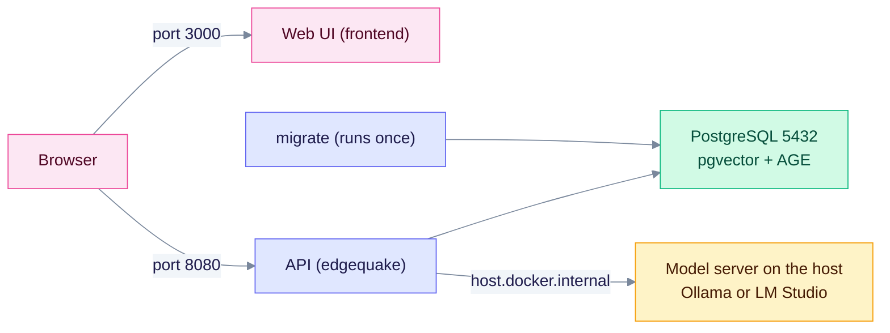

`make docker-up` builds the images from source and starts the full stack with Docker Compose: PostgreSQL, a one-shot schema migration, the API and the web UI. Use it when you change the code. To run published images without a build, use `make docker-prebuilt` or follow the [Docker quickstart](../operations/docker-quickstart.md).

> Status (v0.32.2): checked against the `Makefile`, `edgequake/docker/docker-compose.yml` and `edgequake_webui/`. The startup caveat was found by reading the code and was not run.

## Startup caveat

The compose file in `edgequake/docker/` does not pass `JWT_SECRET`, `EDGEQUAKE_AUTH_ENABLED` or `EDGEQUAKE_DEV_MODE` to the API container. Without `JWT_SECRET`, the API falls back to the built-in default secret. It then refuses to start unless dev mode is on (`edgequake/crates/edgequake-api/src/startup_security.rs`).

If the `edgequake` container exits at boot, do one of these:

1. Use `quickstart.sh` or the root `docker-compose.quickstart.yml`. That file turns on dev mode by default and binds ports to `127.0.0.1` only.
2. Add a compose override that sets `JWT_SECRET` (32 bytes or more), or `EDGEQUAKE_DEV_MODE=true` for a laptop.

## What starts

The stack has four services. The web UI and the API are the only parts you open in a browser. The API is the only part that talks to PostgreSQL and the model server.



Notice that the browser calls the API on port 8080 directly. The web UI only serves the page.

Startup order is set by `depends_on` in the compose file:

- PostgreSQL must pass its health check first.
- `migrate` applies the schema and exits.
- The API starts after `migrate` succeeds.
- The web UI starts after the API container starts. It does not wait for the API health check.

The API reaches Ollama or LM Studio on your computer through `host.docker.internal`.

| Service | Container | Default port | Purpose |
|---------|-----------|--------------|---------|
| `postgres` | `edgequake-postgres` | 5432 | PostgreSQL 18 with pgvector and Apache AGE (default profile) |
| `migrate` | `edgequake-migrate` | none | Applies migrations, then exits |
| `edgequake` | `edgequake` | 8080 | REST API. Health at `/health`; Swagger UI at `/swagger-ui` (on by default) |
| `frontend` | `edgequake-frontend` | 3000 | Web UI |

## Commands

```bash
make docker-up       # start in the background (builds only missing images)
make docker-build    # rebuild all images after a code change
make docker-ps       # container status
make docker-logs     # follow all logs
make docker-down     # stop; keeps the database volume
```

`make docker-up` runs `docker compose up -d` without `--build`. Existing images are reused, so after a code change run `make docker-build` first.

To delete the database too, run `docker compose -f edgequake/docker/docker-compose.yml down -v`.

The target waits 5 seconds and then prints the URLs. Check `curl -s http://localhost:8080/health` before you open the UI. The first build takes several minutes. Later builds use the Docker cache.

## Settings you can override

Set these in your shell before `make docker-up`.

| Variable | Default | Purpose |
|----------|---------|---------|
| `EDGEQUAKE_PORT` | 8080 | Host port for the API (see [Changing the API port](#changing-the-api-port)) |
| `FRONTEND_PORT` | 3000 | Host port for the web UI |
| `POSTGRES_PORT` | 5432 | Host port for PostgreSQL |
| `POSTGRES_PASSWORD` | `edgequake_secret` | Database password. Change it outside a laptop |
| `EDGEQUAKE_LLM_PROVIDER` | `ollama` | Default LLM provider |
| `OLLAMA_HOST` | `http://host.docker.internal:11434` | Ollama address from inside the container |
| `OPENAI_API_KEY` and `OPENAI_BASE_URL` | empty | OpenAI or an OpenAI-compatible server |
| `EDGEQUAKE_MEM_LIMIT` | `4g` | Memory cap of the API container |
| `EDGEQUAKE_MAX_CONCURRENT_EXTRACTIONS` | 4 | Parallel extraction calls |

```bash
# Another host port for the web UI
FRONTEND_PORT=4000 make docker-up

# OpenAI instead of Ollama
EDGEQUAKE_LLM_PROVIDER=openai OPENAI_API_KEY="sk-..." make docker-up
```

Compose sets `EDGEQUAKE_LLM_PROVIDER` to `ollama` when it is unset. An OpenAI key alone does not switch the provider, so set `EDGEQUAKE_LLM_PROVIDER=openai` too.

### Changing the API port

`EDGEQUAKE_PORT` changes only the host port of the API. The web UI still calls `http://localhost:8080`, so the UI shows "API Status: Disconnected" on any other port.

To use another API URL without a rebuild:

1. Add `EDGEQUAKE_API_URL: http://localhost:9000` (your URL) under the `frontend` service `environment:` in `edgequake/docker/docker-compose.yml`, or in a compose override.
2. Run `docker compose -f edgequake/docker/docker-compose.yml up -d frontend`.

Code reading, not run: the root layout is `force-dynamic` and reads `EDGEQUAKE_API_URL` at request time (`edgequake_webui/src/lib/runtime-config.ts`). `NEXT_PUBLIC_API_URL` is inlined at build time, so do not rely on it to change the URL.

On Linux, `host.docker.internal` works because the compose file adds `host-gateway`. Details for each model server are in the [provider pages](../providers/index.md).

## Common problems

| Symptom | Cause | Fix |
|---------|-------|-----|
| "Port already in use" | Another program uses 3000, 8080 or 5432 | `lsof -i :8080`, then stop that program or set another host port as shown above. If `docker-proxy` holds the port, run `make docker-down` instead of killing it |
| The `edgequake` container keeps restarting | A startup check refused to start, often the JWT secret (see the caveat) | `docker logs edgequake` and read the last error |
| The UI shows "API Status: Disconnected" | The browser cannot reach the API URL the UI uses | Open `http://localhost:8080/health` in the browser. If you changed the API port, see [Changing the API port](#changing-the-api-port) |
| Documents stay in Processing | The model server is not reachable from the container | `curl http://localhost:11434/api/tags` on the host, then check `OLLAMA_HOST` |
| A code change does not show up | `make docker-up` reused the old image | Run `make docker-build`, then `make docker-up` |
| Services not starting | A container failed at startup | `docker logs edgequake`, `docker logs edgequake-frontend`, `docker logs edgequake-postgres` |

To see errors live, run `docker compose -f edgequake/docker/docker-compose.yml up` without `-d`. To check a local install, run `scripts/verify-docker-setup.sh`.

## Related

- [Docker quickstart](../operations/docker-quickstart.md): one-command install with published images
- [Deployment](../operations/deployment.md) and [Docker deployment options](../operations/docker-deployment-options.md)
- [Troubleshooting](../troubleshooting/common-issues.md)
- Build history of this setup: [Docker setup implementation](DOCKER_SETUP_IMPLEMENTATION.md), [Docker deployment summary](DOCKER_DEPLOYMENT_SUMMARY.md), [Docker verification](DOCKER_VERIFICATION.md)
