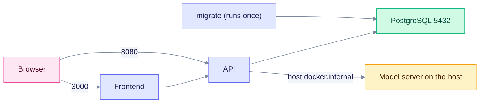

`make docker-up` builds the images from your working tree and starts the full stack with Docker Compose: PostgreSQL, a one-shot schema migration, the API and the web UI. Use it when you change the code. To run published images without building, use `make docker-prebuilt` or `quickstart.sh` (see [Providers](../providers/index.md)).

> Status: living reference, last checked against the Makefile and `edgequake/docker/docker-compose.yml`. The startup caveat below was found by reading the code and was not run.

## Startup caveat

The compose file in `edgequake/docker/` does not pass `JWT_SECRET`, `EDGEQUAKE_AUTH_ENABLED` or `EDGEQUAKE_DEV_MODE` to the API container. Outside dev mode the API refuses to start with the default JWT secret ("JWT_SECRET is the insecure default"; see [troubleshooting](../troubleshooting/common-issues.md#2-the-server-will-not-start)). If the API container exits at boot, either:

- use `quickstart.sh` or `docker-compose.quickstart.yml`, which set dev mode and loopback-only ports, or
- add a compose override that sets `JWT_SECRET` (32 bytes or more), or `EDGEQUAKE_DEV_MODE=true` for a laptop.

## What starts



The migrate container applies the schema and exits. The API starts after it succeeds. The API reaches Ollama or LM Studio on your computer through `host.docker.internal`. Your browser calls the API directly at `http://localhost:8080`.

| Service | Container | Default port | Purpose |
|---------|-----------|--------------|---------|
| `postgres` | `edgequake-postgres` | 5432 | PostgreSQL with pgvector and Apache AGE |
| `migrate` | `edgequake-migrate` | none | Applies migrations, then exits |
| `edgequake` | `edgequake` | 8080 | REST API, health and Swagger UI at `/swagger-ui` |
| `frontend` | `edgequake-frontend` | 3000 | Web UI |

## Commands

```bash
make docker-up       # build and start in the background
make docker-ps       # container status
make docker-logs     # follow all logs
make docker-down     # stop (keeps the database volume)
make docker-build    # rebuild images only
```

To delete the database too, run `docker compose -f edgequake/docker/docker-compose.yml down -v`.

The first build takes several minutes. Later runs use the cache. The target waits 5 seconds and then prints the URLs, so check `curl -s http://localhost:8080/health` before you open the UI.

## Settings you can override

Set these in your shell before `make docker-up`.

| Variable | Default | Purpose |
|----------|---------|---------|
| `EDGEQUAKE_PORT` | 8080 | Host port for the API |
| `FRONTEND_PORT` | 3000 | Host port for the web UI |
| `POSTGRES_PORT` | 5432 | Host port for PostgreSQL |
| `POSTGRES_PASSWORD` | `edgequake_secret` | Database password. Change it outside a laptop |
| `EDGEQUAKE_LLM_PROVIDER` | `ollama` | Default provider |
| `OLLAMA_HOST` | `http://host.docker.internal:11434` | Ollama address from inside the container |
| `OPENAI_API_KEY` and `OPENAI_BASE_URL` | empty | OpenAI or an OpenAI-compatible server |
| `EDGEQUAKE_MEM_LIMIT` | `4g` | Memory cap of the API container |
| `EDGEQUAKE_MAX_CONCURRENT_EXTRACTIONS` | 4 | Parallel extraction calls |

```bash
# Different ports
EDGEQUAKE_PORT=9000 FRONTEND_PORT=4000 make docker-up

# OpenAI instead of Ollama. Leave OLLAMA_HOST unset or empty.
EDGEQUAKE_LLM_PROVIDER=openai OPENAI_API_KEY="sk-..." make docker-up
```

The web UI is built with `NEXT_PUBLIC_API_URL=http://localhost:8080`. This value is fixed at build time, so changing `EDGEQUAKE_PORT` needs a rebuild of the frontend image (`make docker-build`) and the browser must still reach that URL.

On Linux, `host.docker.internal` works because the compose file adds `host-gateway`. Details for each model server are in the [provider pages](../providers/index.md).

## Common problems

| Symptom | Cause | Fix |
|---------|-------|-----|
| "Port already in use" | Another program uses 3000, 8080 or 5432 | `lsof -i :8080`, stop the program, or set a different port as shown above |
| The `edgequake` container keeps restarting | A startup check refused to start, often the JWT secret (see the caveat) | `docker logs edgequake` and read the last line |
| The UI shows "API Status: Disconnected" | The browser cannot reach the URL baked into the frontend | Open `http://localhost:8080/health` in the browser. Rebuild the frontend if you changed the port |
| Documents stay in Processing | The model server is not reachable from the container | `curl http://localhost:11434/api/tags` on the host, then check `OLLAMA_HOST` |
| Services not starting | See logs | `docker logs edgequake`, `docker logs edgequake-frontend`, `docker logs edgequake-postgres` |

To see errors live, run `docker compose -f edgequake/docker/docker-compose.yml up` without `-d`. To check an install, run `scripts/verify-docker-setup.sh`.

## Related

- [Deployment](../operations/deployment.md) and [Docker deployment options](../operations/docker-deployment-options.md)
- [Troubleshooting](../troubleshooting/common-issues.md)
- Historical notes about how this setup was built: [Docker setup implementation](DOCKER_SETUP_IMPLEMENTATION.md), [Docker verification](DOCKER_VERIFICATION.md)
