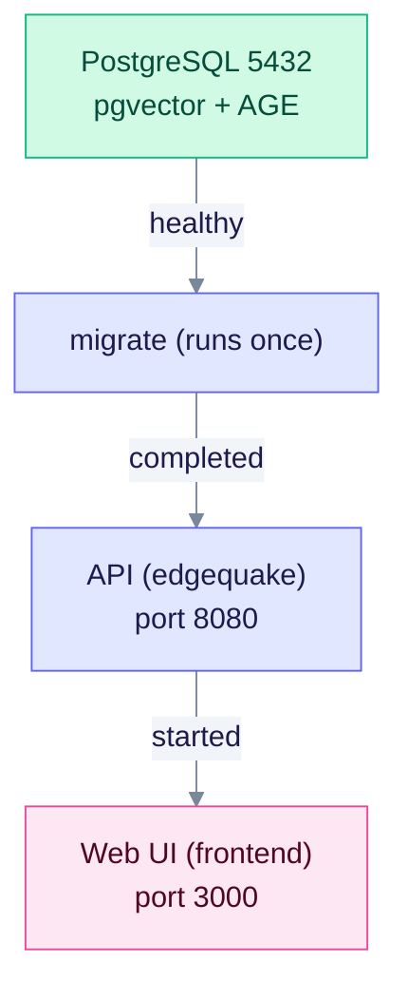

> Historical note, 2026-02-09. The wiring below is the 2026-02-09 design. For the current stack, read the [Docker quick reference](DOCKER_QUICK_START.md) first.

## Overview

On 2026-02-09, the Docker stack gained a web UI container. From then on, `make docker-up` started the database, the API and the UI together, and printed the access URLs. This page records that change.

## Status today (v0.32.2)

Still true:

- `make docker-up`, `make docker-down`, `make docker-logs`, `make docker-ps` and `make docker-build` drive `edgequake/docker/docker-compose.yml`.
- The UI image is built from `edgequake_webui/Dockerfile`. It runs as the non-root `nextjs` user (uid 1001) on port 3000.
- Host ports: API 8080, web UI 3000, PostgreSQL 5432.

Changed since then:

- A `migrate` service applies the schema once, before the API starts.
- PostgreSQL uses `edgequake/docker/Dockerfile.postgres.pg18` by default. The choice is set by `EQ_POSTGRES_DOCKERFILE`.
- The API image is distroless and runs as the `nonroot` user.
- `make docker-up` reuses existing images. Run `make docker-build` after code changes.
- The web UI reads `EDGEQUAKE_API_URL` at request time. `NEXT_PUBLIC_API_URL` is fixed at build time.
- The compose file does not set `JWT_SECRET`. See the [startup caveat](DOCKER_QUICK_START.md#startup-caveat).

## What was implemented

### 1. Frontend Dockerfile

`edgequake_webui/Dockerfile` has three stages:

- **deps**: installs dependencies from the lockfile with `--frozen-lockfile`.
- **builder**: runs `next build --webpack`. It takes `NEXT_PUBLIC_API_URL` as a build argument (default `http://localhost:8080`).
- **runtime**: runs `pnpm start` as the non-root `nextjs` user, with a `wget` health check on port 3000.

The base image is `node:20-alpine`. The current file pins pnpm to 10.13.1 so that builds use a known version.

`next.config.ts` sets `output: "standalone"`. The runtime stage does not use that output. It copies `.next` and runs `pnpm start`.

### 2. Compose service

`edgequake/docker/docker-compose.yml` builds the frontend from the repo root:

```yaml
frontend:
  build:
    context: ../../
    dockerfile: edgequake_webui/Dockerfile
    args:
      NEXT_PUBLIC_API_URL: http://localhost:8080
  container_name: edgequake-frontend
  ports:
    - "${FRONTEND_PORT:-3000}:3000"
  environment:
    - NEXT_PUBLIC_API_URL=http://localhost:8080
    - NODE_ENV=production
  depends_on:
    - edgequake
```

The services are:

| Service | Container | Host port | Built from |
|---------|-----------|-----------|------------|
| `postgres` | `edgequake-postgres` | 5432 | `Dockerfile.postgres.pg18` (default) |
| `migrate` | `edgequake-migrate` | none | `edgequake/docker/Dockerfile` |
| `edgequake` | `edgequake` | 8080 | `edgequake/docker/Dockerfile` |
| `frontend` | `edgequake-frontend` | 3000 | `edgequake_webui/Dockerfile` |

Caption: the arrows show the compose condition each service waits for. The UI waits only for the API container to start.



### 3. Makefile targets

- `make docker-up` runs `docker compose up -d`, waits 5 seconds, and then prints the access points. The output lists the web UI, the API, Swagger UI at `/swagger-ui`, health at `/health`, and PostgreSQL on port 5432.
- `make help` describes `docker-up` as "Start full stack via Docker (build from source)".

## Files changed on 2026-02-09

| File | Change |
|------|--------|
| `edgequake_webui/Dockerfile` | Created (frontend image) |
| `edgequake/docker/docker-compose.yml` | Added the `frontend` service |
| `Makefile` | Richer `docker-up` output and help text |
| `scripts/verify-docker-setup.sh` | Created (local setup checks) |
| `edgequake/docker/Dockerfile.frontend` | Older copy, kept. Compose does not use it |

The backend `edgequake/docker/Dockerfile` was not changed that day.

## Verification (2026-02-09)

The 2026-02-09 notes list checks such as compose config validation, make help output and health-check definitions. They were not re-run for this page. For a current check, use `scripts/verify-docker-setup.sh` and the steps in [Docker verification](DOCKER_VERIFICATION.md).

## How it works

1. **Build**: builds the API and UI images. The first build takes several minutes.
2. **Start**: PostgreSQL starts and passes its `pg_isready` check. `migrate` applies the schema and exits. The API starts after that.
3. **Health**: the API container runs `edgequake healthcheck`, which calls `GET /live`. The UI container runs `wget` against port 3000. To check the API from the host, use `curl http://localhost:8080/health`.
4. **Output**: `make docker-up` prints the access URLs and the management commands.

## Next steps for users

1. Make sure Docker is running (`docker ps` should work).
2. Run `make docker-up`.
3. Open `http://localhost:3000` for the UI. The API is at `http://localhost:8080`, and Swagger UI is at `http://localhost:8080/swagger-ui`.
4. Use `make docker-logs`, `make docker-ps` and `make docker-down`. Run `make docker-build` after code changes.

## Requirements

- Docker with the Compose v2 plugin (`docker compose`).
- The API container memory cap defaults to `4g` (`EDGEQUAKE_MEM_LIMIT`).
- Enough disk for the images and the PostgreSQL volume.
- The first build downloads dependencies and can take several minutes. Later builds use the cache.

## Security notes

- The API image runs as the distroless `nonroot` user. The UI runs as `nextjs` (uid 1001).
- The containers share the private `edgequake-network` bridge network.
- PostgreSQL is also published on the host (`POSTGRES_PORT`, default 5432). It uses the default password `edgequake_secret` unless `POSTGRES_PASSWORD` is set. Change both outside a laptop.
- The OpenAI key is read from the host environment at run time. It is not baked into an image.

## Troubleshooting

### Docker is not running

- macOS: start Docker Desktop or OrbStack from Applications.
- Linux: `sudo systemctl start docker`.

### A port is in use

```bash
lsof -i :3000   # or :8080, :5432
```

Stop the program that owns the port. If `docker-proxy` or the Docker app owns it, run `make docker-down` instead of killing the process. The Makefile never kills OrbStack, Docker Desktop or `docker-proxy`.

### The build fails

```bash
make docker-down
make docker-build
make docker-up
```

To rebuild without the cache, run `cd edgequake/docker && docker compose build --no-cache`, then `make docker-up`.

## References

- [Docker quick reference](DOCKER_QUICK_START.md)
- [Docker deployment summary](DOCKER_DEPLOYMENT_SUMMARY.md)
- [Docker verification](DOCKER_VERIFICATION.md)
- [Docker quickstart](../operations/docker-quickstart.md)
- Compose file: `edgequake/docker/docker-compose.yml`
- Setup check: `scripts/verify-docker-setup.sh`

---

**Implementation date**: February 9, 2026. **Status on that date**: complete. See "Status today" above for what has changed.
